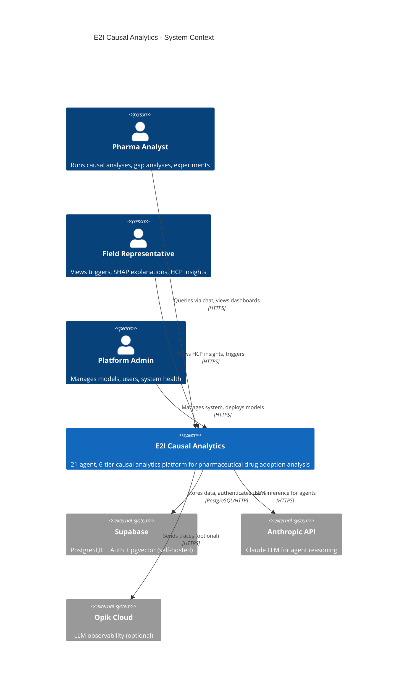
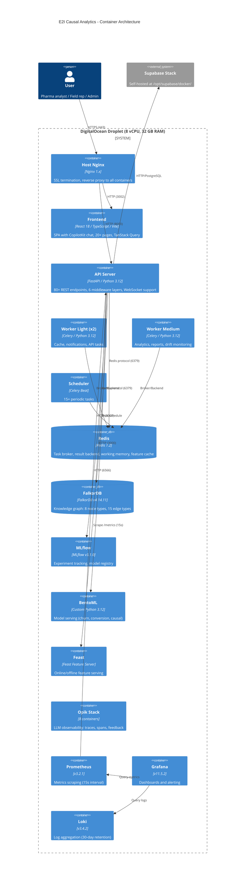
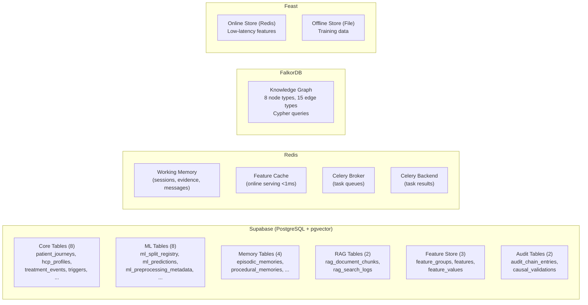

# E2I Causal Analytics - Architecture Documentation

**Version**: 4.2.1 | **Last Updated**: February 2026 | **Status**: Living Document

---

## Table of Contents

1. [System Context](#1-system-context)
2. [Container Architecture](#2-container-architecture)
3. [Component Architecture](#3-component-architecture)
4. [Data Architecture](#4-data-architecture)
5. [Security Architecture](#5-security-architecture)
6. [Observability Architecture](#6-observability-architecture)
7. [Architecture Decision Records](#7-architecture-decision-records)
8. [Cross-Cutting Concerns](#8-cross-cutting-concerns)

---

## 1. System Context

### 1.1 C4 Level 1: System Context Diagram



### 1.2 Stakeholders

| Role | Responsibilities | Access Level |
|------|-----------------|--------------|
| Pharma Analyst | Run causal inference, gap analysis, segmentation | ANALYST |
| Field Representative | View triggers, SHAP explanations, HCP insights | VIEWER |
| Platform Operator | Manage experiments, digital twin, feedback loops | OPERATOR |
| Platform Admin | System management, model deployment, user admin | ADMIN |

### 1.3 External Systems

| System | Purpose | Protocol | Auth |
|--------|---------|----------|------|
| Supabase (self-hosted) | PostgreSQL + Auth + pgvector + Row-Level Security | HTTP/PostgreSQL | JWT + Anon Key |
| Anthropic API | Claude LLM for agent reasoning (Sonnet/Haiku) | HTTPS | API Key |
| Opik Cloud | LLM/agent observability traces (optional) | HTTPS | API Key |

### 1.4 Analyzed Brands

- **Remibrutinib** - BTK inhibitor for chronic spontaneous urticaria (CSU)
- **Fabhalta** - Factor B inhibitor for paroxysmal nocturnal hemoglobinuria (PNH)
- **Kisqali** - CDK4/6 inhibitor (ribociclib) for breast cancer

---

## 2. Container Architecture

### 2.1 C4 Level 2: Container Diagram



### 2.2 Container Inventory

#### Core Application (4 containers)

| Container | Image/Build | Port (host:container) | Purpose |
|-----------|-------------|----------------------|---------|
| `e2i_api_dev` | `docker/Dockerfile` (target: development) | 8000:8000 | FastAPI + uvicorn --reload |
| `e2i_frontend_dev` | `docker/frontend/Dockerfile` (target: development) | 3002:5173 | Vite dev server + HMR |
| `worker_light` (x2) | `docker/Dockerfile` | - | Celery light tasks (2 CPU, 2 GB) |
| `worker_medium` | `docker/Dockerfile` | - | Celery medium tasks (4 CPU, 8 GB) |
| `scheduler` | `docker/Dockerfile` | - | Celery Beat periodic tasks |

#### Data Stores (2 containers)

| Container | Image | Port (host:container) | Auth |
|-----------|-------|----------------------|------|
| `redis` | redis:7.2-alpine | 6382:6379 | `REDIS_PASSWORD` (required) |
| `falkordb` | falkordb/falkordb:v4.14.11 | 6381:6379 | `FALKORDB_PASSWORD` (required) |

#### MLOps (3 containers)

| Container | Image | Port (host:container) | Purpose |
|-----------|-------|----------------------|---------|
| `mlflow` | ghcr.io/mlflow/mlflow:v3.1.0 | 127.0.0.1:5000:5000 | Experiment tracking, model registry |
| `bentoml` | Local build (`docker/bentoml/Dockerfile`) | 127.0.0.1:3000:3000 | Model serving |
| `feast` | feastdev/feature-server:latest | 127.0.0.1:6567:6566 | Feature serving |

#### Observability (7 containers)

| Container | Image | Port (host:container) |
|-----------|-------|----------------------|
| `prometheus` | prom/prometheus:v3.2.1 | 127.0.0.1:9091:9090 |
| `alertmanager` | prom/alertmanager:v0.28.1 | 127.0.0.1:9093:9093 |
| `grafana` | grafana/grafana:11.5.2 | 127.0.0.1:3200:3000 |
| `loki` | grafana/loki:3.4.2 | 127.0.0.1:3101:3100 |
| `promtail` | grafana/promtail:3.4.2 | - |
| `node-exporter` | prom/node-exporter:v1.9.0 | - |
| `postgres-exporter` | prometheuscommunity/postgres-exporter:v0.16.0 | - |

#### Opik Stack (8 containers in `docker-compose.opik.yml`)

| Container | Image | Port |
|-----------|-------|------|
| `opik-frontend` | ghcr.io/comet-ml/opik/opik-frontend:latest | 127.0.0.1:5173:80 |
| `opik-backend` | ghcr.io/comet-ml/opik/opik-backend:latest | 127.0.0.1:8084:8080 |
| `opik-python-backend` | ghcr.io/comet-ml/opik/opik-python-backend:latest | 127.0.0.1:8001:8001 |
| `opik-mysql` | mysql:8.4.2 | - |
| `opik-redis` | redis:7.2.4-alpine3.19 | - |
| `opik-clickhouse` | clickhouse/clickhouse-server:25.3.6.56-alpine | - |
| `opik-zookeeper` | zookeeper:3.9.4 | - |
| `opik-minio` | minio/minio | 127.0.0.1:9090:9090 (console) |

### 2.3 Network Topology

```
Internet
  │
  ▼
┌─────────────────────────────┐
│  Host Nginx (port 443/80)   │  SSL termination, Certbot certs
│  server_name eznomics.site  │
└──────┬──────────┬───────────┘
       │          │
  /api/* → :8000  / → :3002
       │          │
┌──────▼──┐  ┌───▼──────────┐
│   API   │  │   Frontend   │
│ FastAPI │  │  Vite (dev)  │
└────┬────┘  └──────────────┘
     │
     ├──→ Redis (:6379)        — task broker, cache, working memory
     ├──→ FalkorDB (:6379)     — knowledge graph
     ├──→ Supabase (external)  — PostgreSQL + Auth
     ├──→ MLflow (:5000)       — model registry
     ├──→ BentoML (:3000)      — model serving
     ├──→ Feast (:6566)        — feature serving
     └──→ Opik (:8080)         — LLM observability
```

All management ports (MLflow, BentoML, Feast, Opik, Grafana, Prometheus, Loki) are bound to `127.0.0.1` and accessed via SSH tunnels from developer machines.

---

## 3. Component Architecture

### 3.1 6-Tier Agent System

```mermaid
graph TB
    subgraph "TIER 0: ML Foundation"
        SD[scope_definer<br/><5s] --> CC[cohort_constructor<br/><120s]
        CC --> DP[data_preparer<br/><60s<br/>QC GATE]
        DP --> FA[feature_analyzer<br/><45s]
        FA --> MS[model_selector<br/><30s]
        MS --> MT[model_trainer<br/>Variable]
        MT --> MD[model_deployer<br/><30s]
        MD --> OC[observability_connector<br/><15s]
    end

    subgraph "TIER 1: Coordination"
        OR[orchestrator<br/><2s overhead]
        TC[tool_composer<br/><180s total]
    end

    subgraph "TIER 2: Causal Analytics"
        CI[causal_impact<br/><120s<br/>DoWhy + EconML]
        GA[gap_analyzer<br/><20s<br/>ROI]
        HO[heterogeneous_optimizer<br/><180s<br/>CATE]
    end

    subgraph "TIER 3: Monitoring"
        DM[drift_monitor<br/><10s]
        ED[experiment_designer<br/>Variable]
        HS[health_score<br/><5s]
    end

    subgraph "TIER 4: Predictions"
        PS[prediction_synthesizer<br/><15s]
        RO[resource_optimizer<br/><20s]
    end

    subgraph "TIER 5: Self-Improvement"
        EX[explainer<br/><45s<br/>SHAP + NL]
        FL[feedback_learner<br/><30s<br/>DSPy]
    end

    OR -->|classify + route| CI
    OR -->|classify + route| GA
    OR -->|classify + route| HO
    OR -->|classify + route| DM
    OR -->|classify + route| ED
    OR -->|classify + route| HS
    OR -->|classify + route| PS
    OR -->|classify + route| RO
    OR -->|classify + route| EX
    OR -->|classify + route| FL
    OR -->|multi-faceted| TC
```



### 3.2 Orchestrator Routing

The orchestrator uses a linear workflow: `audit_init` -> `classify_intent` -> `retrieve_rag_context` -> `route_to_agents` -> `dispatch_to_agents` -> `synthesize_response`.

**Intent-to-Agent Mapping:**

| Intent | Primary Agent | Timeout | Tier |
|--------|--------------|---------|------|
| `causal_effect` | causal_impact | 30s | 2 |
| `performance_gap` | gap_analyzer | 20s | 2 |
| `segment_analysis` | heterogeneous_optimizer | 25s | 2 |
| `experiment_design` | experiment_designer | 60s | 3 |
| `prediction` | prediction_synthesizer | 15s | 4 |
| `resource_allocation` | resource_optimizer | 20s | 4 |
| `explanation` | explainer | 45s | 5 |
| `system_health` | health_score | 5s | 3 |
| `drift_check` | drift_monitor | 10s | 3 |
| `feedback` | feedback_learner | 30s | 5 |
| `cohort_definition` | cohort_constructor | 120s | 0 |

### 3.3 Agent Patterns

All agents share common patterns:

- **State**: TypedDicts with `query`, `query_id`, `session_id`, `brand`, `status`, `errors`, `warnings`
- **Graph**: LangGraph state machines with per-node error handling
- **Audit**: Tamper-evident chain (genesis block -> per-node entries -> verification)
- **Observability**: Lazy-init Opik tracing + MLflow logging (graceful degradation)
- **Memory**: Tri-memory hooks (working/episodic/procedural/semantic)
- **Dependencies**: Lazy imports to avoid circular deps; all external services optional

### 3.4 API Layer

**80+ endpoints** across 21 route files:

| Route Group | Prefix | Key Endpoints | Auth Level |
|------------|--------|---------------|------------|
| agents | `/api/agents/` | Status of all 20 agents | - |
| analytics | `/api/analytics/` | Dashboard, agent metrics, trends | AUTH/ANALYST |
| audit | `/api/audit/` | Workflow audit chain, verification | AUTH |
| causal | `/api/causal/` | Hierarchical CATE, pipeline, validation | ANALYST |
| cognitive | `/api/cognitive/` | 4-phase cognitive workflow, RAG | - |
| copilotkit | `/api/copilotkit/` | CopilotKit AI chat runtime | Rate-limited |
| digital-twin | `/api/digital-twin/` | Simulate, validate, list models | OPERATOR |
| experiments | `/api/experiments/` | Randomize, enroll, interim analysis | OPERATOR |
| explain | `/api/explain/` | Real-time SHAP explanations | AUTH |
| feedback | `/api/feedback/` | Learning cycles, patterns, traces | OPERATOR |
| gaps | `/api/gaps/` | Gap analysis, ROI opportunities | ANALYST |
| graph | `/api/graph/` | FalkorDB knowledge graph queries | - |
| health-score | `/api/health-score/` | Composite health metrics | - |
| kpi | `/api/kpis/` | 46+ KPI definitions and values | Public |
| memory | `/api/memory/` | Tri-memory read/write | AUTH |
| metrics | `/metrics` | Prometheus metrics export | Public |
| monitoring | `/api/monitoring/` | Drift detection, alerts | AUTH |
| predictions | `/api/models/` | Churn, conversion model inference | AUTH |
| rag | `/api/v1/rag/` | Hybrid RAG search | AUTH |
| resources | `/api/resources/` | Resource allocation optimization | AUTH |
| segments | `/api/segments/` | Treatment effect segmentation | AUTH |

**Middleware Stack** (applied in LIFO order):

1. **OpenTelemetry ASGI** - Distributed tracing (outermost)
2. **TracingMiddleware** - Request ID, correlation ID, W3C trace context
3. **TimingMiddleware** - Prometheus latency metrics, Server-Timing header
4. **RateLimitMiddleware** - Per-endpoint limits (Redis or in-memory backend)
5. **SecurityHeadersMiddleware** - CSP, XSS, clickjacking, HSTS
6. **JWTAuthMiddleware** - Supabase JWT validation, RBAC
7. **CORS** - Origin validation (innermost)

### 3.5 Celery Worker Architecture

```
┌─────────────────────────────────────────────────────────────┐
│                     Redis Broker (DB 1)                      │
├──────────┬──────────┬──────────┬──────────┬────────────────┤
│ default  │  quick   │   api    │analytics │  reports       │
│          │          │          │aggregate │                │
├──────────┴──────────┴──────────┼──────────┴────────────────┤
│       Light Workers (x2)       │     Medium Worker (x1)     │
│    2 CPU, 2 GB per replica     │    4 CPU, 8 GB             │
│    Scales: 2-4 replicas        │    Scales: 1-3 replicas    │
├────────────────────────────────┼────────────────────────────┤
│     shap    │  causal  │  ml   │  twins                     │
├─────────────┴──────────┴──────┴────────────────────────────┤
│              Heavy Worker (x0, on-demand)                    │
│              16 CPU, 32 GB per replica                       │
│              Scales: 0-4 replicas                            │
├────────────────────────────────────────────────────────────┤
│                    dead_letter (DLQ)                         │
│              Failed tasks after max retries                  │
│              Monitored every 30 minutes                      │
└────────────────────────────────────────────────────────────┘
```

**Celery Beat Schedule** (15+ periodic tasks):

| Task | Interval | Queue |
|------|----------|-------|
| Drift monitoring | 6 hours | analytics |
| Health check | 1 hour | quick |
| Cache cleanup | 24 hours | quick |
| Queue metrics | 5 minutes | quick |
| Feast materialize (incremental) | 6 hours | analytics |
| Feast freshness check | 4 hours | analytics |
| Feast materialize (full) | 7 days | ml |
| A/B interim analysis | 24 hours (2 AM) | quick |
| A/B enrollment health | 12 hours | quick |
| A/B SRM detection sweep | 6 hours | quick |
| Feedback loop (short window) | 4 hours | analytics |
| Feedback loop (medium window) | 24 hours (2 AM) | analytics |
| Feedback loop (long window) | 7 days (Sunday) | analytics |
| Concept drift analysis | 24 hours (3 AM) | analytics |
| DLQ monitoring | 30 minutes | quick |

---

## 4. Data Architecture

### 4.1 Data Store Overview



### 4.2 Database Schema (80+ tables)

> **Comprehensive documentation**: See [`docs/data/00-INDEX.md`](data/00-INDEX.md) for the complete data dictionary covering all tables, columns, constraints, enums, views, and functions.

#### Core Tables (8)

| Table | Purpose | Key Columns |
|-------|---------|-------------|
| `hcp_profiles` | Healthcare provider master data | hcp_id, npi, specialty, priority_tier, adoption_category |
| `patient_journeys` | Patient treatment history + causal vars | patient_id, journey_stage, engagement_score (treatment), disease_severity (confounder), treatment_initiated (outcome) |
| `treatment_events` | Drug administration, procedures, labs | event_type, brand, icd_codes[], cpt_codes[], outcome_indicator |
| `ml_predictions` | Model outputs with SHAP + ground truth | prediction_type, prediction_value, shap_values, actual_outcome |
| `triggers` | Marketing interventions | trigger_type, priority, delivery_status, acceptance_status |
| `agent_activities` | Agent action audit trail | agent_name, agent_tier, processing_duration_ms |
| `business_metrics` | KPI measurements | metric_type, value, target, statistical_significance |
| `causal_paths` | Discovered causal relationships | causal_chain, effect_size, method_used, validation_status |

#### ML Pipeline Tables (4)

| Table | Purpose |
|-------|---------|
| `ml_split_registry` | Temporal split configs (60/20/15/5) |
| `ml_patient_split_assignments` | Patient-level split assignments |
| `ml_preprocessing_metadata` | Preprocessing stats (train-only) |
| `ml_leakage_audit` | Automated leakage detection |

#### Memory Tables (4)

| Table | Store | Indexing |
|-------|-------|---------|
| `episodic_memories` | Supabase + pgvector | HNSW vector index (1536-dim) |
| `procedural_memories` | Supabase + pgvector | HNSW vector index |
| `dspy_training_signals` | Supabase | signal_type, agent_name |
| Working memory (sessions) | Redis | Key-value (24h TTL) |

### 4.3 FalkorDB Knowledge Graph Schema

**8 Node Types:**
Patient, HCP, Brand, Region, KPI, CausalPath, Trigger, Agent

**15 Edge Types:**

| Edge | From -> To | Key Properties |
|------|-----------|----------------|
| TREATED_BY | Patient -> HCP | is_primary_hcp, visit_count |
| PRESCRIBED | Patient -> Brand | is_first_line, line_of_therapy |
| PRESCRIBES | HCP -> Brand | volume_monthly, market_share |
| PRACTICES_IN | HCP -> Region | primary_location |
| INFLUENCES | HCP -> HCP | influence_strength, network_type |
| CAUSES | any -> any | effect_size, confidence, method_used |
| IMPACTS | CausalPath -> KPI | impact_magnitude, direction |
| ANALYZES | Agent -> any | analysis_date, analysis_type |
| DISCOVERED | Agent -> CausalPath | discovery_date, method |
| GENERATED | Agent -> Trigger | generation_date, reasoning |

### 4.4 Hybrid RAG Pipeline

```
User Query
    │
    ▼
Extract Entities (brands, regions, KPIs, agents)
    │
    ├──────────────────┬──────────────────┐
    ▼                  ▼                  ▼
Vector Search      Full-Text Search   Graph Search
(pgvector HNSW)    (PostgreSQL GIN)   (FalkorDB Cypher)
~50-100ms          ~20-50ms           ~100-300ms
    │                  │                  │
    └──────────────────┴──────────────────┘
                       │
                       ▼
              Reciprocal Rank Fusion (RRF)
              k=60, graph boost=1.3x
                       │
                       ▼
              Top-20 Fused Results
              (source attribution + latency audit)
```

### 4.5 Feature Store (Feast + Lightweight)

**Feast Feature Views:**

| Feature View | Entity | TTL | Key Features |
|-------------|--------|-----|-------------|
| hcp_conversion_fv | hcp | 7d | trx_count, nrx_count, market_share, conversion_rate |
| hcp_profile_fv | hcp | 30d | specialty, years_of_practice, patient_volume_tier |
| hcp_engagement_fv | hcp | 1d | engagement_score, call_frequency |
| patient_journey_fv | patient | 7d | days_on_therapy, adherence_rate, churn_risk_score |
| patient_adherence_fv | patient | 1d | adherence_rate, gap_days |

**Lightweight Feature Store** (Supabase + Redis + MLflow):
- Online: Redis (<1ms cache hits, <50ms misses)
- Offline: PostgreSQL time-series with freshness monitoring
- Tracking: MLflow automatic feature definition versioning

---

## 5. Security Architecture

### 5.1 Security Layers

```
Internet
    │
    ▼
┌─────────────────────────────────┐
│ Host Nginx                       │
│ - SSL/TLS termination (Certbot) │
│ - Rate limiting (100 req/s API) │
│ - server_tokens off             │
│ - CSP headers (CDN for Swagger) │
└───────────┬─────────────────────┘
            │
            ▼
┌─────────────────────────────────┐
│ FastAPI Middleware Stack         │
│ 1. CORS (origin validation)     │
│ 2. JWT Auth (Supabase tokens)   │
│ 3. Security Headers (CSP, etc.) │
│ 4. Rate Limiting (per-endpoint) │
│ 5. Timing (latency tracking)    │
│ 6. Tracing (request correlation)│
│ 7. OpenTelemetry (distributed)  │
└───────────┬─────────────────────┘
            │
            ▼
┌─────────────────────────────────┐
│ Application Security             │
│ - RBAC (4-tier role hierarchy)  │
│ - Audit chain (hash-linked)     │
│ - Circuit breakers              │
│ - Security audit logging        │
└─────────────────────────────────┘
```

### 5.2 Authentication & Authorization

**JWT Flow:**
1. User authenticates with Supabase Auth (email/password or OAuth)
2. Supabase issues JWT with user ID, email, role in `app_metadata`
3. Frontend sends `Authorization: Bearer <token>` on API requests
4. `JWTAuthMiddleware` validates token against Supabase
5. User attached to `request.state.user` for route-level RBAC

**RBAC Hierarchy:**
```
ADMIN (level 4)    → Full system access
  └── OPERATOR (3) → Experiments, digital twin, feedback, deployment
      └── ANALYST (2) → Causal inference, gap analysis, segmentation
          └── VIEWER (1) → Read-only dashboards, KPIs, graphs
```

### 5.3 Security Headers

| Header | Value | Purpose |
|--------|-------|---------|
| Content-Security-Policy | `default-src 'self'; script-src 'self'; ...` | XSS prevention |
| X-Content-Type-Options | `nosniff` | MIME sniffing prevention |
| X-Frame-Options | `DENY` | Clickjacking prevention |
| X-XSS-Protection | `1; mode=block` | Legacy XSS filter |
| Referrer-Policy | `strict-origin-when-cross-origin` | Referrer leakage control |
| Permissions-Policy | Restricts camera, mic, geo, payment, USB | Feature restriction |
| HSTS | Optional (`max-age=31536000`) | HTTPS enforcement |

### 5.4 Rate Limiting

| Endpoint Category | Limit | Window |
|-------------------|-------|--------|
| Default | 100 req | 60s |
| Health checks | 300 req | 60s |
| Auth endpoints | 20 req | 60s |
| Calculations | 30 req | 60s |
| Batch operations | 10 req | 60s |
| CopilotKit chat | 30 req | 3600s |
| CopilotKit status | 100 req | 60s |

### 5.5 Network Security

- Management ports (MLflow, Grafana, Prometheus, Opik) bound to `127.0.0.1`
- Redis and FalkorDB require passwords (`REDIS_PASSWORD`, `FALKORDB_PASSWORD`)
- No default passwords anywhere in compose configuration
- API container has `read_only: true` filesystem
- Worker containers use `tmpfs` with mode `1770`
- MLflow UI behind nginx `auth_basic`

### 5.6 CI/CD Security Pipeline

| Scan | Tool | Trigger |
|------|------|---------|
| Secrets | Gitleaks | Every push/PR |
| Python SAST | Bandit | Every push/PR |
| Multi-language SAST | Semgrep | Every push/PR |
| Dependency audit | pip-audit | Every push/PR |
| Frontend audit | npm audit | Every push/PR |
| Container scan | Trivy | Every push/PR |
| Dockerfile lint | Hadolint | Every push/PR |

---

## 6. Observability Architecture

### 6.1 Three Pillars

```
                    ┌──────────────┐
                    │   Grafana    │
                    │  (port 3200) │
                    └──────┬───────┘
                           │
              ┌────────────┼────────────┐
              │            │            │
        ┌─────▼─────┐ ┌───▼────┐ ┌────▼─────┐
        │ Prometheus │ │  Loki  │ │   Opik   │
        │ (metrics)  │ │ (logs) │ │ (traces) │
        │  port 9091 │ │  3101  │ │   8084   │
        └─────┬──────┘ └───┬────┘ └────┬─────┘
              │            │            │
    ┌─────────┤      ┌─────┤      ┌─────┤
    │         │      │     │      │     │
  API    Node    Promtail  │    Agents  │
/metrics Exporter (Docker  │   @track   │
 (15s)  (system)  logs)    │  decorator │
                           │            │
                    Alertmanager        │
                    (webhook → API)     │
                                  Supabase
                                  (span persist)
```

### 6.2 Prometheus Scrape Targets

| Job | Target | Interval | Metrics |
|-----|--------|----------|---------|
| e2i-api | api:8000/metrics | 15s | Request latency, error rates, active connections |
| prometheus | localhost:9090 | 15s | Self-monitoring |
| node | node-exporter:9100 | 15s | CPU, memory, disk, network |
| postgres | postgres-exporter:9187 | 30s | Connections, queries, locks |
| bentoml | bentoml:3000/metrics | 30s | Model serving latency |

### 6.3 Alert Rules

Alertmanager routes to `http://api:8000/api/v1/webhooks/alertmanager` with:
- Group by: alertname, severity
- Group wait: 30s, interval: 5m, repeat: 12h
- Inhibition: critical suppresses warning for same alert+instance

### 6.4 Log Aggregation

- **Loki**: Collects Docker container logs via Promtail
- **Retention**: 30 days (`720h`)
- **Schema**: TSDB v13 with 24h index periods
- **Pipeline**: Docker JSON log format -> labeldrop (filename, stream)

---

## 7. Architecture Decision Records

### ADR-001: 6-Tier Agent Architecture

**Status**: Accepted (v3.0)

**Context**: The system needs to orchestrate 21 AI agents with different responsibilities, latency requirements, and resource needs. Agents range from sub-second health checks to multi-minute causal inference jobs.

**Decision**: Organize agents into 6 tiers with clear separation of concerns:
- Tier 0 (ML Foundation) handles the data/model lifecycle sequentially
- Tier 1 (Coordination) routes queries and composes tools
- Tiers 2-5 handle domain-specific analytics independently

**Consequences**:
- (+) Clear SLA boundaries per tier
- (+) Agents can be tested independently
- (+) Orchestrator routing is simple (intent -> agent mapping)
- (-) Sequential Tier 0 pipeline is a bottleneck for full retraining

---

### ADR-002: Single-Droplet Deployment

**Status**: Accepted (v4.2)

**Context**: Budget and operational simplicity favor a single machine. The system serves a small team of pharma analysts (< 50 concurrent users).

**Decision**: Deploy all services on a single DigitalOcean droplet (8 vCPU, 32 GB RAM) using Docker Compose. Dev and production are the same environment. API and frontend auto-reload via bind mounts.

**Consequences**:
- (+) Zero infrastructure overhead, simple deployment (`git pull` + restart workers)
- (+) All services share localhost networking (no service mesh needed)
- (-) No horizontal scaling (single point of failure)
- (-) Heavy ML jobs compete with API for resources
- Mitigation: Worker autoscaling config, heavy worker starts on-demand only

---

### ADR-003: Tri-Memory Architecture

**Status**: Accepted (v3.0)

**Context**: Agents need different types of memory: fast session state, long-term experiences, learned patterns, and relationship knowledge.

**Decision**: Four memory backends, each optimized for its access pattern:
- **Working Memory** (Redis): Session state, 24h TTL, key-value
- **Episodic Memory** (Supabase + pgvector): Past experiences, vector similarity search
- **Procedural Memory** (Supabase + pgvector): Successful patterns for DSPy few-shot learning
- **Semantic Memory** (FalkorDB): Entity relationships, graph traversal (Cypher)

**Consequences**:
- (+) Each memory type uses the optimal storage backend
- (+) Semantic memory enables multi-hop causal reasoning
- (+) Procedural memory feeds DSPy prompt optimization
- (-) Four backends to maintain and keep in sync
- (-) FalkorDB adds operational complexity

---

### ADR-004: EconML + CausalML + DoWhy for Causal Inference

**Status**: Accepted (v3.0), Refined (v4.1)

**Context**: Core platform mission requires robust causal effect estimation with heterogeneous treatment effects, refutation testing, and sensitivity analysis.

**Decision**: Use three complementary causal inference libraries:
- **DoWhy**: Causal DAG construction, refutation testing (5 tests), sensitivity analysis
- **EconML**: CausalForestDML for CATE estimation with safe config (`min_impurity_decrease=1e-7`, `min_samples_leaf=5`)
- **CausalML**: UpliftRandomForest as complementary estimator (`control_name="0"`, `n_reg=100`)

**Consequences**:
- (+) DoWhy refutation provides causal validity guarantees
- (+) EconML CausalForestDML handles heterogeneous effects well
- (+) Cross-library validation increases confidence
- (-) Must maintain consistent config across 4+ instantiation sites (grep and fix ALL)
- (-) Treatment binarization must be identical across all nodes

---

### ADR-005: Hybrid RAG with Three Backends

**Status**: Accepted (v4.0)

**Context**: Single-backend RAG (vector-only or keyword-only) misses complementary signals. Causal relationships stored in the knowledge graph are invisible to vector search.

**Decision**: Three-backend hybrid RAG with Reciprocal Rank Fusion (RRF):
1. Vector search (pgvector HNSW) for semantic similarity
2. Full-text search (PostgreSQL GIN) for exact keyword matching
3. Graph search (FalkorDB Cypher) for causal relationships

RRF with k=60 and 1.3x boost for graph-connected results.

**Consequences**:
- (+) Captures semantic, lexical, and structural relevance
- (+) Graph boost prioritizes causally-grounded results
- (+) Graceful degradation if one backend fails
- (-) Higher latency (~300ms vs ~100ms for single-backend)
- (-) Three indexes to maintain

---

### ADR-006: Docker Compose Over Kubernetes

**Status**: Accepted (v4.2)

**Context**: Single-droplet deployment doesn't justify Kubernetes overhead. Team size is small (1-2 developers).

**Decision**: Use Docker Compose with three overlay files:
- `docker-compose.yml` (base definitions)
- `docker-compose.dev.yml` (bind mounts, dev resources, debug ports)
- `docker-compose.opik.yml` (Opik observability stack)

**Consequences**:
- (+) Dramatically simpler operations (no etcd, no kubelet, no CRDs)
- (+) YAML anchors for DRY config (`x-common-env`, `x-common-worker`)
- (+) Overlay pattern supports future production/staging split
- (-) No auto-healing (manual restart on container crash)
- (-) No rolling deployments (brief downtime on restart)

---

### ADR-007: Supabase JWT for Authentication

**Status**: Accepted (v4.1)

**Context**: Need authentication that integrates with the existing Supabase self-hosted deployment. Custom auth adds maintenance burden.

**Decision**: Use Supabase Auth for JWT issuance with a 4-tier RBAC model stored in `app_metadata.role`. `JWTAuthMiddleware` validates tokens against Supabase's auth service on every request.

**Consequences**:
- (+) Zero custom auth code, leverages Supabase's battle-tested auth
- (+) Row-Level Security in PostgreSQL uses the same JWT
- (+) Testing mode with module-level flag for integration tests
- (-) Token validation requires network call to Supabase
- (-) Role changes require re-authentication

---

### ADR-008: Prometheus + Grafana + Loki for Observability

**Status**: Accepted (v4.2)

**Context**: Need metrics, logs, and alerting without SaaS costs. All data stays on the droplet.

**Decision**: Self-hosted observability stack:
- Prometheus for metrics (scrapes API, node exporter, postgres exporter)
- Loki for log aggregation (30-day retention via Promtail)
- Grafana for dashboards (provisioned datasources)
- Alertmanager for alert routing (webhook to API)
- Opik for LLM-specific tracing (separate stack)

**Consequences**:
- (+) Full observability at zero recurring cost
- (+) Prometheus metrics integrate with Celery event consumer
- (+) Loki provides centralized log search across all containers
- (-) Self-hosted means self-managed (upgrades, disk, retention)
- (-) 7 additional containers for observability

---

## 8. Cross-Cutting Concerns

### 8.1 Resilience

**Circuit Breaker** (`src/utils/circuit_breaker.py`):
- States: CLOSED -> OPEN (5 failures) -> HALF_OPEN (30s) -> CLOSED (2 successes)
- Applied to: Redis health, FalkorDB health, Supabase health, Opik connector
- Thread-safe with `threading.RLock()`

**Retry with Tenacity**:
- Database connections: `init_redis()`, `init_falkordb()`, `init_supabase()` all use tenacity decorators
- Celery tasks: 3 retries with exponential backoff (max 10 min)

**Graceful Degradation**:
- All external services (Opik, MLflow, Feast, BentoML) are optional
- Agents lazy-init dependencies and log warnings on failure
- RAG continues with 2 backends if one fails

### 8.2 Testing Strategy

| Level | Runner | Config |
|-------|--------|--------|
| Unit tests | `pytest -n 4 --dist=loadscope` | 30s timeout, `E2I_TESTING_MODE=true` |
| Integration tests | `pytest -n 2` | 60s timeout, Redis service required |
| Tier 0 (ML pipeline) | `scripts/run_tier0_test.py` | 1500 patients, cached to `tier0_output_cache/latest.pkl` |
| Tier 1-5 (all agents) | `scripts/run_tier1_5_test.py` | Uses Tier0 cached output via `Tier0OutputMapper` |
| Batched full suite | `scripts/run_tests_batched.sh` | 43 batches, ~20 minutes |
| Frontend | `vitest` + Playwright e2e | Coverage thresholds: 62% lines |

### 8.3 Deployment Workflow

```
Developer Machine                       Droplet
      │                                    │
      │  git push main                     │
      │─────────────────────►              │
      │                    GitHub Actions  │
      │                    ┌──────────┐   │
      │                    │ Lint     │   │
      │                    │ Type     │   │
      │                    │ Test     │   │
      │                    │ Security │   │
      │                    └────┬─────┘   │
      │                         │ (success)│
      │                    ┌────▼─────┐   │
      │                    │ Build    │   │
      │                    │ Push GHCR│   │
      │                    └────┬─────┘   │
      │                         │ SSH      │
      │                         ▼          │
      │                    git pull        │
      │                    restart workers │
      │                    health check    │
      │                                    │
      │  API: auto-reload via bind mount   │
      │  Frontend: HMR via bind mount      │
      │  Workers: explicit restart         │
```

### 8.4 Configuration Management

| Config Type | Location | Format |
|-------------|----------|--------|
| Agent definitions | `config/agent_config.yaml` | YAML |
| Domain vocabulary | `config/domain_vocabulary.yaml` | YAML |
| KPI definitions | `config/kpi_definitions.yaml` | YAML (46+ KPIs) |
| Ontology | `config/ontology/*.yaml` | YAML (14 files) |
| Docker services | `docker/docker-compose*.yml` | YAML (4 files) |
| Environment | `.env` (gitignored) | Key=Value |
| Python tools | `pyproject.toml` | TOML (ruff, mypy, pytest, coverage) |
| Pre-commit | `.pre-commit-config.yaml` | YAML |

### 8.5 Performance Characteristics

| Operation | Latency Target | Actual |
|-----------|---------------|--------|
| Orchestrator routing | <2s overhead | ~500ms classify + ~50ms route |
| SHAP explanation (tree) | P50 <100ms, P99 <500ms | Achieved |
| Feature cache hit (Redis) | <1ms | <1ms |
| Feature cache miss | <50ms | ~30ms |
| RAG hybrid search | <500ms | ~300ms (3 backends) |
| Causal impact (full) | <120s | 30s estimate + 15s refutation |
| Health check | <5s | ~1s |

### 8.6 Known Architectural Debt

1. **Single droplet**: No HA, no failover. Acceptable for current scale.
2. **Celery doesn't auto-reload**: Workers require manual restart on code changes.
3. **No API versioning**: All endpoints at `/api/` without version prefix (except RAG at `/api/v1/`).
4. **FalkorDB graph sync**: Manual seeding via `scripts/seed_falkordb.py`, no CDC pipeline.
5. **Heavy worker at 0 replicas**: On-demand startup adds ~120s latency for first ML/causal job.

---

*Document generated from codebase analysis. See `CLAUDE.md` for developer reference, `DEPLOYMENT.md` for operational procedures, and [`docs/data/00-INDEX.md`](data/00-INDEX.md) for the complete data dictionary.*
