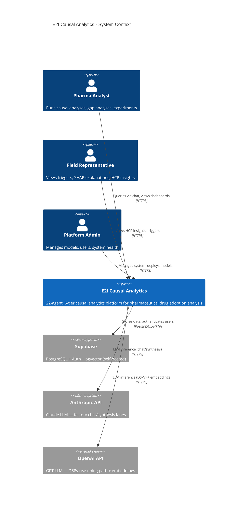
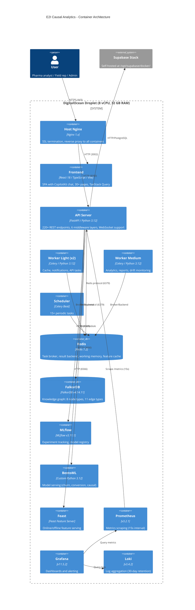
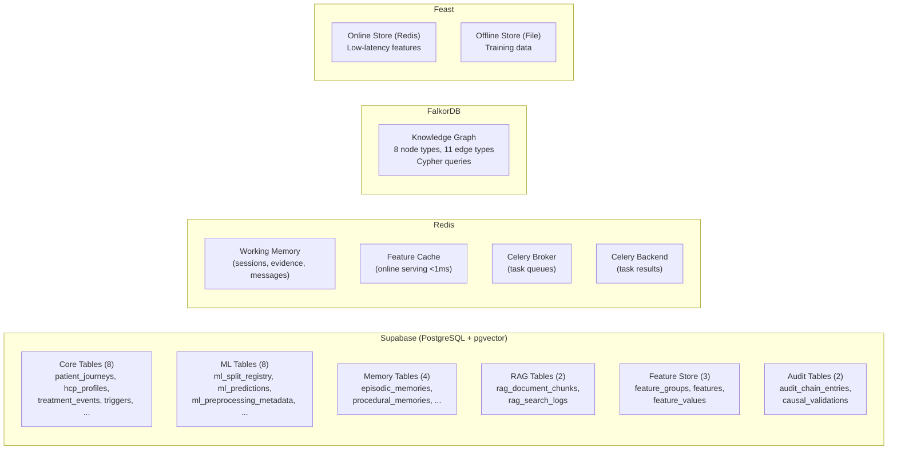

# E2I Causal Analytics - Architecture Documentation

**Version**: 4.2.1 | **Last Updated**: July 2026 | **Status**: Living Document

---

## Table of Contents

1. [System Context](#1-system-context)
2. [Container Architecture](#2-container-architecture)
3. [Component Architecture](#3-component-architecture)
4. [Data Architecture](#4-data-architecture)
5. [Memory Subsystems](#5-memory-subsystems)
6. [Security Architecture](#6-security-architecture)
7. [Observability Architecture](#7-observability-architecture)
8. [Architecture Decision Records](#8-architecture-decision-records)
9. [Cross-Cutting Concerns](#9-cross-cutting-concerns)

---

## 1. System Context

### 1.1 C4 Level 1: System Context Diagram


```mermaid
C4Context
    title E2I Causal Analytics - System Context

    Person(pharma_analyst, "Pharma Analyst", "Runs causal analyses, gap analyses, experiments")
    Person(field_rep, "Field Representative", "Views triggers, SHAP explanations, HCP insights")
    Person(admin, "Platform Admin", "Manages models, users, system health")

    System(e2i, "E2I Causal Analytics", "22-agent, 6-tier causal analytics platform for pharmaceutical drug adoption analysis")

    System_Ext(supabase, "Supabase", "PostgreSQL + Auth + pgvector (self-hosted)")
    System_Ext(anthropic, "Anthropic API", "Claude LLM — factory chat/synthesis lanes")
    System_Ext(openai, "OpenAI API", "GPT LLM — DSPy reasoning path + embeddings")

    Rel(pharma_analyst, e2i, "Queries via chat, views dashboards", "HTTPS")
    Rel(field_rep, e2i, "Views HCP insights, triggers", "HTTPS")
    Rel(admin, e2i, "Manages system, deploys models", "HTTPS")
    Rel(e2i, supabase, "Stores data, authenticates users", "PostgreSQL/HTTP")
    Rel(e2i, anthropic, "LLM inference (chat/synthesis)", "HTTPS")
    Rel(e2i, openai, "LLM inference (DSPy) + embeddings", "HTTPS")
```

### 1.2 Stakeholders

| Role | Responsibilities | Access Level |
|------|-----------------|--------------|
| Pharma Analyst | Run causal inference, gap analysis, segmentation | ANALYST |
| Field Representative | View triggers, SHAP explanations, HCP insights | VIEWER |
| Platform Operator | Manage experiments, digital twin, feedback loops | OPERATOR |
| Platform Admin | System management, model deployment, user admin | ADMIN |

### 1.3 External Systems

| System | Purpose | Protocol | Auth |
|--------|---------|----------|------|
| Supabase (self-hosted) | PostgreSQL + Auth + pgvector + Row-Level Security | HTTP/PostgreSQL | JWT + Anon Key |
| Anthropic API | Claude LLM for the factory chat/synthesis lanes (claude-sonnet-5 standard/reasoning, claude-haiku-4-5 fast) | HTTPS | API Key |
| OpenAI API | GPT LLM for the DSPy reasoning path (gpt-5.6-terra) + embeddings | HTTPS | API Key |

> **LLM provider split (July 2026):** both providers are load-bearing. The LangChain factory lanes run on Anthropic (`LLM_PROVIDER=anthropic`); the GEPA-tuned DSPy reasoning path is pinned to OpenAI `gpt-5.6-terra` (`DSPY_LM_MODEL`); embeddings are OpenAI. See [`docs/LLM_CONFIGURATION.md`](LLM_CONFIGURATION.md) and ADR-009/ADR-010 in [`docs/decisions/`](decisions/README.md).
>
> **Opik (removed from this diagram):** the Opik observability stack was intentionally stopped in May 2026 and is no longer an active external system. LLM usage tracking now lives in the `llm_usage_events` table (migration 104), surfaced at `/admin` → Observability. The compose overlay (`docker/docker-compose.opik.yml`) remains in the repo but is not part of the running stack.

### 1.4 Analyzed Brands

- **Remibrutinib** - BTK inhibitor for chronic spontaneous urticaria (CSU)
- **Fabhalta** - Factor B inhibitor for paroxysmal nocturnal hemoglobinuria (PNH)
- **Kisqali** - CDK4/6 inhibitor (ribociclib) for breast cancer

---

## 2. Container Architecture

### 2.1 C4 Level 2: Container Diagram


```mermaid
C4Container
    title E2I Causal Analytics - Container Architecture

    Person(user, "User", "Pharma analyst / Field rep / Admin")

    System_Boundary(droplet, "DigitalOcean Droplet (8 vCPU, 32 GB RAM)") {

        Container(nginx_host, "Host Nginx", "Nginx 1.x", "SSL termination, reverse proxy to all containers")

        Container(frontend, "Frontend", "React 18 / TypeScript / Vite", "SPA with CopilotKit chat, 30+ pages, TanStack Query")
        Container(api, "API Server", "FastAPI / Python 3.12", "220+ REST endpoints, 6 middleware layers, WebSocket support")

        Container(worker_light, "Worker Light (x2)", "Celery / Python 3.12", "Cache, notifications, API tasks")
        Container(worker_medium, "Worker Medium", "Celery / Python 3.12", "Analytics, reports, drift monitoring")
        Container(scheduler, "Scheduler", "Celery Beat", "15+ periodic tasks")

        ContainerDb(redis, "Redis", "Redis 7.2", "Task broker, result backend, working memory, feature cache")
        ContainerDb(falkordb, "FalkorDB", "FalkorDB v4.14.11", "Knowledge graph: 8 node types, 11 edge types")

        Container(mlflow, "MLflow", "MLflow v3.11.1", "Experiment tracking, model registry")
        Container(bentoml, "BentoML", "Custom Python 3.12", "Model serving (churn, conversion, causal)")
        Container(feast, "Feast", "Feast Feature Server", "Online/offline feature serving")

        Container(prometheus, "Prometheus", "v3.2.1", "Metrics scraping (15s interval)")
        Container(grafana, "Grafana", "v11.5.2", "Dashboards and alerting")
        Container(loki, "Loki", "v3.4.2", "Log aggregation (30-day retention)")
    }

    System_Ext(supabase, "Supabase Stack", "Self-hosted at /opt/supabase/docker/")

    Rel(user, nginx_host, "HTTPS (443)")
    Rel(nginx_host, frontend, "HTTP (3002)")
    Rel(nginx_host, api, "HTTP (8000)")
    Rel(api, redis, "Redis protocol (6379)")
    Rel(api, falkordb, "Redis protocol (6379)")
    Rel(api, supabase, "HTTP/PostgreSQL")
    Rel(api, mlflow, "HTTP (5000)")
    Rel(api, bentoml, "HTTP (3000)")
    Rel(api, feast, "HTTP (6566)")
    Rel(worker_light, redis, "Broker/Backend")
    Rel(worker_medium, redis, "Broker/Backend")
    Rel(scheduler, redis, "Beat schedule")
    Rel(prometheus, api, "Scrape /metrics (15s)")
    Rel(grafana, prometheus, "Query metrics")
    Rel(grafana, loki, "Query logs")
```

### 2.2 Container Inventory

#### Core Application (4 containers)

| Container | Image/Build | Port (host:container) | Purpose |
|-----------|-------------|----------------------|---------|
| `e2i_api_dev` | `docker/Dockerfile` (target: development) | 8000:8000 | FastAPI + uvicorn --reload |
| `e2i_frontend_dev` | `docker/frontend/Dockerfile` (target: development) | 3002:5173 | Vite dev server + HMR |
| `worker_light` (x2) | `docker/Dockerfile` | - | Celery light tasks (2 CPU, 2 GB) |
| `worker_medium` | `docker/Dockerfile` | - | Celery medium tasks (4 CPU, 8 GB) |
| `scheduler` | `docker/Dockerfile` | - | Celery Beat periodic tasks |

#### Data Stores (2 containers)

| Container | Image | Port (host:container) | Auth |
|-----------|-------|----------------------|------|
| `redis` | redis:7.2-alpine | 6382:6379 | `REDIS_PASSWORD` (required) |
| `falkordb` | falkordb/falkordb:v4.14.11 | 6381:6379 | `FALKORDB_PASSWORD` (required) |

#### MLOps (3 containers)

| Container | Image | Port (host:container) | Purpose |
|-----------|-------|----------------------|---------|
| `mlflow` | ghcr.io/mlflow/mlflow:v3.11.1 | 127.0.0.1:5000:5000 | Experiment tracking, model registry |
| `bentoml` | Local build (`docker/bentoml/Dockerfile`) | 127.0.0.1:3000:3000 | Model serving |
| `feast` | feastdev/feature-server:latest | 127.0.0.1:6567:6566 | Feature serving |

#### Observability (7 containers)

| Container | Image | Port (host:container) |
|-----------|-------|----------------------|
| `prometheus` | prom/prometheus:v3.2.1 | 127.0.0.1:9091:9090 |
| `alertmanager` | prom/alertmanager:v0.28.1 | 127.0.0.1:9093:9093 |
| `grafana` | grafana/grafana:11.5.2 | 127.0.0.1:3200:3000 |
| `loki` | grafana/loki:3.4.2 | 127.0.0.1:3101:3100 |
| `promtail` | grafana/promtail:3.4.2 | - |
| `node-exporter` | prom/node-exporter:v1.9.0 | - |
| `postgres-exporter` | prometheuscommunity/postgres-exporter:v0.16.0 | - |

#### Opik Stack (10 services in `docker-compose.opik.yml`) — **STOPPED May 2026**

> Opik was intentionally stopped in May 2026 and these containers are **not running**. The overlay file is retained for reference; LLM usage tracking moved to the `llm_usage_events` table + `/admin` → Observability. See the amendment note under ADR-008.

| Container | Image | Port |
|-----------|-------|------|
| `opik-frontend` | ghcr.io/comet-ml/opik/opik-frontend:latest | 127.0.0.1:5173:80 |
| `opik-backend` | ghcr.io/comet-ml/opik/opik-backend:latest | 127.0.0.1:8084:8080 |
| `opik-python-backend` | ghcr.io/comet-ml/opik/opik-python-backend:latest | 127.0.0.1:8001:8001 |
| `opik-mysql` | mysql:8.4.2 | - |
| `opik-redis` | redis:7.2.4-alpine3.19 | - |
| `opik-clickhouse` | clickhouse/clickhouse-server:25.3.6.56-alpine | - |
| `opik-zookeeper` | zookeeper:3.9.4 | - |
| `opik-minio` | minio/minio | 127.0.0.1:9090:9090 (console) |
| `opik-clickhouse-init` | Custom init | - (one-shot) |
| `opik-mc` | minio/mc | - (one-shot) |

### 2.3 Network Topology

```
Internet
  │
  ▼
┌─────────────────────────────┐
│  Host Nginx (port 443/80)   │  SSL termination, Certbot certs
│  server_name eznomics.site  │
└──────┬──────────┬───────────┘
       │          │
  /api/* → :8000  / → :3002
       │          │
┌──────▼──┐  ┌───▼──────────┐
│   API   │  │   Frontend   │
│ FastAPI │  │  Vite (dev)  │
└────┬────┘  └──────────────┘
     │
     ├──→ Redis (:6379)        — task broker, cache, working memory
     ├──→ FalkorDB (:6379)     — knowledge graph
     ├──→ Supabase (external)  — PostgreSQL + Auth
     ├──→ MLflow (:5000)       — model registry
     ├──→ BentoML (:3000)      — model serving
     └──→ Feast (:6566)        — feature serving
```

All management ports (MLflow, BentoML, Feast, Grafana, Prometheus, Loki) are bound to `127.0.0.1` and accessed via SSH tunnels from developer machines.

---

## 3. Component Architecture

### 3.1 6-Tier Agent System


```mermaid
graph TB
    subgraph "TIER 0: ML Foundation"
        SD[scope_definer<br/><5s] --> CC[cohort_constructor<br/><120s]
        CC --> DP[data_preparer<br/><60s<br/>QC GATE]
        DP --> FA[feature_analyzer<br/><45s]
        FA --> MS[model_selector<br/><30s]
        MS --> MT[model_trainer<br/>Variable]
        MT --> MD[model_deployer<br/><30s]
        MD --> OC[observability_connector<br/><15s]
    end

    subgraph "TIER 1: Coordination"
        OR[orchestrator<br/><2s overhead]
        TC[tool_composer<br/><180s total]
    end

    subgraph "TIER 2: Causal Analytics"
        CI[causal_impact<br/><120s<br/>DoWhy + EconML]
        GA[gap_analyzer<br/><20s<br/>ROI]
        HO[heterogeneous_optimizer<br/><180s<br/>CATE]
    end

    subgraph "TIER 3: Monitoring"
        DM[drift_monitor<br/><10s]
        ED[experiment_designer<br/>Variable]
        EM[experiment_monitor<br/><15s]
        HS[health_score<br/><5s]
    end

    subgraph "TIER 4: Predictions"
        PS[prediction_synthesizer<br/><15s]
        RO[resource_optimizer<br/><20s]
    end

    subgraph "TIER 5: Self-Improvement"
        EX[explainer<br/><45s<br/>SHAP + NL]
        FL[feedback_learner<br/><30s<br/>DSPy]
    end

    OR -->|classify + route| CI
    OR -->|classify + route| GA
    OR -->|classify + route| HO
    OR -->|classify + route| DM
    OR -->|classify + route| ED
    OR -->|classify + route| EM
    OR -->|classify + route| HS
    OR -->|classify + route| PS
    OR -->|classify + route| RO
    OR -->|classify + route| EX
    OR -->|classify + route| FL
    OR -->|multi-faceted| TC
```

### 3.2 Orchestrator Routing

The orchestrator uses a linear workflow: `audit_init` -> `classify_intent` -> `retrieve_rag_context` -> `route_to_agents` -> `dispatch_to_agents` -> `synthesize_response`.

**Intent-to-Agent Mapping:**

| Intent | Primary Agent | Timeout | Tier |
|--------|--------------|---------|------|
| `causal_effect` | causal_impact | 30s | 2 |
| `performance_gap` | gap_analyzer | 20s | 2 |
| `segment_analysis` | heterogeneous_optimizer | 25s | 2 |
| `experiment_design` | experiment_designer | 60s | 3 |
| `experiment_monitor` | experiment_monitor | 15s | 3 |
| `prediction` | prediction_synthesizer | 15s | 4 |
| `resource_allocation` | resource_optimizer | 20s | 4 |
| `explanation` | explainer | 45s | 5 |
| `system_health` | health_score | 5s | 3 |
| `drift_check` | drift_monitor | 10s | 3 |
| `feedback` | feedback_learner | 30s | 5 |
| `cohort_definition` | cohort_constructor | 120s | 0 |

### 3.3 Agent Patterns

All agents share common patterns:

- **State**: TypedDicts with `query`, `query_id`, `session_id`, `brand`, `status`, `errors`, `warnings`
- **Graph**: LangGraph state machines with per-node error handling
- **Audit**: Tamper-evident chain (genesis block -> per-node entries -> verification)
- **Observability**: Lazy-init MLflow logging (graceful degradation); the legacy Opik tracing connector is disabled (Opik stopped May 2026) — per-call LLM usage is recorded in `llm_usage_events`
- **Memory**: Tri-memory hooks (working/episodic/procedural/semantic)
- **Dependencies**: Lazy imports to avoid circular deps; all external services optional

### 3.4 API Layer

**220+ endpoints** across 33 route files (July 2026). The table below lists the major route groups; the full set lives in `src/api/routes/`:

| Route Group | Prefix | Key Endpoints | Auth Level |
|------------|--------|---------------|------------|
| agents | `/api/agents/` | Status of all 22 agents | - |
| analytics | `/api/analytics/` | Dashboard, agent metrics, trends | AUTH/ANALYST |
| audit | `/api/audit/` | Workflow audit chain, verification | AUTH |
| causal | `/api/causal/` | Hierarchical CATE, pipeline, validation | ANALYST |
| cognitive | `/api/cognitive/` | 4-phase cognitive workflow, RAG | - |
| copilotkit | `/api/copilotkit/` | CopilotKit AI chat runtime | Rate-limited |
| digital-twin | `/api/digital-twin/` | Simulate, validate, list models | OPERATOR |
| experiments | `/api/experiments/` | Randomize, enroll, interim analysis | OPERATOR |
| explain | `/api/explain/` | Real-time SHAP explanations | AUTH |
| feedback | `/api/feedback/` | Learning cycles, patterns, traces | OPERATOR |
| gaps | `/api/gaps/` | Gap analysis, ROI opportunities | ANALYST |
| graph | `/api/graph/` | FalkorDB knowledge graph queries | - |
| health-score | `/api/health-score/` | Composite health metrics | - |
| kpi | `/api/kpis/` | 44 KPI definitions and values | AUTH |
| memory | `/api/memory/` | Tri-memory read/write | AUTH |
| metrics | `/metrics` | Prometheus metrics export | Public |
| monitoring | `/api/monitoring/` | Drift detection, alerts | AUTH |
| predictions | `/api/models/` | Churn, conversion model inference | AUTH |
| rag | `/api/v1/rag/` | Hybrid RAG search | AUTH |
| resources | `/api/resources/` | Resource allocation optimization | AUTH |
| segments | `/api/segments/` | Treatment effect segmentation | AUTH |

**Middleware Stack** (applied in LIFO order):

1. **OpenTelemetry ASGI** - Distributed tracing (outermost)
2. **TracingMiddleware** - Request ID, correlation ID, W3C trace context
3. **TimingMiddleware** - Prometheus latency metrics, Server-Timing header
4. **RateLimitMiddleware** - Per-endpoint limits (Redis or in-memory backend)
5. **SecurityHeadersMiddleware** - CSP, XSS, clickjacking, HSTS
6. **JWTAuthMiddleware** - Supabase JWT validation, RBAC
7. **CORS** - Origin validation (innermost)

### 3.5 Celery Worker Architecture

```
┌─────────────────────────────────────────────────────────────┐
│                     Redis Broker (DB 1)                      │
├──────────┬──────────┬──────────┬──────────┬────────────────┤
│ default  │  quick   │   api    │analytics │  reports       │
│          │          │          │aggregate │                │
├──────────┴──────────┴──────────┼──────────┴────────────────┤
│       Light Workers (x2)       │     Medium Worker (x1)     │
│    2 CPU, 2 GB per replica     │    4 CPU, 8 GB             │
│    Scales: 2-4 replicas        │    Scales: 1-3 replicas    │
├────────────────────────────────┼────────────────────────────┤
│     shap    │  causal  │  ml   │  twins                     │
├─────────────┴──────────┴──────┴────────────────────────────┤
│              Heavy Worker (x0, on-demand)                    │
│              16 CPU, 32 GB per replica                       │
│              Scales: 0-4 replicas                            │
├────────────────────────────────────────────────────────────┤
│                    dead_letter (DLQ)                         │
│              Failed tasks after max retries                  │
│              Monitored every 30 minutes                      │
└────────────────────────────────────────────────────────────┘
```

**Celery Beat Schedule** (15+ periodic tasks):

| Task | Interval | Queue |
|------|----------|-------|
| Drift monitoring | 6 hours | analytics |
| Health check | 1 hour | quick |
| Cache cleanup | 24 hours | quick |
| Queue metrics | 5 minutes | quick |
| Feast materialize (incremental) | 6 hours | analytics |
| Feast freshness check | 4 hours | analytics |
| Feast materialize (full) | 7 days | ml |
| A/B interim analysis | 24 hours (2 AM) | quick |
| A/B enrollment health | 12 hours | quick |
| A/B SRM detection sweep | 6 hours | quick |
| Feedback loop (short window) | 4 hours | analytics |
| Feedback loop (medium window) | 24 hours (2 AM) | analytics |
| Feedback loop (long window) | 7 days (Sunday) | analytics |
| Concept drift analysis | 24 hours (3 AM) | analytics |
| DLQ monitoring | 30 minutes | quick |

---

## 4. Data Architecture

### 4.1 Data Store Overview


```mermaid
graph LR
    subgraph "Supabase (PostgreSQL + pgvector)"
        CORE["Core Tables (8)<br/>patient_journeys, hcp_profiles,<br/>treatment_events, triggers, ..."]
        ML["ML Tables (8)<br/>ml_split_registry, ml_predictions,<br/>ml_preprocessing_metadata, ..."]
        MEM["Memory Tables (4)<br/>episodic_memories,<br/>procedural_memories, ..."]
        RAG["RAG Tables (2)<br/>rag_document_chunks,<br/>rag_search_logs"]
        FS["Feature Store (3)<br/>feature_groups, features,<br/>feature_values"]
        AUDIT["Audit Tables (2)<br/>audit_chain_entries,<br/>causal_validations"]
    end

    subgraph "Redis"
        WM["Working Memory<br/>(sessions, evidence, messages)"]
        CACHE["Feature Cache<br/>(online serving <1ms)"]
        BROKER["Celery Broker<br/>(task queues)"]
        BACKEND["Celery Backend<br/>(task results)"]
    end

    subgraph "FalkorDB"
        GRAPH["Knowledge Graph<br/>8 node types, 11 edge types<br/>Cypher queries"]
    end

    subgraph "Feast"
        ONLINE["Online Store (Redis)<br/>Low-latency features"]
        OFFLINE["Offline Store (File)<br/>Training data"]
    end
```

### 4.2 Database Schema (140+ tables)

> **Comprehensive documentation**: See [`docs/data/00-INDEX.md`](data/00-INDEX.md) for the complete data dictionary covering all tables, columns, constraints, enums, views, and functions.

#### Core Tables (8)

| Table | Purpose | Key Columns |
|-------|---------|-------------|
| `hcp_profiles` | Healthcare provider master data | hcp_id, npi, specialty, priority_tier, adoption_category |
| `patient_journeys` | Patient treatment history + causal vars | patient_id, journey_stage, engagement_score (treatment), disease_severity (confounder), treatment_initiated (outcome) |
| `treatment_events` | Drug administration, procedures, labs | event_type, brand, icd_codes[], cpt_codes[], outcome_indicator |
| `ml_predictions` | Model outputs with SHAP + ground truth | prediction_type, prediction_value, shap_values, actual_outcome |
| `triggers` | Marketing interventions | trigger_type, priority, delivery_status, acceptance_status |
| `agent_activities` | Agent action audit trail | agent_name, agent_tier, processing_duration_ms |
| `business_metrics` | KPI measurements | metric_type, value, target, statistical_significance |
| `causal_paths` | Discovered causal relationships | causal_chain, effect_size, method_used, validation_status |

#### ML Pipeline Tables (4)

| Table | Purpose |
|-------|---------|
| `ml_split_registry` | Temporal split configs (60/20/10/10 since #44 v3.1.0; was 60/20/15/5) |
| `ml_patient_split_assignments` | Patient-level split assignments |
| `ml_preprocessing_metadata` | Preprocessing stats (train-only) |
| `ml_leakage_audit` | Automated leakage detection |

#### Memory Tables (4)

| Table | Store | Indexing |
|-------|-------|---------|
| `episodic_memories` | Supabase + pgvector | HNSW vector index (1536-dim) |
| `procedural_memories` | Supabase + pgvector | HNSW vector index |
| `dspy_training_signals` | Supabase | signal_type, agent_name |
| Working memory (sessions) | Redis | Key-value (24h TTL) |

### 4.3 FalkorDB Knowledge Graph Schema

**8 Node Types:**
Patient, HCP, Brand, Region, KPI, CausalPath, Trigger, Agent

**Edge Types** — the canonical machine-readable set is the `E2IRelationshipType`
enum in `src/memory/graphiti_config.py` (11 types). The table below shows the
primary commercial-graph edges (illustrative, not exhaustive):

| Edge | From -> To | Key Properties |
|------|-----------|----------------|
| TREATED_BY | Patient -> HCP | is_primary_hcp, visit_count |
| PRESCRIBED | Patient -> Brand | is_first_line, line_of_therapy |
| PRESCRIBES | HCP -> Brand | volume_monthly, market_share |
| PRACTICES_IN | HCP -> Region | primary_location |
| INFLUENCES | HCP -> HCP | influence_strength, network_type |
| CAUSES | any -> any | effect_size, confidence, method_used |
| IMPACTS | CausalPath -> KPI | impact_magnitude, direction |
| ANALYZES | Agent -> any | analysis_date, analysis_type |
| DISCOVERED | Agent -> CausalPath | discovery_date, method |
| GENERATED | Agent -> Trigger | generation_date, reasoning |

### 4.4 Hybrid RAG Pipeline

```
User Query
    │
    ▼
Extract Entities (brands, regions, KPIs, agents)
    │
    ├──────────────────┬──────────────────┐
    ▼                  ▼                  ▼
Vector Search      Full-Text Search   Graph Search
(pgvector HNSW)    (PostgreSQL GIN)   (FalkorDB Cypher)
~50-100ms          ~20-50ms           ~100-300ms
    │                  │                  │
    └──────────────────┴──────────────────┘
                       │
                       ▼
              Reciprocal Rank Fusion (RRF)
              k=60, graph boost=1.3x
                       │
                       ▼
              Top-20 Fused Results
              (source attribution + latency audit)
```

### 4.5 Feature Store (Feast + Lightweight)

**Feast Feature Views:**

| Feature View | Entity | TTL | Key Features |
|-------------|--------|-----|-------------|
| hcp_conversion_fv | hcp | 7d | trx_count, nrx_count, market_share, conversion_rate |
| hcp_profile_fv | hcp | 30d | specialty, years_of_practice, patient_volume_tier |
| hcp_engagement_fv | hcp | 1d | engagement_score, call_frequency |
| patient_journey_fv | patient | 7d | days_on_therapy, adherence_rate, churn_risk_score |
| patient_adherence_fv | patient | 1d | adherence_rate, gap_days |

**Lightweight Feature Store** (Supabase + Redis + MLflow):
- Online: Redis (<1ms cache hits, <50ms misses)
- Offline: PostgreSQL time-series with freshness monitoring
- Tracking: MLflow automatic feature definition versioning

### 4.6 Layer-4 Evaluator Audit Trail

The adaptive-validity pipeline (`src/agents/ml_foundation/data_preparer/`)
writes a per-run sidecar JSON under `$ADAPTIVE_VALIDITY_ARTIFACTS_DIR`
when the operator enables the Haiku audit evaluator
(`ADAPTIVE_VALIDITY_EVALUATOR_ENABLED=1` + `ANTHROPIC_API_KEY`). In
docker-compose the variable defaults to `/app/data/audit_artifacts`,
backed by the `audit_artifacts` named volume mounted on every service
that mounts `agent_outputs` (api + worker_light + worker_medium +
worker_heavy).

The sidecars are NOT consumed by the orchestrator or any agent — they
are an audit trail for a manual curation workflow. To turn accumulated
sidecars into compile-set candidate examples:

```bash
make curate-candidates
# or directly:
python scripts/curate_compile_set_candidates.py \
    --artifacts-dir $ADAPTIVE_VALIDITY_ARTIFACTS_DIR \
    --output-dir ./candidates \
    --since 2026-05-01 \
    --until 2026-05-31
```

The CLI emits a markdown report (engineer reviews accept/reject) and a
JSON manifest (machine-parseable with nullable `expected_*` fields to be
filled in at review). Accepted candidates are hand-merged into
`build_compile_set()` in `src/data/causal_role_classifier.py`; then
re-run `scripts/compile_causal_role_classifier.py` to produce a new
compiled artifact.

**Auto-trigger surface (Phase 4.5, issue #236)**: the compile script
runs a pre-flight backlog check that refuses to recompile when zero
accepted candidates (rows with all four `_REQUIRED_FILL_INS` non-null —
`expected_causal_role`, `expected_remediation`, `derivation_pseudocode`,
`dataset_context`) have landed in `./candidates/` since the existing
artifact's mtime. Pass `--force` to bypass for determinism re-runs.
The standalone `make check-compile-backlog` (wraps
`scripts/check_compile_set_candidate_backlog.py`) counts the same
backlog and prints a grep-friendly `READY` signal when it crosses the
default threshold (5 — tunable via `--threshold`); suitable for a
weekly cron / GitHub Action that nudges operators without running the
5-15min compile job itself. The auto-merge of accepted candidates into
`build_compile_set()` remains explicitly manual (issue #236
out-of-scope).

Each sidecar verdict carries 5 evaluator audit keys (`evaluator_satisfied`,
`evaluator_rationale_complete`, `evaluator_missed_considerations`,
`evaluator_notes`, `evaluator_model`) plus 4 telemetry keys
(`evaluator_latency_ms`, `evaluator_input_tokens`,
`evaluator_output_tokens`, `evaluator_cost_usd` — issue #241). All 9
keys are `null` when the evaluator was disabled, failed, or no LLM
verdict was produced for that feature.

The telemetry keys exist for cost monitoring as the evaluator moves
from operator-opt-in to wider use. Cost is computed at write time from
the Haiku rate constants pinned in
`src/data/causal_role_evaluator.py` (`HAIKU_INPUT_USD_PER_MTOK = 1.00`,
`HAIKU_OUTPUT_USD_PER_MTOK = 5.00`; source: Anthropic public pricing
page, checked 2026-05-15). A unit test pins the constants; when
Anthropic re-prices Haiku, operators bump the constants and the test
trips, surfacing a deliberate update.

Plans:
- Producer (shipped 2026-05-15): `.claude/plans/layer4_evaluator_audit_signal.md`
- Persistence + curation CLI (shipped 2026-05-15): `.claude/plans/layer4_evaluator_audit_consumer.md`
- Cost + latency telemetry (issue #241, shipped 2026-05-15)

### 4.7 KG External APIs — Offline mode (rxnav-in-a-box)

The RxNav client at `src/data/kg/rxnav.py` resolves drug names + NDC codes
to RxCUIs against the public NLM REST endpoint
(`https://rxnav.nlm.nih.gov/REST`) by default. For bulk cache builds, air-
gapped deployments, or pinning a specific monthly RxNorm release, operators
can flip a single env var to redirect all traffic to a locally-hosted
`rxnav-in-a-box` Docker instance.

**When to use:**
- Building or rebuilding KG caches in bulk (public API rate-limits +
  occasional 5xx + variable latency can stall multi-hour runs).
- Restricted-egress / air-gapped environments.
- Reproducibility — pin to a specific monthly RxNorm release tag.

**Image-provenance note (iter-1 update 2026-05-16):** an earlier draft of
this section + `docker/docker-compose.rxnav.yml` referenced a hypothetical
`rxnavinabox/rxnavinabox` Docker Hub image. That image source could not be
verified as NLM-official (`docker manifest inspect` → `unauthorized`; the
`rxnavinabox/` Docker Hub namespace has zero public repositories; only
third-party forks surface on a "rxnav" search). NLM's own documentation
(https://lhncbc.nlm.nih.gov/RxNav/applications/RxNav-in-a-Box.html) lists
distribution as a downloadable .zip — not a Docker Hub image. The runbook
below now follows NLM's documented .zip-download path. The `docker-compose
.rxnav.yml` file is retained as a documentation-stub pointing here; it has
no `services:` block.

**How to start (issue #246):**

```bash
# 1. Accept the UMLS license at https://uts.nlm.nih.gov/uts/license
#    (free; required for the .zip download).

# 2. Download the latest monthly RxNav-in-a-Box .zip from NLM. The download
#    URL on the NLM page (linked under References) names the date stamp,
#    e.g. ``rxnav-in-a-box-20260504.zip``.

# 3. Unpack and bring up NLM's bundled compose stack directly:
unzip rxnav-in-a-box-20260504.zip -d rxnav-in-a-box/
cd rxnav-in-a-box/
docker compose -f docker-compose.yml up -d
# The .zip ships its own docker-compose.yml + the data tarballs preloaded.

# 4. Wait for ingestion warm-up (~60s) and confirm reachability:
curl -fsS http://localhost:4000/REST/version

# 5. Point the application at it:
export RXNAV_BASE_URL=http://localhost:4000/REST
# (or set it in .env / the compose env block of api + worker_* services to
# propagate cluster-wide).
```

**Env var contract:**
- `RXNAV_BASE_URL` — full base URL including the `/REST` path prefix that
  rxnav-in-a-box mounts (mirroring the public endpoint), e.g.
  `http://localhost:4000/REST` for a localhost-bound rxnav-in-a-box, or
  `http://rxnav:4000/REST` when called from another compose service that
  shares a network with the unpacked rxnav-in-a-box stack via in-network
  DNS. When unset, the client uses the public NLM endpoint
  (`https://rxnav.nlm.nih.gov/REST`). Read at client instantiation, not at
  module import — safe to monkeypatch in tests + per-worker overrides take
  effect. The trailing `/REST` is part of the env var because the client
  constructs URLs as `f"{base}{path}"` where `path` already starts with
  `/rxcui.json`, `/version`, etc.

**Storage budget warning:** the rxnav-in-a-box .zip bundles RxNorm +
RxTerms + ATC + DailyMed data — ~15-20 GB on disk, ~12 GB RAM steady-state
once tarballs ingest (per NLM README). Allocate before `up -d`.

**Monthly refresh:** NLM publishes a new dated .zip shortly after each
RxNorm release. Production deployments should pin to a specific monthly
.zip (track the dated filename) and refresh on a known cadence.

References:
- NLM RxNav-in-a-Box page (download .zip): https://lhncbc.nlm.nih.gov/RxNav/applications/RxNav-in-a-Box.html
- README.txt inside the .zip: https://data.lhncbc.nlm.nih.gov/public/rxnav/rxnav-in-a-box/README.txt
- UMLS license: https://uts.nlm.nih.gov/uts/license

---

## 5. Memory Subsystems

The platform ships four memory subsystems atop the tri-memory architecture
described in [ADR-003](#adr-003-tri-memory-architecture). These were added
in PRs #250, #375-#388 per the plan
`.claude/plans/e2i_memory_subsystems_implementation_plan.md`.

```mermaid
graph TB
    subgraph "Episodic (raw findings)"
        EM["episodic_memories<br/>Supabase + pgvector<br/>dedup_signature<br/>dedup_counter"]
    end

    subgraph "Lifecycle (subsystem 1)"
        CON["Consolidator<br/>src/memory/lifecycle/<br/>consolidator.py"]
        INV["Invalidator<br/>cascade_invalidate"]
    end

    subgraph "Crystallization (subsystem 2)"
        CR["Crystallizer<br/>src/memory/crystallization/<br/>crystallizer.py:102"]
        EI["executive_insights<br/>15 CrystalDigest fields<br/>+ invalidated_at"]
    end

    subgraph "Sentinels (subsystem 3)"
        REG["Sentinel Registry<br/>src/memory/sentinels/<br/>registry.py"]
        ACT["Action Handlers<br/>src/tasks/<br/>sentinel_actions.py"]
        ALR["Redis e2i:alerts<br/>pub/sub channel"]
    end

    subgraph "Triple-stream RAG (subsystem 4)"
        HR["HybridRetriever<br/>src/rag/<br/>hybrid_retriever.py:41"]
    end

    EM -->|deduplicate then promote| CON
    CON -->|stamps consolidation_tier| EM
    CON -->|promotes causal_paths| CR
    CR -->|crystallizes| EI
    EI -->|on staleness| INV
    INV -->|sets invalidated_at| EI
    REG -->|evaluates against| EI
    REG -->|fires| ACT
    ACT -->|publishes| ALR
    ALR -.->|SSE bridge<br/>(staleness_alerts.py)| FE[CopilotKit Frontend<br/>consumer TBD]
    EI -->|fused signals| HR
```

### 5.1 Subsystem 1 — Lifecycle (consolidation + invalidation)

**Consolidator** (`src/memory/lifecycle/consolidator.py`, `Consolidator.run`) is a
promotion engine invoked daily by the Celery beat task
`consolidate_insights`. Its `run()` orchestrates four steps in order:

1. `deduplicate_episodic` — collapses near-duplicate episodic rows so
   promotion thresholds see effective (deduplicated) counts. Must run
   first because semantic promotion's confirmation-count threshold reads
   `SUM(dedup_counter)`.
2. `_promote_to_semantic` — stamps `causal_paths` rows as consolidated
   when `confirmation_count >= SEMANTIC_MIN_CONFIRMATIONS` (default `3`).
3. `_promote_to_procedural` — graduates `procedural_memories` rows when
   `usage_count >= PROCEDURAL_MIN_USAGE` (default `5`) AND success rate
   meets `PROCEDURAL_MIN_SUCCESS_RATE`.
4. `extract_procedural_templates` — emits one reusable procedural template
   per recurring (signature) cluster (Issue #389 §3.4); runs last because it
   reads the deduplicated effective counts produced by step 1.

**Episodic deduplication** (PR #388, migration
`database/memory/026_episodic_dedup.sql`) adds two columns:

- `dedup_signature TEXT` — deterministic hash over the key fields,
  computed by `_compute_dedup_signature`
  (`src/memory/lifecycle/consolidator.py`).
- `dedup_counter INT DEFAULT 1` — count of underlying events represented
  by the canonical row after the dedup pass.

A partial unique index on `(brand, dedup_signature) WHERE dedup_signature
IS NOT NULL` provides DB-level race-condition safety. Brand is ALWAYS
included in the key — cross-brand dedup is forbidden by spec.

**Cascade invalidation** (`src/memory/lifecycle/invalidator.py`) walks
the `insight_edges` DAG to set `invalidated_at` on downstream artifacts
when an ancestor is overturned. The `invalidated_at` column was added to
`triggers`, `ml_predictions`, and `executive_insights` by migration
`database/memory/021_insight_lifecycle.sql:20-21`. Brand scoping is
enforced at every cascade hop (see plan §"Tenancy Model").

### 5.2 Subsystem 2 — Crystallization

**Crystallizer** (`src/memory/crystallization/crystallizer.py:102-117`)
aggregates 2+ related episodic memories (different agents, same brand,
within a 7-day window, on the same `causal_path` or KPI) into a single
durable `executive_insights` row plus `insight_edges` rows linking back
to every source. Brand-strict: NEVER co-aggregates across brands.

Public entrypoints:

- `run_for_brand(brand, region=None)` — periodic Celery beat path.
- `crystallize_finding(finding_id, *, brand)` — single-finding path
  (#376 DoD §D).
- `crystallize_portfolio(brands=None)` — iterates the configured
  portfolio brand list (default: `("remibrutinib", "fabhalta",
  "kisqali")` per `src/memory/crystallization/crystallizer.py:62`).

**Schema shape (Decision 2 = HYBRID)**: 13 deterministic fields derived
from estimator state / `insight_edges` / `episodic` `raw_content` + 2
LLM-narrative prose fields wrapped in `LLMCrystalNarrativeAudit`
(`src/data/kg/types.py:407-470`). The LLM path is gated by
`E2I_CRYSTAL_LLM_NARRATIVES_ENABLED`
(`src/memory/crystallization/crystallizer.py:55`); flag-off falls back
to a deterministic heuristic. See `docs/api/crystal_digests.md` for the
full 15-field reference.

**Schema migration**: `database/memory/025_crystaldigest_schema_completion.sql`
adds the 15 columns to `executive_insights` in lockstep with the Pydantic
`ExecutiveInsightResponse` (`src/api/routes/executive_insights.py:66-129`).

**Decision 3 = KEEP BINARY**: the `staleness_score` field is intentionally
omitted from the schema. Staleness remains boolean via `invalidated_at
IS NULL`.

### 5.3 Subsystem 3 — Sentinels (data-driven watchers)

**Registry** (`src/memory/sentinels/registry.py:91-101`) ships 5 shipped
pattern types and 4 plan-vocabulary triggers. A single Celery beat task
`sentinel_dispatcher` runs every 5 minutes
(`src/memory/sentinels/registry.py:457-509`) and evaluates each enabled
sentinel; errors in one sentinel never block others.

**YAML configuration**: `config/sentinels.yaml` ships 4 plan-specified
sentinels with `lifecycle_state: advisory` and per-sentinel
`cooldown_minutes`. Loaded at API startup by
`src.memory.sentinels.config_loader.load_sentinels_from_yaml`. See
`docs/runbooks/sentinels.md` for the full schema + ops guide.

**Cooldown semantics** (migration
`database/memory/023_sentinel_cooldown.sql`): `cooldown_minutes DEFAULT 0`
on the column preserves pre-#375 "always-fire" semantics; the dispatcher
skips re-fires within `now - last_fired_at < cooldown_minutes`. NULL or
0 means no cooldown.

**Redis alert channel**: `e2i:alerts`, a `Final[str]` constant at
`src/tasks/sentinel_actions.py:70`. Four action handlers
(`rerun_all_active_cohorts`, `notify_and_queue_reanalysis`,
`flag_for_review`, `run_full_consolidation`) publish JSON-serialized
payloads via the best-effort `publish_alert()` helper.

**SSE bridge to CopilotKit**: `src/api/routes/staleness_alerts.py:395-435`
exposes `GET /api/alerts/stream?brand=<brand>` returning
`text/event-stream` with per-connection bounded queue (cap 100,
drop-oldest backpressure). Authentication is `Depends(require_auth)` at
`src/api/routes/staleness_alerts.py:407`. Added in PR #394.

### 5.4 Subsystem 4 — Triple-stream Retrieval

The **HybridRetriever** (`src/rag/hybrid_retriever.py:41`) orchestrates
three parallel search backends and fuses their results via Reciprocal
Rank Fusion (RRF):

1. **Vector** (`VectorBackend`) — pgvector HNSW similarity on
   `episodic_memories.embedding` (1536-dim).
2. **Full-text** (`FulltextBackend`) — PostgreSQL GIN index keyword
   search.
3. **Graph** (`GraphBackend`) — FalkorDB Cypher traversal on the
   knowledge graph (8 node types, 11 edge types).

**Fusion algorithm**: `_apply_rrf_fusion`
(`src/rag/hybrid_retriever.py:316-382`):

```
RRF Score = sum(weight_i / (k + rank_i)) for each backend i
where k = 60 (RRF_K, src/rag/hybrid_retriever.py:82)
```

Backend weights are configurable via `RAGConfig.search.fusion_weights`
(default ~0.33 each). After fusion, `_apply_graph_boost`
(`src/rag/hybrid_retriever.py:384-410`) multiplies graph-connected
results by 1.3× (`GRAPH_BOOST`, `src/rag/hybrid_retriever.py:85`).

**Health + degradation**: `health_check()` returns per-backend health.
The retriever gracefully degrades to fewer backends on failure rather
than raising; only when ALL backends return zero results does it return
an empty list with a logged warning.

**Source attribution**: each `RetrievalResult` carries
`metadata['rrf_sources']` listing which backends contributed and
`metadata['rrf_score']` for audit transparency.

### 5.5 End-to-end signal flow

A typical cascade triggered by a sentinel (BACKEND steps; frontend
consumer is TBD — the SSE bridge is shipped at
`src/api/routes/staleness_alerts.py` but no frontend consumer exists in
the current repo):

```
1. Celery beat fires sentinel_dispatcher (every 5 minutes)
2. Dispatcher checks cooldown gate (e.g. 360 min for staleness alert);
   cooled-down sentinels are SKIPPED before evaluation
3. Registry evaluates remaining enabled sentinels
4. sentinel_staleness_alert matches: invalidation_count enumerates rows
   on executive_insights where invalidated_at IS NOT NULL
5. Dispatcher dispatch_agent → bus event + Celery enqueue of
   notify_and_queue_reanalysis (single-fire-with-list semantics)
6. Handler publishes {type: "staleness_alert", brands: [...],
   findings: [...]} to e2i:alerts Redis pub/sub channel (full findings
   list; top-5 cap is internal to the handler's per-finding enqueue)
7. Handler enqueues up to 5 reanalyze_finding Celery tasks (#378), one
   per top-stale finding
8. reanalyze_finding publishes a reanalysis_requested event on the
   brand-scoped reanalysis:e2i:{brand} Redis channel — downstream
   orchestrator consumers subscribe here (consumer surface still moving
   under #237 / #373 follow-ups)
9. Any authenticated client subscribed to GET /api/alerts/stream?brand=
   receives the staleness_alert event via the SSE bridge
   (src/api/routes/staleness_alerts.py)
```

Sentinels MATCH rows where `invalidated_at IS NOT NULL` — they do NOT
set the column. The invalidator (`src/memory/lifecycle/invalidator.py`)
is the writer; it is invoked separately by upstream cascade paths (e.g.
ancestor overturn events). The staleness sentinel detects the
already-invalidated state and surfaces it to operators + queues
reanalysis.

---

## 6. Security Architecture

### 6.1 Security Layers

```
Internet
    │
    ▼
┌─────────────────────────────────┐
│ Host Nginx                       │
│ - SSL/TLS termination (Certbot) │
│ - Rate limiting (100 req/s API) │
│ - server_tokens off             │
│ - CSP headers (CDN for Swagger) │
└───────────┬─────────────────────┘
            │
            ▼
┌─────────────────────────────────┐
│ FastAPI Middleware Stack         │
│ 1. CORS (origin validation)     │
│ 2. JWT Auth (Supabase tokens)   │
│ 3. Security Headers (CSP, etc.) │
│ 4. Rate Limiting (per-endpoint) │
│ 5. Timing (latency tracking)    │
│ 6. Tracing (request correlation)│
│ 7. OpenTelemetry (distributed)  │
└───────────┬─────────────────────┘
            │
            ▼
┌─────────────────────────────────┐
│ Application Security             │
│ - RBAC (4-tier role hierarchy)  │
│ - Audit chain (hash-linked)     │
│ - Circuit breakers              │
│ - Security audit logging        │
└─────────────────────────────────┘
```

### 6.2 Authentication & Authorization

**JWT Flow:**
1. User authenticates with Supabase Auth (email/password or OAuth)
2. Supabase issues JWT with user ID, email, role in `app_metadata`
3. Frontend sends `Authorization: Bearer <token>` on API requests
4. `JWTAuthMiddleware` validates token against Supabase
5. User attached to `request.state.user` for route-level RBAC

**RBAC Hierarchy:**
```
ADMIN (level 4)    → Full system access
  └── OPERATOR (3) → Experiments, digital twin, feedback, deployment
      └── ANALYST (2) → Causal inference, gap analysis, segmentation
          └── VIEWER (1) → Read-only dashboards, KPIs, graphs
```

### 6.3 Security Headers

| Header | Value | Purpose |
|--------|-------|---------|
| Content-Security-Policy | `default-src 'self'; script-src 'self'; ...` | XSS prevention |
| X-Content-Type-Options | `nosniff` | MIME sniffing prevention |
| X-Frame-Options | `DENY` | Clickjacking prevention |
| X-XSS-Protection | `1; mode=block` | Legacy XSS filter |
| Referrer-Policy | `strict-origin-when-cross-origin` | Referrer leakage control |
| Permissions-Policy | Restricts camera, mic, geo, payment, USB | Feature restriction |
| HSTS | Optional (`max-age=31536000`) | HTTPS enforcement |

### 6.4 Rate Limiting

| Endpoint Category | Limit | Window |
|-------------------|-------|--------|
| Default | 100 req | 60s |
| Health checks | 300 req | 60s |
| Auth endpoints | 20 req | 60s |
| Calculations | 30 req | 60s |
| Batch operations | 10 req | 60s |
| CopilotKit chat | 30 req | 3600s |
| CopilotKit status | 100 req | 60s |

### 6.5 Network Security

- Management ports (MLflow, Grafana, Prometheus, Opik) bound to `127.0.0.1`
- Redis and FalkorDB require passwords (`REDIS_PASSWORD`, `FALKORDB_PASSWORD`)
- No default passwords anywhere in compose configuration
- API container has `read_only: true` filesystem
- Worker containers use `tmpfs` with mode `1770`
- MLflow UI behind nginx `auth_basic`

### 6.6 CI/CD Security Pipeline

| Scan | Tool | Trigger |
|------|------|---------|
| Secrets | Gitleaks | Every push/PR |
| Python SAST | Bandit | Every push/PR |
| Multi-language SAST | Semgrep | Every push/PR |
| Dependency audit | pip-audit | Every push/PR |
| Frontend audit | npm audit | Every push/PR |
| Container scan | Trivy | Every push/PR |
| Dockerfile lint | Hadolint | Every push/PR |

---

## 7. Observability Architecture

> **Status note (July 2026):** Opik — shown as the traces pillar below — was intentionally stopped in May 2026. LLM/agent call tracking now lives in the `llm_usage_events` table (migration 104, written by the LLM factory + DSPy hooks) and is surfaced at `/admin` → Observability. Prometheus, Grafana, Loki, and Alertmanager remain active.

### 7.1 Three Pillars

```
                    ┌──────────────┐
                    │   Grafana    │
                    │  (port 3200) │
                    └──────┬───────┘
                           │
              ┌────────────┼────────────┐
              │            │            │
        ┌─────▼─────┐ ┌───▼────┐ ┌────▼─────┐
        │ Prometheus │ │  Loki  │ │   Opik   │
        │ (metrics)  │ │ (logs) │ │(stopped) │
        │  port 9091 │ │  3101  │ │   8084   │
        └─────┬──────┘ └───┬────┘ └────┬─────┘
              │            │            │
    ┌─────────┤      ┌─────┤      ┌─────┤
    │         │      │     │      │     │
  API    Node    Promtail  │    Agents  │
/metrics Exporter (Docker  │   @track   │
 (15s)  (system)  logs)    │  decorator │
                           │            │
                    Alertmanager        │
                    (webhook → API)     │
                                  Supabase
                                  (span persist)
```

### 7.2 Prometheus Scrape Targets

| Job | Target | Interval | Metrics |
|-----|--------|----------|---------|
| e2i-api | api:8000/metrics | 15s | Request latency, error rates, active connections |
| prometheus | localhost:9090 | 15s | Self-monitoring |
| node | node-exporter:9100 | 15s | CPU, memory, disk, network |
| postgres | postgres-exporter:9187 | 30s | Connections, queries, locks |
| bentoml | bentoml:3000/metrics | 30s | Model serving latency |

### 7.3 Alert Rules

Alertmanager routes to `http://api:8000/api/v1/webhooks/alertmanager` with:
- Group by: alertname, severity
- Group wait: 30s, interval: 5m, repeat: 12h
- Inhibition: critical suppresses warning for same alert+instance

### 7.4 Log Aggregation

- **Loki**: Collects Docker container logs via Promtail
- **Retention**: 30 days (`720h`)
- **Schema**: TSDB v13 with 24h index periods
- **Pipeline**: Docker JSON log format -> labeldrop (filename, stream)

---

## 8. Architecture Decision Records

> **ADR-001–008 are the original embedded set (through v4.2).** Decision records from July 2026 onward (ADR-009+) are maintained as standalone files in [`docs/decisions/`](decisions/README.md), which also indexes this embedded set.

### ADR-001: 6-Tier Agent Architecture

**Status**: Accepted (v3.0)

**Context**: The system needs to orchestrate 21 (now 22) AI agents with different responsibilities, latency requirements, and resource needs. Agents range from sub-second health checks to multi-minute causal inference jobs.

**Decision**: Organize agents into 6 tiers with clear separation of concerns:
- Tier 0 (ML Foundation) handles the data/model lifecycle sequentially
- Tier 1 (Coordination) routes queries and composes tools
- Tiers 2-5 handle domain-specific analytics independently

**Consequences**:
- (+) Clear SLA boundaries per tier
- (+) Agents can be tested independently
- (+) Orchestrator routing is simple (intent -> agent mapping)
- (-) Sequential Tier 0 pipeline is a bottleneck for full retraining

---

### ADR-002: Single-Droplet Deployment

**Status**: Accepted (v4.2)

**Context**: Budget and operational simplicity favor a single machine. The system serves a small team of pharma analysts (< 50 concurrent users).

**Decision**: Deploy all services on a single DigitalOcean droplet (8 vCPU, 32 GB RAM) using Docker Compose. Dev and production are the same environment. API and frontend auto-reload via bind mounts.

**Consequences**:
- (+) Zero infrastructure overhead, simple deployment (`git pull` + restart workers)
- (+) All services share localhost networking (no service mesh needed)
- (-) No horizontal scaling (single point of failure)
- (-) Heavy ML jobs compete with API for resources
- Mitigation: Worker autoscaling config, heavy worker starts on-demand only

---

### ADR-003: Tri-Memory Architecture

**Status**: Accepted (v3.0)

**Context**: Agents need different types of memory: fast session state, long-term experiences, learned patterns, and relationship knowledge.

**Decision**: Four memory backends, each optimized for its access pattern:
- **Working Memory** (Redis): Session state, 24h TTL, key-value
- **Episodic Memory** (Supabase + pgvector): Past experiences, vector similarity search
- **Procedural Memory** (Supabase + pgvector): Successful patterns for DSPy few-shot learning
- **Semantic Memory** (FalkorDB): Entity relationships, graph traversal (Cypher)

**Consequences**:
- (+) Each memory type uses the optimal storage backend
- (+) Semantic memory enables multi-hop causal reasoning
- (+) Procedural memory feeds DSPy prompt optimization
- (-) Four backends to maintain and keep in sync
- (-) FalkorDB adds operational complexity

---

### ADR-004: NetworkX + DoWhy + EconML + CausalML for Causal Inference

**Status**: Accepted (v3.0), Refined (v4.1), Pipeline-wired (v4.2 via #354 C-1..C-9)

**Context**: Core platform mission requires robust causal effect estimation with heterogeneous treatment effects, refutation testing, sensitivity analysis, and structural graph analysis.

**Decision**: Use four complementary causal inference libraries, orchestrated through the canonical multi-library pipeline at `src/causal_engine/pipeline/`:
- **NetworkX**: Symbolic DAG analysis (centrality, paths, structural validation) from upstream `state["causal_graph"]` + state vars
- **DoWhy**: Causal DAG construction, refutation testing (5 tests), sensitivity analysis
- **EconML**: CausalForestDML/LinearDML/DRLearner/DMLOrthoForest for CATE estimation with safe config (`min_impurity_decrease=1e-7`, `min_samples_leaf=5`); selection via `energy_score/estimator_selector.py`
- **CausalML**: UpliftRandomForest + meta-learners (`BaseTClassifier`/`BaseXClassifier`/`BaseSClassifier`) for uplift modeling (`control_name` lexicographically resolved per arm)

**Pipeline orchestration** (post-#354):
- Per-executor wrappers live in `src/causal_engine/pipeline/executors/{networkx,dowhy,econml,causalml}.py` — each fail-closed on missing data, no synthetic-data fabrication, no hardcoded placeholders
- Cross-library consensus at `pipeline/sequential.py::_aggregate_results` + `pipeline/parallel.py::_aggregate_parallel_results`: DoWhy/EconML produce ATE → effect-consensus; CausalML produces uplift → separate uplift channel (semantically distinct from ATE); NetworkX structural quality modulates `consensus_confidence`. No silent `0.8` confidence default — missing confidence excludes the executor from consensus
- Canonical DataFrame contract via `pipeline/data_resolver.py::resolve_estimation_dataframe(state)` (preserves Wave-1 executors' back-compat data keys)
- Production entry points: tool composer `causal_effect_estimator` (Surface B) + `/causal/pipeline/{sequential,parallel}` API endpoints (Surface C)
- `demo_mode=true` on Surface C preserves pinned-zero UI-demo contract; production path is fail-closed (503 on data unavailability is honest, not a hardcoded short-circuit)

**Consequences**:
- (+) DoWhy refutation provides causal validity guarantees
- (+) EconML CausalForestDML handles heterogeneous effects well
- (+) CausalML uplift complements ATE with per-unit treatment-effect estimation
- (+) NetworkX structural quality penalizes ill-formed DAGs in consensus confidence
- (+) Cross-library validation increases confidence (4-library consensus, pairwise agreement)
- (+) Fail-closed end-to-end: no silent fabrication anywhere in the pipeline
- (-) Must maintain consistent config across 4+ instantiation sites (grep and fix ALL)
- (-) Treatment binarization must be identical across all nodes
- (-) `data_resolver` is a transitional helper; Wave-1 executors retain their own data keys (`filters.estimation_data`/`data_cache.estimation_data`/`filters.dataframe`) — long-term cleanup tracked separately when PipelineState/PipelineInput add `data_cache` as first-class field

---

### ADR-005: Hybrid RAG with Three Backends

**Status**: Accepted (v4.0)

**Context**: Single-backend RAG (vector-only or keyword-only) misses complementary signals. Causal relationships stored in the knowledge graph are invisible to vector search.

**Decision**: Three-backend hybrid RAG with Reciprocal Rank Fusion (RRF):
1. Vector search (pgvector HNSW) for semantic similarity
2. Full-text search (PostgreSQL GIN) for exact keyword matching
3. Graph search (FalkorDB Cypher) for causal relationships

RRF with k=60 and 1.3x boost for graph-connected results.

**Consequences**:
- (+) Captures semantic, lexical, and structural relevance
- (+) Graph boost prioritizes causally-grounded results
- (+) Graceful degradation if one backend fails
- (-) Higher latency (~300ms vs ~100ms for single-backend)
- (-) Three indexes to maintain

---

### ADR-006: Docker Compose Over Kubernetes

**Status**: Accepted (v4.2)

**Context**: Single-droplet deployment doesn't justify Kubernetes overhead. Team size is small (1-2 developers).

**Decision**: Use Docker Compose with three overlay files:
- `docker-compose.yml` (base definitions)
- `docker-compose.dev.yml` (bind mounts, dev resources, debug ports)
- `docker-compose.opik.yml` (Opik observability stack)

**Consequences**:
- (+) Dramatically simpler operations (no etcd, no kubelet, no CRDs)
- (+) YAML anchors for DRY config (`x-common-env`, `x-common-worker`)
- (+) Overlay pattern supports future production/staging split
- (-) No auto-healing (manual restart on container crash)
- (-) No rolling deployments (brief downtime on restart)

---

### ADR-007: Supabase JWT for Authentication

**Status**: Accepted (v4.1)

**Context**: Need authentication that integrates with the existing Supabase self-hosted deployment. Custom auth adds maintenance burden.

**Decision**: Use Supabase Auth for JWT issuance with a 4-tier RBAC model stored in `app_metadata.role`. `JWTAuthMiddleware` validates tokens against Supabase's auth service on every request.

**Consequences**:
- (+) Zero custom auth code, leverages Supabase's battle-tested auth
- (+) Row-Level Security in PostgreSQL uses the same JWT
- (+) Testing mode with module-level flag for integration tests
- (-) Token validation requires network call to Supabase
- (-) Role changes require re-authentication

---

### ADR-008: Prometheus + Grafana + Loki for Observability

**Status**: Accepted (v4.2)

**Context**: Need metrics, logs, and alerting without SaaS costs. All data stays on the droplet.

**Decision**: Self-hosted observability stack:
- Prometheus for metrics (scrapes API, node exporter, postgres exporter)
- Loki for log aggregation (30-day retention via Promtail)
- Grafana for dashboards (provisioned datasources)
- Alertmanager for alert routing (webhook to API)
- Opik for LLM-specific tracing (separate stack) — *see amendment below*

**Amended (July 2026)**: Opik was intentionally stopped in May 2026. LLM-specific usage tracking (model, tokens, cost, latency per call) moved to the in-database `llm_usage_events` table (migration 104) surfaced at `/admin` → Observability. The metrics/logs/alerting pillars are unchanged.

**Consequences**:
- (+) Full observability at zero recurring cost
- (+) Prometheus metrics integrate with Celery event consumer
- (+) Loki provides centralized log search across all containers
- (-) Self-hosted means self-managed (upgrades, disk, retention)
- (-) 7 additional containers for observability

---

## 9. Cross-Cutting Concerns

### 9.1 Resilience

**Circuit Breaker** (`src/utils/circuit_breaker.py`):
- States: CLOSED -> OPEN (5 failures) -> HALF_OPEN (30s) -> CLOSED (2 successes)
- Applied to: Redis health, FalkorDB health, Supabase health, Opik connector
- Thread-safe with `threading.RLock()`

**Retry with Tenacity**:
- Database connections: `init_redis()`, `init_falkordb()`, `init_supabase()` all use tenacity decorators
- Celery tasks: 3 retries with exponential backoff (max 10 min)

**Graceful Degradation**:
- All external services (Opik, MLflow, Feast, BentoML) are optional
- Agents lazy-init dependencies and log warnings on failure
- RAG continues with 2 backends if one fails

### 9.2 Testing Strategy

| Level | Runner | Config |
|-------|--------|--------|
| Unit tests | `pytest -n 4 --dist=loadscope` | 30s timeout, `E2I_TESTING_MODE=true` |
| Integration tests | `pytest -n 2` | 60s timeout, Redis service required |
| Tier 0 (ML pipeline) | `scripts/run_tier0_test.py` | 1500 patients, cached to `tier0_output_cache/latest.pkl` |
| Tier 1-5 (all agents) | `scripts/run_tier1_5_test.py` | Uses Tier0 cached output via `Tier0OutputMapper` |
| Batched full suite | `scripts/run_tests_batched.sh` | 43 batches, ~20 minutes |
| Frontend | `vitest` + Playwright e2e | Coverage thresholds: 62% lines |

### 9.3 Deployment Workflow

```
Developer Machine                       Droplet
      │                                    │
      │  git push main                     │
      │─────────────────────►              │
      │                    GitHub Actions  │
      │                    ┌──────────┐   │
      │                    │ Lint     │   │
      │                    │ Type     │   │
      │                    │ Test     │   │
      │                    │ Security │   │
      │                    └────┬─────┘   │
      │                         │ (success)│
      │                    ┌────▼─────┐   │
      │                    │ Build    │   │
      │                    │ Push GHCR│   │
      │                    └────┬─────┘   │
      │                         │ SSH      │
      │                         ▼          │
      │                    git pull        │
      │                    restart workers │
      │                    health check    │
      │                                    │
      │  API: auto-reload via bind mount   │
      │  Frontend: HMR via bind mount      │
      │  Workers: explicit restart         │
```

### 9.4 Configuration Management

| Config Type | Location | Format |
|-------------|----------|--------|
| Agent definitions | `config/agent_config.yaml` | YAML |
| Domain vocabulary | `config/domain_vocabulary.yaml` | YAML |
| KPI definitions | `config/kpi_definitions.yaml` | YAML (44 KPIs) |
| Ontology | `config/ontology/*.yaml` | YAML (14 files) |
| Docker services | `docker/docker-compose*.yml` | YAML (4 files) |
| Environment | `.env` (gitignored) | Key=Value |
| Python tools | `pyproject.toml` | TOML (ruff, mypy, pytest, coverage) |
| Pre-commit | `.pre-commit-config.yaml` | YAML |

### 9.5 Performance Characteristics

| Operation | Latency Target | Actual |
|-----------|---------------|--------|
| Orchestrator routing | <2s overhead | ~500ms classify + ~50ms route |
| SHAP explanation (tree) | P50 <100ms, P99 <500ms | Achieved |
| Feature cache hit (Redis) | <1ms | <1ms |
| Feature cache miss | <50ms | ~30ms |
| RAG hybrid search | <500ms | ~300ms (3 backends) |
| Causal impact (full) | <120s | 30s estimate + 15s refutation |
| Health check | <5s | ~1s |

### 9.6 Known Architectural Debt

1. **Single droplet**: No HA, no failover. Acceptable for current scale.
2. **Celery doesn't auto-reload**: Workers require manual restart on code changes.
3. **No API versioning**: All endpoints at `/api/` without version prefix (except RAG at `/api/v1/`).
4. **FalkorDB graph sync**: Manual seeding via `scripts/seed_falkordb.py`, no CDC pipeline.
5. **Heavy worker at 0 replicas**: On-demand startup adds ~120s latency for first ML/causal job.

---

*Document generated from codebase analysis. See `CLAUDE.md` for developer reference, `DEPLOYMENT.md` for setup instructions, and [`docs/data/00-INDEX.md`](data/00-INDEX.md) for the complete data dictionary.*
