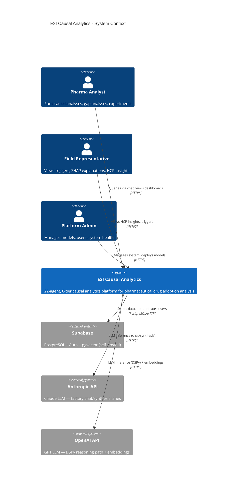
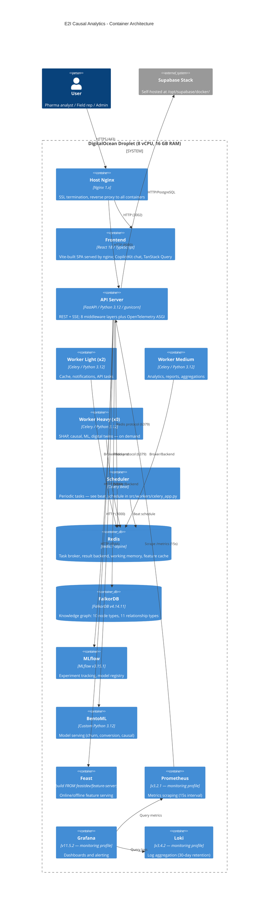
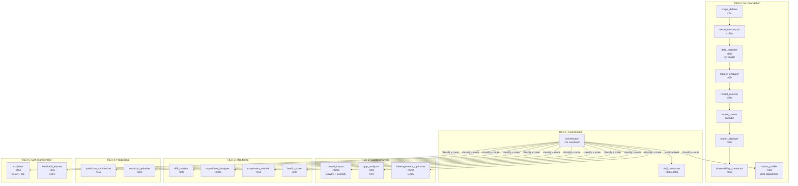
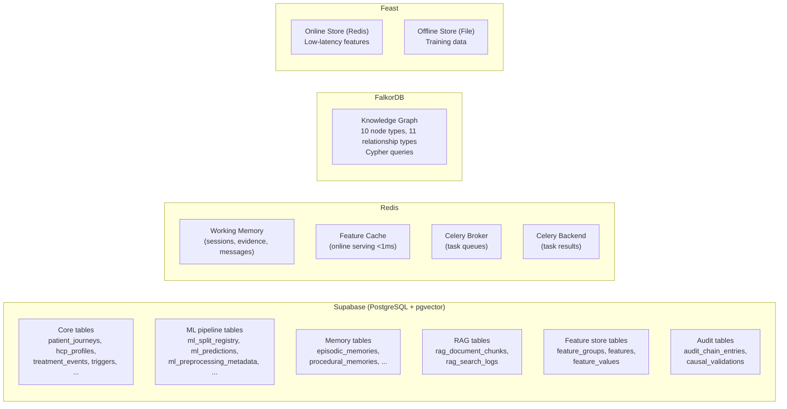

# E2I Causal Analytics - Architecture Documentation

**Version**: 4.3.0 | **Last Updated**: September 2026 | **Status**: Living Document

---

## Table of Contents

1. [System Context](#1-system-context)
2. [Container Architecture](#2-container-architecture)
3. [Component Architecture](#3-component-architecture)
4. [Data Architecture](#4-data-architecture)
5. [Memory Subsystems](#5-memory-subsystems)
6. [Security Architecture](#6-security-architecture)
7. [Observability Architecture](#7-observability-architecture)
8. [Architecture Decision Records](#8-architecture-decision-records)
9. [Cross-Cutting Concerns](#9-cross-cutting-concerns)

---

## 1. System Context

### 1.1 C4 Level 1: System Context Diagram


```mermaid
C4Context
    title E2I Causal Analytics - System Context

    Person(pharma_analyst, "Pharma Analyst", "Runs causal analyses, gap analyses, experiments")
    Person(field_rep, "Field Representative", "Views triggers, SHAP explanations, HCP insights")
    Person(admin, "Platform Admin", "Manages models, users, system health")

    System(e2i, "E2I Causal Analytics", "22-agent, 6-tier causal analytics platform for pharmaceutical drug adoption analysis")

    System_Ext(supabase, "Supabase", "PostgreSQL + Auth + pgvector (self-hosted)")
    System_Ext(anthropic, "Anthropic API", "Claude LLM — factory chat/synthesis lanes")
    System_Ext(openai, "OpenAI API", "GPT LLM — DSPy reasoning path + embeddings")

    Rel(pharma_analyst, e2i, "Queries via chat, views dashboards", "HTTPS")
    Rel(field_rep, e2i, "Views HCP insights, triggers", "HTTPS")
    Rel(admin, e2i, "Manages system, deploys models", "HTTPS")
    Rel(e2i, supabase, "Stores data, authenticates users", "PostgreSQL/HTTP")
    Rel(e2i, anthropic, "LLM inference (chat/synthesis)", "HTTPS")
    Rel(e2i, openai, "LLM inference (DSPy) + embeddings", "HTTPS")
```

### 1.2 Stakeholders

| Role | Responsibilities | Access Level |
|------|-----------------|--------------|
| Pharma Analyst | Run causal inference, gap analysis, segmentation | ANALYST |
| Field Representative | View triggers, SHAP explanations, HCP insights | VIEWER |
| Platform Operator | Manage experiments, digital twin, feedback loops | OPERATOR |
| Platform Admin | System management, model deployment, user admin | ADMIN |

### 1.3 External Systems

| System | Purpose | Protocol | Auth |
|--------|---------|----------|------|
| Supabase (self-hosted) | PostgreSQL + Auth + pgvector + Row-Level Security | HTTP/PostgreSQL | JWT + Anon Key |
| Anthropic API | Claude LLM for the factory chat/synthesis lanes (claude-sonnet-5 standard/reasoning, claude-haiku-4-5 fast) | HTTPS | API Key |
| OpenAI API | GPT LLM for the DSPy reasoning path (gpt-5.6-terra) + embeddings | HTTPS | API Key |

> **LLM provider split (July 2026):** both providers are load-bearing. The LangChain factory lanes run on Anthropic (`LLM_PROVIDER=anthropic`); the GEPA-tuned DSPy reasoning path is pinned to OpenAI `gpt-5.6-terra` (`DSPY_LM_MODEL`); embeddings are OpenAI. See [`docs/LLM_CONFIGURATION.md`](LLM_CONFIGURATION.md) and ADR-009/ADR-010 in [`docs/decisions/`](decisions/README.md); ADR-011 (feature-importance covariate-group estimand) and ADR-012 (RCT ANCOVA efficiency adjustment) live in the same directory.
>
> **Opik (removed from this diagram):** the Opik observability stack was intentionally stopped in May 2026 and is no longer an active external system. LLM usage tracking now lives in the `llm_usage_events` table (migration 104), surfaced at `/admin` → Observability. The compose overlay (`docker/docker-compose.opik.yml`) remains in the repo but is not part of the running stack.

### 1.4 Analyzed Brands

- **Remibrutinib** - BTK inhibitor for chronic spontaneous urticaria (CSU)
- **Fabhalta** - Factor B inhibitor for paroxysmal nocturnal hemoglobinuria (PNH)
- **Kisqali** - CDK4/6 inhibitor (ribociclib) for breast cancer

---

## 2. Container Architecture

### 2.1 C4 Level 2: Container Diagram


```mermaid
C4Container
    title E2I Causal Analytics - Container Architecture

    Person(user, "User", "Pharma analyst / Field rep / Admin")

    System_Boundary(droplet, "DigitalOcean Droplet (8 vCPU, 16 GB RAM)") {

        Container(nginx_host, "Host Nginx", "Nginx 1.x", "SSL termination, reverse proxy to all containers")

        Container(frontend, "Frontend", "React 18 / TypeScript", "Vite-built SPA served by nginx; CopilotKit chat, TanStack Query")
        Container(api, "API Server", "FastAPI / Python 3.12 / gunicorn", "REST + SSE; 8 middleware layers plus OpenTelemetry ASGI")

        Container(worker_light, "Worker Light (x2)", "Celery / Python 3.12", "Cache, notifications, API tasks")
        Container(worker_medium, "Worker Medium", "Celery / Python 3.12", "Analytics, reports, aggregations")
        Container(worker_heavy, "Worker Heavy (x0)", "Celery / Python 3.12", "SHAP, causal, ML, digital twins — on demand")
        Container(scheduler, "Scheduler", "Celery Beat", "Periodic tasks — see beat_schedule in src/workers/celery_app.py")

        ContainerDb(redis, "Redis", "redis:7-alpine", "Task broker, result backend, working memory, feature cache")
        ContainerDb(falkordb, "FalkorDB", "FalkorDB v4.14.11", "Knowledge graph: 10 node types, 11 relationship types")

        Container(mlflow, "MLflow", "MLflow v3.15.1", "Experiment tracking, model registry")
        Container(bentoml, "BentoML", "Custom Python 3.12", "Model serving (churn, conversion, causal)")
        Container(feast, "Feast", "Local build FROM feastdev/feature-server:0.43.0", "Online/offline feature serving")

        Container(prometheus, "Prometheus", "v3.2.1 — monitoring profile", "Metrics scraping (15s interval)")
        Container(grafana, "Grafana", "v11.5.2 — monitoring profile", "Dashboards and alerting")
        Container(loki, "Loki", "v3.4.2 — monitoring profile", "Log aggregation (30-day retention)")
    }

    System_Ext(supabase, "Supabase Stack", "Self-hosted at /opt/supabase/docker/")

    Rel(user, nginx_host, "HTTPS (443)")
    Rel(nginx_host, frontend, "HTTP (3002)")
    Rel(nginx_host, api, "HTTP (8000)")
    Rel(api, redis, "Redis protocol (6379)")
    Rel(api, falkordb, "Redis protocol (6379)")
    Rel(api, supabase, "HTTP/PostgreSQL")
    Rel(api, mlflow, "HTTP (5000)")
    Rel(api, bentoml, "HTTP (3000)")
    Rel(api, feast, "HTTP (6566)")
    Rel(worker_light, redis, "Broker/Backend")
    Rel(worker_medium, redis, "Broker/Backend")
    Rel(worker_heavy, redis, "Broker/Backend")
    Rel(scheduler, redis, "Beat schedule")
    Rel(prometheus, api, "Scrape /metrics (15s)")
    Rel(grafana, prometheus, "Query metrics")
    Rel(grafana, loki, "Query logs")
```

### 2.2 Container Inventory

**Deployment model.** Production runs the **base `docker/docker-compose.yml` alone — no
overlay**. `deploy.yml`'s `pick_overlay()` selects `""` as soon as the frontend Dockerfile
carries an `AS production` stage (it does), and only falls back to
`docker-compose.frontend-dev.yml` (the #528-A rollback era) or `docker-compose.dev.yml` (the
pre-flip #527 dev-in-prod era) on older trees. Deploys happen **only by merging to `main`**
(`.github/workflows/deploy.yml`); to redeploy without a merge, re-run the workflow
(`gh workflow run deploy.yml`). `scripts/deploy.sh` / `make deploy` / `make deploy-build` is the
**legacy local-dev path** (dev overlay, no feast/bentoml gates, `git checkout <sha>` rollback) —
never run it on the droplet.

**Local development** is base + `docker-compose.dev.yml`, which renames the app containers to
`e2i_*_dev` and swaps the runtimes: `e2i_api_dev` runs `uvicorn --reload` (plus debugpy on
127.0.0.1:5678) and `e2i_frontend_dev` runs the Vite dev server with HMR on `3002:5173`. The dev
overlay also renames `redis`/`falkordb`/`mlflow`/`bentoml` to their `_dev` equivalents. **Names
you see in `docker ps` on the droplet are the base names below, not the `_dev` names.**

#### Core Application (6 services)

| Service | Container | Image/Build | Port (host:container) | Purpose |
|---------|-----------|-------------|----------------------|---------|
| `api` | `e2i_api` | `ghcr.io/<owner>/e2i-api:<sha>` (built from `docker/Dockerfile`) | 8000:8000 | FastAPI under gunicorn, 2 × `uvicorn.workers.UvicornWorker`, `read_only: true` (2 CPU, 5 GB) |
| `frontend` | `e2i_frontend` | `ghcr.io/<owner>/e2i-frontend:<sha>` (`docker/frontend/Dockerfile`, `AS production`) | 3002:80 | nginx:alpine serving the built Vite bundle, `read_only: true` (0.5 CPU, 512 MB) |
| `worker_light` (×2) | — (replicated) | same API image | - | Celery `default,quick,api` (2 CPU, 1.5 GB per replica) |
| `worker_medium` (×1) | — (replicated) | same API image | - | Celery `analytics,reports,aggregations` (4 CPU, 4 GB) |
| `worker_heavy` (×0) | — (replicated) | same API image | - | Celery `shap,causal,ml,twins` — on-demand (2 CPU, 3 GB) |
| `scheduler` | `e2i_scheduler` | same API image | - | Celery Beat, `PersistentScheduler` on the `e2i_celerybeat_state` volume (0.5 CPU, 1 GB) |

Resource limits are the `deploy.resources.limits` blocks in `docker/docker-compose.yml`; re-derive
with `python3 -c "import yaml;d=yaml.safe_load(open('docker/docker-compose.yml'))['services'];..."`
rather than trusting a copied number.

#### Data Stores (2 containers)

| Container | Image | Port (host:container) | Auth |
|-----------|-------|----------------------|------|
| `e2i_redis` | `redis:7-alpine` | 127.0.0.1:6382:6379 | `REDIS_PASSWORD` (required) |
| `e2i_falkordb` | `falkordb/falkordb:v4.14.11` | 127.0.0.1:6381:6379 | `FALKORDB_PASSWORD` (required) |

Both are bound to the loopback interface — nothing reaches them from outside the droplet.

#### MLOps (4 containers)

| Container | Image | Port (host:container) | Purpose |
|-----------|-------|----------------------|---------|
| `e2i_mlflow` | `ghcr.io/mlflow/mlflow:v3.15.1` | 127.0.0.1:5000:5000 | Experiment tracking, model registry |
| `e2i_bentoml` | Local build (`docker/bentoml/Dockerfile`) | 127.0.0.1:3000:3000 | Model serving |
| `e2i_feast` | Local build (`docker/Dockerfile.feast`, `FROM feastdev/feature-server:0.43.0`) | 127.0.0.1:6567:6566 | Online feature serving |
| `e2i_feast_materializer` | Same `Dockerfile.feast` build | - | Long-running materialization sidecar (`/materializer-entrypoint.sh`, heartbeat-guarded) |

#### Observability (7 containers) — `monitoring` profile, opt-in

A plain `docker compose up -d` does **not** start these. Bring them up with
`COMPOSE_PROFILES=monitoring docker compose -f docker/docker-compose.yml up -d`.
`scripts/health_check.sh` derives its probe set from `docker compose config --services` and
reports profile-gated services as SKIPPED rather than as failures. See the ADR-008 amendment.

| Container | Image | Port (host:container) |
|-----------|-------|----------------------|
| `e2i_prometheus` | prom/prometheus:v3.2.1 | 127.0.0.1:9091:9090 |
| `e2i_alertmanager` | prom/alertmanager:v0.28.1 | 127.0.0.1:9093:9093 |
| `e2i_grafana` | grafana/grafana:11.5.2 | 127.0.0.1:3200:3000 |
| `e2i_loki` | grafana/loki:3.4.2 | 127.0.0.1:3101:3100 |
| `e2i_promtail` | grafana/promtail:3.4.2 | - |
| `e2i_node_exporter` | prom/node-exporter:v1.9.0 | - |
| `e2i_postgres_exporter` | prometheuscommunity/postgres-exporter:v0.16.0 | - |

#### Other services defined in compose

| Service | Container | Where | Notes |
|---------|-----------|-------|-------|
| `config-check` | `e2i_config_check` | base | One-shot alpine gate: fails the stack if `REDIS_PASSWORD` / `FALKORDB_PASSWORD` are unset or `changeme` while `ENVIRONMENT=production` |
| `falkordb-browser` | `e2i_falkordb_browser` | base, `debug` profile | falkordb/falkordb-browser:v1.7.1 on 127.0.0.1:3030:3000 |
| `flower` | `e2i_flower_dev` | dev overlay, `dev-tools` profile | Celery dashboard on 127.0.0.1:5555 |
| `redis-commander` | `e2i_redis_commander_dev` | dev overlay, `dev-tools` profile | Redis browser on 127.0.0.1:8081 |
| `falkordb-seeder` | `e2i_falkordb_seeder` | dev overlay | One-shot graph seed for a fresh dev stack |
| `test` | `e2i_test_runner` | dev overlay, profile-gated | Containerised pytest runner |

#### Opik Stack (10 services in `docker-compose.opik.yml`) — **STOPPED May 2026**

> Opik was intentionally stopped in May 2026 and these containers are **not running**. The overlay file is retained for reference; LLM usage tracking moved to the `llm_usage_events` table + `/admin` → Observability. See the amendment note under ADR-008.

| Container | Image | Port |
|-----------|-------|------|
| `opik-frontend` | ghcr.io/comet-ml/opik/opik-frontend:${OPIK_VERSION:-1.10.8} | 127.0.0.1:5173:80 |
| `opik-backend` | ghcr.io/comet-ml/opik/opik-backend:${OPIK_VERSION:-1.10.8} | 127.0.0.1:8084:8080 |
| `opik-python-backend` | ghcr.io/comet-ml/opik/opik-python-backend:${OPIK_VERSION:-1.10.8} | 127.0.0.1:8001:8001 |
| `opik-mysql` | mysql:8.4.2 | - |
| `opik-redis` | redis:7.2.4-alpine3.19 | - |
| `opik-clickhouse` | clickhouse/clickhouse-server:25.3.6.56-alpine | - |
| `opik-zookeeper` | zookeeper:3.9.4 | - |
| `opik-minio` | minio/minio:RELEASE.2025-03-12T18-04-18Z | 127.0.0.1:9090:9090 (console) |
| `opik-clickhouse-init` | alpine:3.19 | - (one-shot) |
| `opik-mc` | minio/mc:RELEASE.2025-03-12T17-29-24Z | - (one-shot) |

### 2.3 Network Topology

```
Internet
  │
  ▼
┌─────────────────────────────┐
│  Host Nginx (port 443/80)   │  SSL termination, Certbot certs
│  server_name eznomics.site  │
└──────┬──────────┬───────────┘
       │          │
  /api/*        → :8000
  /copilotkit/  → :8000   (AG-UI runtime; copilot_limit zone)
  /ws           → :8000   (WebSocket upgrade)
  /mlflow/      → :5000   (basic-auth, host-nginx only)
  /auth/ /rest/ /realtime/ /functions/v1/ /storage/ → Supabase
  /             → :3002
       │          │
┌──────▼──┐  ┌───▼─────────────────┐
│   API   │  │      Frontend       │
│ FastAPI │  │ nginx + Vite bundle │
└────┬────┘  └─────────────────────┘
     │
     ├──→ Redis (:6379)        — task broker, cache, working memory
     ├──→ FalkorDB (:6379)     — knowledge graph
     ├──→ Supabase (external)  — PostgreSQL + Auth
     ├──→ MLflow (:5000)       — model registry
     ├──→ BentoML (:3000)      — model serving
     └──→ Feast (:6566)        — feature serving
```

All management ports (MLflow, BentoML, Feast, Grafana, Prometheus, Loki, FalkorDB browser) are
bound to `127.0.0.1` and accessed via SSH tunnels from developer machines — except MLflow, which
is additionally proxied at `/mlflow/` behind basic auth. The full location list is
`docker/nginx/host-nginx.conf` (deployed as the host nginx server block); the `limit_req_zone`
definitions it references live in `/etc/nginx/nginx.conf` (see §6.1).

---

## 3. Component Architecture

### 3.0 Source Package Map

`src/` holds 27 top-level packages. This table is the orientation map; each row's entry point is
the module to read first.

| Package | Responsibility | Entry points |
|---------|----------------|--------------|
| `src/agents` | The 22-agent roster — one sub-package per agent, each a LangGraph state machine with `nodes/`, state TypedDicts and a `CONTRACT_VALIDATION.md` | `src/agents/orchestrator/graph.py`, `src/agents/<agent>/graph.py` |
| `src/api` | FastAPI app, middleware stack, dependencies, route modules | `src/api/main.py`, `src/api/routes/` |
| `src/causal` | Small shared statistics helpers (z-scores for a confidence level / alpha). **Not** the causal engine — 2 modules, 3 consumers | `src/causal/stats.py` |
| `src/causal_engine` | The canonical causal-inference engine: discovery, hierarchical CATE, IV, uplift, refutation, energy-score validation, the expert-review gate | `src/causal_engine/pipeline/`, `src/causal_engine/hierarchical/segment_cate.py` |
| `src/data` | Data-access helpers around the analytic tables: adaptive validity, audit sidecars, causal-role classification, leakage checks | `src/data/adaptive_validity_repository.py` |
| `src/digital_twin` | Patient/HCP twin simulation, fidelity tracking, retraining | `src/digital_twin/simulation_cache.py`, `src/digital_twin/retraining_service.py` |
| `src/etl` | Scheduled rollups feeding the analytic marts (per-HCP business metrics, patient adherence, territory) | `src/etl/business_metrics_per_hcp_etl.py` |
| `src/feature_store` | Feast client + the lightweight Redis feature cache, model feature refs | `src/feature_store/feast_client.py`, `src/feature_store/client.py` |
| `src/insights` | Insight generation and enrichment: causal context, causal discovery, clinical context/narrative, column labels | `src/insights/clinical_narrative.py` |
| `src/kpi` | The KPI registry calculators, cache and history backfill | `src/kpi/calculator.py`, `config/kpi_definitions.yaml` |
| `src/lifecycle` | Gate lifecycle state machine shared by the quality gates | `src/lifecycle/gate_lifecycle.py` |
| `src/memory` | Tri-memory (working / episodic / procedural + semantic), crystallization, sentinels, triple-stream retrieval | `src/memory/graphiti_config.py`, `src/memory/crystallization/` |
| `src/ml` | Synthetic data generation (v1/v2/v3), DGPs, loaders — the ML foundation's data layer | `src/ml/data_generator.py`, `src/ml/synthetic_v2/` |
| `src/mlops` | MLflow/BentoML integration, packaging, prediction audit, agent cost tracking | `src/mlops/bentoml_service.py`, `src/mlops/agent_cost_tracker.py` |
| `src/nlp` | Query typo handling and the fastText intent trainer | `src/nlp/typo_handler.py` |
| `src/ontology` | Ontology YAML compilation, validation and inference over `config/ontology/` | `src/ontology/schema_compiler.py` |
| `src/optimization` | DSPy prompt optimization, GEPA, lane A/B, the shared DSPy LM config | `src/optimization/dspy_lm.py`, `src/optimization/gepa/` |
| `src/rag` | Hybrid RAG: the three backends, chunk corpus ingestion, causal RAG, cognitive backends | `src/rag/causal_rag.py`, `src/rag/backends/` |
| `src/repositories` | Supabase data-access layer, one repository per table family, all on `BaseRepository` | `src/repositories/base.py` |
| `src/security` | PHI scanning | `src/security/phi_scanner.py` |
| `src/services` | Cross-cutting application services used by routes and agents (admin users, alert routing, chat capability catalog, clinical context, cohort resolution) | `src/services/clinical_context/`, `src/services/chat_capability_catalog.py` |
| `src/skills` | Skill loading and matching for the agent skill packs | `src/skills/loader.py` |
| `src/tasks` | Celery task bodies — every `beat_schedule` entry resolves into here | `src/tasks/__init__.py` |
| `src/testing` | In-tree quality gates and contract validators used by CI and by agents at runtime | `src/testing/contract_validator.py` |
| `src/tool_registry` | The tool registry the orchestrator and tool_composer dispatch through | `src/tool_registry/registry.py` |
| `src/utils` | Shared primitives: audit chain, circuit breaker, frame registry, env diagnostics | `src/utils/circuit_breaker.py`, `src/utils/audit_chain.py` |
| `src/workers` | Celery app, the `beat_schedule` SSOT, worker monitoring, event consumer | `src/workers/celery_app.py` |

**`causal` vs `causal_engine`:** these are not duplicates. `src/causal_engine` is the causal
inference engine (53 modules, ~47 import sites outside itself). `src/causal` is a two-module
statistics helper (`stats.py`) imported by three call sites, including `causal_engine` itself.
Re-derive with `grep -rn 'src\.causal\.' src/ --include=*.py | grep -v '^src/causal/'`.

### 3.1 6-Tier Agent System

The roster is defined in `config/agent_config.yaml` — 22 agents, 9 of them in Tier 0
(`ml_foundation`). Tier 0 runs as a sequential pipeline from `scope_definer` to
`observability_connector`; `cohort_profiler` (#1790) is the exception — it sits in Tier 0 but is
dispatched by the orchestrator from chat (`cohort_definition` intent), not from the SD→OC chain.
For the 13 chat-dispatchable agents the labels below are the dispatch timeouts in
`RouterNode.INTENT_TO_AGENTS` (`src/agents/orchestrator/nodes/router.py`) — workload-measured
SLAs, not latency targets; see the table in §3.2. The Tier-0 pipeline agents are not dispatched
from chat and their labels are pipeline-stage budgets.


```mermaid
graph TB
    subgraph "TIER 0: ML Foundation"
        SD[scope_definer<br/><5s] --> CC[cohort_constructor<br/><120s]
        CC --> DP[data_preparer<br/><60s<br/>QC GATE]
        DP --> FA[feature_analyzer<br/><45s]
        FA --> MS[model_selector<br/><30s]
        MS --> MT[model_trainer<br/>Variable]
        MT --> MD[model_deployer<br/><30s]
        MD --> OC[observability_connector<br/><15s]
        CP[cohort_profiler<br/><30s<br/>chat-dispatched]
    end

    subgraph "TIER 1: Coordination"
        OR[orchestrator<br/><2s overhead]
        TC[tool_composer<br/><180s total]
    end

    subgraph "TIER 2: Causal Analytics"
        CI[causal_impact<br/><300s<br/>DoWhy + EconML]
        GA[gap_analyzer<br/><20s<br/>ROI]
        HO[heterogeneous_optimizer<br/><420s<br/>CATE]
    end

    subgraph "TIER 3: Monitoring"
        DM[drift_monitor<br/><10s]
        ED[experiment_designer<br/><240s]
        EM[experiment_monitor<br/><15s]
        HS[health_score<br/><20s]
    end

    subgraph "TIER 4: Predictions"
        PS[prediction_synthesizer<br/><15s]
        RO[resource_optimizer<br/><20s]
    end

    subgraph "TIER 5: Self-Improvement"
        EX[explainer<br/><45s<br/>SHAP + NL]
        FL[feedback_learner<br/><30s<br/>DSPy]
    end

    OR -->|classify + route| CI
    OR -->|classify + route| GA
    OR -->|classify + route| HO
    OR -->|classify + route| DM
    OR -->|classify + route| ED
    OR -->|classify + route| EM
    OR -->|classify + route| HS
    OR -->|classify + route| PS
    OR -->|classify + route| RO
    OR -->|classify + route| EX
    OR -->|classify + route| FL
    OR -->|classify + route| CP
    OR -->|multi-faceted| TC
```

### 3.2 Orchestrator Routing

The orchestrator uses a linear workflow (node ids as registered in
`create_orchestrator_graph`, `src/agents/orchestrator/graph.py`): `audit_init` → `classify` →
[`rag_context`] → `route` → `dispatch` → `synthesize` → END. The `rag_context` hop is
conditional on the graph's `enable_rag` flag (default `True`); with RAG off, `classify` edges
straight to `route`. There are no other conditional edges — the flow is linear by design.

**Two routing layers coexist** (2026-07, PR #1330 onward; sources:
`src/agents/orchestrator/nodes/intent_classifier.py`, `nodes/router.py`,
`classifier/pattern_selector.py`):

1. **Legacy intent router** (always runs): regex `INTENT_PATTERNS` score the
   query; below the 0.8 pattern-trust floor a fast-LLM (haiku) fallback
   classifies instead. The resulting intent drives `INTENT_TO_AGENTS`
   dispatch (table below), with hard-coded `MULTI_AGENT_PATTERNS` pairs and a
   `multi_faceted` promotion (dependency-linked multi-intent → tool_composer).
2. **4-stage ClassificationPipeline** (feature extraction → domain mapping →
   dependency analysis → pattern selection), gated by
   `ORCHESTRATOR_CLASSIFIER_MODE`:
   - `off` — never runs;
   - `shadow` (default) — runs, surfaced in `dispatch_info` /
     `ChatResponse` (`routing_pattern`, `classification_latency_ms`,
     `used_llm_layer`) and logged to `classification_logs`, but routing stays
     legacy;
   - `active` — takes routing authority only when confident
     (`RouterNode.MIN_ACTIVE_CONFIDENCE = 0.5`); on `CLARIFICATION_NEEDED`,
     low confidence, or an undispatchable result it **abstains** and legacy
     routing proceeds unchanged. Its LLM stage is currently hard-disabled
     (pending the async stage-3 implementation), so pipeline decisions are
     rule-based.

Routing patterns: `SINGLE_AGENT` (one capability domain), `PARALLEL_DELEGATION`
(multi-domain, independent sub-questions), `TOOL_COMPOSER` (multi-domain AND
dependency-linked — single-domain multi-step stays SINGLE_AGENT),
`CLARIFICATION_NEEDED` (pipeline-only; the legacy path cannot produce it and
active mode abstains on it — issue #1407). The nightly labeler
(`routing-label-nightly`, #1341) scores logged decisions into
`classification_logs.was_correct` and snapshots per-run telemetry to
`routing_classifier_metrics` (see `docs/data/07-SUPPORTING-SCHEMAS.md`).

**Reachability**: the classifier's `DOMAIN_TO_AGENT` maps 8 domains →
causal_impact, heterogeneous_optimizer, gap_analyzer, experiment_designer,
prediction_synthesizer, drift_monitor, explainer, cohort_profiler (+
tool_composer via the TOOL_COMPOSER pattern). **resource_optimizer,
health_score, feedback_learner and experiment_monitor are legacy-only** — the
classifier cannot select them. Full per-agent matrix and chat-surface split
(AG-UI vs `/chat/stream`): `docs/api/chat.md` and
`docs/demos/COPILOT_CHAT_DEMO_SCENARIOS_V2.md`; contract registry:
`scripts/benchmarks/routing/data/agent_contracts.json`.

**Legacy Intent-to-Agent Mapping** (`RouterNode.INTENT_TO_AGENTS`; timeouts
are workload-measured SLAs, not latency targets — see inline comments in
`router.py`):

| Intent | Primary Agent | Timeout | Fallback | Tier |
|--------|--------------|---------|----------|------|
| `causal_effect` | causal_impact | 300s | explainer | 2 |
| `performance_gap` | gap_analyzer | 20s | — | 2 |
| `segment_analysis` | heterogeneous_optimizer | 420s | gap_analyzer | 2 |
| `experiment_design` | experiment_designer | 240s | — | 3 |
| `experiment_monitor` | experiment_monitor | 15s | — | 3 |
| `prediction` | prediction_synthesizer | 15s | — | 4 |
| `resource_allocation` | resource_optimizer | 20s | — | 4 |
| `explanation` | explainer | 45s | — | 5 |
| `system_health` | health_score | 20s | — | 3 |
| `drift_check` | drift_monitor | 10s | — | 3 |
| `feedback` | feedback_learner | 30s | — | 5 |
| `multi_faceted` | tool_composer | 180s | explainer | 1 |
| `cohort_definition` | cohort_profiler | 30s | — | 0 |

Note: chat `cohort_definition` routes to **cohort_profiler**, not
cohort_constructor — the constructor materializes patient rows for the ML
pipeline and cannot run from a chat payload (`router.py` inline comment).

### 3.3 Agent Patterns

All agents share common patterns:

- **State**: TypedDicts with `query`, `query_id`, `session_id`, `brand`, `status`, `errors`, `warnings`
- **Graph**: LangGraph state machines with per-node error handling
- **Audit**: Tamper-evident chain (genesis block -> per-node entries -> verification)
- **Observability**: Lazy-init MLflow logging (graceful degradation); the legacy Opik tracing connector is disabled (Opik stopped May 2026) — per-call LLM usage is recorded in `llm_usage_events`
- **Memory**: Tri-memory hooks (working/episodic/procedural/semantic)
- **Dependencies**: Lazy imports to avoid circular deps; all external services optional

**Synthesis honesty guard** (`src/api/routes/synthesis_guard.py`, #1691/#1694). The chat
synthesis streams token by token, so a superlative that contradicts the answer's own table
cannot be rewritten after the fact. Instead `find_superlative_contradictions` re-reads the
completed text against the tables in it and `build_superlative_correction` appends a
deterministic correction note; visible-tier findings are emitted to the user, the rest are
logged for monitoring. The companion system-prompt rule is that a superlative over a metric
ranges only over rows that actually carry that metric.

**Per-request latency spans** (`src/api/routes/chatbot_graph.py`, #1454 + #1475). Every node in
the compiled chatbot graph is wrapped by `_timed_node` — a structural test asserts the wrapper
covers every node, so a new node cannot silently reopen the attribution hole. The final item
`stream_chatbot` yields carries `LATENCY_SPAN_KEY` (`__latency_span__`): per-node wall time,
orchestrator-internal stage times, an `untimed_overhead_ms` bucket for time outside any node
(checkpointer writes, scheduling, generator gaps — a large value there is itself the answer), and
the emitting `worker_pid`. It is observability data, never answer text. The first request a
worker serves is labelled so cold and warm latency populations stay separable, and unmeasured
stages are `{}`/`None` — an honest absence, never fabricated zeros.

### 3.4 API Layer

The route modules live in `src/api/routes/` and are mounted in `src/api/main.py`
(`app.include_router(...)` — that call list is the authoritative registration order and
prefix set). Public API paths are under `/api`, **not** `/api/v1` — RAG is the one exception.
The table below lists the route groups; re-derive the set with
`grep -n 'include_router' src/api/main.py`.

| Route Group | Prefix | Key Endpoints | Auth Level |
|------------|--------|---------------|------------|
| agents | `/api/agents/` | Status of all 22 agents | - |
| analytics | `/api/analytics/` | Dashboard, agent metrics, trends | AUTH/ANALYST |
| audit | `/api/audit/` | Workflow audit chain, verification | AUTH |
| causal | `/api/causal/` | Hierarchical CATE, pipeline, validation, and the **guided discovery job**: `GET /discover-effects/questions` (candidate subset, strongest-first) → `POST /discover-effects` (submit) → `GET /discover-effects/{job_id}` (poll) → `POST /discover-effects/{job_id}/cancel` (cooperative, job-store marker). Jobs live 8 h in the durable store; liveness is a 15 s heartbeat with a 120 s TTL, so a run orphaned by a restart is read-repaired to `failed` on the next poll rather than polling `running` forever (ADR-016). Refuses with **400** rather than guessing: an unknown brand for the dataset, and an empty question selection | ANALYST |
| cognitive | `/api/cognitive/` | 4-phase cognitive workflow, RAG | - |
| chat (orchestrator brain) | `/api/copilotkit/` | `POST /chat/stream` (SSE, `dispatch_info`) and `POST /chat` — classify → orchestrator → synthesize. On a **complete** orchestrator failure the #1336 conversational bridge (`src/api/routes/chat_bridge.py`) re-runs the turn through the AG-UI brain behind an honest preamble, failing open to the original summary | Rate-limited |
| chat (AG-UI runtime) | `/api/copilotkit/{path}` | The CopilotKit AG-UI agent runtime (`chat_node` + bound tools), registered by `add_api_route` at both `/api/copilotkit` and `/api/copilotkit/{path:path}`; this is the brain the frontend chat panel talks to | Rate-limited |
| chat (suggestions) | `/api/chat/` | `POST /suggestions` — one fast-tier LLM call returning up to four conversation- and page-adaptive pills; 502 makes the frontend fall back to static pills | AUTH |
| digital-twin | `/api/digital-twin/` | Simulate, validate, list models | OPERATOR |
| experiments | `/api/experiments/` | Randomize, enroll, interim analysis | OPERATOR |
| explain | `/api/explain/` | Real-time SHAP explanations | AUTH |
| feedback | `/api/feedback/` | Learning cycles, patterns, traces | OPERATOR |
| gaps | `/api/gaps/` | Gap analysis, ROI opportunities | ANALYST |
| graph | `/api/graph/` | FalkorDB knowledge graph queries | - |
| health-score | `/api/health-score/` | Composite health metrics | - |
| kpi | `/api/kpis/` | KPI definitions and values (the registry in `config/kpi_definitions.yaml`) | AUTH |
| memory | `/api/memory/` | Tri-memory read/write | AUTH |
| metrics | `/metrics` | Prometheus metrics export | Public |
| monitoring | `/api/monitoring/` | Drift detection, alerts | AUTH |
| predictions | `/api/models/` | Churn, conversion model inference | AUTH |
| rag | `/api/v1/rag/` | Hybrid RAG search | AUTH |
| resources | `/api/resources/` | Resource allocation optimization | AUTH |
| segments | `/api/segments/` | Treatment effect segmentation. `POST /analyze` is asynchronous (submit + poll) under a wall-clock run budget (`SEGMENT_ANALYSIS_BUDGET_SECONDS`, default 900 s). An unmodeled treatment/outcome pair is refused with **400** and a named reason rather than silently returning an unmodeled estimate | AUTH |
| admin | `/api/admin/` | User administration, activity log, observability panel | ADMIN |
| alerts | `/api/alerts/` | Staleness alert stream (SSE, drop-oldest backpressure) | AUTH |
| executive-insights | `/api/executive-insights/` | Executive insight rows (JIT provenance-verified) | ANALYST |
| insights | `/api/insights/` | Strategic insights row, incl. `POST /insights/clinical-narrative` | ANALYST |
| expert-reviews | `/api/expert-reviews/` | Expert review gate queue and decisions | OPERATOR |
| sentinels | `/api/sentinels/` | Data-driven memory sentinels (register, list, fire) | AUTH |

**Middleware Stack.** `src/api/main.py` makes eight `app.add_middleware(...)` calls plus the
OpenTelemetry ASGI layer added by `instrument_fastapi()`. Starlette applies middleware LIFO, so
the **last** registered is outermost — the list below runs outermost first:

1. **OpenTelemetry ASGI** — distributed tracing, added last so its span covers everything
   (`instrument_fastapi`, `src/api/dependencies/opentelemetry_config.py`; skipped when
   `OTEL_ENABLED=false`)
2. **TracingMiddleware** — `X-Request-ID`, `X-Correlation-ID`, W3C `traceparent`
3. **TimingMiddleware** — Prometheus latency metrics + `Server-Timing`
   (`TIMING_SLOW_THRESHOLD_MS`, default 1000)
4. **RateLimitMiddleware** — per-endpoint limits, Redis-backed; skipped when
   `DISABLE_RATE_LIMITING` is set, which is itself ignored under `ENVIRONMENT=production`
5. **SecurityHeadersMiddleware** — CSP, XSS, clickjacking, HSTS
6. **JWTAuthMiddleware** — Supabase JWT validation, RBAC
7. **ActivityTrackingMiddleware** — bounded per-minute aggregation of authenticated `/api`
   requests into `user_activity_log`; deliberately registered before the JWT layer so it is
   *inner* to it and can read `request.state.user`
8. **InsightVerifierMiddleware** — JIT provenance check on `/api/causal`, `/api/explain`,
   `/api/executive-insights`; replaces a stale response with `410 Gone` on the outbound side
9. **CORS** — origin validation (innermost)

**Error envelope.** Every handled failure is serialised by `E2IError.to_dict()`
(`src/api/errors.py`) through the app-wide exception handlers in `src/api/main.py`. The body is
**flat**, not nested:

```json
{
  "error": "ValidationError",
  "error_id": "…",
  "category": "validation",
  "message": "…",
  "timestamp": "…",
  "suggested_action": "…",
  "details": {}
}
```

`suggested_action` and `details` appear only when set; `severity`, `original_error` and
`traceback` are added only when `DEBUG_MODE` is on. `ErrorCategory` values: `validation`,
`authentication`, `authorization`, `not_found`, `rate_limited`, `conflict`, `internal`,
`agent_error`, `dependency_error`, `timeout`, `configuration`. `ErrorSeverity`: `low`, `medium`,
`high`, `critical` (CRITICAL/HIGH also go to Sentry).

Two helpers do the status → category mapping for raw `HTTPException`s:

- `_generic_http_error` (#1831) — 400/422 → `ValidationError`, 409 → `ConflictError`, any other
  4xx → generic class but `VALIDATION` category and `LOW` severity; 5xx keeps the `INTERNAL`
  / `MEDIUM` default. Before #1831 every in-app `HTTPException(400|409|422)` was labelled a
  server error.
- `_e2i_404_error` (#1814) — an unmatched route (empty or `"Not Found"` detail) becomes
  `EndpointNotFoundError`; an in-app `HTTPException(404)` keeps its deliberate client-facing
  detail as the message.

### 3.5 Celery Worker Architecture

```
┌─────────────────────────────────────────────────────────────┐
│                     Redis Broker (DB 1)                      │
├──────────┬──────────┬──────────┬──────────┬────────────────┤
│ default  │  quick   │   api    │analytics │ reports        │
│          │          │          │          │ aggregations   │
├──────────┴──────────┴──────────┼──────────┴────────────────┤
│       Light Workers (x2)       │     Medium Worker (x1)     │
│   2 CPU, 1.5 GB per replica    │       4 CPU, 4 GB          │
│   --concurrency=2              │       --concurrency=2      │
├────────────────────────────────┼────────────────────────────┤
│     shap    │  causal  │  ml   │  twins                     │
├─────────────┴──────────┴───────┴────────────────────────────┤
│              Heavy Worker (x0, on-demand)                    │
│              2 CPU, 3 GB, --concurrency=1                    │
├────────────────────────────────────────────────────────────┤
│                    dead_letter (DLQ)                         │
│              Failed tasks after max retries                  │
│              Depth polled every 30 minutes                   │
└────────────────────────────────────────────────────────────┘
```

Queue-to-worker assignment is the `--queues=` argument of each service in
`docker/docker-compose.yml`; the queue set itself is `celery_app.conf.task_queues`. CPU/memory
figures are the compose `deploy.resources.limits`. `config/autoscale.yml` and the
`e2i.autoscale=true` label describe `scripts/autoscaler.py`, which is **not running** on the
droplet — replica counts are whatever compose declares.

**Celery Beat Schedule.** The SSOT is `beat_schedule` in `src/workers/celery_app.py`, guarded by
`tests/unit/test_workers/test_beat_schedule_registration.py`. Note the dict literal is not the
whole story: `monitor-dead-letter-queue` is assigned onto `celery_app.conf.beat_schedule` after
the literal, so the effective schedule is one entry larger than a grep of the literal suggests
(28 + 1 = 29 at the time of writing). Beat state persists on the `e2i_celerybeat_state` volume.
Daily jobs moved from 86400-second intervals to wall-clock `crontab()` entries in #1653, so
"2 AM" style prose no longer describes them.

| Task | Schedule (as written) | Queue |
|------|----------------------|-------|
| `monitor-drift` | 21600.0 (6 h) | analytics |
| `drift-history-cleanup` | `crontab(hour=0, minute=45)` | quick |
| `queue-metrics` | 300.0 (5 min) | quick |
| `feast-materialize-incremental` | 21600.0 (6 h) | analytics |
| `feast-check-freshness` | 14400.0 (4 h) | analytics |
| `feast-materialize-full-weekly` | 604800.0 (7 d) | ml |
| `business-metrics-per-hcp-rollup` | `crontab(hour=3, minute=15)` | analytics |
| `patient-adherence-rollup` | `crontab(hour=3, minute=30)` | analytics |
| `territory-metrics-rollup` | `crontab(hour=3, minute=45)` | analytics |
| `sync-operational-corpus` | `crontab(hour=4, minute=0)` | analytics |
| `sync-chunk-corpus` | `crontab(hour=4, minute=15)` | analytics |
| `ab-interim-analysis-check` | `crontab(hour=1, minute=15)` | quick |
| `ab-enrollment-health-check` | 43200.0 (12 h) | quick |
| `ab-srm-detection-sweep` | 21600.0 (6 h) | quick |
| `ab-results-cleanup` | 604800.0 (7 d) | quick |
| `feedback-loop-short-window` | 14400.0 (4 h) | analytics |
| `feedback-loop-medium-window` | `crontab(hour=2, minute=10)` | analytics |
| `feedback-loop-long-window` | 604800.0 (7 d) | analytics |
| `feedback-loop-drift-analysis` | `crontab(hour=2, minute=40)` | analytics |
| `feedback-learning-cycle` | 21600.0 (6 h) | analytics |
| `dspy-prompt-optimization-daily` | `crontab(hour=6, minute=0)` | analytics |
| `routing-label-nightly` | `crontab(hour=4, minute=30)` | analytics |
| `chatbot-optimization-drain` | `crontab(hour=5, minute=30)` | analytics |
| `nppes-refresh-monthly` | 2592000.0 (~30 d) | analytics |
| `graph-emptiness-sentinel` | 1800.0 (30 min) | quick |
| `insight-lifecycle-consolidate` | `crontab(hour=6, minute=30)` | analytics |
| `insight-lifecycle-sentinels` | 300.0 (5 min) | quick |
| `crystallization-portfolio` | 21600.0 (6 h) | analytics |
| `monitor-dead-letter-queue` (post-literal) | 1800.0 (30 min) | quick |

The scaffolded `health-check` and `cache-cleanup` entries were removed in #897.

### 3.6 Application Services

Four surfaces shipped since the July 2026 audit that are load-bearing but had no home in this
document. Each is a *service* layer under `src/services/` or `src/insights/` with a thin route
in front of it.

#### Clinical-context service

`src/services/clinical_context/` backs `GET /api/causal/clinical-context?brand=…&outcome=…`
(`get_causal_clinical_context`), which enriches a discovered causal effect with brand-faithful,
*sourced* clinical context. Structure:

- `brand_map.py` — `BrandClinicalProfile` / `TreatmentContext` per analysed brand, resolved by
  `resolve_brand_profile`. A brand with no profile is a 404, not a guess.
- `providers.py` — one provider per evidence source behind a `ClinicalContextProvider` ABC:
  `ChEMBLMechanismProvider`, `ClinicalTrialsEndpointProvider`, `PubMedRWEProvider`,
  `OpenFDAIndicationsProvider`, `CuratedCompetitorProvider`. `clients.py` holds the HTTP clients.
- `causal_evidence.py` — Open Targets / Europe PMC evidence for the specific *indication* node.
  The module's own header documents the trap it is built around: Open Targets reports a
  drug-wide `maximumClinicalStage`, so reading it per-drug would assert approvals Open Targets
  never made for that indication, and its staging lags the FDA label.
- `label_gate.py` / `label_criteria_provider.py` / `label_considerations.py` — the label gate.
- `analysis_grounding.py` — composes the grounding text, and **refuses** rather than
  extrapolating when the sources describe the therapy but not the analysed relationship.

#### Strategic insights

`src/api/routes/insights_strategic.py` mounts `/api/insights/` — 14 `POST` endpoints, one per
page surface (`/knowledge-graph`, `/home-kpis`, `/digital-twin`, `/model-performance`,
`/causal-discovery`, `/treatment-effect`, `/predictive-cohort`, `/predictive-whatif`,
`/executive-brief`, `/hte`, `/resource-optimization`, `/feedback-learning`, `/experiments`,
`/clinical-narrative`), all returning `StrategicInsightResponse`. `POST /insights/clinical-narrative`
is the one that composes over the clinical-context service above; a context-fetch or grounding
failure degrades that endpoint rather than failing the page.

#### Feedback-learner optimizer gate

`GET /api/feedback/health` returns an `optimizer` block (`OptimizerGateStatus`) describing the
daily prompt-optimization trigger: `optimization_runs`, `min_trainset_examples`, `would_trigger`
and a human-readable `reason`. `would_trigger` is deliberately the **whole** decision — cooldown,
forced interval, reward delta and trainset size — not the size gate alone, so the panel cannot
show "enough examples" while the beat declines to run. It is read live from the signal store; if
that read fails the block degrades to the configured minimum rather than disappearing.

`GET /api/feedback/patterns` defaults to `max_age_days = PATTERN_MAX_AGE_DAYS` (30). Pass
`include_stale=true` to see older patterns — without it, a pattern last detected 31 days ago is
absent from the list, which is the intended behaviour and a common source of "the pattern
vanished" reports.

#### RAG chunk corpus

There are two RAG substrates and they are not interchangeable. The chat `HybridRetriever` reads
`rag_document_chunks`, embedded in the `text-embedding-3-small` space; the memory path's
episodic corpus is embedded in the ada-002 space and is **invisible to chat queries**. The chunk
corpus is populated by:

- `scripts/rag/ingest_chunk_corpus.py` — the one-off/backfill path.
- the `sync-chunk-corpus` beat entry (nightly, `analytics` queue) →
  `src/tasks/corpus_ingestion_tasks.py::sync_chunk_corpus`, which indexes the latest snapshot of
  every (brand, metric, region) combination. It is idempotent via content-hash dedup, so a daily
  run only embeds what changed, and it is scheduled after the business-metrics ETL.

---

## 4. Data Architecture

### 4.1 Data Store Overview


```mermaid
graph LR
    subgraph "Supabase (PostgreSQL + pgvector)"
        CORE["Core tables<br/>patient_journeys, hcp_profiles,<br/>treatment_events, triggers, ..."]
        ML["ML pipeline tables<br/>ml_split_registry, ml_predictions,<br/>ml_preprocessing_metadata, ..."]
        MEM["Memory tables<br/>episodic_memories,<br/>procedural_memories, ..."]
        RAG["RAG tables<br/>rag_document_chunks,<br/>rag_search_logs"]
        FS["Feature store tables<br/>feature_groups, features,<br/>feature_values"]
        AUDIT["Audit tables<br/>audit_chain_entries,<br/>causal_validations"]
    end

    subgraph "Redis"
        WM["Working Memory<br/>(sessions, evidence, messages)"]
        CACHE["Feature Cache<br/>(online serving <1ms)"]
        BROKER["Celery Broker<br/>(task queues)"]
        BACKEND["Celery Backend<br/>(task results)"]
    end

    subgraph "FalkorDB"
        GRAPH["Knowledge Graph<br/>10 node types, 11 relationship types<br/>Cypher queries"]
    end

    subgraph "Feast"
        ONLINE["Online Store (Redis)<br/>Low-latency features"]
        OFFLINE["Offline Store (File)<br/>Training data"]
    end
```

### 4.2 Database Schema

> **Comprehensive documentation**: See [`docs/data/00-INDEX.md`](data/00-INDEX.md) for the complete data dictionary covering all tables, columns, constraints, enums, views, and functions — that index, not this section, carries the table counts.

The tables below are the load-bearing ones referenced elsewhere in this document; each family
has more members than are listed here.

#### Core tables

| Table | Purpose | Key Columns |
|-------|---------|-------------|
| `hcp_profiles` | Healthcare provider master data | hcp_id, npi, specialty, priority_tier, adoption_category |
| `patient_journeys` | Patient treatment history + causal vars | patient_id, journey_stage, engagement_score (treatment), disease_severity (confounder), treatment_initiated (outcome) |
| `treatment_events` | Drug administration, procedures, labs | event_type, brand, icd_codes[], cpt_codes[], outcome_indicator |
| `ml_predictions` | Model outputs with SHAP + ground truth | prediction_type, prediction_value, shap_values, actual_outcome |
| `triggers` | Marketing interventions | trigger_type, priority, delivery_status, acceptance_status |
| `agent_activities` | Agent action audit trail | agent_name, agent_tier, processing_duration_ms |
| `business_metrics` | KPI measurements | metric_type, value, target, statistical_significance |
| `causal_paths` | Discovered causal relationships | causal_chain, effect_size, method_used, validation_status |

#### ML pipeline tables

| Table | Purpose |
|-------|---------|
| `ml_split_registry` | Temporal split configs (60/20/10/10 since #44 v3.1.0; was 60/20/15/5) |
| `ml_patient_split_assignments` | Patient-level split assignments |
| `ml_preprocessing_metadata` | Preprocessing stats (train-only) |
| `ml_leakage_audit` | Automated leakage detection |

#### Memory tables

| Table | Store | Indexing |
|-------|-------|---------|
| `episodic_memories` | Supabase + pgvector | HNSW vector index (1536-dim) |
| `procedural_memories` | Supabase + pgvector | HNSW vector index |
| `dspy_agent_training_signals` | Supabase | signal_type, source_agent (migration `database/memory/014_dspy_training_signals.sql`) |
| Working memory (sessions) | Redis | Key-value (24h TTL) |

### 4.3 FalkorDB Knowledge Graph Schema

The canonical machine-readable schema is the `E2IEntityType` / `E2IRelationshipType` enums in
`src/memory/graphiti_config.py`. (`src/memory/episodic_memory.py` defines a *different*, older
`E2IEntityType` with 8 members for its own episodic payloads — do not read that one as the graph
schema.)

**Node types (10, `E2IEntityType`):**
PATIENT, HCP, BRAND, REGION, KPI, CAUSAL_PATH, TRIGGER, AGENT, EPISODE, COMMUNITY

`EPISODE` and `COMMUNITY` are the Graphiti-side nodes — an ingested episode and a detected
community — rather than commercial-domain entities.

**Relationship types (11, `E2IRelationshipType`):**

| Relationship | From -> To | Key Properties |
|------|-----------|----------------|
| TREATED_BY | Patient -> HCP | is_primary_hcp, visit_count |
| PRESCRIBED | Patient -> Brand | is_first_line, line_of_therapy |
| PRESCRIBES | HCP -> Brand | volume_monthly, market_share |
| CAUSES | any -> any | effect_size, confidence, method_used |
| IMPACTS | CausalPath -> KPI | impact_magnitude, direction |
| INFLUENCES | HCP -> HCP | influence_strength, network_type |
| DISCOVERED | Agent -> CausalPath | discovery_date, method |
| GENERATED | Agent -> Trigger | generation_date, reasoning |
| MENTIONS | Episode -> any | what an ingested episode refers to |
| MEMBER_OF | any -> Community | community membership |
| RELATES_TO | any -> any | generic fallback edge |

`PRACTICES_IN` and `ANALYZES` were previously documented here; neither is a member of
`E2IRelationshipType`.

### 4.4 Hybrid RAG Pipeline

```
User Query
    │
    ▼
Extract Entities (brands, regions, KPIs, agents)
    │
    ├──────────────────┬──────────────────┐
    ▼                  ▼                  ▼
Vector Search      Full-Text Search   Graph Search
(pgvector HNSW)    (PostgreSQL GIN)   (FalkorDB Cypher)
~50-100ms          ~20-50ms           ~100-300ms
    │                  │                  │
    └──────────────────┴──────────────────┘
                       │
                       ▼
              Reciprocal Rank Fusion (RRF)
              k=60, graph boost=1.3x
                       │
                       ▼
              Top-20 Fused Results
              (source attribution + latency audit)
```

### 4.5 Feature Store (Feast + Lightweight)

The repository is `feature_repo/` — 11 `FeatureView`s over 65 `Field`s, fed by 7
`PostgreSQLSource`s (5 in `feature_repo/data_sources.py`, 2 alongside the gold-standard views).
The serving sidecar is a local build `FROM feastdev/feature-server:0.43.0`
(`docker/Dockerfile.feast`); the Feast SDK is **not** installed in the API venv, so nothing in
`src/` imports `feast` directly. There is no checked-in `feature_store.yaml`: the entrypoint
(`docker/feast/_populate_feast.sh`) renders `/feast/feature_store.yaml` from
`feature_repo/feature_store.yaml.tmpl` with secrets injected at container start. The canonical
reference is
[`docs/data/05-FEATURE-STORE-REFERENCE.md`](data/05-FEATURE-STORE-REFERENCE.md).

| Feature view | Entities | TTL | Fields |
|-------------|----------|-----|--------|
| `hcp_conversion_features` | hcp, hcp_brand | 7 d | 7 |
| `hcp_profile_features` | hcp | 30 d | 6 |
| `hcp_engagement_features` | hcp, hcp_brand | 1 d | 3 |
| `patient_journey_features` | patient, patient_brand | 7 d | 7 |
| `patient_adherence_features` | patient, patient_brand | 1 d | 4 |
| `trigger_effectiveness_features` | trigger, hcp, hcp_brand | 7 d | 6 |
| `trigger_response_features` | trigger | 1 d | 3 |
| `market_dynamics_features` | territory, brand | 7 d | 6 |
| `territory_performance_features` | territory | 1 d | 6 |
| `goldstd_cohort_features` | patient | 7 d | 12 |
| `goldstd_hcp_cohort_features` | hcp | 30 d | 5 |

The two `goldstd_*` views (June 2026) serve the gold-standard evaluation cohorts.

**Lightweight Feature Store** (Supabase + Redis + MLflow):
- Online: Redis (<1ms cache hits, <50ms misses)
- Offline: PostgreSQL time-series with freshness monitoring
- Tracking: MLflow automatic feature definition versioning

### 4.6 Layer-4 Evaluator Audit Trail

The adaptive-validity pipeline (`src/agents/ml_foundation/data_preparer/`)
writes a per-run sidecar JSON under `$ADAPTIVE_VALIDITY_ARTIFACTS_DIR`
when the operator enables the Haiku audit evaluator
(`ADAPTIVE_VALIDITY_EVALUATOR_ENABLED=1` + `ANTHROPIC_API_KEY`). In
docker-compose the variable defaults to `/app/data/audit_artifacts`,
backed by the `audit_artifacts` named volume mounted on every service
that mounts `agent_outputs` (api + worker_light + worker_medium +
worker_heavy).

The sidecars are NOT consumed by the orchestrator or any agent — they
are an audit trail for a manual curation workflow. To turn accumulated
sidecars into compile-set candidate examples:

```bash
make curate-candidates
# or directly:
python scripts/curate_compile_set_candidates.py \
    --artifacts-dir $ADAPTIVE_VALIDITY_ARTIFACTS_DIR \
    --output-dir ./candidates \
    --since 2026-05-01 \
    --until 2026-05-31
```

The CLI emits a markdown report (engineer reviews accept/reject) and a
JSON manifest (machine-parseable with nullable `expected_*` fields to be
filled in at review). Accepted candidates are hand-merged into
`build_compile_set()` in `src/data/causal_role_classifier.py`; then
re-run `scripts/compile_causal_role_classifier.py` to produce a new
compiled artifact.

**Auto-trigger surface (Phase 4.5, issue #236)**: the compile script
runs a pre-flight backlog check that refuses to recompile when zero
accepted candidates (rows with all four `_REQUIRED_FILL_INS` non-null —
`expected_causal_role`, `expected_remediation`, `derivation_pseudocode`,
`dataset_context`) have landed in `./candidates/` since the existing
artifact's mtime. Pass `--force` to bypass for determinism re-runs.
The standalone `make check-compile-backlog` (wraps
`scripts/check_compile_set_candidate_backlog.py`) counts the same
backlog and prints a grep-friendly `READY` signal when it crosses the
default threshold (5 — tunable via `--threshold`); suitable for a
weekly cron / GitHub Action that nudges operators without running the
5-15min compile job itself. The auto-merge of accepted candidates into
`build_compile_set()` remains explicitly manual (issue #236
out-of-scope).

Each sidecar verdict carries 5 evaluator audit keys (`evaluator_satisfied`,
`evaluator_rationale_complete`, `evaluator_missed_considerations`,
`evaluator_notes`, `evaluator_model`) plus 4 telemetry keys
(`evaluator_latency_ms`, `evaluator_input_tokens`,
`evaluator_output_tokens`, `evaluator_cost_usd` — issue #241). All 9
keys are `null` when the evaluator was disabled, failed, or no LLM
verdict was produced for that feature.

The telemetry keys exist for cost monitoring as the evaluator moves
from operator-opt-in to wider use. Cost is computed at write time from
the Haiku rate constants pinned in
`src/data/causal_role_evaluator.py` (`HAIKU_INPUT_USD_PER_MTOK = 1.00`,
`HAIKU_OUTPUT_USD_PER_MTOK = 5.00`; source: Anthropic public pricing
page, checked 2026-05-15). A unit test pins the constants; when
Anthropic re-prices Haiku, operators bump the constants and the test
trips, surfacing a deliberate update.

Plans (local, untracked planning notes; historical — all shipped 2026-05-15 and since archived):
- Producer: `.claude/plans/archive/15_layer4_evaluator_audit_signal_DONE_*.md`
- Persistence + curation CLI: `.claude/plans/archive/14_layer4_evaluator_audit_consumer_DONE_*.md`
- Cost + latency telemetry: issue #241

### 4.7 KG External APIs — Offline mode (rxnav-in-a-box)

The RxNav client at `src/data/kg/rxnav.py` resolves drug names + NDC codes
to RxCUIs against the public NLM REST endpoint
(`https://rxnav.nlm.nih.gov/REST`) by default. For bulk cache builds, air-
gapped deployments, or pinning a specific monthly RxNorm release, operators
can flip a single env var to redirect all traffic to a locally-hosted
`rxnav-in-a-box` Docker instance.

**When to use:**
- Building or rebuilding KG caches in bulk (public API rate-limits +
  occasional 5xx + variable latency can stall multi-hour runs).
- Restricted-egress / air-gapped environments.
- Reproducibility — pin to a specific monthly RxNorm release tag.

**Image-provenance note (iter-1 update 2026-05-16):** an earlier draft of
this section + `docker/docker-compose.rxnav.yml` referenced a hypothetical
`rxnavinabox/rxnavinabox` Docker Hub image. That image source could not be
verified as NLM-official (`docker manifest inspect` → `unauthorized`; the
`rxnavinabox/` Docker Hub namespace has zero public repositories; only
third-party forks surface on a "rxnav" search). NLM's own documentation
(https://lhncbc.nlm.nih.gov/RxNav/applications/RxNav-in-a-Box.html) lists
distribution as a downloadable .zip — not a Docker Hub image. The runbook
below now follows NLM's documented .zip-download path. The `docker-compose
.rxnav.yml` file is retained as a documentation-stub pointing here; it has
no `services:` block.

**How to start (issue #246):**

```bash
# 1. Accept the UMLS license at https://uts.nlm.nih.gov/uts/license
#    (free; required for the .zip download).

# 2. Download the latest monthly RxNav-in-a-Box .zip from NLM. The download
#    URL on the NLM page (linked under References) names the date stamp,
#    e.g. ``rxnav-in-a-box-20260504.zip``.

# 3. Unpack and bring up NLM's bundled compose stack directly:
unzip rxnav-in-a-box-20260504.zip -d rxnav-in-a-box/
cd rxnav-in-a-box/
docker compose -f docker-compose.yml up -d
# The .zip ships its own docker-compose.yml + the data tarballs preloaded.

# 4. Wait for ingestion warm-up (~60s) and confirm reachability:
curl -fsS http://localhost:4000/REST/version

# 5. Point the application at it:
export RXNAV_BASE_URL=http://localhost:4000/REST
# (or set it in .env / the compose env block of api + worker_* services to
# propagate cluster-wide).
```

**Env var contract:**
- `RXNAV_BASE_URL` — full base URL including the `/REST` path prefix that
  rxnav-in-a-box mounts (mirroring the public endpoint), e.g.
  `http://localhost:4000/REST` for a localhost-bound rxnav-in-a-box, or
  `http://rxnav:4000/REST` when called from another compose service that
  shares a network with the unpacked rxnav-in-a-box stack via in-network
  DNS. When unset, the client uses the public NLM endpoint
  (`https://rxnav.nlm.nih.gov/REST`). Read at client instantiation, not at
  module import — safe to monkeypatch in tests + per-worker overrides take
  effect. The trailing `/REST` is part of the env var because the client
  constructs URLs as `f"{base}{path}"` where `path` already starts with
  `/rxcui.json`, `/version`, etc.

**Storage budget warning:** the rxnav-in-a-box .zip bundles RxNorm +
RxTerms + ATC + DailyMed data — ~15-20 GB on disk, ~12 GB RAM steady-state
once tarballs ingest (per NLM README). Allocate before `up -d`.

**Monthly refresh:** NLM publishes a new dated .zip shortly after each
RxNorm release. Production deployments should pin to a specific monthly
.zip (track the dated filename) and refresh on a known cadence.

References:
- NLM RxNav-in-a-Box page (download .zip): https://lhncbc.nlm.nih.gov/RxNav/applications/RxNav-in-a-Box.html
- README.txt inside the .zip: https://data.lhncbc.nlm.nih.gov/public/rxnav/rxnav-in-a-box/README.txt
- UMLS license: https://uts.nlm.nih.gov/uts/license

---

## 5. Memory Subsystems

The platform ships four memory subsystems atop the tri-memory architecture
described in [ADR-003](#adr-003-tri-memory-architecture). These were added
in PRs #250, #375-#388 per the plan
`.claude/plans/archive/e2i_memory_subsystems_implementation_plan_archived_20260520.md`
(local, untracked planning note; historical).

```mermaid
graph TB
    subgraph "Episodic (raw findings)"
        EM["episodic_memories<br/>Supabase + pgvector<br/>dedup_signature<br/>dedup_counter"]
    end

    subgraph "Lifecycle (subsystem 1)"
        CON["Consolidator<br/>src/memory/lifecycle/<br/>consolidator.py"]
        INV["Invalidator<br/>cascade_invalidate"]
    end

    subgraph "Crystallization (subsystem 2)"
        CR["Crystallizer<br/>src/memory/crystallization/<br/>crystallizer.py"]
        EI["executive_insights<br/>15 CrystalDigest fields<br/>+ invalidated_at"]
    end

    subgraph "Sentinels (subsystem 3)"
        REG["Sentinel Registry<br/>src/memory/sentinels/<br/>registry.py"]
        ACT["Action Handlers<br/>src/tasks/<br/>sentinel_actions.py"]
        ALR["Redis e2i:alerts<br/>pub/sub channel"]
    end

    subgraph "Triple-stream RAG (subsystem 4)"
        HR["HybridRetriever<br/>src/rag/<br/>hybrid_retriever.py"]
    end

    EM -->|deduplicate then promote| CON
    CON -->|stamps consolidation_tier| EM
    CON -->|promotes causal_paths| CR
    CR -->|crystallizes| EI
    EI -->|on staleness| INV
    INV -->|sets invalidated_at| EI
    REG -->|evaluates against| EI
    REG -->|fires| ACT
    ACT -->|publishes| ALR
    ALR -.->|SSE bridge<br/>(staleness_alerts.py)| FE[CopilotKit Frontend<br/>consumer TBD]
    EI -->|fused signals| HR
```

### 5.1 Subsystem 1 — Lifecycle (consolidation + invalidation)

**Consolidator** (`src/memory/lifecycle/consolidator.py`, `Consolidator.run`) is a
promotion engine invoked daily by the Celery beat task
`consolidate_insights`. Its `run()` orchestrates four steps in order:

1. `deduplicate_episodic` — collapses near-duplicate episodic rows so
   promotion thresholds see effective (deduplicated) counts. Must run
   first because semantic promotion's confirmation-count threshold reads
   `SUM(dedup_counter)`.
2. `_promote_to_semantic` — stamps `causal_paths` rows as consolidated
   when `confirmation_count >= SEMANTIC_MIN_CONFIRMATIONS` (default `3`).
3. `_promote_to_procedural` — graduates `procedural_memories` rows when
   `usage_count >= PROCEDURAL_MIN_USAGE` (default `5`) AND success rate
   meets `PROCEDURAL_MIN_SUCCESS_RATE`.
4. `extract_procedural_templates` — emits one reusable procedural template
   per recurring (signature) cluster (Issue #389 §3.4); runs last because it
   reads the deduplicated effective counts produced by step 1.

**Episodic deduplication** (PR #388, migration
`database/memory/026_episodic_dedup.sql`) adds two columns:

- `dedup_signature TEXT` — deterministic hash over the key fields,
  computed by `_compute_dedup_signature`
  (`src/memory/lifecycle/consolidator.py`).
- `dedup_counter INT DEFAULT 1` — count of underlying events represented
  by the canonical row after the dedup pass.

A partial unique index on `(brand, dedup_signature) WHERE dedup_signature
IS NOT NULL` provides DB-level race-condition safety. Brand is ALWAYS
included in the key — cross-brand dedup is forbidden by spec.

**Cascade invalidation** (`src/memory/lifecycle/invalidator.py`) walks
the `insight_edges` DAG to set `invalidated_at` on downstream artifacts
when an ancestor is overturned. The `invalidated_at` column was added to
`triggers`, `ml_predictions`, and `executive_insights` by migration
`database/memory/021_insight_lifecycle.sql:20-21`. Brand scoping is
enforced at every cascade hop (see plan §"Tenancy Model").

### 5.2 Subsystem 2 — Crystallization

**Crystallizer** (the `Crystallizer` class in `src/memory/crystallization/crystallizer.py`)
aggregates 2+ related episodic memories (different agents, same brand,
within a 7-day window, on the same `causal_path` or KPI) into a single
durable `executive_insights` row plus `insight_edges` rows linking back
to every source. Brand-strict: NEVER co-aggregates across brands.

Public entrypoints:

- `run_for_brand(brand, region=None)` — periodic Celery beat path.
- `crystallize_finding(finding_id, *, brand)` — single-finding path
  (#376 DoD §D).
- `crystallize_portfolio(brands=None)` — iterates the configured
  portfolio brand list (default: `("remibrutinib", "fabhalta",
  "kisqali")` — `DEFAULT_PORTFOLIO_BRANDS` in
  `src/memory/crystallization/crystallizer.py`).

**Schema shape (Decision 2 = HYBRID)**: 13 deterministic fields derived
from estimator state / `insight_edges` / `episodic` `raw_content` + 2
LLM-narrative prose fields wrapped in `LLMCrystalNarrativeAudit`
(`LLMCrystalNarrativeAudit` in `src/data/kg/types.py`). The LLM path is gated by
`E2I_CRYSTAL_LLM_NARRATIVES_ENABLED` (`LLM_NARRATIVE_ENV_VAR` in
`src/memory/crystallization/crystallizer.py`); flag-off falls back
to a deterministic heuristic. See `docs/api/crystal_digests.md` for the
full 15-field reference.

**Schema migration**: `database/memory/025_crystaldigest_schema_completion.sql`
adds the 15 columns to `executive_insights` in lockstep with the Pydantic
`ExecutiveInsightResponse` model in `src/api/routes/executive_insights.py`.

**Decision 3 = KEEP BINARY**: the `staleness_score` field is intentionally
omitted from the schema. Staleness remains boolean via `invalidated_at
IS NULL`.

### 5.3 Subsystem 3 — Sentinels (data-driven watchers)

**Registry** (`VALID_PATTERN_TYPES` in `src/memory/sentinels/registry.py`) ships 5
shipped pattern types and 4 plan-vocabulary triggers; the `_eval_*` functions in the
same module implement them. A single Celery beat task, `sentinel_dispatcher`
(`src/tasks/insight_lifecycle_tasks.py`, beat entry `insight-lifecycle-sentinels`),
runs every 5 minutes and evaluates each enabled sentinel; errors in one sentinel
never block others.

**YAML configuration**: `config/sentinels.yaml` ships 4 plan-specified
sentinels with `lifecycle_state: advisory` and per-sentinel
`cooldown_minutes`. Loaded at API startup by
`src.memory.sentinels.config_loader.load_sentinels_from_yaml`. See
`docs/runbooks/sentinels.md` for the full schema + ops guide.

**Cooldown semantics** (migration
`database/memory/023_sentinel_cooldown.sql`): `cooldown_minutes DEFAULT 0`
on the column preserves pre-#375 "always-fire" semantics; the dispatcher
skips re-fires within `now - last_fired_at < cooldown_minutes`. NULL or
0 means no cooldown.

**Redis alert channel**: `e2i:alerts`, a `Final[str]` constant at
`ALERTS_CHANNEL` in `src/tasks/sentinel_actions.py`. Four action handlers
(`rerun_all_active_cohorts`, `notify_and_queue_reanalysis`,
`flag_for_review`, `run_full_consolidation`) publish JSON-serialized
payloads via the best-effort `publish_alert()` helper.

**SSE bridge to CopilotKit**: the `alerts_stream` route in
`src/api/routes/staleness_alerts.py` exposes `GET /api/alerts/stream?brand=<brand>`
returning `text/event-stream`, fed by the `AlertBridge` class in the same module with
a per-connection bounded queue (`MAX_QUEUE_DEPTH = 100`, drop-oldest backpressure).
Authentication is `Depends(require_auth)` on the route. Added in PR #394.

### 5.4 Subsystem 4 — Triple-stream Retrieval

The **HybridRetriever** (`src/rag/hybrid_retriever.py`) orchestrates
three parallel search backends and fuses their results via Reciprocal
Rank Fusion (RRF):

1. **Vector** (`VectorBackend`) — pgvector HNSW similarity on
   `episodic_memories.embedding` (1536-dim).
2. **Full-text** (`FulltextBackend`) — PostgreSQL GIN index keyword
   search.
3. **Graph** (`GraphBackend`) — FalkorDB Cypher traversal on the
   knowledge graph (10 node types, 11 relationship types — see §4.3).

**Fusion algorithm**: `HybridRetriever._apply_rrf_fusion`:

```
RRF Score = sum(weight_i / (k + rank_i)) for each backend i
where k = 60 (HybridRetriever.RRF_K)
```

Backend weights are configurable via `RAGConfig.search.fusion_weights`
(default ~0.33 each). After fusion, `HybridRetriever._apply_graph_boost` multiplies
graph-connected results by 1.3× (`HybridRetriever.GRAPH_BOOST`).

**Health + degradation**: `health_check()` returns per-backend health.
The retriever gracefully degrades to fewer backends on failure rather
than raising; only when ALL backends return zero results does it return
an empty list with a logged warning.

**Source attribution**: each `RetrievalResult` carries
`metadata['rrf_sources']` listing which backends contributed and
`metadata['rrf_score']` for audit transparency.

### 5.5 End-to-end signal flow

A typical cascade triggered by a sentinel (BACKEND steps; frontend
consumer is TBD — the SSE bridge is shipped at
`src/api/routes/staleness_alerts.py` but no frontend consumer exists in
the current repo):

```
1. Celery beat fires sentinel_dispatcher (every 5 minutes)
2. Dispatcher checks cooldown gate (e.g. 360 min for staleness alert);
   cooled-down sentinels are SKIPPED before evaluation
3. Registry evaluates remaining enabled sentinels
4. sentinel_staleness_alert matches: invalidation_count enumerates rows
   on executive_insights where invalidated_at IS NOT NULL
5. Dispatcher dispatch_agent → bus event + Celery enqueue of
   notify_and_queue_reanalysis (single-fire-with-list semantics)
6. Handler publishes {type: "staleness_alert", brands: [...],
   findings: [...]} to e2i:alerts Redis pub/sub channel (full findings
   list; top-5 cap is internal to the handler's per-finding enqueue)
7. Handler enqueues up to 5 reanalyze_finding Celery tasks (#378), one
   per top-stale finding
8. reanalyze_finding publishes a reanalysis_requested event on the
   brand-scoped reanalysis:e2i:{brand} Redis channel — downstream
   orchestrator consumers subscribe here (consumer surface still moving
   under #237 / #373 follow-ups)
9. Any authenticated client subscribed to GET /api/alerts/stream?brand=
   receives the staleness_alert event via the SSE bridge
   (src/api/routes/staleness_alerts.py)
```

Sentinels MATCH rows where `invalidated_at IS NOT NULL` — they do NOT
set the column. The invalidator (`src/memory/lifecycle/invalidator.py`)
is the writer; it is invoked separately by upstream cascade paths (e.g.
ancestor overturn events). The staleness sentinel detects the
already-invalidated state and surfaces it to operators + queues
reanalysis.

---

## 6. Security Architecture

### 6.1 Security Layers

```
Internet
    │
    ▼
┌─────────────────────────────────┐
│ Host Nginx                       │
│ - SSL/TLS termination (Certbot) │
│ - Rate limiting (see zones below)│
│ - server_tokens off             │
│ - CSP headers (CDN for Swagger) │
└───────────┬─────────────────────┘
            │
            ▼
┌─────────────────────────────────┐
│ FastAPI Middleware Stack         │
│ (innermost → outermost)          │
│ 1. CORS (origin validation)     │
│ 2. Insight Verifier (410 stale) │
│ 3. Activity Tracking (per-user) │
│ 4. JWT Auth (Supabase tokens)   │
│ 5. Security Headers (CSP, etc.) │
│ 6. Rate Limiting (per-endpoint) │
│ 7. Timing (latency tracking)    │
│ 8. Tracing (request correlation)│
│ 9. OpenTelemetry (distributed)  │
└───────────┬─────────────────────┘
            │
            ▼
┌─────────────────────────────────┐
│ Application Security             │
│ - RBAC (4-tier role hierarchy)  │
│ - Audit chain (hash-linked)     │
│ - Circuit breakers              │
│ - Security audit logging        │
└─────────────────────────────────┘
```

**Host nginx rate-limit zones.** The `limit_req_zone` definitions live in the http block of
`/etc/nginx/nginx.conf` on the droplet (not in the repo — `docker/nginx/host-nginx.conf` only
*references* them, as its own header note says):

| Zone | Rate | Applied to (in `docker/nginx/host-nginx.conf`) |
|------|------|-----------------------------------------------|
| `api_limit` | 10 r/s, burst 20 nodelay | `location /api/` |
| `copilot_limit` | 30 r/s, burst 10 nodelay | `location /copilotkit/` |
| `general_limit` | 100 r/s, burst 50 nodelay | `location /` (the SPA) |

The "100 req/s API" figure this section used to carry was the `general_limit` rate applied to
the SPA, not the API limit — `/api/` is an order of magnitude tighter. The application-level
limits in §6.4 are a second, independent layer.

### 6.2 Authentication & Authorization

**JWT Flow:**
1. User authenticates with Supabase Auth (email/password or OAuth)
2. Supabase issues JWT with user ID, email, role in `app_metadata`
3. Frontend sends `Authorization: Bearer <token>` on API requests
4. `JWTAuthMiddleware` validates token against Supabase
5. User attached to `request.state.user` for route-level RBAC

**RBAC Hierarchy:**
```
ADMIN (level 4)    → Full system access
  └── OPERATOR (3) → Experiments, digital twin, feedback, deployment
      └── ANALYST (2) → Causal inference, gap analysis, segmentation
          └── VIEWER (1) → Read-only dashboards, KPIs, graphs
```

### 6.3 Security Headers

| Header | Value | Purpose |
|--------|-------|---------|
| Content-Security-Policy | `default-src 'self'; script-src 'self'; ...` | XSS prevention |
| X-Content-Type-Options | `nosniff` | MIME sniffing prevention |
| X-Frame-Options | `DENY` | Clickjacking prevention |
| X-XSS-Protection | `1; mode=block` | Legacy XSS filter |
| Referrer-Policy | `strict-origin-when-cross-origin` | Referrer leakage control |
| Permissions-Policy | Restricts camera, mic, geo, payment, USB | Feature restriction |
| HSTS | Optional (`max-age=31536000`) | HTTPS enforcement |

### 6.4 Rate Limiting

| Endpoint Category | Limit | Window |
|-------------------|-------|--------|
| Default | 100 req | 60s |
| Health checks | 300 req | 60s |
| Auth endpoints | 20 req | 60s |
| Calculations | 30 req | 60s |
| Batch operations | 10 req | 60s |
| CopilotKit chat | 30 req | 3600s |
| CopilotKit status | 100 req | 60s |
| CopilotKit other (analytics/feedback) | 60 req | 60s |

Source: `RateLimitMiddleware.DEFAULT_LIMITS` in
`src/api/middleware/rate_limit_middleware.py`. `EXEMPT_PATHS` bypasses the limiter entirely for
`/health`, `/healthz`, `/ready`, `/metrics` and `/api/kpis/health` (the last is polled by the
frontend); any other path containing `/health` falls into the 300/60s health bucket rather than
being exempt.

### 6.5 Network Security

- Management ports (MLflow, Grafana, Prometheus, Opik) bound to `127.0.0.1`
- Redis and FalkorDB require passwords (`REDIS_PASSWORD`, `FALKORDB_PASSWORD`); the one-shot
  `config-check` service fails the stack if either is unset or `changeme` under
  `ENVIRONMENT=production`
- No default passwords anywhere in compose configuration
- API, frontend, worker and scheduler containers all set `read_only: true`
- Writable scratch is `tmpfs` only: `/app/tmp` is `uid=1000,gid=1000,mode=0700` on every app
  service (256 MB on worker_light, 2 GB on worker_medium and worker_heavy, 100 MB on the API,
  64 MB on the scheduler); the shared `/tmp` stays `mode=1777` (512 MB on the API, 50 MB on the
  scheduler)
- Celery beat state is a **named volume** (`e2i_celerybeat_state`), deliberately not the `/tmp`
  tmpfs — a tmpfs resets `last_run_at` on every deploy, and no 24-hour entry would ever come due
- MLflow UI behind nginx `auth_basic`

### 6.6 CI/CD Security Pipeline

| Scan | Tool | Trigger |
|------|------|---------|
| Secrets | Gitleaks | Every push/PR |
| Python SAST | Bandit | Every push/PR |
| Multi-language SAST | Semgrep | Every push/PR |
| Dependency audit | pip-audit | Every push/PR |
| Frontend audit | npm audit | Every push/PR |
| Container scan | Trivy | Every push/PR |
| Dockerfile lint | Hadolint | Every push/PR |

**Host cron (droplet).** Two project jobs run outside Docker from the `enunez` crontab:
a nightly backup at 02:00 (`scripts/backup_cron.sh` → `~/logs/e2i-backup.log`) and a weekly
synthetic reseed Mondays at 03:00 (`scripts/reseed_synthetic.sh` → `~/logs/e2i-reseed.log`).
The Monday reseed is a known source of drift in the DQ Consistency panel and is intentional.

---

## 7. Observability Architecture

> **Status note (July 2026):** Opik — shown as the traces pillar below — was intentionally stopped in May 2026. LLM/agent call tracking now lives in the `llm_usage_events` table (migration 104, written by the LLM factory + DSPy hooks) and is surfaced at `/admin` → Observability. Prometheus, Grafana, Loki, and Alertmanager remain supported, but since #1806 they only start under the `monitoring` compose profile (see the ADR-008 August 2026 amendment).

### 7.1 Three Pillars

```
                    ┌──────────────┐
                    │   Grafana    │
                    │  (port 3200) │
                    └──────┬───────┘
                           │
              ┌────────────┼────────────┐
              │            │            │
        ┌─────▼─────┐ ┌───▼────┐ ┌────▼─────┐
        │ Prometheus │ │  Loki  │ │   Opik   │
        │ (metrics)  │ │ (logs) │ │(stopped) │
        │  port 9091 │ │  3101  │ │   8084   │
        └─────┬──────┘ └───┬────┘ └────┬─────┘
              │            │            │
    ┌─────────┤      ┌─────┤      ┌─────┤
    │         │      │     │      │     │
  API    Node    Promtail  │   Agent    │
/metrics Exporter (Docker  │  tracers   │
 (15s)  (system)  logs)    │ (disabled) │
                           │            │
                    Alertmanager        │
                    (webhook — see 7.3) │
                                  Supabase
                                  (llm_usage_events)
```

**Prometheus, Grafana, Loki, Alertmanager, promtail and the two exporters are behind the
`monitoring` compose profile** (#1806) — a plain `up -d` does not start them, and
`scripts/health_check.sh` reports them SKIPPED rather than failing. An unmanaged service is not
an outage. See the ADR-008 amendment.

**On the "@track decorator" arrow.** There is no Opik `@track` decorator in `src/` — the only
`@track_*` decorators (`track_cohort_step`, `track_cohort_construction`,
`track_feature_retrieval`) are project-local and unrelated to Opik. Opik integration is 8
modules under `src/agents/*/opik_tracer.py` and `src/mlops/`, all gated on `OPIK_ENABLED`
(opt-out, default `"true"`). On the droplet the API container has **`OPIK_ENABLED=false`**
(`docker exec e2i_api printenv | grep -i opik`), so none of them construct a client. That gate is
load-bearing, not cosmetic: against a dead Opik endpoint the SDK's background uploader does
**not** no-op — it raises `httpx.ConnectTimeout` and retries forever, leaking a thread per call
(#952). Do not "simplify" the gate away.

### 7.2 Prometheus Scrape Targets

| Job | Target | Interval | Metrics |
|-----|--------|----------|---------|
| e2i-api | api:8000/metrics | 15s | Request latency, error rates, active connections |
| prometheus | localhost:9090 | 15s | Self-monitoring |
| node | node-exporter:9100 | 15s | CPU, memory, disk, network |
| postgres | postgres-exporter:9187 | 30s | Connections, queries, locks |
| bentoml | bentoml:3000/metrics | 30s | Model serving latency |

### 7.3 Alert Rules

> **Caveat (verified 2026-09-07):** the configured receiver URL
> `http://api:8000/api/v1/webhooks/alertmanager` has **no matching route in the API** —
> `grep -rn '/webhooks' src/api/` returns nothing. Alerts that fire are grouped and routed by
> Alertmanager but the webhook delivery 404s. This is a code/config gap, not a doc gap; it is
> tracked separately. Alertmanager only runs under the `monitoring` profile in any case.

Alertmanager routes to `http://api:8000/api/v1/webhooks/alertmanager` with:
- Group by: alertname, severity
- Group wait: 30s, interval: 5m, repeat: 12h
- Inhibition: critical suppresses warning for same alert+instance

### 7.4 Log Aggregation

- **Loki**: Collects Docker container logs via Promtail
- **Retention**: 30 days (`720h`)
- **Schema**: TSDB v13 with 24h index periods
- **Pipeline**: Docker JSON log format -> labeldrop (filename, stream)

---

## 8. Architecture Decision Records

> **ADR-001–008 are the original embedded set (through v4.2).** Decision records from July 2026 onward (ADR-009+) are maintained as standalone files in [`docs/decisions/`](decisions/README.md), which also indexes this embedded set.

### ADR-001: 6-Tier Agent Architecture

**Status**: Accepted (v3.0)

**Context**: The system needs to orchestrate 21 (now 22) AI agents with different responsibilities, latency requirements, and resource needs. Agents range from sub-second health checks to multi-minute causal inference jobs.

**Decision**: Organize agents into 6 tiers with clear separation of concerns:
- Tier 0 (ML Foundation) handles the data/model lifecycle sequentially
- Tier 1 (Coordination) routes queries and composes tools
- Tiers 2-5 handle domain-specific analytics independently

**Consequences**:
- (+) Clear SLA boundaries per tier
- (+) Agents can be tested independently
- (+) Orchestrator routing is simple (intent -> agent mapping)
- (-) Sequential Tier 0 pipeline is a bottleneck for full retraining

---

### ADR-002: Single-Droplet Deployment

**Status**: Accepted (v4.2)

**Context**: Budget and operational simplicity favor a single machine. The system serves a small team of pharma analysts (< 50 concurrent users).

**Decision**: Deploy all services on a single DigitalOcean droplet (8 vCPU, 16 GB RAM) using Docker Compose. The droplet is both the dev box and production, but they are **not the same runtime**: production runs the base compose file alone (gunicorn, nginx-served bundle, `read_only: true` containers), while the bind-mount / auto-reload setup is the `docker-compose.dev.yml` overlay. See §2.2.

**Consequences**:
- (+) Zero infrastructure overhead; deploys are a merge to `main` driving `.github/workflows/deploy.yml` (GHCR image pull + compose up), not a `git pull` on the box
- (+) All services share localhost networking (no service mesh needed)
- (-) No horizontal scaling (single point of failure)
- (-) Heavy ML jobs compete with API for resources
- Mitigation: heavy worker starts on-demand only (`replicas: 0`). Note `config/autoscale.yml` / `scripts/autoscaler.py` describe an autoscaler that is **not running** on the droplet, and its per-replica sizing (16 CPU / 32 GB for the heavy tier) exceeds the box.

---

### ADR-003: Tri-Memory Architecture

**Status**: Accepted (v3.0)

**Context**: Agents need different types of memory: fast session state, long-term experiences, learned patterns, and relationship knowledge.

**Decision**: Four memory backends, each optimized for its access pattern:
- **Working Memory** (Redis): Session state, 24h TTL, key-value
- **Episodic Memory** (Supabase + pgvector): Past experiences, vector similarity search
- **Procedural Memory** (Supabase + pgvector): Successful patterns for DSPy few-shot learning
- **Semantic Memory** (FalkorDB): Entity relationships, graph traversal (Cypher)

**Consequences**:
- (+) Each memory type uses the optimal storage backend
- (+) Semantic memory enables multi-hop causal reasoning
- (+) Procedural memory feeds DSPy prompt optimization
- (-) Four backends to maintain and keep in sync
- (-) FalkorDB adds operational complexity

---

### ADR-004: NetworkX + DoWhy + EconML + CausalML for Causal Inference

**Status**: Accepted (v3.0), Refined (v4.1), Pipeline-wired (v4.2 via #354 C-1..C-9)

**Context**: Core platform mission requires robust causal effect estimation with heterogeneous treatment effects, refutation testing, sensitivity analysis, and structural graph analysis.

**Decision**: Use four complementary causal inference libraries, orchestrated through the canonical multi-library pipeline at `src/causal_engine/pipeline/`:
- **NetworkX**: Symbolic DAG analysis (centrality, paths, structural validation) from upstream `state["causal_graph"]` + state vars
- **DoWhy**: Causal DAG construction, refutation testing (5 tests), sensitivity analysis
- **EconML**: CausalForestDML/LinearDML/DRLearner/DMLOrthoForest for CATE estimation with safe config (`min_impurity_decrease=1e-7`, `min_samples_leaf=5`); selection via `energy_score/estimator_selector.py`
- **CausalML**: UpliftRandomForest + meta-learners (`BaseTClassifier`/`BaseXClassifier`/`BaseSClassifier`) for uplift modeling (`control_name` lexicographically resolved per arm)

**Pipeline orchestration** (post-#354):
- Per-executor wrappers live in `src/causal_engine/pipeline/executors/{networkx,dowhy,econml,causalml}.py` — each fail-closed on missing data, no synthetic-data fabrication, no hardcoded placeholders
- Cross-library consensus at `pipeline/sequential.py::_aggregate_results` + `pipeline/parallel.py::_aggregate_parallel_results`: DoWhy/EconML produce ATE → effect-consensus; CausalML produces uplift → separate uplift channel (semantically distinct from ATE); NetworkX structural quality modulates `consensus_confidence`. No silent `0.8` confidence default — missing confidence excludes the executor from consensus
- Canonical DataFrame contract via `pipeline/data_resolver.py::resolve_estimation_dataframe(state)` (preserves Wave-1 executors' back-compat data keys)
- Production entry points: tool composer `causal_effect_estimator` (Surface B) + the API endpoints `POST /api/causal/pipeline/sequential`, `POST /api/causal/pipeline/parallel` and `GET /api/causal/pipeline/{pipeline_id}` (status) — Surface C
- `demo_mode=true` on Surface C preserves pinned-zero UI-demo contract; production path is fail-closed (503 on data unavailability is honest, not a hardcoded short-circuit)

**Consequences**:
- (+) DoWhy refutation provides causal validity guarantees
- (+) EconML CausalForestDML handles heterogeneous effects well
- (+) CausalML uplift complements ATE with per-unit treatment-effect estimation
- (+) NetworkX structural quality penalizes ill-formed DAGs in consensus confidence
- (+) Cross-library validation increases confidence (4-library consensus, pairwise agreement)
- (+) Fail-closed end-to-end: no silent fabrication anywhere in the pipeline
- (-) Must maintain consistent config across 4+ instantiation sites (grep and fix ALL)
- (-) Treatment binarization must be identical across all nodes
- (-) `data_resolver` is a transitional helper; Wave-1 executors retain their own data keys (`filters.estimation_data`/`data_cache.estimation_data`/`filters.dataframe`) — long-term cleanup tracked separately when PipelineState/PipelineInput add `data_cache` as first-class field

---

### ADR-005: Hybrid RAG with Three Backends

**Status**: Accepted (v4.0)

**Context**: Single-backend RAG (vector-only or keyword-only) misses complementary signals. Causal relationships stored in the knowledge graph are invisible to vector search.

**Decision**: Three-backend hybrid RAG with Reciprocal Rank Fusion (RRF):
1. Vector search (pgvector HNSW) for semantic similarity
2. Full-text search (PostgreSQL GIN) for exact keyword matching
3. Graph search (FalkorDB Cypher) for causal relationships

RRF with k=60 and 1.3x boost for graph-connected results.

**Consequences**:
- (+) Captures semantic, lexical, and structural relevance
- (+) Graph boost prioritizes causally-grounded results
- (+) Graceful degradation if one backend fails
- (-) Higher latency (~300ms vs ~100ms for single-backend)
- (-) Three indexes to maintain

---

### ADR-006: Docker Compose Over Kubernetes

**Status**: Accepted (v4.2)

**Context**: Single-droplet deployment doesn't justify Kubernetes overhead. Team size is small (1-2 developers).

**Decision**: Use Docker Compose. `docker/` holds seven compose files:

| File | Role |
|------|------|
| `docker-compose.yml` | **Base — this is what production runs, alone.** All app services, data stores, MLOps, and the `monitoring`/`debug` profile services |
| `docker-compose.dev.yml` | Local dev overlay: bind mounts, `uvicorn --reload`, Vite HMR, `e2i_*_dev` names, debugpy, `dev-tools` profile (flower, redis-commander) |
| `docker-compose.frontend-dev.yml` | Frontend-only dev overlay; the #528-A rollback target, not used by current deploys |
| `docker-compose.monitoring.yml` | Older standalone exporter overlay (node/postgres exporters); superseded in practice by the base file's `monitoring` profile |
| `docker-compose.opik.yml` | Opik stack — stopped May 2026, retained for reference |
| `docker-compose.rxnav.yml` | Pointer/notes file for the offline RxNav-in-a-Box setup — NLM ships its own compose file, see §4.7 |
| `docker-compose.secure.yml` | Network-isolation/segmentation variant; must be kept in sync with the base file by hand |

**Which one deploys:** `.github/workflows/deploy.yml`'s `pick_overlay()` returns `""` — no
overlay — whenever `docker/frontend/Dockerfile` contains an `AS production` stage, which it has
since #528. The two overlay branches below it exist only so a rollback to a pre-#528 tree still
brings up a working stack.

**Consequences**:
- (+) Dramatically simpler operations (no etcd, no kubelet, no CRDs)
- (+) YAML anchors for DRY config (`x-common-env`, `x-common-worker`)
- (+) Compose profiles give opt-in service groups (`monitoring`, `debug`, `dev-tools`) without a
  separate file
- (-) No auto-healing (manual restart on container crash)
- (-) No rolling deployments (brief downtime on restart)
- (-) Seven files is enough that "which one is production" needs stating explicitly — hence the
  table above

---

### ADR-007: Supabase JWT for Authentication

**Status**: Accepted (v4.1)

**Context**: Need authentication that integrates with the existing Supabase self-hosted deployment. Custom auth adds maintenance burden.

**Decision**: Use Supabase Auth for JWT issuance with a 4-tier RBAC model stored in `app_metadata.role`. `JWTAuthMiddleware` validates tokens against Supabase's auth service on every request.

**Consequences**:
- (+) Zero custom auth code, leverages Supabase's battle-tested auth
- (+) Row-Level Security in PostgreSQL uses the same JWT
- (+) Testing mode with module-level flag for integration tests
- (-) Token validation requires network call to Supabase
- (-) Role changes require re-authentication

---

### ADR-008: Prometheus + Grafana + Loki for Observability

**Status**: Accepted (v4.2)

**Context**: Need metrics, logs, and alerting without SaaS costs. All data stays on the droplet.

**Decision**: Self-hosted observability stack:
- Prometheus for metrics (scrapes API, node exporter, postgres exporter)
- Loki for log aggregation (30-day retention via Promtail)
- Grafana for dashboards (provisioned datasources)
- Alertmanager for alert routing (webhook to API)
- Opik for LLM-specific tracing (separate stack) — *see amendment below*

**Amended (July 2026)**: Opik was intentionally stopped in May 2026. LLM-specific usage tracking (model, tokens, cost, latency per call) moved to the in-database `llm_usage_events` table (migration 104) surfaced at `/admin` → Observability. The metrics/logs/alerting pillars are unchanged.

**Amended (August 2026)** — the stack became **opt-in**:

- PR #1806 put prometheus, alertmanager, node-exporter, postgres-exporter, loki, promtail and
  grafana behind `profiles: [monitoring]` in the base compose file. A plain `up -d` starts none
  of them; `COMPOSE_PROFILES=monitoring docker compose -f docker/docker-compose.yml up -d` does.
- The operating principle behind that change: **an unmanaged service is not an outage.**
  `scripts/health_check.sh` derives its probe set from `docker compose config --services` and
  reports profile-gated services as SKIPPED, so a box running without monitoring reports healthy
  instead of permanently red.
- PR #1807 added the maintenance-freshness alarm, so the absence of monitoring does not silently
  become the absence of maintenance signal.

**Consequences**:
- (+) Full observability at zero recurring cost
- (+) Prometheus metrics integrate with Celery event consumer
- (+) Loki provides centralized log search across all containers
- (+) Opt-in profile keeps ~7 containers of memory off a 16 GB box that does not need them
- (-) Self-hosted means self-managed (upgrades, disk, retention)
- (-) 7 additional containers when the profile is enabled
- (-) Dashboards are only as live as the last time someone enabled the profile

---

## 9. Cross-Cutting Concerns

### 9.1 Resilience

**Circuit Breaker** (`src/utils/circuit_breaker.py`):
- States: CLOSED -> OPEN (5 failures) -> HALF_OPEN (30s) -> CLOSED (2 successes)
- Applied to: Redis health, FalkorDB health, Supabase health, Opik connector
- Thread-safe with `threading.RLock()`

**Retry with Tenacity**:
- Database connections: `init_redis()`, `init_falkordb()`, `init_supabase()` all use tenacity decorators
- Celery tasks: 3 retries with exponential backoff (max 10 min)

**Graceful Degradation**:
- All external services (Opik, MLflow, Feast, BentoML) are optional
- Agents lazy-init dependencies and log warnings on failure
- RAG continues with 2 backends if one fails

### 9.2 Testing Strategy

| Level | Runner | Config |
|-------|--------|--------|
| Unit tests | `pytest -n 4 --dist=loadscope` | 30s timeout, `E2I_TESTING_MODE=true` |
| Integration tests | `pytest -n 2` | 60s timeout, Redis service required |
| Tier 0 (ML pipeline) | `scripts/run_tier0_test.py` | 1500 patients, cached to `tier0_output_cache/latest.pkl` |
| Tier 1-5 (all agents) | `scripts/run_tier1_5_test.py` | Uses Tier0 cached output via `Tier0OutputMapper` |
| Batched full suite | `scripts/run_tests_batched.sh` | 43 batches, ~20 minutes |
| Frontend | `vitest` + Playwright e2e | Coverage thresholds: 62% lines |

### 9.3 Deployment Workflow

Deploys are triggered **only** by a merge to `main` (or a manual
`gh workflow run deploy.yml`). Nothing is built or pulled on the droplet by hand.

```
Developer Machine                       Droplet
      │                                    │
      │  merge PR → main                   │
      │─────────────────────►              │
      │                    GitHub Actions  │
      │                    ┌──────────┐   │
      │                    │ test     │   │  lint / mypy / pytest / security
      │                    └────┬─────┘   │
      │                         │          │
      │            ┌────────────┴───────┐ │
      │            ▼                    ▼ │
      │   build-and-push        build-and-push-frontend
      │   (GHCR e2i-api:<sha>)  (GHCR e2i-frontend:<sha>)
      │            └────────────┬───────┘ │
      │                         ▼          │
      │                  ensure-main-image │
      │                         │ SSH      │
      │                         ▼          │
      │                    deploy job:     │
      │                      pick_overlay() → "" (base compose alone)
      │                      docker compose pull + up -d --no-deps
      │                      health check; rollback to PREV_SHA on failure
      │                                    │
      │  API: gunicorn, read_only rootfs — no reload, image swap only
      │  Frontend: nginx serving the built bundle — no HMR
      │  Workers: recreated with the new image
```

`scripts/deploy.sh` / `make deploy` / `make deploy-build` are the **legacy local-dev** path
(dev overlay, no feast/bentoml gates, `git checkout <sha>` rollback). Do not run them on the
droplet. To redeploy the same sha, re-run the workflow rather than touching the box.

### 9.4 Configuration Management

| Config Type | Location | Format |
|-------------|----------|--------|
| Agent definitions | `config/agent_config.yaml` | YAML |
| Domain vocabulary | `config/domain_vocabulary.yaml` | YAML |
| KPI definitions | `config/kpi_definitions.yaml` | YAML (`summary.total_kpis` is the count) |
| Ontology | `config/ontology/*.yaml` | YAML (17 files) |
| Docker services | `docker/docker-compose*.yml` | YAML (7 files — see ADR-006 for which one deploys) |
| Environment | `.env` (gitignored) | Key=Value |
| Python tools | `pyproject.toml` | TOML (ruff, mypy, pytest, coverage) |
| Pre-commit | `.pre-commit-config.yaml` | YAML |

### 9.5 Performance Characteristics

| Operation | Latency Target | Actual |
|-----------|---------------|--------|
| Orchestrator routing | <2s overhead | ~500ms classify + ~50ms route |
| SHAP explanation (tree) | P50 <100ms, P99 <500ms | Achieved |
| Feature cache hit (Redis) | <1ms | <1ms |
| Feature cache miss | <50ms | ~30ms |
| RAG hybrid search | <500ms | ~300ms (3 backends) |
| Causal impact (full) | <300s SLA | 30s estimate + 15s refutation typical |
| Health check | <20s SLA | ~1s |

Agent-facing numbers here are the dispatch SLAs in `RouterNode.INTENT_TO_AGENTS` (§3.2), not
observed latency. Two mechanisms keep the causal path inside them: the energy-score estimator
tournament runs its 4-way selection on a **deterministic stratified subsample** above a row cap
and refits only the winner on the full frame (`_stratified_subsample_indices` in
`src/causal_engine/energy_score/estimator_selector.py`, #1392/#1413 — the response discloses
when the subsampled tournament was used); and categorical covariates reach the estimators
one-hot encoded by the FeatureBuilder, so a confounder appears as `X_<value>` columns rather
than as a raw string column (`src/api/routes/explain.py`).

### 9.6 Known Architectural Debt

1. **Single droplet**: No HA, no failover. Acceptable for current scale.
2. **Celery doesn't auto-reload**: Workers require manual restart on code changes.
3. **No API versioning**: All endpoints at `/api/` without version prefix (except RAG at `/api/v1/`).
4. **FalkorDB graph sync**: no CDC pipeline. An *empty* curated graph self-heals — the
   `graph-emptiness-sentinel` beat task runs every 30 minutes, and `GET /api/graph/health`
   reports `degraded` while `curated_node_count == 0` (emptiness deliberately trips on the
   curated count, not the total, because agent runtime writes repopulate the total within hours
   of a wipe). A full manual reseed is still `scripts/seed_falkordb_all.sh`.
5. **Heavy worker at 0 replicas**: On-demand startup adds ~120s latency for first ML/causal job.

---

*Document generated from codebase analysis. See `CLAUDE.md` for developer reference, `DEPLOYMENT.md` for setup instructions, and [`docs/data/00-INDEX.md`](data/00-INDEX.md) for the complete data dictionary.*
