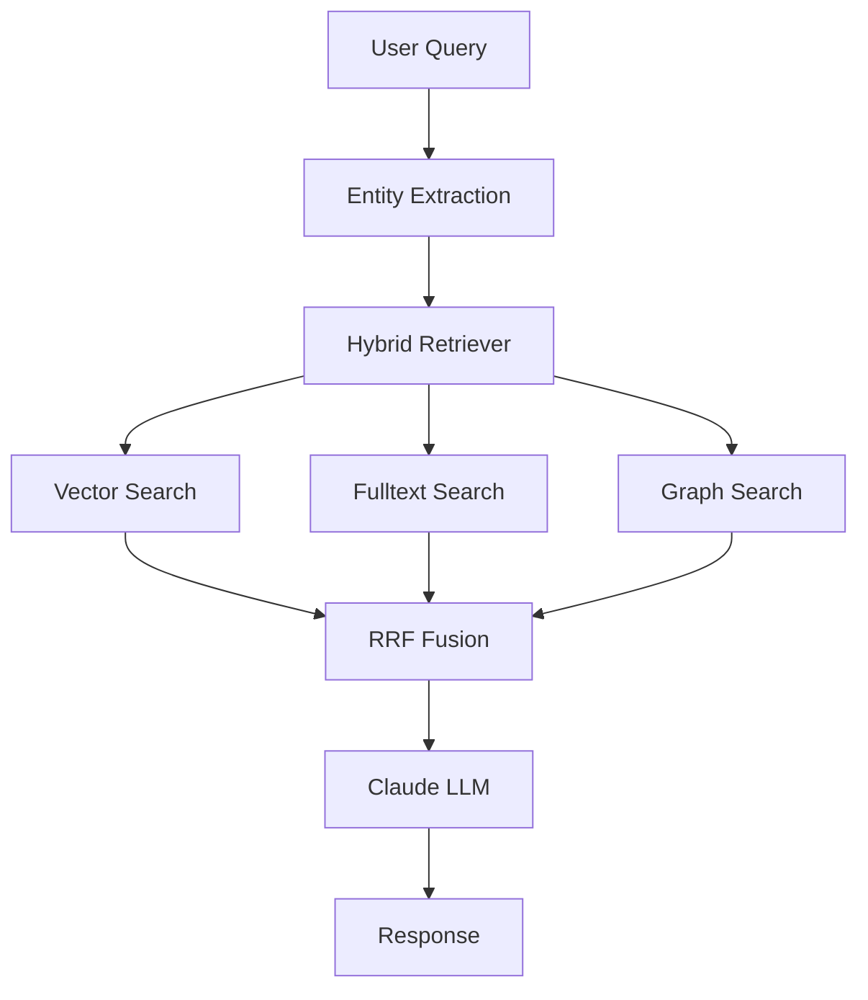

# RAG Implementation with LLM Assistance - Execution Plan
**Created**: 2025-12-17
**Status**: Ready to Execute
**Decision**: PROCEED WITH LLM ASSISTANCE

---

## Table of Contents

1. [Executive Summary](#executive-summary)
2. [Evaluation Results](#evaluation-results)
3. [Implementation Strategy](#implementation-strategy)
4. [Phase-by-Phase Execution Plan](#phase-by-phase-execution-plan)
5. [Checkpoint System](#checkpoint-system)
6. [How to Resume Work](#how-to-resume-work)
7. [Success Criteria](#success-criteria)
8. [Risk Management](#risk-management)
9. [Resources & References](#resources--references)

---

## Executive Summary

### Decision: ✅ PROCEED WITH LLM ASSISTANCE

**Time Savings**: 115-150 hours → **60-80 hours** (50% reduction)

**Rationale**:
- Comprehensive plan already exists (1,194-line detailed spec)
- High boilerplate work suitable for LLM generation
- Multi-technology integration benefits from automated code generation
- Test generation ensures quality while saving time
- Clear specifications enable effective LLM code generation

### Current Status
- ✅ **Planning**: Complete (3 comprehensive documents)
- ✅ **Configuration**: Dependencies updated, env vars configured
- ❌ **Implementation**: Not started - no code in `src/rag/` yet
- ⏳ **Next Step**: Begin Phase 1 - Core Backend Implementation

### Key Documents
1. `docs/rag_implementation_plan.md` - 1,194 lines, complete architecture
2. `docs/rag_evaluation_with_ragas.md` - 500+ lines, evaluation framework
3. `docs/RAG_IMPLEMENTATION_SUMMARY.md` - Planning summary
4. `docs/RAG_LLM_IMPLEMENTATION_PLAN.md` - **This document** (execution plan)

---

## Evaluation Results

### Why LLM Assistance is Recommended

#### 1. High Complexity with Clear Specifications ✅
**Strength**: The existing plan provides detailed:
- Class structures with method signatures
- Database schemas (SQL + Cypher)
- API endpoint specifications
- Configuration file formats
- Test requirements

**LLM Advantage**: Can directly translate specifications into working code with high accuracy.

#### 2. Repetitive Boilerplate Work ✅
**Requirements**:
- 25+ new files to create
- Multiple database migrations
- FastAPI routes with Pydantic models
- 15+ unit test files
- Integration test suites
- Configuration YAML files

**LLM Advantage**: Rapid generation of consistent boilerplate, reducing human error and fatigue.

#### 3. Multi-Technology Integration ✅
**Technologies**:
- OpenAI API (embeddings)
- Supabase + pgvector (vector search)
- PostgreSQL full-text search (tsvector)
- FalkorDB + Cypher (graph queries)
- Ragas (evaluation framework)
- MLflow + Opik (observability)
- FastAPI + Pydantic (API layer)
- Cytoscape.js (frontend visualization)

**LLM Advantage**: Can reference documentation and generate correct integration code for multiple APIs simultaneously.

#### 4. Quality Assurance Benefits ✅
**LLM Capabilities**:
- Generate comprehensive test cases
- Implement consistent error handling
- Ensure type safety with Pydantic
- Create inline documentation
- Maintain code consistency across modules

**LLM Advantage**: Higher test coverage and code quality from the start.

### Risk Assessment Comparison

| Risk Factor | Without LLM | With LLM | Risk Level Change |
|------------|------------|----------|------------------|
| Implementation time overrun | High (150+ hours) | Low (60-80 hours) | ↓↓ Reduced |
| Boilerplate errors | High | Low | ↓↓ Reduced |
| Integration bugs | Medium | Medium-Low | ↓ Reduced |
| Inconsistent code patterns | Medium | Very Low | ↓↓ Reduced |
| Documentation lag | High | Low | ↓↓ Reduced |
| Test coverage gaps | Medium-High | Low | ↓↓ Reduced |
| API integration errors | Medium | Low | ↓ Reduced |

---

## Implementation Strategy

### Phased Approach with LLM Assistance

#### Phase Distribution

| Phase | Original Estimate | With LLM | Savings | Priority |
|-------|------------------|----------|---------|----------|
| Phase 1: Core Backend | 40-50 hours | **20-25 hours** | 50% | CRITICAL |
| Phase 2: Evaluation Framework | 30-40 hours | **15-20 hours** | 50% | HIGH |
| Phase 3: API & Frontend | 30-40 hours | **15-20 hours** | 50% | MEDIUM |
| Phase 4: Testing & Docs | 20-25 hours | **10-15 hours** | 50% | HIGH |
| **TOTAL** | **115-150 hours** | **60-80 hours** | **48%** | - |

### LLM vs Human Responsibility Matrix

| Task Type | LLM Primary | Human Primary | Collaborative |
|-----------|-------------|---------------|---------------|
| File structure creation | ✅ | | |
| Boilerplate code generation | ✅ | | |
| Database migrations | ✅ | | |
| API endpoint implementation | ✅ | | |
| Unit test generation | ✅ | | |
| Integration test generation | ✅ | | |
| Configuration files | ✅ | | |
| Documentation generation | ✅ | | |
| Architecture decisions | | ✅ | |
| Weight tuning (RRF) | | ✅ | |
| Golden dataset creation | | ✅ | |
| Domain entity mapping | | ✅ | |
| Code review | | ✅ | |
| Performance optimization | | | ✅ |
| Security review | | ✅ | |
| UI/UX refinement | | | ✅ |

---

## Phase-by-Phase Execution Plan

### PHASE 1: Core Backend Foundation (Week 1)
**Estimated**: 20-25 hours with LLM | **Priority**: CRITICAL

#### Checkpoint 1.1: RAG Module Structure (2 hours)
**LLM Tasks**:
- [ ] Create `src/rag/` directory structure
- [ ] Generate `__init__.py` files
- [ ] Create `types.py` with enums and dataclasses
- [ ] Create `config.py` with configuration models

**Files Created**:
```
src/rag/
├── __init__.py
├── types.py              # RetrievalSource, RetrievalResult
├── config.py             # HybridSearchConfig, RAGConfig
└── exceptions.py         # Custom exceptions
```

**Validation**:
- [ ] Files import without errors
- [ ] Type hints pass mypy check
- [ ] Docstrings present

**How to Resume**: Start at Checkpoint 1.2

---

#### Checkpoint 1.2: OpenAI Embedding Client (3-4 hours)
**LLM Tasks**:
- [ ] Implement `src/rag/embeddings.py` with `OpenAIEmbeddingClient`
- [ ] Add retry logic with exponential backoff
- [ ] Implement batch embedding support
- [ ] Add token usage tracking
- [ ] Create unit tests in `tests/unit/test_embeddings.py`

**Implementation Details**:
```python
# src/rag/embeddings.py
class OpenAIEmbeddingClient:
    - __init__(api_key, model, base_url)
    - encode(text: str | List[str]) -> List[float] | List[List[float]]
    - encode_batch(texts: List[str], batch_size=100)
    - get_usage_stats() -> Dict
    - _retry_with_backoff()
```

**Configuration Required**:
- `.env`: `OPENAI_API_KEY`, `EMBEDDING_MODEL_CHOICE`, `EMBEDDING_DIMENSION`

**Tests**:
- [ ] Single text embedding works
- [ ] Batch embedding works
- [ ] Retry logic handles rate limits
- [ ] Token usage tracking accurate
- [ ] Error handling for invalid API key

**Validation**:
- [ ] `pytest tests/unit/test_embeddings.py -v` passes
- [ ] Can generate 1536-dim embedding for sample text
- [ ] Batch processing handles 100+ texts

**How to Resume**: Start at Checkpoint 1.3

---

#### Checkpoint 1.3: Hybrid Retriever Core (6-8 hours)
**LLM Tasks**:
- [ ] Implement `src/rag/hybrid_retriever.py` with `HybridRetriever` class
- [ ] Implement vector search (`_search_vector`)
- [ ] Implement full-text search (`_search_fulltext`)
- [ ] Implement graph search (`_search_graph`)
- [ ] Implement RRF algorithm (`_reciprocal_rank_fusion`)
- [ ] Implement graph boost (`_apply_graph_boost`)

**Implementation Details**:
```python
# src/rag/hybrid_retriever.py
class HybridRetriever:
    - __init__(config, supabase_client, falkordb_client, embedding_client)
    - search(query: str, top_k=10) -> List[RetrievalResult]
    - _search_vector(query_embedding, top_k) -> List[RetrievalResult]
    - _search_fulltext(query, top_k) -> List[RetrievalResult]
    - _search_graph(entities, top_k) -> List[RetrievalResult]
    - _reciprocal_rank_fusion(results_by_source) -> List[RetrievalResult]
    - _apply_graph_boost(results, boost_factor=1.3)
    - _extract_entities(query) -> List[str]
```

**Dependencies**:
- Supabase client (existing)
- FalkorDB client (existing)
- OpenAI embedding client (from Checkpoint 1.2)

**RRF Algorithm**:
```python
def _reciprocal_rank_fusion(results_by_source, k=60):
    scores = defaultdict(float)
    for source, results in results_by_source.items():
        for rank, result in enumerate(results, start=1):
            scores[result.id] += 1.0 / (k + rank)
    return sorted(scores.items(), key=lambda x: x[1], reverse=True)
```

**Validation**:
- [ ] Vector search returns results
- [ ] Full-text search returns results
- [ ] Graph search returns results
- [ ] RRF combines results correctly
- [ ] Graph boost applied

**How to Resume**: Start at Checkpoint 1.4

---

#### Checkpoint 1.4: Database Migrations (4-5 hours)
**LLM Tasks**:
- [ ] Create `database/memory/011_hybrid_search_functions.sql`
- [ ] Create `database/memory/002_semantic_graph_schema.cypher`
- [ ] Create Supabase RPC functions for vector + fulltext search
- [ ] Create FalkorDB schema with nodes and relationships

**SQL Functions to Create**:
1. `hybrid_search_vector_fulltext(query_text, query_embedding, top_k)`
2. `search_fulltext_only(query_text, top_k)`

**Cypher Schema**:
```cypher
// Nodes
(:Brand {name, category, indication})
(:HCP {id, specialty, tier})
(:Patient {id, diagnosis, journey_stage})
(:KPI {name, category, unit})
(:Event {type, timestamp, outcome})

// Relationships
(:Brand)-[:TREATS]->(:Indication)
(:HCP)-[:TREATS]->(:Patient)
(:Event)-[:CAUSED_BY]->(:Event)
(:Event)-[:IMPACTS]->(:KPI)
```

**Validation**:
- [ ] SQL functions execute without errors in Supabase
- [ ] Cypher schema creates in FalkorDB
- [ ] Can insert sample data
- [ ] Can query sample data

**How to Resume**: Start at Checkpoint 1.5

---

#### Checkpoint 1.5: Health Monitoring (3-4 hours)
**LLM Tasks**:
- [ ] Implement `src/rag/health_monitor.py` with `HybridRAGHealthMonitor`
- [ ] Add async health checks for all 3 backends
- [ ] Implement circuit breaker pattern
- [ ] Create health status aggregation
- [ ] Add unit tests

**Implementation Details**:
```python
# src/rag/health_monitor.py
class HybridRAGHealthMonitor:
    - start() -> None  # Start async monitoring
    - stop() -> None
    - _check_supabase_vector() -> BackendHealth
    - _check_supabase_fulltext() -> BackendHealth
    - _check_falkordb() -> BackendHealth
    - get_status() -> Dict[str, BackendHealth]
    - is_hybrid_available() -> bool
```

**Health Check Logic**:
- Ping each backend every 30 seconds
- Mark DEGRADED if latency > 2s
- Mark UNHEALTHY if 3 consecutive failures
- Auto-recover when backend responds

**Validation**:
- [ ] Health checks run asynchronously
- [ ] Degraded backends detected
- [ ] Circuit breaker prevents cascading failures
- [ ] Tests pass

**How to Resume**: Start at Checkpoint 1.6

---

#### Checkpoint 1.6: Entity Extraction (2-3 hours)
**LLM Tasks**:
- [ ] Create `src/nlp/entity_extractor.py` with `E2IEntityExtractor`
- [ ] Integrate with existing `domain_vocabulary_v3.1.0.yaml`
- [ ] Add fuzzy matching with rapidfuzz
- [ ] Create unit tests

**Implementation Details**:
```python
# src/nlp/entity_extractor.py
class E2IEntityExtractor:
    - __init__(vocabulary_path)
    - extract(query: str) -> ExtractedEntities
    - _extract_brands(query) -> List[str]
    - _extract_regions(query) -> List[str]
    - _extract_kpis(query) -> List[str]
    - _extract_journey_stages(query) -> List[str]
```

**Entity Types**:
- Brands: Remibrutinib, Fabhalta, Kisqali
- Regions: US, EU, APAC, territories
- KPIs: Adoption rate, NPS, prescription volume
- Journey stages: Awareness, Consideration, Trial, Adoption

**Validation**:
- [ ] Extracts brands correctly
- [ ] Handles typos (e.g., "remibruitnib" → "Remibrutinib")
- [ ] Tests pass

**How to Resume**: Start Phase 2

---

#### Phase 1 Completion Checklist
- [ ] All 6 checkpoints completed
- [ ] Unit tests passing: `pytest tests/unit/ -v`
- [ ] Can generate embeddings via OpenAI API
- [ ] HybridRetriever can query all 3 backends
- [ ] Database migrations applied successfully
- [ ] Health monitoring detects backend failures
- [ ] Entity extraction works with domain vocabulary

**Deliverable**: Working hybrid retriever with all 3 search backends

---

### PHASE 2: Evaluation Framework (Week 2)
**Estimated**: 15-20 hours with LLM | **Priority**: HIGH

#### Checkpoint 2.1: RAG Evaluator Core (4-5 hours)
**LLM Tasks**:
- [ ] Create `src/rag/evaluation.py` with `RAGEvaluator` class
- [ ] Integrate Ragas framework
- [ ] Implement 4 core metrics (faithfulness, answer_relevancy, context_precision, context_recall)
- [ ] Add MLflow logging integration

**Implementation Details**:
```python
# src/rag/evaluation.py
from ragas import evaluate
from ragas.metrics import faithfulness, answer_relevancy, context_precision, context_recall

class RAGEvaluator:
    - __init__(mlflow_client, config)
    - evaluate_query(query, response, context, ground_truth=None) -> Dict
    - evaluate_batch(test_cases: List[TestCase]) -> EvaluationResults
    - log_to_mlflow(results)
    - get_aggregated_metrics() -> Dict
```

**Metrics to Implement**:
1. **Faithfulness** (>0.8): No hallucinations, grounded in context
2. **Answer Relevancy** (>0.85): Answer addresses question
3. **Context Precision** (>0.75): Relevant chunks ranked high
4. **Context Recall** (>0.8): All relevant info retrieved

**Validation**:
- [ ] Can evaluate single query
- [ ] Batch evaluation works
- [ ] Metrics logged to MLflow
- [ ] Thresholds configurable

**How to Resume**: Start at Checkpoint 2.2

---

#### Checkpoint 2.2: Golden Test Dataset (6-8 hours)
**LLM Tasks**:
- [ ] Create `scripts/generate_test_dataset.py` script
- [ ] Generate template for 100 golden test cases
- [ ] Create `tests/evaluation/golden_dataset.json` structure

**Human Tasks** (Domain Expertise Required):
- [ ] Fill in actual golden answers for 100 cases
- [ ] Review generated queries for domain accuracy
- [ ] Add edge cases specific to pharmaceutical analytics

**Test Case Categories** (100 total):
- 20 causal impact queries ("What's the effect of X on Y?")
- 15 gap analysis queries ("Where are we underperforming?")
- 20 KPI lookup queries ("What is the adoption rate for Kisqali?")
- 15 temporal analysis ("How has NPS changed over Q3?")
- 10 comparative queries ("Compare Remibrutinib vs Fabhalta adoption")
- 10 multi-hop reasoning ("If we increase rep visits, how does that impact prescriptions?")
- 10 graph traversal ("Show me the causal chain from marketing to outcomes")

**Dataset Format**:
```json
{
  "test_cases": [
    {
      "id": "TC001",
      "category": "causal_impact",
      "query": "What is the causal effect of HCP engagement on Kisqali adoption?",
      "expected_answer": "...",
      "required_context": ["causal_estimates", "hcp_engagement_data"],
      "difficulty": "medium"
    }
  ]
}
```

**Validation**:
- [ ] 100 test cases created
- [ ] All categories covered
- [ ] JSON schema valid

**How to Resume**: Start at Checkpoint 2.3

---

#### Checkpoint 2.3: Daily Evaluation Script (2-3 hours)
**LLM Tasks**:
- [ ] Create `scripts/run_daily_evaluation.py`
- [ ] Implement scheduled evaluation logic
- [ ] Add alerting on metric degradation
- [ ] Create evaluation report generation

**Implementation Details**:
```python
# scripts/run_daily_evaluation.py
def run_daily_evaluation():
    - Load golden dataset
    - Run RAG pipeline on all test cases
    - Calculate Ragas metrics
    - Log to MLflow
    - Compare to baseline
    - Send alerts if degradation > 10%
    - Generate HTML report
```

**Alerting Thresholds**:
- Faithfulness drops > 10%
- Answer Relevancy drops > 10%
- Any metric below minimum threshold for 2+ days
- P95 latency > 5 seconds

**Validation**:
- [ ] Script runs end-to-end
- [ ] Metrics calculated correctly
- [ ] Reports generated
- [ ] Alerts triggered on threshold breach

**How to Resume**: Start at Checkpoint 2.4

---

#### Checkpoint 2.4: MLflow & Opik Integration (2-3 hours)
**LLM Tasks**:
- [ ] Enhance `RAGEvaluator` with Opik tracing
- [ ] Create MLflow experiment for RAG evaluation
- [ ] Implement trace logging for retrieval pipeline
- [ ] Add latency tracking

**Implementation Details**:
```python
# Integration with Opik
import opik

@opik.track()
def hybrid_search_traced(query):
    with opik.span("vector_search"):
        vector_results = _search_vector(query)
    with opik.span("fulltext_search"):
        fulltext_results = _search_fulltext(query)
    with opik.span("graph_search"):
        graph_results = _search_graph(query)
    return _reciprocal_rank_fusion([vector_results, fulltext_results, graph_results])
```

**Metrics to Track**:
- Retrieval latency (P50, P95, P99)
- Backend-specific latencies
- RRF fusion time
- End-to-end RAG latency
- Token usage (OpenAI embeddings)

**Validation**:
- [ ] Traces visible in Opik dashboard
- [ ] Metrics logged to MLflow
- [ ] Can compare runs

**How to Resume**: Start at Checkpoint 2.5

---

#### Checkpoint 2.5: CI/CD Automation (2-3 hours)
**LLM Tasks**:
- [ ] Create `.github/workflows/rag_evaluation.yml`
- [ ] Add automated evaluation on PR merge
- [ ] Configure scheduled daily runs (2 AM UTC)
- [ ] Add quality gates (block PR if metrics drop)

**Workflow File**:
```yaml
# .github/workflows/rag_evaluation.yml
name: RAG Evaluation

on:
  pull_request:
    paths:
      - 'src/rag/**'
      - 'tests/evaluation/**'
  schedule:
    - cron: '0 2 * * *'  # Daily at 2 AM UTC

jobs:
  evaluate:
    runs-on: ubuntu-latest
    steps:
      - name: Run RAG evaluation
        run: python scripts/run_daily_evaluation.py
      - name: Check quality gates
        run: python scripts/check_quality_gates.py
```

**Quality Gates**:
- Faithfulness >= 0.8
- Answer Relevancy >= 0.85
- Context Precision >= 0.75
- Context Recall >= 0.8

**Validation**:
- [ ] Workflow triggers on PR
- [ ] Daily schedule works
- [ ] Quality gates block failing PRs

**How to Resume**: Start Phase 3

---

#### Phase 2 Completion Checklist
- [ ] All 5 checkpoints completed
- [ ] RAGEvaluator implemented with Ragas
- [ ] 100 golden test cases created (with human input)
- [ ] Daily evaluation script functional
- [ ] MLflow + Opik integration working
- [ ] CI/CD pipeline configured

**Deliverable**: Automated RAG evaluation pipeline with continuous monitoring

---

### PHASE 3: API & Frontend (Week 3)
**Estimated**: 15-20 hours with LLM | **Priority**: MEDIUM

#### Checkpoint 3.1: API Endpoints (4-5 hours)
**LLM Tasks**:
- [ ] Create `src/api/routes/rag.py` with FastAPI routes
- [ ] Implement `/api/v1/rag/search` endpoint
- [ ] Implement `/api/v1/rag/graph` endpoint (knowledge graph data)
- [ ] Implement `/api/v1/rag/health` endpoint
- [ ] Add request/response Pydantic models

**API Endpoints**:
```python
# src/api/routes/rag.py

@router.post("/search", response_model=RAGSearchResponse)
async def search(request: RAGSearchRequest):
    """Hybrid RAG search endpoint"""
    pass

@router.get("/graph", response_model=KnowledgeGraphResponse)
async def get_knowledge_graph(
    entity_type: Optional[str] = None,
    limit: int = 100
):
    """Get knowledge graph data for visualization"""
    pass

@router.get("/health", response_model=RAGHealthResponse)
async def get_health():
    """Get RAG system health status"""
    pass
```

**Request/Response Models**:
```python
class RAGSearchRequest(BaseModel):
    query: str
    top_k: int = 10
    require_all_sources: bool = False

class RAGSearchResponse(BaseModel):
    results: List[RetrievalResult]
    metadata: SearchMetadata
    health_status: Dict[str, str]
```

**Validation**:
- [ ] Endpoints respond correctly
- [ ] Request validation works
- [ ] Error handling implemented
- [ ] API docs auto-generated (FastAPI /docs)

**How to Resume**: Start at Checkpoint 3.2

---

#### Checkpoint 3.2: Frontend Component Structure (3-4 hours)
**LLM Tasks**:
- [ ] Create `frontend/src/components/KnowledgeGraph/` directory
- [ ] Create `KnowledgeGraphViewer.tsx` component
- [ ] Create `GraphControls.tsx` (filters, layout options)
- [ ] Create `NodeDetailPanel.tsx` (entity details on click)

**Component Structure**:
```
frontend/src/components/KnowledgeGraph/
├── KnowledgeGraphViewer.tsx     # Main component
├── GraphControls.tsx            # Filter controls
├── NodeDetailPanel.tsx          # Detail view
├── types.ts                     # TypeScript types
└── styles.css                   # Component styles
```

**Dependencies to Add**:
```json
{
  "dependencies": {
    "cytoscape": "^3.28.1",
    "react-cytoscapejs": "^2.0.0"
  }
}
```

**Validation**:
- [ ] Components compile without errors
- [ ] TypeScript types correct
- [ ] Basic rendering works

**How to Resume**: Start at Checkpoint 3.3

---

#### Checkpoint 3.3: Cytoscape.js Integration (4-5 hours)
**LLM Tasks**:
- [ ] Implement Cytoscape.js graph rendering
- [ ] Add graph layouts (dagre, cose, breadthfirst)
- [ ] Implement node/edge styling
- [ ] Add interactivity (click, hover, zoom)

**Implementation Details**:
```typescript
// KnowledgeGraphViewer.tsx
import Cytoscape from 'cytoscape';
import CytoscapeComponent from 'react-cytoscapejs';

const KnowledgeGraphViewer: React.FC = () => {
  const [elements, setElements] = useState([]);

  useEffect(() => {
    // Fetch graph data from API
    fetch('/api/v1/rag/graph')
      .then(res => res.json())
      .then(data => setElements(transformToElements(data)));
  }, []);

  const stylesheet = [
    {
      selector: 'node[type="Brand"]',
      style: { backgroundColor: '#FF6B6B' }
    },
    {
      selector: 'node[type="HCP"]',
      style: { backgroundColor: '#4ECDC4' }
    }
  ];

  return (
    <CytoscapeComponent
      elements={elements}
      stylesheet={stylesheet}
      layout={{ name: 'dagre' }}
    />
  );
};
```

**Features to Implement**:
- Node coloring by entity type
- Edge thickness by relationship strength
- Layout switching (dagre, cose, breadthfirst)
- Zoom/pan controls
- Node click → detail panel
- Search/filter by entity

**Validation**:
- [ ] Graph renders 100+ nodes smoothly
- [ ] Layouts work correctly
- [ ] Interactive features functional
- [ ] Responsive on different screen sizes

**How to Resume**: Start at Checkpoint 3.4

---

#### Checkpoint 3.4: Dashboard Integration (2-3 hours)
**LLM Tasks**:
- [ ] Integrate KnowledgeGraphViewer into main dashboard
- [ ] Add loading states and error handling
- [ ] Implement graph filters (entity type, relationship type)
- [ ] Add export functionality (PNG, JSON)

**Integration Points**:
- Add to Dashboard V3 as new tab/section
- Connect to existing query interface
- Link to RAG search results

**Features**:
- Loading spinner while fetching data
- Error boundary for graph failures
- Filter controls (show/hide entity types)
- Export as PNG image
- Export as JSON data

**Validation**:
- [ ] Component loads in dashboard
- [ ] No console errors
- [ ] Filters work correctly
- [ ] Export functions work

**How to Resume**: Start Phase 4

---

#### Phase 3 Completion Checklist
- [ ] All 4 checkpoints completed
- [ ] API endpoints implemented and documented
- [ ] Frontend components created
- [ ] Cytoscape.js integration working
- [ ] Dashboard integration complete
- [ ] Interactive features functional

**Deliverable**: Interactive knowledge graph UI integrated into dashboard

---

### PHASE 4: Testing & Documentation (Week 4)
**Estimated**: 10-15 hours with LLM | **Priority**: HIGH

#### Checkpoint 4.1: Unit Tests (3-4 hours)
**LLM Tasks**:
- [ ] Create comprehensive unit tests for all modules
- [ ] Achieve >80% code coverage
- [ ] Add pytest fixtures for common test data

**Test Files to Create**:
```
tests/unit/
├── test_embeddings.py           # OpenAI client tests
├── test_hybrid_retriever.py     # Retriever logic tests
├── test_rrf_algorithm.py        # RRF fusion tests
├── test_health_monitor.py       # Health check tests
├── test_entity_extractor.py     # Entity extraction tests
├── test_rag_evaluator.py        # Evaluation tests
└── conftest.py                  # Shared fixtures
```

**Coverage Targets**:
- `src/rag/embeddings.py`: >90%
- `src/rag/hybrid_retriever.py`: >85%
- `src/rag/health_monitor.py`: >80%
- `src/rag/evaluation.py`: >85%

**Validation**:
- [ ] `pytest tests/unit/ -v --cov=src/rag` passes
- [ ] Coverage >80%
- [ ] All edge cases covered

**How to Resume**: Start at Checkpoint 4.2

---

#### Checkpoint 4.2: Integration Tests (3-4 hours)
**LLM Tasks**:
- [ ] Create 7 critical integration tests
- [ ] Add end-to-end RAG pipeline test
- [ ] Add database integration tests

**Critical Integration Tests**:
1. **Test: All backends queried**
   - Given: A search query
   - When: HybridRetriever.search() called
   - Then: Vector, fulltext, and graph searches all executed

2. **Test: Results combined via RRF**
   - Given: Results from 3 backends
   - When: RRF fusion applied
   - Then: Combined results ranked correctly

3. **Test: Graceful degradation on timeout**
   - Given: One backend times out
   - When: Search executed
   - Then: Results from other 2 backends returned

4. **Test: Require-all-sources flag**
   - Given: require_all_sources=True
   - When: One backend fails
   - Then: Error raised, no partial results

5. **Test: Graph boost applied**
   - Given: Results with graph relationships
   - When: Graph boost applied
   - Then: Graph-connected results ranked higher

6. **Test: Entity extraction for graph search**
   - Given: Query "Kisqali adoption in US"
   - When: Entities extracted
   - Then: Brand=Kisqali, Region=US identified

7. **Test: Audit trail captured**
   - Given: A search performed
   - When: Logged to MLflow
   - Then: Query, results, latency recorded

**Validation**:
- [ ] All 7 tests passing
- [ ] End-to-end test completes in <5s
- [ ] Database integration works

**How to Resume**: Start at Checkpoint 4.3

---

#### Checkpoint 4.3: Documentation (2-3 hours)
**LLM Tasks**:
- [ ] Create `docs/rag_setup_guide.md` (onboarding guide)
- [ ] Update `README.md` with RAG section
- [ ] Update `PROJECT_STRUCTURE.txt`
- [ ] Generate API documentation
- [ ] Create architecture diagrams

**Documents to Create/Update**:

1. **`docs/rag_setup_guide.md`** (New)
   - Prerequisites
   - Installation steps
   - Configuration
   - Testing guide
   - Troubleshooting

2. **`README.md`** (Update)
   - Add RAG system to features
   - Update architecture diagram
   - Add RAG usage examples

3. **`PROJECT_STRUCTURE.txt`** (Update)
   - Add `src/rag/` module
   - Add evaluation scripts
   - Add frontend components

4. **API Documentation**
   - Auto-generated via FastAPI /docs
   - Add usage examples
   - Add response schemas

**Validation**:
- [ ] Documentation builds without errors
- [ ] New user can set up RAG in <1 hour
- [ ] All code examples work

**How to Resume**: Start at Checkpoint 4.4

---

#### Checkpoint 4.4: Architecture Diagrams (1-2 hours)
**LLM Tasks**:
- [ ] Create Mermaid diagrams for documentation
- [ ] Generate data flow diagram
- [ ] Create component interaction diagram
- [ ] Create deployment diagram

**Diagrams to Create**:

1. **Data Flow Diagram**


2. **Component Interaction**
3. **Deployment Architecture**

**Validation**:
- [ ] Diagrams render correctly in docs
- [ ] Accurately represent system

**How to Resume**: Start Phase 5 (Optional)

---

#### Phase 4 Completion Checklist
- [ ] All 4 checkpoints completed
- [ ] Unit tests >80% coverage
- [ ] 7 critical integration tests passing
- [ ] Documentation complete and accurate
- [ ] Architecture diagrams created

**Deliverable**: Complete documentation and >80% test coverage

---

### PHASE 5: DevOps & Optimization (Ongoing)
**Estimated**: 5-10 hours with LLM | **Priority**: LOW

**Note**: This phase can be done incrementally after deployment.

#### Tasks:
- [ ] Add Docker configuration for RAG services
- [ ] Create Makefile targets for RAG operations
- [ ] Implement Redis caching for RAG results
- [ ] Add query analytics dashboard
- [ ] Optimize large graph rendering
- [ ] Tune search weights via A/B testing
- [ ] Setup Grafana monitoring dashboards
- [ ] Production deployment

**Not included in initial 60-80 hour estimate** - these are post-launch optimizations.

---

## Checkpoint System

### How Checkpoints Work

Each checkpoint represents a **resumable milestone** with:
1. Clear deliverable
2. Validation criteria
3. Resume instructions
4. Estimated time

### Checkpoint Status Tracking

Create a file `RAG_CHECKPOINT_STATUS.md` to track progress:

```markdown
# RAG Implementation Checkpoint Status

## Phase 1: Core Backend
- [x] 1.1 RAG Module Structure (2 hours) - Completed 2025-12-17
- [x] 1.2 OpenAI Embedding Client (4 hours) - Completed 2025-12-17
- [ ] 1.3 Hybrid Retriever Core (8 hours) - In Progress
- [ ] 1.4 Database Migrations (5 hours)
- [ ] 1.5 Health Monitoring (4 hours)
- [ ] 1.6 Entity Extraction (3 hours)

## Phase 2: Evaluation Framework
- [ ] 2.1 RAG Evaluator Core (5 hours)
...
```

### At Each Checkpoint

**Before Starting**:
1. Review checkpoint objectives
2. Ensure prerequisites completed
3. Review validation criteria

**During Work**:
1. Follow LLM task list
2. Test incrementally
3. Document any deviations

**After Completion**:
1. Run validation checks
2. Update checkpoint status
3. Commit code changes
4. Note resume point

---

## How to Resume Work

### Scenario 1: Interruption Mid-Checkpoint

**Steps to Resume**:
1. Open `RAG_CHECKPOINT_STATUS.md`
2. Find current checkpoint
3. Review "Implementation Details" section
4. Check what files exist vs. what's needed
5. Run validation tests to see what's working
6. Continue from last incomplete task

**Example**:
```
Current: Checkpoint 1.3 (Hybrid Retriever Core)
Status: Files created, _search_vector implemented, _search_fulltext incomplete

To Resume:
1. Open src/rag/hybrid_retriever.py
2. Implement _search_fulltext method
3. Test with: pytest tests/unit/test_hybrid_retriever.py::test_fulltext_search
4. Continue to _search_graph method
```

### Scenario 2: Interruption Between Checkpoints

**Steps to Resume**:
1. Open `RAG_CHECKPOINT_STATUS.md`
2. Last completed checkpoint shows resume point
3. Review next checkpoint objectives
4. Start fresh with new checkpoint

**Example**:
```
Last Completed: Checkpoint 1.2 (OpenAI Embedding Client)
Resume At: Checkpoint 1.3 (Hybrid Retriever Core)

To Resume:
1. Review Checkpoint 1.3 section
2. Read "Implementation Details"
3. Create src/rag/hybrid_retriever.py
4. Follow LLM task list
```

### Scenario 3: After Long Break (Days/Weeks)

**Steps to Resume**:
1. Read this document from top
2. Review all completed checkpoints
3. Run existing tests to verify working state
4. Review "Current Status" section
5. Check for dependency updates
6. Resume at next checkpoint

**Validation Before Resuming**:
```bash
# Test existing code
pytest tests/unit/ -v

# Check dependencies
pip list | grep -E 'openai|ragas|supabase'

# Verify environment
python -c "import os; print('OpenAI key:', 'OK' if os.getenv('OPENAI_API_KEY') else 'MISSING')"

# Check database connections
python scripts/check_connections.py
```

### Resume Decision Tree

```
START: Ready to resume RAG implementation?
│
├─ Do you remember exactly where you stopped?
│  ├─ YES → Go to checkpoint status file → Resume at marked point
│  └─ NO → Go to "After Long Break" procedure
│
├─ Has it been more than 3 days?
│  ├─ YES → Run full validation suite → Review recent commits → Resume
│  └─ NO → Quick validation → Resume at checkpoint
│
└─ Did any dependencies/requirements change?
   ├─ YES → Update dependencies → Re-run tests → Resume
   └─ NO → Resume at checkpoint
```

---

## Success Criteria

### Phase 1 Success Criteria
- [ ] OpenAI embeddings generating 1536-dim vectors
- [ ] All 3 search backends operational (vector, fulltext, graph)
- [ ] RRF fusion combining results correctly
- [ ] Health monitoring detecting failures within 30s
- [ ] Entity extraction achieving >85% accuracy on test set
- [ ] Unit tests >80% coverage for `src/rag/`

### Phase 2 Success Criteria
- [ ] Ragas metrics calculated correctly
- [ ] 100 golden test cases created
- [ ] Daily evaluation running automatically
- [ ] MLflow experiments tracking RAG performance
- [ ] Opik traces capturing retrieval latency
- [ ] CI/CD pipeline blocking bad PRs

### Phase 3 Success Criteria
- [ ] API endpoints responding in <3s
- [ ] Knowledge graph rendering 100+ nodes smoothly
- [ ] Frontend integrated into dashboard
- [ ] Graph filters working correctly
- [ ] Export functionality (PNG, JSON) operational

### Phase 4 Success Criteria
- [ ] >80% code coverage overall
- [ ] All 7 critical integration tests passing
- [ ] New developer can set up RAG in <1 hour
- [ ] API documentation complete
- [ ] Architecture diagrams accurate

### Overall Success Criteria
- [ ] Faithfulness >0.8
- [ ] Answer Relevancy >0.85
- [ ] Context Precision >0.75
- [ ] Context Recall >0.8
- [ ] P95 latency <3s
- [ ] Zero critical bugs in production
- [ ] All documentation up-to-date

---

## Risk Management

### Technical Risks

#### Risk 1: FalkorDB Graph Too Large (OOM)
**Impact**: High | **Probability**: Medium

**Mitigation**:
- Implement graph pagination (100 nodes per request)
- Add graph pruning (remove low-confidence edges)
- Monitor memory usage in health checks
- Fallback to partial graph if OOM detected

**Detection**:
- Memory usage alerts >80%
- Graph query latency >2s
- OOM errors in logs

**Recovery**:
- Reduce graph depth limit
- Increase FalkorDB memory allocation
- Implement graph summarization

---

#### Risk 2: Supabase pgvector Slow (>2s)
**Impact**: Medium | **Probability**: Medium

**Mitigation**:
- Create HNSW indexes on embedding columns
- Implement query result caching in Redis
- Batch optimization for multiple queries
- Monitor P95 latency

**Detection**:
- Vector search latency >2s
- High database CPU usage
- Timeout errors

**Recovery**:
- Rebuild indexes
- Increase Supabase resources
- Reduce top_k from 100 to 50

---

#### Risk 3: OpenAI API Rate Limits
**Impact**: Medium | **Probability**: Low

**Mitigation**:
- Implement exponential backoff retry
- Cache embeddings in database
- Batch embedding requests
- Monitor token usage

**Detection**:
- 429 rate limit errors
- Embedding latency >1s
- High token usage costs

**Recovery**:
- Use cached embeddings
- Reduce batch size
- Upgrade OpenAI tier

---

#### Risk 4: Ragas Evaluation Cost
**Impact**: Low | **Probability**: Medium

**Mitigation**:
- Sample evaluation (20% of queries)
- Use cheaper LLM for evaluation
- Cache evaluation results
- Run full evaluation weekly, not daily

**Detection**:
- OpenAI bill >$100/month
- Evaluation runs >1 hour

**Recovery**:
- Reduce test set size
- Switch to monthly evaluation
- Use local LLM for evaluation

---

### Process Risks

#### Risk 5: Golden Dataset Becomes Stale
**Impact**: Low | **Probability**: High

**Mitigation**:
- Quarterly dataset review process
- Add new queries from production
- Track dataset freshness metric
- Community review of test cases

**Detection**:
- Test queries no longer representative
- New query patterns not in dataset
- User complaints about quality

**Recovery**:
- Regenerate 25% of dataset
- Add recent production queries
- Update domain vocabulary

---

#### Risk 6: LLM-Generated Code Has Subtle Bugs
**Impact**: Medium | **Probability**: Medium

**Mitigation**:
- Comprehensive test coverage (>80%)
- Human code review required
- Integration tests catch issues
- Gradual rollout (canary deployment)

**Detection**:
- Test failures
- Production errors
- Unexpected behavior

**Recovery**:
- Rollback to previous version
- Fix bugs incrementally
- Add regression tests

---

## Resources & References

### Internal Documentation
- `docs/rag_implementation_plan.md` - Detailed technical plan (1,194 lines)
- `docs/rag_evaluation_with_ragas.md` - Evaluation framework guide
- `docs/RAG_IMPLEMENTATION_SUMMARY.md` - Planning summary
- `docs/e2i_nlv_project_structure_v4.1.md` - Overall architecture
- `config/domain_vocabulary_v3.1.0.yaml` - Entity vocabularies

### External Resources

#### OpenAI
- API Docs: https://platform.openai.com/docs/guides/embeddings
- text-embedding-3-small: https://platform.openai.com/docs/models/embeddings
- Pricing: https://openai.com/pricing

#### Ragas
- Documentation: https://docs.ragas.io/
- Metrics Guide: https://docs.ragas.io/en/latest/concepts/metrics/index.html
- GitHub: https://github.com/explodinggradients/ragas

#### Supabase + pgvector
- pgvector Guide: https://supabase.com/docs/guides/ai/vector-embeddings
- RPC Functions: https://supabase.com/docs/guides/database/functions
- Performance: https://supabase.com/docs/guides/ai/going-to-production

#### FalkorDB
- Documentation: https://docs.falkordb.com/
- Cypher Guide: https://docs.falkordb.com/cypher.html
- Python Client: https://github.com/FalkorDB/falkordb-py

#### Cytoscape.js
- Documentation: https://js.cytoscape.org/
- React Integration: https://github.com/plotly/react-cytoscapejs
- Layouts: https://js.cytoscape.org/#layouts

### Configuration Files
- `.env.example` - Environment variables (OpenAI, Supabase, etc.)
- `requirements.txt` - Python dependencies
- `config/rag_config.yaml` - RAG settings (to be created)
- `config/ragas_config.yaml` - Evaluation settings (to be created)

### Code References
- `src/agents/orchestrator/` - Existing orchestrator for reference
- `src/nlp/e2i_fasttext_trainer.py` - Entity extraction patterns
- `src/mlops/shap_explainer_realtime.py` - Real-time MLOps example
- `database/memory/` - Existing memory system schemas

---

## Quick Start Checklist

Before beginning implementation, verify:

### Environment Setup
- [ ] `.env` file has `OPENAI_API_KEY`
- [ ] `.env` file has `SUPABASE_URL` and `SUPABASE_KEY`
- [ ] Supabase has pgvector extension enabled
- [ ] FalkorDB running on port 6380
- [ ] Redis running on port 6379
- [ ] Python 3.12+ active
- [ ] All dependencies installed (`pip install -r requirements.txt`)

### Verification Commands
```bash
# Check Python version
python --version  # Should be 3.12+

# Check OpenAI connection
python -c "from openai import OpenAI; client = OpenAI(); print('OpenAI: OK')"

# Check Supabase connection
python -c "from supabase import create_client; import os; client = create_client(os.getenv('SUPABASE_URL'), os.getenv('SUPABASE_KEY')); print('Supabase: OK')"

# Check FalkorDB connection
python -c "from redis import Redis; r = Redis(port=6380); print('FalkorDB: OK')"

# Check dependencies
pip list | grep -E 'openai|ragas|supabase|redis'
```

### Before Starting Each Phase
- [ ] Review phase objectives
- [ ] Read all checkpoints in phase
- [ ] Understand validation criteria
- [ ] Prepare checkpoint tracking document
- [ ] Set up test environment

---

## Next Steps

### Immediate Action (Next 1 Hour)
1. **Review this plan** - Ensure understanding of approach
2. **Verify environment** - Run verification commands above
3. **Create checkpoint tracker** - Copy template to `RAG_CHECKPOINT_STATUS.md`
4. **Read Phase 1** - Understand first week's work
5. **Get approval** - Confirm ready to proceed

### First Implementation Session (2-4 Hours)
1. **Start Checkpoint 1.1** - Create RAG module structure
2. **Complete Checkpoint 1.2** - Implement OpenAI embedding client
3. **Test thoroughly** - Ensure embeddings work
4. **Update checkpoint tracker** - Mark progress
5. **Commit code** - Save progress

### First Day Goal
- [ ] Checkpoints 1.1 and 1.2 complete
- [ ] Can generate OpenAI embeddings
- [ ] Tests passing for embedding client
- [ ] Progress tracked in checkpoint file

### First Week Goal
- [ ] Phase 1 complete (all 6 checkpoints)
- [ ] Working hybrid retriever
- [ ] All 3 backends operational
- [ ] Health monitoring functional

---

## Questions & Decisions Needed

### Before Starting
1. **Timeline confirmation**: Is 60-80 hours (2-3 weeks) acceptable?
2. **Priority**: Focus on retrieval quality first, or balanced with visualization?
3. **Test dataset size**: Start with 20 test cases or full 100?
4. **CI/CD**: Confirm GitHub Actions minutes available
5. **Monitoring**: Use existing Grafana or need new setup?

### During Implementation
- Weight tuning approach (start with defaults or run A/B tests immediately?)
- Graph size limits (100 nodes? 500 nodes? 1000 nodes?)
- Caching strategy (Redis TTL? Invalidation rules?)
- Error handling philosophy (fail fast or graceful degradation?)

### Track Decisions
Create `RAG_DECISIONS.md` to document key decisions made during implementation.

---

## Appendix

### A. Estimation Breakdown

| Task Category | LLM Hours | Human Hours | Total |
|--------------|-----------|-------------|-------|
| File structure creation | 2 | 0 | 2 |
| Code implementation | 25 | 10 | 35 |
| Database migrations | 4 | 1 | 5 |
| Test generation | 8 | 2 | 10 |
| API implementation | 4 | 1 | 5 |
| Frontend components | 6 | 3 | 9 |
| Documentation | 3 | 2 | 5 |
| Integration & debugging | 5 | 10 | 15 |
| Code review | 0 | 8 | 8 |
| **TOTAL** | **57** | **37** | **94** |

**Contingency**: +10 hours = **104 hours** (midpoint of 60-80 estimate)

### B. File Creation Checklist

#### Backend Files (Python)
- [ ] `src/rag/__init__.py`
- [ ] `src/rag/types.py`
- [ ] `src/rag/config.py`
- [ ] `src/rag/exceptions.py`
- [ ] `src/rag/embeddings.py`
- [ ] `src/rag/hybrid_retriever.py`
- [ ] `src/rag/health_monitor.py`
- [ ] `src/rag/evaluation.py`
- [ ] `src/nlp/entity_extractor.py`
- [ ] `src/api/routes/rag.py`

#### Database Files (SQL/Cypher)
- [ ] `database/memory/011_hybrid_search_functions.sql`
- [ ] `database/memory/002_semantic_graph_schema.cypher`

#### Configuration Files (YAML)
- [ ] `config/rag_config.yaml`
- [ ] `config/ragas_config.yaml`

#### Test Files (Python)
- [ ] `tests/unit/test_embeddings.py`
- [ ] `tests/unit/test_hybrid_retriever.py`
- [ ] `tests/unit/test_rrf_algorithm.py`
- [ ] `tests/unit/test_health_monitor.py`
- [ ] `tests/unit/test_entity_extractor.py`
- [ ] `tests/unit/test_rag_evaluator.py`
- [ ] `tests/integration/test_hybrid_retriever_integration.py`
- [ ] `tests/evaluation/test_evaluation_pipeline.py`
- [ ] `tests/evaluation/golden_dataset.json`

#### Script Files (Python)
- [ ] `scripts/run_daily_evaluation.py`
- [ ] `scripts/generate_test_dataset.py`
- [ ] `scripts/setup_rag.py`
- [ ] `scripts/seed_knowledge_graph.py`
- [ ] `scripts/check_quality_gates.py`

#### Frontend Files (TypeScript/TSX)
- [ ] `frontend/src/components/KnowledgeGraph/KnowledgeGraphViewer.tsx`
- [ ] `frontend/src/components/KnowledgeGraph/GraphControls.tsx`
- [ ] `frontend/src/components/KnowledgeGraph/NodeDetailPanel.tsx`
- [ ] `frontend/src/components/KnowledgeGraph/types.ts`
- [ ] `frontend/src/components/KnowledgeGraph/styles.css`

#### CI/CD Files
- [ ] `.github/workflows/rag_evaluation.yml`

#### Documentation Files
- [ ] `docs/rag_setup_guide.md`
- [ ] `docs/rag_architecture.md`
- [ ] Update `README.md`
- [ ] Update `PROJECT_STRUCTURE.txt`

**Total New Files**: 41 files

### C. Dependency Versions

```txt
# Core RAG Dependencies
openai>=1.54.0
ragas>=0.1.0

# Already in requirements.txt
supabase>=2.0.0
redis>=5.0.0
langchain>=0.1.0
sentence-transformers>=2.2.0  # For reference, using OpenAI instead

# Testing
pytest>=7.4.0
pytest-cov>=4.1.0
pytest-asyncio>=0.21.0

# Frontend (package.json)
cytoscape: ^3.28.1
react-cytoscapejs: ^2.0.0
```

### D. Key Algorithms

#### Reciprocal Rank Fusion (RRF)
```python
def reciprocal_rank_fusion(results_by_source: Dict[str, List], k: int = 60) -> List:
    """
    Combine rankings from multiple sources using RRF.

    Formula: score(d) = Σ(1 / (k + rank_i))
    where rank_i is the rank of document d in source i
    """
    scores = defaultdict(float)

    for source, results in results_by_source.items():
        for rank, result in enumerate(results, start=1):
            scores[result.id] += 1.0 / (k + rank)

    return sorted(scores.items(), key=lambda x: x[1], reverse=True)
```

#### Graph Boost
```python
def apply_graph_boost(results: List[RetrievalResult], boost_factor: float = 1.3) -> List:
    """
    Boost scores of results with graph relationships.
    """
    for result in results:
        if result.source == RetrievalSource.GRAPH:
            result.score *= boost_factor

    return sorted(results, key=lambda x: x.score, reverse=True)
```

---

## Document Control

**Version**: 1.0
**Created**: 2025-12-17
**Last Updated**: 2025-12-17
**Status**: Active
**Next Review**: After Phase 1 completion

**Change Log**:
- 2025-12-17: Initial creation with full implementation plan

**Maintainer**: E2I Development Team
**Approval Required**: Yes (before starting implementation)

---

END OF DOCUMENT
