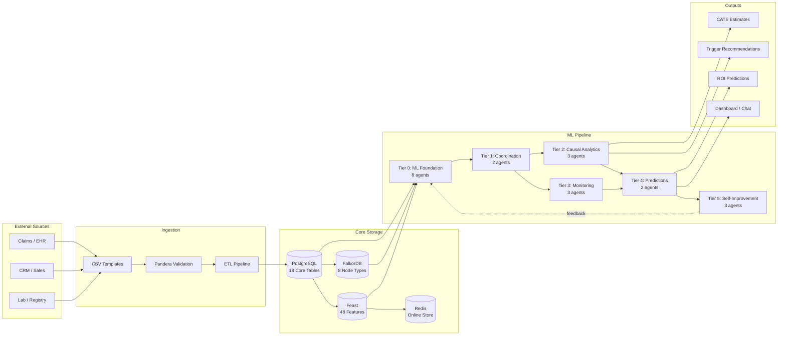

# 00 — Data Documentation Index

> **E2I Causal Analytics** | v4.2.1 | 21 Agents | 6 Tiers | 3 Brands | Last Updated: 2026-02

---

## System Overview

E2I Causal Analytics is a 21-agent, 6-tier pharmaceutical drug adoption analysis platform. It processes healthcare data (claims, EHR, CRM, lab) through causal inference pipelines to generate actionable insights for three Novartis brands: **Remibrutinib** (CSU), **Fabhalta** (PNH), and **Kisqali** (HR+ HER2- breast cancer). The system combines ML models, knowledge graphs, feature stores, and agentic workflows to produce causal estimates, trigger recommendations, ROI predictions, and resource optimization strategies.

---

## Document Map

| # | Document | Focus | What It Covers |
|---|----------|-------|-----------------|
| **01** | [Data Conversion Guide](01-DATA-CONVERSION-GUIDE.md) | Data engineers | Step-by-step playbook for converting real data to E2I format. Priority tables, enum mappings, ID formats, split assignment, Pandera validation. |
| **02** | [Core Data Dictionary](02-CORE-DATA-DICTIONARY.md) | Data engineers, analysts | 19 core PostgreSQL tables — `hcp_profiles`, `patient_journeys`, `treatment_events`, `triggers`, `business_metrics`, plus 12 enum types, 28 views, 6 functions. Full ERD. |
| **03** | [ML Pipeline Schema](03-ML-PIPELINE-SCHEMA.md) | ML engineers, MLOps | 60+ ML lifecycle tables — experiments, model registry, training runs, causal validation, digital twins, tool composer, HPO, A/B testing, GEPA, BentoML, Feast, causal discovery, cohort constructor. |
| **04** | [Knowledge Graph Ontology](04-KNOWLEDGE-GRAPH-ONTOLOGY.md) | Data scientists, graph engineers | FalkorDB schema — 8 node types, 15 edge types (13 direct + 2 inferred), 5 inference rules, pharma domain model, Cypher examples. |
| **05** | [Feature Store Reference](05-FEATURE-STORE-REFERENCE.md) | ML engineers | Feast configuration — 5 primary + 3 composite entities, 5 data sources, 9 feature views, 48 features, materialization and serving. |
| **06** | [KPI Reference](06-KPI-REFERENCE.md) | Analysts, product managers | All 46 KPIs across 6 workstreams with formulas, thresholds (target/warning/critical), source tables, and calculator references. |
| **07** | [Supporting Schemas](07-SUPPORTING-SCHEMAS.md) | Platform engineers | Memory (7 tables), RAG (2 tables + HNSW indexes), Chat (6+ tables with RLS), Audit (SHA-256 hash chain). |
| --- | [CSV Templates](templates/README.md) | Data engineers | 5 ready-to-use CSV templates with example rows: `hcp_profiles`, `patient_journeys`, `treatment_events`, `business_metrics`, `triggers`. |

---

## Quick-Start Decision Tree

**"I need to..."**

- **Load real data into the system** --> Start with [01 Data Conversion Guide](01-DATA-CONVERSION-GUIDE.md), then use [CSV Templates](templates/README.md)
- **Understand a specific database table** --> [02 Core Data Dictionary](02-CORE-DATA-DICTIONARY.md) for core tables, [03 ML Pipeline Schema](03-ML-PIPELINE-SCHEMA.md) for ML tables, [07 Supporting Schemas](07-SUPPORTING-SCHEMAS.md) for memory/RAG/chat/audit
- **Define or modify ML experiments** --> [03 ML Pipeline Schema](03-ML-PIPELINE-SCHEMA.md) (sections 1-2)
- **Set up causal validation gates** --> [03 ML Pipeline Schema](03-ML-PIPELINE-SCHEMA.md) (section 2) + [06 KPI Reference](06-KPI-REFERENCE.md) (causal metrics)
- **Configure digital twin simulations** --> [03 ML Pipeline Schema](03-ML-PIPELINE-SCHEMA.md) (section 3)
- **Query the knowledge graph** --> [04 Knowledge Graph Ontology](04-KNOWLEDGE-GRAPH-ONTOLOGY.md) (Cypher examples at bottom)
- **Add or modify graph nodes/edges** --> [04 Knowledge Graph Ontology](04-KNOWLEDGE-GRAPH-ONTOLOGY.md) (node/edge catalogs)
- **Serve features for real-time scoring** --> [05 Feature Store Reference](05-FEATURE-STORE-REFERENCE.md) (online store section)
- **Train models with historical features** --> [05 Feature Store Reference](05-FEATURE-STORE-REFERENCE.md) (offline store section)
- **Check KPI thresholds or formulas** --> [06 KPI Reference](06-KPI-REFERENCE.md)
- **Understand the audit trail** --> [07 Supporting Schemas](07-SUPPORTING-SCHEMAS.md) (audit section)
- **Debug RAG retrieval** --> [07 Supporting Schemas](07-SUPPORTING-SCHEMAS.md) (RAG section)
- **Review agent memory architecture** --> [07 Supporting Schemas](07-SUPPORTING-SCHEMAS.md) (memory section)

---

## Data Flow



---

## Cross-Reference Legend

| Symbol | Meaning |
|--------|---------|
| **PK** | Primary key |
| **FK** | Foreign key (references another table) |
| **UQ** | Unique constraint |
| **NN** | Not null |
| **IDX** | Indexed column |
| `JSONB` | Semi-structured JSON data |
| `vector(1536)` | pgvector embedding (1536-dim, OpenAI) |
| `GENERATED ALWAYS` | Computed column (stored) |
| `DEFAULT now()` | Auto-timestamped on insert |
| `CHECK(...)` | Value range constraint |
| `ENUM` | PostgreSQL enumerated type (see doc 02 for all 12 types) |

---

## Storage Summary

| Store | Technology | Tables/Entities | Primary Use |
|-------|-----------|----------------|-------------|
| **Core DB** | PostgreSQL (Supabase) | 19 tables, 12 enums, 28 views | Patient journeys, HCP profiles, treatments, triggers, business metrics |
| **ML DB** | PostgreSQL (Supabase) | 60+ tables | Experiments, models, deployments, causal validation, digital twins |
| **Memory DB** | PostgreSQL (Supabase) + pgvector | 7 tables | Episodic, procedural, semantic agent memory |
| **RAG DB** | PostgreSQL (Supabase) + pgvector | 2 tables + HNSW indexes | Hybrid document search (vector + full-text + graph) |
| **Chat DB** | PostgreSQL (Supabase) | 6+ tables with RLS | Conversation history, user preferences, training signals |
| **Audit DB** | PostgreSQL (Supabase) | 2 tables | SHA-256 hash-chained audit trail |
| **Knowledge Graph** | FalkorDB (Redis-compatible) | 8 node types, 15 edge types | Temporal pharma domain graph, Cypher queries |
| **Feature Store** | Feast + Redis | 9 feature views, 48 features | Offline training + online serving |
| **Task Queue** | Redis + Celery | N/A | Async task execution, dead-letter queue |

---

## Brand Reference

| Brand | Indication | Therapeutic Area | Key Specialties |
|-------|-----------|-----------------|----------------|
| **Remibrutinib** | Chronic Spontaneous Urticaria (CSU) | Immunology | Dermatology, Allergy/Immunology |
| **Fabhalta** | Paroxysmal Nocturnal Hemoglobinuria (PNH) | Hematology | Hematology |
| **Kisqali** | HR+ HER2- Breast Cancer | Oncology | Oncology, Breast Surgery |

---

## File Inventory

```
docs/data/
├── 00-INDEX.md                          # This file
├── 01-DATA-CONVERSION-GUIDE.md          # Conversion playbook
├── 02-CORE-DATA-DICTIONARY.md           # 19 core tables
├── 03-ML-PIPELINE-SCHEMA.md             # 60+ ML tables
├── 04-KNOWLEDGE-GRAPH-ONTOLOGY.md       # FalkorDB schema
├── 05-FEATURE-STORE-REFERENCE.md        # Feast features
├── 06-KPI-REFERENCE.md                  # 46 KPIs
├── 07-SUPPORTING-SCHEMAS.md             # Memory, RAG, Chat, Audit
└── templates/
    ├── README.md                        # Template usage guide
    ├── hcp_profiles.csv                 # 5 example HCP rows
    ├── patient_journeys.csv             # 5 example patient rows
    ├── treatment_events.csv             # 5 example treatment rows
    ├── business_metrics.csv             # 5 example metric rows
    └── triggers.csv                     # 5 example trigger rows
```
