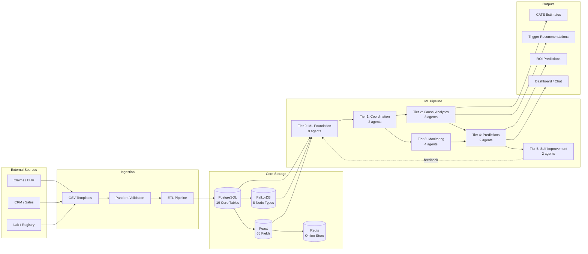

# 00 — Data Documentation Index

> **E2I Causal Analytics** | v4.2.1 | 22 Agents | 6 Tiers | 3 Brands | Last Updated: 2026-09-07

---

## System Overview

E2I Causal Analytics is a 22-agent, 6-tier pharmaceutical drug adoption analysis platform. It processes healthcare data (claims, EHR, CRM, lab) through causal inference pipelines to generate actionable insights for three Novartis brands: **Remibrutinib** (CSU), **Fabhalta** (PNH), and **Kisqali** (HR+ HER2- breast cancer). The system combines ML models, knowledge graphs, feature stores, and agentic workflows to produce causal estimates, trigger recommendations, ROI predictions, and resource optimization strategies.

---

## Document Map

| # | Document | Focus | What It Covers |
|---|----------|-------|-----------------|
| **01** | [Data Conversion Guide](01-DATA-CONVERSION-GUIDE.md) | Data engineers | Step-by-step playbook for converting real data to E2I format. Priority tables, enum mappings, ID formats, split assignment, Pandera validation. |
| **02** | [Core Data Dictionary](02-CORE-DATA-DICTIONARY.md) | Data engineers, analysts | The 19 core PostgreSQL tables declared in `database/core/e2i_ml_complete_v3_schema.sql` — `hcp_profiles`, `patient_journeys`, `treatment_events`, `triggers`, `business_metrics` — plus the enum types, views and functions that file declares (11 / 37 / 6 today) and the columns, views and RPCs added since by `database/migrations/`. Full ERD. Also the KPI registry & history tables. |
| **03** | [ML Pipeline Schema](03-ML-PIPELINE-SCHEMA.md) | ML engineers, MLOps | 60+ ML lifecycle tables — experiments, model registry, training runs, causal validation, digital twins, tool composer, HPO, A/B testing, GEPA, BentoML, Feast, causal discovery, cohort constructor. |
| **04** | [Knowledge Graph Ontology](04-KNOWLEDGE-GRAPH-ONTOLOGY.md) | Data scientists, graph engineers | FalkorDB schema — 8 node types, 15 edge types (13 direct + 2 inferred), 5 inference rules, pharma domain model, Cypher examples. |
| **05** | [Feature Store Reference](05-FEATURE-STORE-REFERENCE.md) | ML engineers | Feast configuration — 5 primary + 3 composite entities, the `PostgreSQLSource` definitions in `feature_repo/`, the feature views and fields declared under `feature_repo/features/` (11 views / 65 fields today, including the two gold-standard serving views), materialization and serving. |
| **06** | [KPI Reference](06-KPI-REFERENCE.md) | Analysts, product managers | All 45 calculable KPIs across 6 workstreams with formulas, thresholds (target/warning/critical), source tables, and calculator references (plus WS1-MP-008 and WS1-DQ-008, decommissioned). |
| **07** | [Supporting Schemas](07-SUPPORTING-SCHEMAS.md) | Platform engineers | The memory table family (`database/memory/`), RAG (`rag_document_chunks`, `rag_search_logs` + HNSW indexes), Chat (RLS-protected), Admin & LLM Observability (`user_activity_log`, `llm_usage_events`), Audit (SHA-256 hash chain + `security_audit_log`). |
| **08** | [Leakage Detection Contract](08-LEAKAGE-DETECTION-CONTRACT.md) | ML engineers, MLOps | Tier-0 adaptive temporal-validity leakage ensemble — the sigma-band + issue-#194 joint clamp, the Layer-3 FDR confident set + permutation feasibility floor, declared-safe full manifest immunity (#648), manifest auto-detection, and the cosmetic-console / Feast-advisory caveats. |
| --- | [CSV Templates](templates/README.md) | Data engineers | 5 ready-to-use CSV templates with example rows: `hcp_profiles`, `patient_journeys`, `treatment_events`, `business_metrics`, `triggers`. |
| --- | [Synthetic Causal Data Guide](SYNTHETIC-CAUSAL-DATA-GUIDE.md) | Data scientists, causal engineers | How the synthetic causal substrate is generated — brand-distinct causal axes, commercial-arm paths, the `business_metrics` brand x region execution matrix, and the `patient_journeys` outcome model. |
| --- | [KPI Coverage Map (synthetic)](kpi_coverage_map_synthetic.md) | Analysts | Which KPIs the synthetic dataset can answer, and with what coverage. Dated snapshot — re-run `scripts/check_kpi_coverage.py` before relying on it. |
| --- | [Optum Mart Data Dictionary](OPTUM-MART-DATA-DICTIONARY.md) | Data engineers | Column-level reference for the Optum claims mart used by the RWD conversion path. |
| --- | [`optum_mart_column_schema.csv`](optum_mart_column_schema.csv) | Data engineers | Machine-readable companion to the Optum Mart dictionary — one row per source column. |

---

## Quick-Start Decision Tree

**"I need to..."**

- **Load real data into the system** --> Start with [01 Data Conversion Guide](01-DATA-CONVERSION-GUIDE.md), then use [CSV Templates](templates/README.md)
- **Understand a specific database table** --> [02 Core Data Dictionary](02-CORE-DATA-DICTIONARY.md) for core tables, [03 ML Pipeline Schema](03-ML-PIPELINE-SCHEMA.md) for ML tables, [07 Supporting Schemas](07-SUPPORTING-SCHEMAS.md) for memory/RAG/chat/audit
- **Define or modify ML experiments** --> [03 ML Pipeline Schema](03-ML-PIPELINE-SCHEMA.md) (sections 1-2)
- **Set up causal validation gates** --> [03 ML Pipeline Schema](03-ML-PIPELINE-SCHEMA.md) (section 2) + [06 KPI Reference](06-KPI-REFERENCE.md) (causal metrics)
- **Configure digital twin simulations** --> [03 ML Pipeline Schema](03-ML-PIPELINE-SCHEMA.md) (section 3)
- **Query the knowledge graph** --> [04 Knowledge Graph Ontology](04-KNOWLEDGE-GRAPH-ONTOLOGY.md) (Cypher examples at bottom)
- **Add or modify graph nodes/edges** --> [04 Knowledge Graph Ontology](04-KNOWLEDGE-GRAPH-ONTOLOGY.md) (node/edge catalogs)
- **Serve features for real-time scoring** --> [05 Feature Store Reference](05-FEATURE-STORE-REFERENCE.md) (online store section)
- **Train models with historical features** --> [05 Feature Store Reference](05-FEATURE-STORE-REFERENCE.md) (offline store section)
- **Check KPI thresholds or formulas** --> [06 KPI Reference](06-KPI-REFERENCE.md)
- **Understand the audit trail** --> [07 Supporting Schemas](07-SUPPORTING-SCHEMAS.md) (audit section)
- **Debug RAG retrieval** --> [07 Supporting Schemas](07-SUPPORTING-SCHEMAS.md) (RAG section)
- **Review agent memory architecture** --> [07 Supporting Schemas](07-SUPPORTING-SCHEMAS.md) (memory section)

---

## Data Flow


```mermaid
flowchart LR
    subgraph "External Sources"
        CLAIMS[Claims / EHR]
        CRM[CRM / Sales]
        LAB[Lab / Registry]
    end

    subgraph "Ingestion"
        CSV[CSV Templates]
        PANDERA[Pandera Validation]
        ETL[ETL Pipeline]
    end

    subgraph "Core Storage"
        PG[(PostgreSQL<br/>19 Core Tables)]
        GRAPH[(FalkorDB<br/>8 Node Types)]
        FEAST[(Feast<br/>65 Fields)]
        REDIS[(Redis<br/>Online Store)]
    end

    subgraph "ML Pipeline"
        T0[Tier 0: ML Foundation<br/>9 agents]
        T1[Tier 1: Coordination<br/>2 agents]
        T2[Tier 2: Causal Analytics<br/>3 agents]
        T3[Tier 3: Monitoring<br/>4 agents]
        T4[Tier 4: Predictions<br/>2 agents]
        T5[Tier 5: Self-Improvement<br/>2 agents]
    end

    subgraph "Outputs"
        CATE[CATE Estimates]
        TRIG[Trigger Recommendations]
        ROI[ROI Predictions]
        DASH[Dashboard / Chat]
    end

    CLAIMS --> CSV
    CRM --> CSV
    LAB --> CSV
    CSV --> PANDERA
    PANDERA --> ETL
    ETL --> PG
    PG --> GRAPH
    PG --> FEAST
    FEAST --> REDIS

    PG --> T0
    GRAPH --> T0
    FEAST --> T0
    T0 --> T1
    T1 --> T2
    T1 --> T3
    T2 --> T4
    T3 --> T4
    T4 --> T5
    T5 -.->|feedback| T0

    T2 --> CATE
    T2 --> TRIG
    T4 --> ROI
    T4 --> DASH
```

---

## Cross-Reference Legend

| Symbol | Meaning |
|--------|---------|
| **PK** | Primary key |
| **FK** | Foreign key (references another table) |
| **UQ** | Unique constraint |
| **NN** | Not null |
| **IDX** | Indexed column |
| `JSONB` | Semi-structured JSON data |
| `vector(1536)` | pgvector embedding (1536-dim, OpenAI) |
| `GENERATED ALWAYS` | Computed column (stored) |
| `DEFAULT now()` | Auto-timestamped on insert |
| `CHECK(...)` | Value range constraint |
| `ENUM` | PostgreSQL enumerated type (see doc 02 for the full set declared in the v3 schema file) |

---

## Storage Summary

| Store | Technology | Tables/Entities | Primary Use |
|-------|-----------|----------------|-------------|
| **Core DB** | PostgreSQL (Supabase) | 19 tables, 11 enums, 37 views in the v3 schema file (+ views and columns added by `database/migrations/`) | Patient journeys, HCP profiles, treatments, triggers, business metrics |
| **ML DB** | PostgreSQL (Supabase) | 60+ tables | Experiments, models, deployments, causal validation, digital twins |
| **Memory DB** | PostgreSQL (Supabase) + pgvector | the memory table family (see [07](07-SUPPORTING-SCHEMAS.md)) | Episodic, procedural, semantic agent memory, sentinels, insight lifecycle |
| **RAG DB** | PostgreSQL (Supabase) + pgvector | 2 tables + HNSW indexes | Hybrid document search (vector + full-text + graph) |
| **Chat DB** | PostgreSQL (Supabase) | 6+ tables with RLS | Conversation history, user preferences, training signals |
| **Audit DB** | PostgreSQL (Supabase) | see [07](07-SUPPORTING-SCHEMAS.md) | SHA-256 hash-chained audit trail (`audit_chain_entries`, `audit_chain_verification_log`) + `security_audit_log` |
| **Knowledge Graph** | FalkorDB (Redis-compatible) | 8 node types, 15 edge types | Temporal pharma domain graph, Cypher queries |
| **Feature Store** | Feast + Redis | 11 feature views, 65 fields (see [05](05-FEATURE-STORE-REFERENCE.md)) | Offline training + online serving |
| **Task Queue** | Redis + Celery | N/A | Async task execution, dead-letter queue |

---

## Brand Reference

| Brand | Indication | Therapeutic Area | Key Specialties |
|-------|-----------|-----------------|----------------|
| **Remibrutinib** | Chronic Spontaneous Urticaria (CSU) | Immunology | Dermatology, Allergy/Immunology |
| **Fabhalta** | Paroxysmal Nocturnal Hemoglobinuria (PNH) | Hematology | Hematology |
| **Kisqali** | HR+ HER2- Breast Cancer | Oncology | Oncology, Breast Surgery |

---

## File Inventory

```
docs/data/
├── 00-INDEX.md                          # This file
├── 01-DATA-CONVERSION-GUIDE.md          # Conversion playbook
├── 02-CORE-DATA-DICTIONARY.md           # 19 core tables
├── 03-ML-PIPELINE-SCHEMA.md             # 60+ ML tables
├── 04-KNOWLEDGE-GRAPH-ONTOLOGY.md       # FalkorDB schema
├── 05-FEATURE-STORE-REFERENCE.md        # Feast features
├── 06-KPI-REFERENCE.md                  # 45 calculable KPIs
├── 07-SUPPORTING-SCHEMAS.md             # Memory, RAG, Chat, Admin/LLM Observability, Audit
├── 08-LEAKAGE-DETECTION-CONTRACT.md     # Tier-0 adaptive temporal-validity leakage contract
├── SYNTHETIC-CAUSAL-DATA-GUIDE.md       # Synthetic causal substrate generation
├── kpi_coverage_map_synthetic.md        # KPI coverage of the synthetic dataset (dated snapshot)
├── OPTUM-MART-DATA-DICTIONARY.md        # Optum claims mart reference
├── optum_mart_column_schema.csv         # Machine-readable Optum mart column schema
└── templates/
    ├── README.md                        # Template usage guide
    ├── hcp_profiles.csv                 # 5 example HCP rows
    ├── patient_journeys.csv             # 5 example patient rows
    ├── treatment_events.csv             # 5 example treatment rows
    ├── business_metrics.csv             # 5 example metric rows
    └── triggers.csv                     # 5 example trigger rows
```
