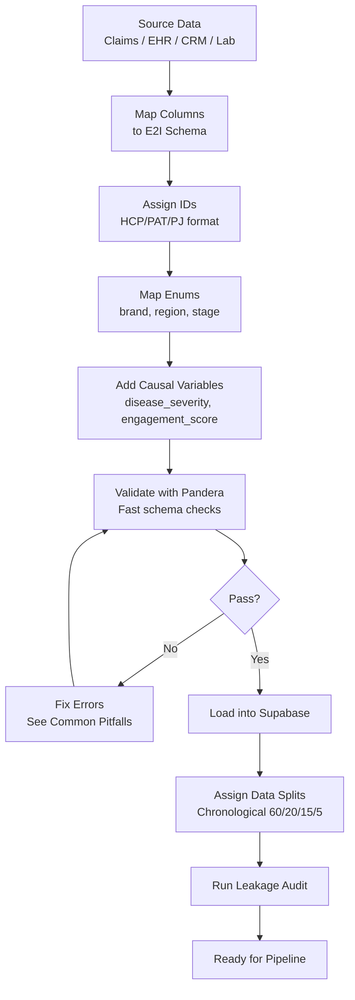

# 01 — Data Conversion Guide

> **E2I Causal Analytics** | Practical Playbook for Real Data Onboarding | Last Updated: 2026-02

| Navigation | |
|---|---|
| [Index](00-INDEX.md) | **Conversion Guide** |
| [Core Dictionary](02-CORE-DATA-DICTIONARY.md) | [ML Pipeline](03-ML-PIPELINE-SCHEMA.md) |
| [Knowledge Graph](04-KNOWLEDGE-GRAPH-ONTOLOGY.md) | [Feature Store](05-FEATURE-STORE-REFERENCE.md) |
| [KPI Reference](06-KPI-REFERENCE.md) | [Supporting Schemas](07-SUPPORTING-SCHEMAS.md) |

---

## Purpose

This guide walks you through converting real pharmaceutical data (claims, EHR, CRM, lab) into the formats required by the E2I 21-agent, 6-tier causal analytics pipeline. It covers the minimum viable dataset, enum mappings, ID formats, validation, and data split assignment.

---

## Prerequisites

- [ ] Access to source data (IQVIA APLD/LAAD, HealthVerity, Komodo, Veeva CRM, or equivalent)
- [ ] PostgreSQL client (Supabase connection or `psql`)
- [ ] Python environment with `pandas`, `pandera` installed (`.venv/bin/python`)
- [ ] E2I schema deployed (`database/core/e2i_ml_complete_v3_schema.sql` applied)
- [ ] CSV templates downloaded from `docs/data/templates/`

---

## Conversion Workflow



---

## Priority 1: Minimum Viable Dataset

These 3 tables are the **minimum** needed to run the Tier 0 ML pipeline (30 patients minimum, 1,500+ recommended):

### 1. hcp_profiles

HCP master table — one row per healthcare provider.

**Template**: [`templates/hcp_profiles.csv`](templates/hcp_profiles.csv)

| Column | Type | Required | Mapping Notes |
|--------|------|----------|---------------|
| `hcp_id` | VARCHAR(20) | **Yes** (PK) | Generate: `HCP` + 8 zero-padded digits |
| `npi` | VARCHAR(20) | No (unique) | 10-digit NPI from NPPES registry |
| `first_name` | VARCHAR(50) | No | From CRM or claims header |
| `last_name` | VARCHAR(50) | No | From CRM or claims header |
| `specialty` | VARCHAR(100) | No | Map to E2I specialties (see enum table below) |
| `sub_specialty` | VARCHAR(100) | No | Optional refinement |
| `practice_type` | VARCHAR(50) | No | `solo`, `group`, `hospital`, `academic` |
| `practice_size` | VARCHAR(20) | No | `small`, `medium`, `large` |
| `geographic_region` | region_type | No | Map state → region (see table below) |
| `state` | VARCHAR(2) | No | 2-letter US state code |
| `priority_tier` | INTEGER | No | 1–5 (1 = highest) |
| `decile` | INTEGER | No | 1–10 (10 = highest volume) |
| `total_patient_volume` | INTEGER | No | Total patients in panel |
| `target_patient_volume` | INTEGER | No | Target-indication patients |
| `prescribing_volume` | INTEGER | No | Annual Rx volume |
| `years_experience` | INTEGER | No | Years since residency |
| `digital_engagement_score` | DECIMAL(3,2) | No | 0.00–1.00 |
| `adoption_category` | VARCHAR(20) | No | `innovator`, `early_adopter`, `early_majority`, `late_majority`, `laggard` |
| `territory_id` | VARCHAR(20) | No | Sales territory mapping |

### 2. patient_journeys

Patient master table — one row per patient-journey. Includes causal variables needed by the ML pipeline.

**Template**: [`templates/patient_journeys.csv`](templates/patient_journeys.csv)

| Column | Type | Required | Mapping Notes |
|--------|------|----------|---------------|
| `patient_journey_id` | VARCHAR(20) | **Yes** (PK) | Generate: `PJ` + 16 zero-padded digits |
| `patient_id` | VARCHAR(20) | **Yes** | Generate: `PAT` + 8 zero-padded digits |
| `journey_start_date` | DATE | **Yes** | First claim/encounter date |
| `journey_stage` | journey_stage_type | No | Map from clinical status |
| `journey_status` | journey_status_type | No | `active`, `stable`, `transitioning`, `completed` |
| `primary_diagnosis_code` | VARCHAR(20) | No | ICD-10-CM code |
| `brand` | brand_type | No | `Remibrutinib`, `Fabhalta`, `Kisqali`, `competitor`, `other` |
| `age_group` | VARCHAR(10) | No | `18-24`, `25-34`, ..., `75+` |
| `gender` | VARCHAR(1) | No | `M`, `F` |
| `geographic_region` | region_type | No | `northeast`, `south`, `midwest`, `west` |
| `insurance_type` | VARCHAR(20) | No | `commercial`, `medicare`, `medicaid`, `uninsured`, `other` |
| `data_quality_score` | DECIMAL(3,2) | No | 0.00–1.00 (completeness measure) |
| `data_source` | VARCHAR(50) | No | `IQVIA_APLD`, `HealthVerity`, `Komodo`, `Veeva`, etc. |
| `hcp_id` | VARCHAR(20) | No | FK → hcp_profiles, primary treating HCP |
| **Causal variables** | | | |
| `disease_severity` | DECIMAL(4,2) | No | 0.00–10.00 — derive from claims/labs |
| `academic_hcp` | INTEGER | No | 0 or 1 — from HCP affiliation data |
| `engagement_score` | DECIMAL(4,2) | No | 0.00–10.00 — from CRM touch frequency |
| `treatment_initiated` | INTEGER | No | 0 or 1 — **outcome variable** |
| `days_to_treatment` | INTEGER | No | Days from diagnosis to Rx (NULL if not initiated) |
| `age_at_diagnosis` | INTEGER | No | Age in years at diagnosis |
| `data_split` | data_split_type | No | Default `unassigned`, assigned later |

**Critical causal variables**: The Tier 0 pipeline uses `disease_severity` (confounder), `academic_hcp` (confounder), `engagement_score` (treatment), and `treatment_initiated` (outcome) for causal inference. These must be populated for the causal agents to function.

### 3. treatment_events

Treatment/prescription events — one row per clinical event.

**Template**: [`templates/treatment_events.csv`](templates/treatment_events.csv)

| Column | Type | Required | Mapping Notes |
|--------|------|----------|---------------|
| `treatment_event_id` | VARCHAR(30) | **Yes** (PK) | Generate: `TE` + 25 zero-padded digits |
| `patient_journey_id` | VARCHAR(20) | No | FK → patient_journeys |
| `patient_id` | VARCHAR(20) | **Yes** | Must match patient_journeys.patient_id |
| `hcp_id` | VARCHAR(20) | No | FK → hcp_profiles |
| `event_date` | DATE | **Yes** | Service/claim date |
| `event_type` | event_type | No | `diagnosis`, `prescription`, `lab_test`, `procedure`, `consultation`, `hospitalization` |
| `brand` | brand_type | No | Brand for Rx events |
| `drug_ndc` | VARCHAR(20) | No | NDC code from claims |
| `drug_name` | VARCHAR(100) | No | Drug name |
| `icd_codes` | TEXT[] | No | Array of ICD-10 codes |
| `cpt_codes` | TEXT[] | No | Array of CPT codes |
| `loinc_codes` | TEXT[] | No | Array of LOINC codes (for labs) |
| `lab_values` | JSONB | No | `{"hemoglobin": 12.5, "ldh": 280}` |
| `cost` | DECIMAL(10,2) | No | Allowed amount or WAC |
| `sequence_number` | INTEGER | No | Order of events for this patient |
| `days_from_diagnosis` | INTEGER | No | Days since diagnosis |
| `data_split` | data_split_type | No | Default `unassigned` |

---

## Priority 2: Full Pipeline Tables

These tables enable the complete agent system but are not required for basic Tier 0 testing.

### business_metrics

KPI snapshots by brand, region, and time period.

**Template**: [`templates/business_metrics.csv`](templates/business_metrics.csv)

| Column | Type | Required | Mapping Notes |
|--------|------|----------|---------------|
| `metric_id` | VARCHAR(50) | **Yes** (PK) | Free-form, e.g., `BM-2025W47-REMI-NE-TRX` |
| `metric_date` | DATE | **Yes** | Reporting period end date |
| `metric_type` | VARCHAR(30) | No | `volume`, `share`, `rate`, `score` |
| `metric_name` | VARCHAR(100) | No | Human-readable name |
| `brand` | brand_type | No | Brand filter |
| `region` | region_type | No | Region filter |
| `value` | DECIMAL(15,2) | No | Actual metric value |
| `target` | DECIMAL(15,2) | No | Target value |
| `sample_size` | INTEGER | No | N for statistical calculations |

### triggers

NBA trigger events with delivery and outcome tracking.

**Template**: [`templates/triggers.csv`](templates/triggers.csv)

| Column | Type | Required | Mapping Notes |
|--------|------|----------|---------------|
| `trigger_id` | VARCHAR(30) | **Yes** (PK) | Generate: `TRG` + 25 zero-padded digits |
| `patient_id` | VARCHAR(20) | **Yes** | Target patient |
| `hcp_id` | VARCHAR(20) | No | FK → hcp_profiles |
| `trigger_timestamp` | TIMESTAMPTZ | **Yes** | When trigger was generated |
| `trigger_type` | VARCHAR(50) | No | `treatment_switch`, `adherence_risk`, `new_patient`, etc. |
| `priority` | priority_type | No | `critical`, `high`, `medium`, `low` |
| `confidence_score` | DECIMAL(4,3) | No | 0.000–1.000 |
| `delivery_channel` | VARCHAR(20) | No | `email`, `in_app`, `digital`, `in_person` |
| `acceptance_status` | VARCHAR(20) | No | `accepted`, `rejected`, `pending` |
| `outcome_tracked` | BOOLEAN | No | Has outcome been recorded? |
| `outcome_value` | DECIMAL(4,3) | No | Outcome metric 0–1 |

---

## Enum Value Mappings

### brand_type

| Source Value | E2I Value | Notes |
|-------------|-----------|-------|
| Remibrutinib / LOU064 | `Remibrutinib` | BTK inhibitor for CSU |
| Fabhalta / Iptacopan / LNP023 | `Fabhalta` | Complement factor B for PNH |
| Kisqali / Ribociclib / LEE011 | `Kisqali` | CDK4/6 inhibitor for HR+/HER2- BC |
| Any other branded drug | `competitor` | Competitor products |
| Unknown / unbranded | `other` | Generic or unclassified |

### region_type

| States | E2I Region |
|--------|-----------|
| CT, DC, DE, MA, MD, ME, NH, NJ, NY, PA, RI, VT | `northeast` |
| AL, AR, FL, GA, KY, LA, MS, NC, OK, SC, TN, TX, VA, WV | `south` |
| IA, IL, IN, KS, MI, MN, MO, ND, NE, OH, SD, WI | `midwest` |
| AK, AZ, CA, CO, HI, ID, MT, NM, NV, OR, UT, WA, WY | `west` |

### journey_stage_type

| Clinical Status | E2I Stage |
|----------------|-----------|
| New diagnosis, workup | `diagnosis` |
| First prescription, early treatment | `initial_treatment` |
| Dose adjustment, therapy modification | `treatment_optimization` |
| Stable on therapy, long-term | `maintenance` |
| Switching brands/therapies | `treatment_switch` |

### event_type

| Source Event | E2I Event Type |
|-------------|---------------|
| Dx claim, encounter | `diagnosis` |
| Rx claim, prescription fill | `prescription` |
| Lab result, pathology | `lab_test` |
| Surgical/procedure claim | `procedure` |
| Office visit, consult | `consultation` |
| Inpatient admission | `hospitalization` |

### insurance_type

| Source | E2I Value |
|--------|-----------|
| Commercial / employer / exchange | `commercial` |
| Medicare / Medicare Advantage | `medicare` |
| Medicaid / dual-eligible | `medicaid` |
| Self-pay / charity | `uninsured` |
| Other / unknown | `other` |

### adoption_category (HCPs)

| Prescribing Behavior | E2I Category |
|---------------------|-------------|
| Among first 2.5% to prescribe | `innovator` |
| Next 13.5% | `early_adopter` |
| Next 34% | `early_majority` |
| Next 34% | `late_majority` |
| Final 16% | `laggard` |

---

## ID Format Requirements

| Entity | Format | Regex | Example |
|--------|--------|-------|---------|
| HCP ID | `HCP` + 8 digits | `^HCP[0-9]{8}$` | `HCP00000001` |
| Patient ID | `PAT` + 8 digits | `^PAT[0-9]{8}$` | `PAT00000001` |
| Patient Journey ID | `PJ` + 16 digits | `^PJ[0-9]{16}$` | `PJ0000000000000001` |
| Treatment Event ID | `TE` + 25 digits | `^TE[0-9]{25}$` | `TE0000000000000000000000001` |
| Trigger ID | `TRG` + 25 digits | `^TRG[0-9]{25}$` | `TRG0000000000000000000000001` |
| NPI | 10 digits (Luhn) | `^[0-9]{10}$` | `1234567890` |
| Metric ID | Free-form string | — | `BM-2025W47-REMI-NE-TRX` |

**ID Generation Script**:

```python
def generate_id(prefix: str, sequence: int, pad_length: int) -> str:
    return f"{prefix}{sequence:0{pad_length}d}"

# Examples
hcp_id = generate_id("HCP", 1, 8)           # HCP00000001
patient_id = generate_id("PAT", 1, 8)       # PAT00000001
journey_id = generate_id("PJ", 1, 16)       # PJ0000000000000001
event_id = generate_id("TE", 1, 25)         # TE0000000000000000000000001
trigger_id = generate_id("TRG", 1, 25)      # TRG0000000000000000000000001
```

---

## Data Split Assignment

The E2I pipeline uses **chronological splitting** with patient-level isolation to prevent data leakage.

### Split Ratios

| Split | Ratio | Purpose |
|-------|-------|---------|
| Train | 60% | Model training |
| Validation | 20% | Hyperparameter tuning |
| Test | 15% | Final evaluation |
| Holdout | 5% | Causal holdout for refutation |

### Assignment Rules

1. **Chronological**: Splits are defined by `journey_start_date` boundaries
2. **7-day temporal gap**: Between each split to prevent leakage
3. **Patient isolation**: A patient's ALL records go to one split (no patient appears in multiple splits)
4. **Default**: Load with `data_split = 'unassigned'`, then use the SQL function:

```sql
-- Create a split configuration
INSERT INTO ml_split_registry (
    config_name, config_version,
    train_ratio, validation_ratio, test_ratio, holdout_ratio,
    data_start_date, data_end_date,
    train_end_date, validation_end_date, test_end_date,
    temporal_gap_days, patient_level_isolation, split_strategy
) VALUES (
    'v1_chronological', '1.0.0',
    0.60, 0.20, 0.15, 0.05,
    '2024-01-01', '2025-12-31',
    '2025-06-30', '2025-09-30', '2025-11-30',
    7, TRUE, 'chronological'
);

-- Assign patients to splits
UPDATE patient_journeys
SET data_split = assign_patient_split(journey_start_date, '<split_config_id>'),
    split_config_id = '<split_config_id>'
WHERE data_split = 'unassigned';

-- Propagate to child tables
UPDATE treatment_events te
SET data_split = pj.data_split, split_config_id = pj.split_config_id
FROM patient_journeys pj
WHERE te.patient_journey_id = pj.patient_journey_id;

-- Run leakage audit
SELECT * FROM run_leakage_audit('<split_config_id>');
```

---

## Pandera Validation

The pipeline uses Pandera for fast schema validation before data enters the ML pipeline.

### Available Schemas

| Registry Key | Schema Class | Validates |
|-------------|-------------|-----------|
| `patient_journeys` | `PatientJourneysSchema` | patient_journey_id (unique), brand (isin), region (isin), stage, status |
| `business_metrics` | `BusinessMetricsSchema` | metric_id (unique), brand (isin), region (isin), achievement_rate (≥ 0) |
| `triggers` | `TriggersSchema` | trigger_id (unique), priority (isin), confidence_score (0–1), lead_time (≥ 0) |
| `predictions` / `ml_predictions` | `PredictionsSchema` | prediction_id (unique), prediction_value (0–1), confidence_score (0–1) |
| `causal_paths` | `CausalPathsSchema` | path_id (unique), causal_effect_size (-1 to 1), confidence_level (0–1) |
| `agent_activities` | `AgentActivitiesSchema` | activity_id (unique), agent_tier (isin), confidence_level (0–1) |

### Validation Commands

```bash
# Validate a single file
.venv/bin/python -c "
import pandas as pd
from src.mlops.pandera_schemas import validate_dataframe

df = pd.read_csv('docs/data/templates/patient_journeys.csv')
result = validate_dataframe(df, 'patient_journeys')
print(f'Status: {result[\"status\"]}')
for e in result.get('errors', []):
    print(f'  {e[\"column\"]}: {e[\"check\"]} — {e[\"failure_case\"]}')
"

# Validate all templates
.venv/bin/python -c "
import pandas as pd
from src.mlops.pandera_schemas import validate_dataframe

for name in ['patient_journeys', 'business_metrics', 'triggers']:
    df = pd.read_csv(f'docs/data/templates/{name}.csv')
    result = validate_dataframe(df, name)
    print(f'{name}: {result[\"status\"]} ({result[\"rows_validated\"]} rows)')
"
```

### Pandera Business Constants

These are the valid values enforced by Pandera (from `src/mlops/pandera_schemas.py`):

| Constant | Values |
|----------|--------|
| `E2I_BRANDS` | `Remibrutinib`, `Fabhalta`, `Kisqali`, `All_Brands` |
| `E2I_REGIONS` | `northeast`, `south`, `midwest`, `west` |
| `E2I_PREDICTION_TYPES` | `trigger`, `propensity`, `risk`, `churn` |
| `E2I_PRIORITY_TYPES` | `critical`, `high`, `medium`, `low` |
| `E2I_JOURNEY_STAGES` | `diagnosis`, `initial_treatment`, `treatment_optimization`, `maintenance` |
| `E2I_JOURNEY_STATUSES` | `active`, `stable`, `transitioning`, `completed` |

> **Note**: The Pandera `E2I_JOURNEY_STAGES` list does not include `treatment_switch` (which exists in the DDL enum). Pandera schemas are set to `strict = False`, so extra values pass validation but won't match the `isin` check if the column is explicitly validated.

---

## Minimum Data Volumes

| Dataset | Min (Tier 0 basic) | Recommended | Why |
|---------|-------------------|-------------|-----|
| Patients | 30 | 1,500+ | CausalForestDML needs ~250/fold after segmentation |
| HCPs | 10 | 200+ | Influence network analysis needs breadth |
| Treatment events | 50 | 5,000+ | Sequence modeling needs depth per patient |
| Triggers | 20 | 1,000+ | Trigger effectiveness needs statistical power |
| Business metrics | 10 | 500+ | Time-series KPI tracking |

**Critical threshold**: With fewer than 250 patients per cross-fit fold, the EconML CausalForestDML will produce unstable estimates. The pipeline generates 1,500 synthetic patients by default because after segmentation (~500/segment) and cross-fitting (~250/fold), this maintains adequate sample sizes.

---

## Deriving Causal Variables

The causal variables on `patient_journeys` must be derived from your source data:

### disease_severity (0–10, confounder)

```
Derive from:
- Lab values (abnormal count, severity markers)
- Comorbidity burden (Charlson/Elixhauser index)
- ER/hospitalization frequency
- Symptom assessment scores

Example formula:
  severity = (lab_abnormal_pct * 3) + (comorbidity_index * 2) + (er_visits_12mo * 1.5) + (symptom_score * 1)
  Normalize to 0–10 range
```

### engagement_score (0–10, treatment variable)

```
Derive from:
- CRM touch count (rep visits, emails, calls)
- Digital engagement (portal logins, content views)
- Conference/event attendance
- Sample requests

Example formula:
  engagement = (touches_90d * 1.5) + (digital_events_90d * 1.0) + (events_12mo * 2.0) + (samples * 0.5)
  Normalize to 0–10 range
```

### treatment_initiated (0 or 1, outcome variable)

```
Derive from:
- Presence of brand-specific Rx claim within observation window
- First fill date vs diagnosis date

Rule:
  1 if patient has any brand Rx within 90 days of first engagement
  0 otherwise
```

### academic_hcp (0 or 1, confounder)

```
Derive from:
- HCP affiliation with teaching hospital
- Academic medical center flag in CRM
- NPI enumeration data (practice location type)

Rule:
  1 if primary affiliation is academic/teaching
  0 otherwise
```

---

## Loading Data

### Via CSV (small datasets)

```sql
-- 1. Load HCPs first (no FK dependencies)
\copy hcp_profiles FROM 'data/input/hcp_profiles.csv' WITH (FORMAT csv, HEADER true);

-- 2. Load patient journeys (references hcp_profiles.hcp_id)
\copy patient_journeys FROM 'data/input/patient_journeys.csv' WITH (FORMAT csv, HEADER true);

-- 3. Load treatment events (references patient_journeys, hcp_profiles)
\copy treatment_events FROM 'data/input/treatment_events.csv' WITH (FORMAT csv, HEADER true);

-- 4. Load business metrics (no FK dependencies)
\copy business_metrics FROM 'data/input/business_metrics.csv' WITH (FORMAT csv, HEADER true);

-- 5. Load triggers (references hcp_profiles)
\copy triggers FROM 'data/input/triggers.csv' WITH (FORMAT csv, HEADER true);
```

### Via Python (larger datasets)

```python
import pandas as pd
from sqlalchemy import create_engine

engine = create_engine(os.environ["SUPABASE_DB_URL"])

# Load order matters for FK constraints
for table, file in [
    ("hcp_profiles", "hcp_profiles.csv"),
    ("patient_journeys", "patient_journeys.csv"),
    ("treatment_events", "treatment_events.csv"),
    ("business_metrics", "business_metrics.csv"),
    ("triggers", "triggers.csv"),
]:
    df = pd.read_csv(f"data/input/{file}")
    df.to_sql(table, engine, if_exists="append", index=False)
    print(f"Loaded {len(df)} rows into {table}")
```

---

## Common Pitfalls

| Issue | Symptom | Fix |
|-------|---------|-----|
| Brand casing | `pandera` validation fails on `isin` | Use exact casing: `Remibrutinib` not `remibrutinib` |
| Region casing | Validation fails | Use lowercase: `northeast` not `Northeast` |
| NPI checksum | NPI lookup fails | Validate Luhn checksum before loading |
| Patient in multiple splits | Leakage audit fails | Ensure `patient_level_isolation = TRUE` |
| Temporal leakage | Future data in training set | Check `journey_start_date` vs split boundaries |
| Missing causal vars | Tier 0 produces NaN effects | Populate `disease_severity`, `engagement_score`, `treatment_initiated` |
| Array columns in CSV | PostgreSQL COPY fails | Use `{val1,val2}` format for TEXT[] |
| JSONB in CSV | Parse errors | Use valid JSON strings: `{"key": "value"}` |
| FK violations | INSERT fails | Load tables in dependency order (HCPs → Patients → Events) |
| `n_jobs=-1` in models | Process deadlocks | E2I convention: always `n_jobs=1` |

---

## Validation Checklist

After loading data, verify:

- [ ] `SELECT COUNT(*) FROM patient_journeys;` — meets minimum (30+)
- [ ] `SELECT COUNT(DISTINCT patient_id) FROM patient_journeys;` — unique patients
- [ ] `SELECT brand, COUNT(*) FROM patient_journeys GROUP BY brand;` — brand distribution
- [ ] `SELECT geographic_region, COUNT(*) FROM patient_journeys GROUP BY geographic_region;` — region coverage
- [ ] `SELECT data_split, COUNT(*) FROM patient_journeys GROUP BY data_split;` — split assignment
- [ ] `SELECT * FROM run_leakage_audit('<split_config_id>');` — all checks pass
- [ ] Pandera validation passes for all source tables
- [ ] Causal variables populated: `SELECT COUNT(*) FROM patient_journeys WHERE disease_severity IS NOT NULL AND engagement_score IS NOT NULL AND treatment_initiated IS NOT NULL;`

---

## Next Steps

1. **Run Tier 0 test**: `.venv/bin/python scripts/run_tier0_test.py` — uses your loaded data
2. **Run Tier 1–5 tests**: `.venv/bin/python scripts/run_tier1_5_test.py` — tests all 12 agents
3. **Seed knowledge graph**: `FALKORDB_HOST=localhost FALKORDB_PORT=6381 .venv/bin/python scripts/seed_falkordb.py`
4. **Materialize features**: `cd feature_repo && feast materialize-incremental $(date -u +%Y-%m-%dT%H:%M:%S)`

See [02-CORE-DATA-DICTIONARY.md](02-CORE-DATA-DICTIONARY.md) for full column-level documentation of all 19 core tables.
