# Core Data Dictionary

**E2I Causal Analytics Platform** | Schema Version 3.0.0 | Last updated: 2026-02-07

This document provides a comprehensive reference for the 19 core database tables in the E2I Causal Analytics schema. It covers every column, constraint, index, foreign key, and function defined in `database/core/e2i_ml_complete_v3_schema.sql`.

---

**Navigation** | [Architecture](../ARCHITECTURE.md) | [Onboarding](../ONBOARDING.md) | [API Docs](../api/) | [Data Templates](templates/)

---

## Table of Contents

- [Enum Type Reference](#enum-type-reference)
- [Core ERD](#core-erd)
- [ML Split Tables](#ml-split-tables)
  - [ml_split_registry](#ml_split_registry)
  - [ml_patient_split_assignments](#ml_patient_split_assignments)
  - [ml_preprocessing_metadata](#ml_preprocessing_metadata)
  - [ml_leakage_audit](#ml_leakage_audit)
- [Core Business Tables](#core-business-tables)
  - [reference_universe](#reference_universe)
  - [hcp_profiles](#hcp_profiles)
  - [patient_journeys](#patient_journeys)
  - [treatment_events](#treatment_events)
  - [ml_predictions](#ml_predictions)
  - [triggers](#triggers)
  - [agent_activities](#agent_activities)
  - [business_metrics](#business_metrics)
  - [causal_paths](#causal_paths)
- [KPI Gap Tables](#kpi-gap-tables)
  - [user_sessions](#user_sessions)
  - [data_source_tracking](#data_source_tracking)
  - [ml_annotations](#ml_annotations)
  - [etl_pipeline_metrics](#etl_pipeline_metrics)
  - [hcp_intent_surveys](#hcp_intent_surveys)
- [Agent Registry](#agent-registry)
  - [agent_registry](#agent_registry)
- [Views](#views)
  - [Split-Based Views](#split-based-views)
  - [KPI Helper Views](#kpi-helper-views)
  - [Agent Routing View](#agent-routing-view)
- [Functions](#functions)

---

## Enum Type Reference

All custom PostgreSQL ENUM types defined in the schema. These types enforce domain-specific value constraints at the database level.

| Enum Type | Values | Used By |
|-----------|--------|---------|
| `data_split_type` | `train`, `validation`, `test`, `holdout`, `unassigned` | patient_journeys, treatment_events, ml_predictions, triggers, agent_activities, business_metrics, causal_paths, ml_patient_split_assignments, ml_preprocessing_metadata |
| `split_strategy_type` | `chronological`, `patient_stratified`, `rolling_window`, `causal_holdout` | ml_split_registry |
| `brand_type` | `Remibrutinib`, `Fabhalta`, `Kisqali`, `competitor`, `other` | patient_journeys, treatment_events, business_metrics, reference_universe, hcp_intent_surveys |
| `region_type` | `northeast`, `south`, `midwest`, `west` | hcp_profiles, patient_journeys, business_metrics, reference_universe, user_sessions |
| `priority_type` | `critical`, `high`, `medium`, `low` | triggers |
| `journey_stage_type` | `diagnosis`, `initial_treatment`, `treatment_optimization`, `maintenance`, `treatment_switch` | patient_journeys |
| `journey_status_type` | `active`, `stable`, `transitioning`, `completed` | patient_journeys |
| `event_type` | `diagnosis`, `prescription`, `lab_test`, `procedure`, `consultation`, `hospitalization` | treatment_events |
| `prediction_type` | `trigger`, `propensity`, `risk`, `churn`, `next_best_action` | ml_predictions |
| `agent_tier_type` | `coordination`, `causal_analytics`, `monitoring`, `ml_predictions`, `self_improvement` | agent_activities, agent_registry |
| `agent_name_type_v2` | `orchestrator`, `causal_impact`, `gap_analyzer`, `heterogeneous_optimizer`, `drift_monitor`, `experiment_designer`, `health_score`, `prediction_synthesizer`, `resource_optimizer`, `explainer`, `feedback_learner` | Reference only (agent_registry uses VARCHAR) |
| `workstream_type` | `WS1`, `WS2`, `WS3` | agent_activities |

> **Note on enum evolution**: Migration 029 introduced `agent_tier_type_v2` (with `tier_0_ml_foundation` through `tier_5_self_improvement`) and `agent_name_type_v3` (with 20 agents including Tier 0). The core schema tables still reference the original enum types shown above. See `database/core/029_update_agent_enums_v4.sql` for the migration path.

---

## Core ERD

The following entity-relationship diagram shows all 19 tables and their foreign key relationships.

```mermaid
erDiagram
    ml_split_registry ||--o{ ml_patient_split_assignments : "has assignments"
    ml_split_registry ||--o| ml_preprocessing_metadata : "has metadata"
    ml_split_registry ||--o{ ml_leakage_audit : "audited by"
    ml_split_registry ||--o{ patient_journeys : "splits"
    ml_split_registry ||--o{ treatment_events : "splits"
    ml_split_registry ||--o{ ml_predictions : "splits"
    ml_split_registry ||--o{ triggers : "splits"
    ml_split_registry ||--o{ agent_activities : "splits"
    ml_split_registry ||--o{ business_metrics : "splits"
    ml_split_registry ||--o{ causal_paths : "splits"

    hcp_profiles ||--o{ treatment_events : "performs"
    hcp_profiles ||--o{ ml_predictions : "predicted for"
    hcp_profiles ||--o{ triggers : "targeted at"
    hcp_profiles ||--o{ hcp_intent_surveys : "surveyed"

    patient_journeys ||--o{ treatment_events : "contains"

    ml_split_registry {
        UUID split_config_id PK
        VARCHAR config_name UK
        VARCHAR config_version
        DECIMAL train_ratio
        DECIMAL validation_ratio
        DECIMAL test_ratio
        DECIMAL holdout_ratio
        DATE data_start_date
        DATE data_end_date
        DATE train_end_date
        DATE validation_end_date
        DATE test_end_date
        INTEGER temporal_gap_days
        BOOLEAN patient_level_isolation
        split_strategy_type split_strategy
        INTEGER random_seed
        BOOLEAN is_active
        TIMESTAMPTZ created_at
        TIMESTAMPTZ updated_at
        VARCHAR created_by
        TEXT notes
    }

    ml_patient_split_assignments {
        UUID assignment_id PK
        UUID split_config_id FK
        VARCHAR patient_id
        data_split_type assigned_split
        VARCHAR assignment_reason
        TIMESTAMPTZ assigned_at
    }

    ml_preprocessing_metadata {
        UUID metadata_id PK
        UUID split_config_id FK
        data_split_type computed_on_split
        TIMESTAMPTZ computed_at
        JSONB feature_means
        JSONB feature_stds
        JSONB feature_mins
        JSONB feature_maxs
        JSONB categorical_encodings
        JSONB feature_distributions
        INTEGER num_training_samples
        TEXT_ARRAY feature_list
        VARCHAR preprocessing_pipeline_version
    }

    ml_leakage_audit {
        UUID audit_id PK
        UUID split_config_id FK
        TIMESTAMPTZ audit_timestamp
        VARCHAR check_type
        BOOLEAN passed
        VARCHAR severity
        TEXT details
        INTEGER affected_records
        TEXT remediation_action
        VARCHAR audited_by
    }

    reference_universe {
        UUID universe_id PK
        VARCHAR universe_type
        brand_type brand
        region_type region
        VARCHAR specialty
        INTEGER total_count
        INTEGER target_count
        DATE effective_date
        DATE expiration_date
        VARCHAR data_source
        TEXT methodology_notes
        TIMESTAMPTZ created_at
    }

    hcp_profiles {
        VARCHAR hcp_id PK
        VARCHAR npi UK
        VARCHAR first_name
        VARCHAR last_name
        VARCHAR specialty
        VARCHAR sub_specialty
        VARCHAR practice_type
        VARCHAR practice_size
        region_type geographic_region
        VARCHAR state
        VARCHAR city
        VARCHAR zip_code
        INTEGER priority_tier
        INTEGER decile
        INTEGER total_patient_volume
        INTEGER target_patient_volume
        INTEGER prescribing_volume
        INTEGER years_experience
        VARCHAR affiliation_primary
        TEXT_ARRAY affiliation_secondary
        DECIMAL digital_engagement_score
        VARCHAR preferred_channel
        DATE last_interaction_date
        DECIMAL interaction_frequency
        INTEGER influence_network_size
        DECIMAL peer_influence_score
        VARCHAR adoption_category
        BOOLEAN coverage_status
        VARCHAR territory_id
        VARCHAR sales_rep_id
        TIMESTAMPTZ created_at
        TIMESTAMPTZ updated_at
    }

    patient_journeys {
        VARCHAR patient_journey_id PK
        VARCHAR patient_id
        VARCHAR patient_hash
        DATE journey_start_date
        DATE journey_end_date
        INTEGER journey_duration_days
        journey_stage_type journey_stage
        journey_status_type journey_status
        VARCHAR primary_diagnosis_code
        TEXT primary_diagnosis_desc
        TEXT_ARRAY secondary_diagnosis_codes
        brand_type brand
        VARCHAR age_group
        VARCHAR gender
        region_type geographic_region
        VARCHAR state
        VARCHAR zip_code
        VARCHAR insurance_type
        DECIMAL data_quality_score
        TEXT_ARRAY comorbidities
        DECIMAL risk_score
        VARCHAR data_source
        TEXT_ARRAY data_sources_matched
        DECIMAL source_match_confidence
        BOOLEAN source_stacking_flag
        VARCHAR source_combination_method
        TIMESTAMPTZ source_timestamp
        TIMESTAMPTZ ingestion_timestamp
        INTEGER data_lag_hours
        VARCHAR hcp_id
        DECIMAL disease_severity
        INTEGER academic_hcp
        DECIMAL engagement_score
        INTEGER treatment_initiated
        INTEGER days_to_treatment
        INTEGER age_at_diagnosis
        data_split_type data_split
        UUID split_config_id FK
        TIMESTAMPTZ created_at
        TIMESTAMPTZ updated_at
    }

    treatment_events {
        VARCHAR treatment_event_id PK
        VARCHAR patient_journey_id FK
        VARCHAR patient_id
        VARCHAR hcp_id FK
        DATE event_date
        event_type event_type
        VARCHAR event_subtype
        brand_type brand
        VARCHAR drug_ndc
        VARCHAR drug_name
        VARCHAR drug_class
        VARCHAR dosage
        INTEGER duration_days
        TEXT_ARRAY icd_codes
        TEXT_ARRAY cpt_codes
        TEXT_ARRAY loinc_codes
        JSONB lab_values
        VARCHAR location_type
        VARCHAR facility_id
        DECIMAL cost
        VARCHAR outcome_indicator
        BOOLEAN adverse_event_flag
        BOOLEAN discontinuation_flag
        VARCHAR discontinuation_reason
        INTEGER sequence_number
        INTEGER days_from_diagnosis
        VARCHAR previous_treatment
        VARCHAR next_treatment
        VARCHAR data_source
        TIMESTAMPTZ source_timestamp
        data_split_type data_split
        UUID split_config_id FK
        TIMESTAMPTZ created_at
    }

    ml_predictions {
        VARCHAR prediction_id PK
        VARCHAR model_version
        VARCHAR model_type
        TIMESTAMPTZ prediction_timestamp
        VARCHAR patient_id
        VARCHAR hcp_id FK
        prediction_type prediction_type
        DECIMAL prediction_value
        VARCHAR prediction_class
        DECIMAL confidence_score
        JSONB probability_scores
        JSONB feature_importance
        JSONB shap_values
        JSONB top_features
        DECIMAL model_auc
        DECIMAL model_precision
        DECIMAL model_recall
        DECIMAL calibration_score
        DECIMAL model_pr_auc
        JSONB rank_metrics
        DECIMAL brier_score
        JSONB fairness_metrics
        TEXT explanation_text
        DECIMAL treatment_effect_estimate
        DECIMAL heterogeneous_effect
        VARCHAR segment_assignment
        DECIMAL causal_confidence
        DECIMAL counterfactual_outcome
        DECIMAL actual_outcome
        TIMESTAMPTZ outcome_recorded_at
        VARCHAR outcome_source
        INTEGER outcome_observation_window_days
        JSONB features_available_at_prediction
        data_split_type data_split
        UUID split_config_id FK
        TIMESTAMPTZ created_at
    }

    triggers {
        VARCHAR trigger_id PK
        VARCHAR patient_id
        VARCHAR hcp_id FK
        TIMESTAMPTZ trigger_timestamp
        VARCHAR trigger_type
        priority_type priority
        DECIMAL confidence_score
        INTEGER lead_time_days
        DATE expiration_date
        VARCHAR delivery_channel
        VARCHAR delivery_status
        TIMESTAMPTZ delivery_timestamp
        TIMESTAMPTZ view_timestamp
        VARCHAR acceptance_status
        TIMESTAMPTZ acceptance_timestamp
        TEXT action_taken
        TIMESTAMPTZ action_timestamp
        BOOLEAN false_positive_flag
        TEXT trigger_reason
        JSONB causal_chain
        JSONB supporting_evidence
        TEXT recommended_action
        BOOLEAN outcome_tracked
        DECIMAL outcome_value
        VARCHAR previous_trigger_id
        VARCHAR change_type
        TEXT change_reason
        TIMESTAMPTZ change_timestamp
        BOOLEAN change_failed
        DECIMAL change_outcome_delta
        data_split_type data_split
        UUID split_config_id FK
        TIMESTAMPTZ created_at
        TIMESTAMPTZ updated_at
    }

    agent_activities {
        VARCHAR activity_id PK
        VARCHAR agent_name
        agent_tier_type agent_tier
        TIMESTAMPTZ activity_timestamp
        VARCHAR activity_type
        workstream_type workstream
        INTEGER processing_duration_ms
        JSONB input_data
        INTEGER records_processed
        VARCHAR time_window
        JSONB analysis_results
        INTEGER causal_paths_analyzed
        DECIMAL confidence_level
        JSONB recommendations
        JSONB actions_initiated
        DECIMAL impact_estimate
        DECIMAL roi_estimate
        VARCHAR status
        TEXT error_message
        JSONB resource_usage
        data_split_type data_split
        UUID split_config_id FK
        TIMESTAMPTZ created_at
    }

    business_metrics {
        VARCHAR metric_id PK
        DATE metric_date
        VARCHAR metric_type
        VARCHAR metric_name
        brand_type brand
        region_type region
        DECIMAL value
        DECIMAL target
        DECIMAL achievement_rate
        DECIMAL year_over_year_change
        DECIMAL month_over_month_change
        DECIMAL roi
        DECIMAL statistical_significance
        DECIMAL confidence_interval_lower
        DECIMAL confidence_interval_upper
        INTEGER sample_size
        data_split_type data_split
        UUID split_config_id FK
        TIMESTAMPTZ created_at
    }

    causal_paths {
        VARCHAR path_id PK
        DATE discovery_date
        JSONB causal_chain
        VARCHAR start_node
        VARCHAR end_node
        TEXT_ARRAY intermediate_nodes
        INTEGER path_length
        DECIMAL causal_effect_size
        DECIMAL confidence_level
        VARCHAR method_used
        TEXT_ARRAY confounders_controlled
        TEXT_ARRAY mediators_identified
        JSONB interaction_effects
        INTEGER time_lag_days
        VARCHAR validation_status
        DECIMAL business_impact_estimate
        data_split_type data_split
        UUID split_config_id FK
        TIMESTAMPTZ created_at
    }

    user_sessions {
        UUID session_id PK
        VARCHAR user_id
        VARCHAR user_email
        VARCHAR user_role
        region_type user_region
        VARCHAR user_territory_id
        TIMESTAMPTZ session_start
        TIMESTAMPTZ session_end
        INTEGER session_duration_seconds
        INTEGER page_views
        INTEGER queries_executed
        INTEGER triggers_viewed
        INTEGER actions_taken
        INTEGER exports_downloaded
        VARCHAR device_type
        VARCHAR browser
        VARCHAR ip_hash
        DECIMAL engagement_score
        TIMESTAMPTZ created_at
    }

    data_source_tracking {
        UUID tracking_id PK
        DATE tracking_date
        VARCHAR source_name
        VARCHAR source_type
        INTEGER records_received
        INTEGER records_matched
        INTEGER records_unique
        DECIMAL match_rate_vs_iqvia
        DECIMAL match_rate_vs_healthverity
        DECIMAL match_rate_vs_komodo
        DECIMAL match_rate_vs_veeva
        INTEGER stacking_eligible_records
        INTEGER stacking_applied_records
        DECIMAL stacking_lift_percentage
        JSONB source_combination_flags
        DECIMAL data_quality_score
        TIMESTAMPTZ created_at
    }

    ml_annotations {
        UUID annotation_id PK
        VARCHAR entity_type
        VARCHAR entity_id
        VARCHAR annotation_type
        VARCHAR annotator_id
        VARCHAR annotator_role
        JSONB annotation_value
        DECIMAL annotation_confidence
        TIMESTAMPTZ annotation_timestamp
        INTEGER annotation_duration_seconds
        BOOLEAN is_adjudicated
        JSONB adjudication_result
        VARCHAR adjudicated_by
        TIMESTAMPTZ adjudicated_at
        UUID iaa_group_id
        TIMESTAMPTZ created_at
    }

    etl_pipeline_metrics {
        UUID pipeline_run_id PK
        VARCHAR pipeline_name
        VARCHAR pipeline_version
        TIMESTAMPTZ run_start
        TIMESTAMPTZ run_end
        INTEGER duration_seconds
        DATE source_data_date
        TIMESTAMPTZ source_data_timestamp
        DECIMAL time_to_release_hours
        JSONB stage_timings
        INTEGER records_processed
        INTEGER records_failed
        VARCHAR status
        TEXT error_details
        INTEGER quality_checks_passed
        INTEGER quality_checks_failed
        JSONB quality_check_details
        TIMESTAMPTZ created_at
    }

    hcp_intent_surveys {
        UUID survey_id PK
        VARCHAR hcp_id FK
        DATE survey_date
        VARCHAR survey_type
        brand_type brand
        INTEGER intent_to_prescribe_score
        INTEGER intent_to_prescribe_change
        INTEGER awareness_score
        INTEGER favorability_score
        UUID previous_survey_id
        INTEGER days_since_last_survey
        JSONB interventions_since_last
        VARCHAR survey_source
        BOOLEAN response_quality_flag
        TIMESTAMPTZ created_at
    }

    agent_registry {
        VARCHAR agent_name PK
        agent_tier_type agent_tier
        VARCHAR display_name
        TEXT description
        JSONB capabilities
        JSONB routes_from_intents
        BOOLEAN is_active
        INTEGER priority_order
        TIMESTAMPTZ created_at
        TIMESTAMPTZ updated_at
    }
```



---

## ML Split Tables

These four tables manage the train/validation/test/holdout split lifecycle, enforcing patient-level isolation and preventing data leakage.

---

### ml_split_registry

Stores split configuration metadata including ratios, temporal boundaries, and the active strategy used for splitting data.

| Column | Type | Nullable | Constraints | Description |
|--------|------|----------|-------------|-------------|
| `split_config_id` | `UUID` | NOT NULL | **PK**, DEFAULT `uuid_generate_v4()` | Unique identifier for this split configuration |
| `config_name` | `VARCHAR(100)` | NOT NULL | **UNIQUE** | Human-readable name for the split configuration |
| `config_version` | `VARCHAR(20)` | NOT NULL | DEFAULT `'1.0.0'` | Semantic version of this configuration |
| `train_ratio` | `DECIMAL(3,2)` | NOT NULL | DEFAULT `0.60`, CHECK `valid_ratios` | Fraction of data allocated to the training split |
| `validation_ratio` | `DECIMAL(3,2)` | NOT NULL | DEFAULT `0.20`, CHECK `valid_ratios` | Fraction of data allocated to the validation split |
| `test_ratio` | `DECIMAL(3,2)` | NOT NULL | DEFAULT `0.15`, CHECK `valid_ratios` | Fraction of data allocated to the test split |
| `holdout_ratio` | `DECIMAL(3,2)` | NOT NULL | DEFAULT `0.05`, CHECK `valid_ratios` | Fraction of data allocated to the holdout split |
| `data_start_date` | `DATE` | NOT NULL | CHECK `valid_date_order` | Earliest date of data included in this split |
| `data_end_date` | `DATE` | NOT NULL | CHECK `valid_date_order` | Latest date of data included in this split |
| `train_end_date` | `DATE` | NOT NULL | CHECK `valid_date_order` | Cutoff date for the training split |
| `validation_end_date` | `DATE` | NOT NULL | CHECK `valid_date_order` | Cutoff date for the validation split |
| `test_end_date` | `DATE` | NOT NULL | CHECK `valid_date_order` | Cutoff date for the test split |
| `temporal_gap_days` | `INTEGER` | NOT NULL | DEFAULT `7` | Gap in days between adjacent splits to prevent temporal leakage |
| `patient_level_isolation` | `BOOLEAN` | NOT NULL | DEFAULT `TRUE` | Whether patients are isolated to a single split |
| `split_strategy` | `split_strategy_type` | NOT NULL | DEFAULT `'chronological'` | Strategy used for splitting (`chronological`, `patient_stratified`, `rolling_window`, `causal_holdout`) |
| `random_seed` | `INTEGER` | YES | | Random seed for reproducible splits (used by `patient_stratified`) |
| `is_active` | `BOOLEAN` | NOT NULL | DEFAULT `TRUE` | Whether this is the currently active split configuration |
| `created_at` | `TIMESTAMPTZ` | NOT NULL | DEFAULT `NOW()` | Record creation timestamp |
| `updated_at` | `TIMESTAMPTZ` | NOT NULL | DEFAULT `NOW()` | Last update timestamp (auto-updated by trigger) |
| `created_by` | `VARCHAR(100)` | YES | | User or system that created this configuration |
| `notes` | `TEXT` | YES | | Free-text notes about this split configuration |

**Check Constraints:**

- `valid_ratios`: `ABS(train_ratio + validation_ratio + test_ratio + holdout_ratio - 1.0) < 0.001`
- `valid_date_order`: `data_start_date < train_end_date < validation_end_date < test_end_date <= data_end_date`

**Triggers:**

- `update_split_registry_timestamp`: Fires `BEFORE UPDATE` to set `updated_at = NOW()`.

**Example Query:**

```sql
-- Get the currently active split configuration
SELECT config_name, split_strategy, train_ratio, validation_ratio, test_ratio, holdout_ratio,
       train_end_date, validation_end_date, test_end_date
FROM ml_split_registry
WHERE is_active = TRUE;
```

---

### ml_patient_split_assignments

Records the per-patient split assignment for a given split configuration, ensuring each patient appears in exactly one split.

| Column | Type | Nullable | Constraints | Description |
|--------|------|----------|-------------|-------------|
| `assignment_id` | `UUID` | NOT NULL | **PK**, DEFAULT `uuid_generate_v4()` | Unique identifier for this assignment record |
| `split_config_id` | `UUID` | NOT NULL | **FK** `ml_split_registry(split_config_id)` ON DELETE CASCADE | Split configuration this assignment belongs to |
| `patient_id` | `VARCHAR(20)` | NOT NULL | **UNIQUE** `(split_config_id, patient_id)` | Patient identifier |
| `assigned_split` | `data_split_type` | NOT NULL | | The split this patient is assigned to |
| `assignment_reason` | `VARCHAR(100)` | YES | | Reason for this particular assignment (e.g., `temporal`, `stratified`, `manual`) |
| `assigned_at` | `TIMESTAMPTZ` | NOT NULL | DEFAULT `NOW()` | Timestamp when the assignment was made |

**Indexes:**

| Index Name | Columns | Notes |
|------------|---------|-------|
| `idx_patient_split_lookup` | `patient_id, split_config_id` | Fast lookup of a patient's split assignment |

**Foreign Keys:**

| Column | References | On Delete |
|--------|------------|-----------|
| `split_config_id` | `ml_split_registry(split_config_id)` | CASCADE |

**Example Query:**

```sql
-- Count patients per split for the active configuration
SELECT mpa.assigned_split, COUNT(*) AS patient_count
FROM ml_patient_split_assignments mpa
JOIN ml_split_registry msr ON mpa.split_config_id = msr.split_config_id
WHERE msr.is_active = TRUE
GROUP BY mpa.assigned_split
ORDER BY mpa.assigned_split;
```

---

### ml_preprocessing_metadata

Stores feature statistics (means, standard deviations, mins, maxs, encodings) computed exclusively on training data to prevent leakage into validation/test/holdout.

| Column | Type | Nullable | Constraints | Description |
|--------|------|----------|-------------|-------------|
| `metadata_id` | `UUID` | NOT NULL | **PK**, DEFAULT `uuid_generate_v4()` | Unique identifier for this metadata record |
| `split_config_id` | `UUID` | NOT NULL | **FK** `ml_split_registry(split_config_id)` ON DELETE CASCADE, **UNIQUE** | Split configuration this metadata belongs to (one per config) |
| `computed_on_split` | `data_split_type` | NOT NULL | DEFAULT `'train'`, CHECK `train_only` | The split these statistics were computed on (must be `train`) |
| `computed_at` | `TIMESTAMPTZ` | NOT NULL | DEFAULT `NOW()` | Timestamp when statistics were computed |
| `feature_means` | `JSONB` | NOT NULL | DEFAULT `'{}'` | Mean values per numerical feature: `{"age": 52.3, "risk_score": 0.67}` |
| `feature_stds` | `JSONB` | NOT NULL | DEFAULT `'{}'` | Standard deviations per numerical feature |
| `feature_mins` | `JSONB` | NOT NULL | DEFAULT `'{}'` | Minimum values per numerical feature |
| `feature_maxs` | `JSONB` | NOT NULL | DEFAULT `'{}'` | Maximum values per numerical feature |
| `categorical_encodings` | `JSONB` | NOT NULL | DEFAULT `'{}'` | Encoding maps for categorical features: `{"region": {"northeast": 0, "south": 1, ...}}` |
| `feature_distributions` | `JSONB` | NOT NULL | DEFAULT `'{}'` | Distribution parameters for drift detection (e.g., histogram bins, KDE parameters) |
| `num_training_samples` | `INTEGER` | YES | | Number of training samples used to compute these statistics |
| `feature_list` | `TEXT[]` | YES | | Ordered list of feature names |
| `preprocessing_pipeline_version` | `VARCHAR(20)` | YES | | Version of the preprocessing pipeline that generated this metadata |

**Check Constraints:**

- `train_only`: `computed_on_split = 'train'` -- Prevents computing stats on non-training data.

**Foreign Keys:**

| Column | References | On Delete |
|--------|------------|-----------|
| `split_config_id` | `ml_split_registry(split_config_id)` | CASCADE |

**Example Query:**

```sql
-- Retrieve training feature statistics for the active split config
SELECT feature_means, feature_stds, num_training_samples, feature_list
FROM ml_preprocessing_metadata mpm
JOIN ml_split_registry msr ON mpm.split_config_id = msr.split_config_id
WHERE msr.is_active = TRUE;
```

---

### ml_leakage_audit

Audit trail of data leakage checks run against a split configuration. Each row represents one check (e.g., patient isolation, temporal boundary, preprocessing source).

| Column | Type | Nullable | Constraints | Description |
|--------|------|----------|-------------|-------------|
| `audit_id` | `UUID` | NOT NULL | **PK**, DEFAULT `uuid_generate_v4()` | Unique identifier for this audit record |
| `split_config_id` | `UUID` | YES | **FK** `ml_split_registry(split_config_id)` ON DELETE SET NULL | Split configuration that was audited |
| `audit_timestamp` | `TIMESTAMPTZ` | NOT NULL | DEFAULT `NOW()` | When the audit check was executed |
| `check_type` | `VARCHAR(50)` | NOT NULL | | Type of leakage check: `patient_split_isolation`, `preprocessing_source`, `temporal_boundaries` |
| `passed` | `BOOLEAN` | NOT NULL | | Whether the check passed |
| `severity` | `VARCHAR(20)` | NOT NULL | CHECK `severity IN ('critical', 'warning', 'info')` | Severity classification of the finding |
| `details` | `TEXT` | YES | | Human-readable description of the check result |
| `affected_records` | `INTEGER` | YES | | Number of records affected by the issue (if any) |
| `remediation_action` | `TEXT` | YES | | Suggested or taken remediation action |
| `audited_by` | `VARCHAR(100)` | YES | | User or system that initiated the audit |

**Indexes:**

| Index Name | Columns | Notes |
|------------|---------|-------|
| `idx_leakage_audit_config` | `split_config_id, audit_timestamp DESC` | Recent audits per config |

**Foreign Keys:**

| Column | References | On Delete |
|--------|------------|-----------|
| `split_config_id` | `ml_split_registry(split_config_id)` | SET NULL |

**Example Query:**

```sql
-- View all critical leakage audit failures
SELECT audit_timestamp, check_type, details, affected_records
FROM ml_leakage_audit
WHERE passed = FALSE AND severity = 'critical'
ORDER BY audit_timestamp DESC
LIMIT 20;
```

---

## Core Business Tables

These nine tables hold the primary business data: HCP profiles, patient journeys, treatment events, ML predictions, NBA triggers, agent execution logs, business KPI snapshots, and discovered causal relationships.

---

### reference_universe

Stores reference population counts (patients, HCPs, territories) by brand, region, and specialty for computing coverage KPIs.

| Column | Type | Nullable | Constraints | Description |
|--------|------|----------|-------------|-------------|
| `universe_id` | `UUID` | NOT NULL | **PK**, DEFAULT `uuid_generate_v4()` | Unique identifier |
| `universe_type` | `VARCHAR(50)` | NOT NULL | | Type of reference universe: `patient`, `hcp`, `territory` |
| `brand` | `brand_type` | YES | | Brand filter |
| `region` | `region_type` | YES | | Region filter |
| `specialty` | `VARCHAR(100)` | YES | | HCP specialty filter |
| `total_count` | `INTEGER` | NOT NULL | | Total count in the reference universe |
| `target_count` | `INTEGER` | YES | | Targetable subset count |
| `effective_date` | `DATE` | NOT NULL | | Date this reference count becomes effective |
| `expiration_date` | `DATE` | YES | | Date this reference count expires (NULL = no expiry) |
| `data_source` | `VARCHAR(50)` | YES | | Source of the reference data (e.g., `IQVIA`, `CMS`) |
| `methodology_notes` | `TEXT` | YES | | Notes on how the count was derived |
| `created_at` | `TIMESTAMPTZ` | NOT NULL | DEFAULT `NOW()` | Record creation timestamp |

**Indexes:**

| Index Name | Columns | Notes |
|------------|---------|-------|
| `idx_reference_universe_lookup` | `universe_type, brand, region, specialty, effective_date` | **UNIQUE** composite index for point lookups |

**Example Query:**

```sql
-- Get current patient universe counts by brand
SELECT brand, total_count, target_count
FROM reference_universe
WHERE universe_type = 'patient'
  AND effective_date <= CURRENT_DATE
  AND (expiration_date IS NULL OR expiration_date > CURRENT_DATE);
```

---

### hcp_profiles

Master table for Healthcare Professional (HCP) profiles with 30 columns covering demographics, practice details, engagement metrics, and influence scores.

| Column | Type | Nullable | Constraints | Description |
|--------|------|----------|-------------|-------------|
| `hcp_id` | `VARCHAR(20)` | NOT NULL | **PK** | Internal HCP identifier |
| `npi` | `VARCHAR(20)` | YES | **UNIQUE** | National Provider Identifier |
| `first_name` | `VARCHAR(50)` | YES | | HCP first name |
| `last_name` | `VARCHAR(50)` | YES | | HCP last name |
| `specialty` | `VARCHAR(100)` | YES | | Primary medical specialty |
| `sub_specialty` | `VARCHAR(100)` | YES | | Sub-specialty |
| `practice_type` | `VARCHAR(50)` | YES | | Practice type: `hospital`, `clinic`, `academic`, etc. |
| `practice_size` | `VARCHAR(20)` | YES | | Practice size: `solo`, `small`, `medium`, `large` |
| `geographic_region` | `region_type` | YES | | US census region |
| `state` | `VARCHAR(2)` | YES | | Two-letter state abbreviation |
| `city` | `VARCHAR(100)` | YES | | City name |
| `zip_code` | `VARCHAR(10)` | YES | | ZIP or ZIP+4 code |
| `priority_tier` | `INTEGER` | YES | CHECK `BETWEEN 1 AND 5` | HCP priority tier (1 = highest priority) |
| `decile` | `INTEGER` | YES | CHECK `BETWEEN 1 AND 10` | Prescribing volume decile (10 = highest volume) |
| `total_patient_volume` | `INTEGER` | YES | | Total patients seen across all indications |
| `target_patient_volume` | `INTEGER` | YES | | Patients in the target indication |
| `prescribing_volume` | `INTEGER` | YES | | Total prescriptions written in the target category |
| `years_experience` | `INTEGER` | YES | | Years of medical practice |
| `affiliation_primary` | `VARCHAR(200)` | YES | | Primary institutional affiliation |
| `affiliation_secondary` | `TEXT[]` | YES | | List of secondary affiliations |
| `digital_engagement_score` | `DECIMAL(3,2)` | YES | | Digital engagement score (0.00 - 9.99) |
| `preferred_channel` | `VARCHAR(20)` | YES | | Preferred communication channel: `email`, `in_person`, `remote`, etc. |
| `last_interaction_date` | `DATE` | YES | | Date of most recent interaction with a sales rep |
| `interaction_frequency` | `DECIMAL(3,1)` | YES | | Average interactions per month |
| `influence_network_size` | `INTEGER` | YES | | Number of HCPs in this HCP's influence network |
| `peer_influence_score` | `DECIMAL(3,2)` | YES | | Peer influence score (0.00 - 9.99) |
| `adoption_category` | `VARCHAR(20)` | YES | | Innovation adoption category: `innovator`, `early_adopter`, `early_majority`, `late_majority`, `laggard` |
| `coverage_status` | `BOOLEAN` | YES | DEFAULT `TRUE` | Whether this HCP is currently covered by a sales rep |
| `territory_id` | `VARCHAR(20)` | YES | | Sales territory identifier |
| `sales_rep_id` | `VARCHAR(20)` | YES | | Assigned sales representative identifier |
| `created_at` | `TIMESTAMPTZ` | NOT NULL | DEFAULT `NOW()` | Record creation timestamp |
| `updated_at` | `TIMESTAMPTZ` | NOT NULL | DEFAULT `NOW()` | Last update timestamp (auto-updated by trigger) |

**Triggers:**

- `update_hcp_profiles_timestamp`: Fires `BEFORE UPDATE` to set `updated_at = NOW()`.

**Example Query:**

```sql
-- Top 20 high-priority HCPs by prescribing volume in the northeast
SELECT hcp_id, npi, last_name, specialty, prescribing_volume, adoption_category
FROM hcp_profiles
WHERE geographic_region = 'northeast'
  AND priority_tier <= 2
ORDER BY prescribing_volume DESC
LIMIT 20;
```

---

### patient_journeys

Master table for patient treatment journeys with 45+ columns including demographics, source tracking for cross-source match/stacking KPIs, causal variables for ML agents, and ML split assignment.

| Column | Type | Nullable | Constraints | Description |
|--------|------|----------|-------------|-------------|
| `patient_journey_id` | `VARCHAR(20)` | NOT NULL | **PK** | Unique journey identifier |
| `patient_id` | `VARCHAR(20)` | NOT NULL | | Patient identifier (one patient may have multiple journeys) |
| `patient_hash` | `VARCHAR(50)` | YES | | De-identified patient hash for privacy |
| `journey_start_date` | `DATE` | NOT NULL | | Date the patient journey began |
| `journey_end_date` | `DATE` | YES | | Date the journey ended (NULL if ongoing) |
| `journey_duration_days` | `INTEGER` | YES | | Calculated duration in days |
| `journey_stage` | `journey_stage_type` | YES | | Current stage: `diagnosis`, `initial_treatment`, `treatment_optimization`, `maintenance`, `treatment_switch` |
| `journey_status` | `journey_status_type` | YES | | Current status: `active`, `stable`, `transitioning`, `completed` |
| `primary_diagnosis_code` | `VARCHAR(20)` | YES | | Primary ICD-10 diagnosis code |
| `primary_diagnosis_desc` | `TEXT` | YES | | Human-readable diagnosis description |
| `secondary_diagnosis_codes` | `TEXT[]` | YES | | Array of secondary ICD-10 codes |
| `brand` | `brand_type` | YES | | Associated brand |
| `age_group` | `VARCHAR(10)` | YES | | Age bucket: `18-34`, `35-49`, `50-64`, `65+` |
| `gender` | `VARCHAR(1)` | YES | | Gender: `M`, `F`, `U` |
| `geographic_region` | `region_type` | YES | | US census region |
| `state` | `VARCHAR(2)` | YES | | Two-letter state abbreviation |
| `zip_code` | `VARCHAR(10)` | YES | | ZIP or ZIP+4 code |
| `insurance_type` | `VARCHAR(20)` | YES | | Insurance type: `commercial`, `medicare`, `medicaid`, `cash`, `other` |
| `data_quality_score` | `DECIMAL(3,2)` | YES | | Data quality score (0.00 - 9.99) |
| `comorbidities` | `TEXT[]` | YES | | Array of comorbidity codes or descriptions |
| `risk_score` | `DECIMAL(3,2)` | YES | | Patient risk score (0.00 - 9.99) |
| `data_source` | `VARCHAR(50)` | YES | | Primary data source: `IQVIA_APLD`, `HealthVerity`, `Komodo`, etc. |
| `data_sources_matched` | `TEXT[]` | YES | | All data sources that matched this patient |
| `source_match_confidence` | `DECIMAL(3,2)` | YES | | Cross-source match confidence (0.00 - 9.99) |
| `source_stacking_flag` | `BOOLEAN` | YES | DEFAULT `FALSE` | Whether data from multiple sources was combined |
| `source_combination_method` | `VARCHAR(50)` | YES | | Method used to combine sources: `deterministic`, `probabilistic`, `hybrid` |
| `source_timestamp` | `TIMESTAMPTZ` | YES | | When source data was generated |
| `ingestion_timestamp` | `TIMESTAMPTZ` | YES | | When data was ingested into the platform |
| `data_lag_hours` | `INTEGER` | YES | | Hours between `source_timestamp` and `ingestion_timestamp` |
| `hcp_id` | `VARCHAR(20)` | YES | | Foreign key reference to the treating HCP |
| `disease_severity` | `DECIMAL(4,2)` | YES | CHECK `0 <= val <= 10` | Confounder: disease severity score (0-10) |
| `academic_hcp` | `INTEGER` | YES | CHECK `IN (0, 1)` | Confounder: 1 if treating HCP is academic, 0 otherwise |
| `engagement_score` | `DECIMAL(4,2)` | YES | CHECK `0 <= val <= 10` | Treatment variable: HCP engagement score (0-10) |
| `treatment_initiated` | `INTEGER` | YES | CHECK `IN (0, 1)` | Outcome variable: 1 if treatment was initiated, 0 otherwise |
| `days_to_treatment` | `INTEGER` | YES | | Days from diagnosis to treatment initiation (NULL if not initiated) |
| `age_at_diagnosis` | `INTEGER` | YES | CHECK `0 <= val <= 120` | Patient age at diagnosis in years |
| `data_split` | `data_split_type` | NOT NULL | DEFAULT `'unassigned'` | ML data split assignment |
| `split_config_id` | `UUID` | YES | **FK** `ml_split_registry(split_config_id)` | Split configuration reference |
| `created_at` | `TIMESTAMPTZ` | NOT NULL | DEFAULT `NOW()` | Record creation timestamp |
| `updated_at` | `TIMESTAMPTZ` | NOT NULL | DEFAULT `NOW()` | Last update timestamp (auto-updated by trigger) |

**Check Constraints:**

- `chk_disease_severity`: Value is NULL or between 0 and 10
- `chk_academic_hcp`: Value is NULL or in (0, 1)
- `chk_engagement_score`: Value is NULL or between 0 and 10
- `chk_treatment_initiated`: Value is NULL or in (0, 1)
- `chk_age_at_diagnosis`: Value is NULL or between 0 and 120

**Indexes:**

| Index Name | Columns | Notes |
|------------|---------|-------|
| `idx_patient_journeys_split` | `data_split, split_config_id` | Split-filtered queries |
| `idx_patient_journeys_patient` | `patient_id` | Patient lookup |
| `idx_patient_journeys_brand` | `brand` | Brand-filtered queries |
| `idx_patient_journeys_region` | `geographic_region` | Region-filtered queries |
| `idx_patient_journeys_dates` | `journey_start_date, journey_end_date` | Date range queries |
| `idx_patient_journeys_source` | `data_source` | Source-filtered queries |

**Foreign Keys:**

| Column | References | On Delete |
|--------|------------|-----------|
| `split_config_id` | `ml_split_registry(split_config_id)` | (default) |

**Triggers:**

- `update_patient_journeys_timestamp`: Fires `BEFORE UPDATE` to set `updated_at = NOW()`.

**Example Query:**

```sql
-- Patients with high engagement and disease severity for causal analysis
SELECT patient_id, disease_severity, engagement_score, treatment_initiated,
       days_to_treatment, brand, geographic_region
FROM patient_journeys
WHERE data_split = 'train'
  AND disease_severity IS NOT NULL
  AND engagement_score IS NOT NULL
  AND treatment_initiated IS NOT NULL
ORDER BY disease_severity DESC;
```

---

### treatment_events

Stores individual clinical events (diagnoses, prescriptions, lab tests, procedures, consultations, hospitalizations) tied to patient journeys and HCPs. Includes ICD-10, CPT, and LOINC coding.

| Column | Type | Nullable | Constraints | Description |
|--------|------|----------|-------------|-------------|
| `treatment_event_id` | `VARCHAR(30)` | NOT NULL | **PK** | Unique event identifier |
| `patient_journey_id` | `VARCHAR(20)` | YES | **FK** `patient_journeys(patient_journey_id)` ON DELETE CASCADE | Parent journey |
| `patient_id` | `VARCHAR(20)` | NOT NULL | | Patient identifier |
| `hcp_id` | `VARCHAR(20)` | YES | **FK** `hcp_profiles(hcp_id)` | Treating HCP |
| `event_date` | `DATE` | NOT NULL | | Date the event occurred |
| `event_type` | `event_type` | YES | | Event category |
| `event_subtype` | `VARCHAR(50)` | YES | | Event subcategory (e.g., `new_rx`, `refill`, `switch`) |
| `brand` | `brand_type` | YES | | Associated brand |
| `drug_ndc` | `VARCHAR(20)` | YES | | National Drug Code |
| `drug_name` | `VARCHAR(100)` | YES | | Drug trade or generic name |
| `drug_class` | `VARCHAR(50)` | YES | | Pharmacological class |
| `dosage` | `VARCHAR(50)` | YES | | Dosage strength and form |
| `duration_days` | `INTEGER` | YES | | Duration of therapy in days |
| `icd_codes` | `TEXT[]` | YES | | ICD-10 diagnosis codes associated with this event |
| `cpt_codes` | `TEXT[]` | YES | | CPT procedure codes |
| `loinc_codes` | `TEXT[]` | YES | | LOINC lab test codes |
| `lab_values` | `JSONB` | YES | DEFAULT `'{}'` | Lab result values: `{"HbA1c": 7.2, "eGFR": 65}` |
| `location_type` | `VARCHAR(50)` | YES | | Encounter setting: `office`, `hospital`, `telehealth`, etc. |
| `facility_id` | `VARCHAR(20)` | YES | | Facility identifier |
| `cost` | `DECIMAL(10,2)` | YES | | Event cost in USD |
| `outcome_indicator` | `VARCHAR(20)` | YES | | Outcome classification: `improved`, `stable`, `worsened` |
| `adverse_event_flag` | `BOOLEAN` | YES | DEFAULT `FALSE` | Whether an adverse event was reported |
| `discontinuation_flag` | `BOOLEAN` | YES | DEFAULT `FALSE` | Whether the patient discontinued treatment |
| `discontinuation_reason` | `VARCHAR(100)` | YES | | Reason for discontinuation |
| `sequence_number` | `INTEGER` | YES | | Ordinal position within the patient journey |
| `days_from_diagnosis` | `INTEGER` | YES | | Days elapsed from initial diagnosis |
| `previous_treatment` | `VARCHAR(100)` | YES | | Previous treatment regimen |
| `next_treatment` | `VARCHAR(100)` | YES | | Subsequent treatment regimen |
| `data_source` | `VARCHAR(50)` | YES | | Data source for this event |
| `source_timestamp` | `TIMESTAMPTZ` | YES | | When this event was recorded at the source |
| `data_split` | `data_split_type` | NOT NULL | DEFAULT `'unassigned'` | ML data split assignment |
| `split_config_id` | `UUID` | YES | **FK** `ml_split_registry(split_config_id)` | Split configuration reference |
| `created_at` | `TIMESTAMPTZ` | NOT NULL | DEFAULT `NOW()` | Record creation timestamp |

**Indexes:**

| Index Name | Columns | Notes |
|------------|---------|-------|
| `idx_treatment_events_split` | `data_split, split_config_id` | Split-filtered queries |
| `idx_treatment_events_patient` | `patient_id` | Patient lookup |
| `idx_treatment_events_date` | `event_date` | Date range queries |
| `idx_treatment_events_journey` | `patient_journey_id` | Journey lookup |
| `idx_treatment_events_type` | `event_type` | Event type filtering |

**Foreign Keys:**

| Column | References | On Delete |
|--------|------------|-----------|
| `patient_journey_id` | `patient_journeys(patient_journey_id)` | CASCADE |
| `hcp_id` | `hcp_profiles(hcp_id)` | (default) |
| `split_config_id` | `ml_split_registry(split_config_id)` | (default) |

**Example Query:**

```sql
-- Prescription events for Kisqali in the last 90 days
SELECT te.treatment_event_id, te.patient_id, te.hcp_id, te.event_date,
       te.drug_name, te.dosage, te.cost
FROM treatment_events te
WHERE te.brand = 'Kisqali'
  AND te.event_type = 'prescription'
  AND te.event_date >= CURRENT_DATE - INTERVAL '90 days'
ORDER BY te.event_date DESC;
```

---

### ml_predictions

Stores ML model predictions with 40+ columns covering scores, SHAP explanations, fairness metrics, causal effect estimates, ground truth outcomes, and the feature set available at prediction time.

| Column | Type | Nullable | Constraints | Description |
|--------|------|----------|-------------|-------------|
| `prediction_id` | `VARCHAR(30)` | NOT NULL | **PK** | Unique prediction identifier |
| `model_version` | `VARCHAR(20)` | YES | | Version of the model that produced this prediction |
| `model_type` | `VARCHAR(30)` | YES | | Model type: `xgboost`, `lightgbm`, `causal_forest`, etc. |
| `prediction_timestamp` | `TIMESTAMPTZ` | NOT NULL | | When the prediction was generated |
| `patient_id` | `VARCHAR(20)` | NOT NULL | | Patient this prediction is about |
| `hcp_id` | `VARCHAR(20)` | YES | **FK** `hcp_profiles(hcp_id)` | HCP this prediction is associated with |
| `prediction_type` | `prediction_type` | YES | | Category: `trigger`, `propensity`, `risk`, `churn`, `next_best_action` |
| `prediction_value` | `DECIMAL(5,4)` | YES | | Raw prediction score (0.0000 - 9.9999) |
| `prediction_class` | `VARCHAR(20)` | YES | | Predicted class label: `positive`, `negative`, `high_risk`, etc. |
| `confidence_score` | `DECIMAL(5,4)` | YES | | Model confidence in the prediction |
| `probability_scores` | `JSONB` | YES | DEFAULT `'{}'` | Class probabilities: `{"positive": 0.82, "negative": 0.18}` |
| `feature_importance` | `JSONB` | YES | DEFAULT `'{}'` | Global feature importance values |
| `shap_values` | `JSONB` | YES | DEFAULT `'{}'` | SHAP values per feature for this prediction |
| `top_features` | `JSONB` | YES | DEFAULT `'[]'` | Top contributing features: `[{"name": "disease_severity", "shap": 0.15}, ...]` |
| `model_auc` | `DECIMAL(4,3)` | YES | | Model ROC-AUC at time of prediction |
| `model_precision` | `DECIMAL(4,3)` | YES | | Model precision at time of prediction |
| `model_recall` | `DECIMAL(4,3)` | YES | | Model recall at time of prediction |
| `calibration_score` | `DECIMAL(4,3)` | YES | | Calibration score (lower is better) |
| `model_pr_auc` | `DECIMAL(4,3)` | YES | | Precision-Recall AUC for imbalanced class performance (WS1 gap) |
| `rank_metrics` | `JSONB` | YES | DEFAULT `'{}'` | Recall@Top-K metrics: `{"recall_at_5": 0.85, "recall_at_10": 0.92}` |
| `brier_score` | `DECIMAL(5,4)` | YES | | Brier score for probability calibration (WS1 gap) |
| `fairness_metrics` | `JSONB` | YES | DEFAULT `'{}'` | Fairness metrics: `{"equalized_odds": 0.95, "demographic_parity": 0.88}` |
| `explanation_text` | `TEXT` | YES | | Natural language explanation generated by the Explainer agent |
| `treatment_effect_estimate` | `DECIMAL(4,3)` | YES | | Estimated causal treatment effect (ATE) |
| `heterogeneous_effect` | `DECIMAL(4,3)` | YES | | Conditional average treatment effect (CATE) for this patient |
| `segment_assignment` | `VARCHAR(30)` | YES | | Segment this patient was assigned to by the heterogeneous optimizer |
| `causal_confidence` | `DECIMAL(4,3)` | YES | | Confidence in the causal effect estimate |
| `counterfactual_outcome` | `DECIMAL(4,3)` | YES | | Estimated outcome under the counterfactual scenario |
| `actual_outcome` | `DECIMAL(5,4)` | YES | | Observed outcome (nullable until known) for drift detection |
| `outcome_recorded_at` | `TIMESTAMPTZ` | YES | | When the actual outcome was recorded |
| `outcome_source` | `VARCHAR(50)` | YES | | Source of the outcome: `manual`, `automated`, `feedback_loop` |
| `outcome_observation_window_days` | `INTEGER` | YES | | Days between prediction and outcome observation |
| `features_available_at_prediction` | `JSONB` | YES | DEFAULT `'{}'` | Snapshot of feature values used at prediction time |
| `data_split` | `data_split_type` | NOT NULL | DEFAULT `'unassigned'` | ML data split assignment |
| `split_config_id` | `UUID` | YES | **FK** `ml_split_registry(split_config_id)` | Split configuration reference |
| `created_at` | `TIMESTAMPTZ` | NOT NULL | DEFAULT `NOW()` | Record creation timestamp |

**Indexes:**

| Index Name | Columns | Notes |
|------------|---------|-------|
| `idx_ml_predictions_split` | `data_split, split_config_id` | Split-filtered queries |
| `idx_ml_predictions_patient` | `patient_id` | Patient lookup |
| `idx_ml_predictions_timestamp` | `prediction_timestamp` | Temporal queries |
| `idx_ml_predictions_type` | `prediction_type` | Type-filtered queries |

**Foreign Keys:**

| Column | References | On Delete |
|--------|------------|-----------|
| `hcp_id` | `hcp_profiles(hcp_id)` | (default) |
| `split_config_id` | `ml_split_registry(split_config_id)` | (default) |

**Example Query:**

```sql
-- High-confidence propensity predictions with SHAP and causal effects
SELECT prediction_id, patient_id, prediction_value, confidence_score,
       shap_values, treatment_effect_estimate, heterogeneous_effect,
       actual_outcome
FROM ml_predictions
WHERE prediction_type = 'propensity'
  AND confidence_score > 0.8
  AND data_split = 'test'
ORDER BY prediction_value DESC
LIMIT 50;
```

---

### triggers

Stores Next-Best-Action (NBA) triggers with 30+ columns covering delivery lifecycle, acceptance tracking, causal chain evidence, and change tracking fields for computing the Change-Fail Rate (CFR) KPI.

| Column | Type | Nullable | Constraints | Description |
|--------|------|----------|-------------|-------------|
| `trigger_id` | `VARCHAR(30)` | NOT NULL | **PK** | Unique trigger identifier |
| `patient_id` | `VARCHAR(20)` | NOT NULL | | Patient this trigger is about |
| `hcp_id` | `VARCHAR(20)` | YES | **FK** `hcp_profiles(hcp_id)` | Target HCP |
| `trigger_timestamp` | `TIMESTAMPTZ` | NOT NULL | | When the trigger was generated |
| `trigger_type` | `VARCHAR(50)` | YES | | Trigger category: `treatment_switch`, `adherence_risk`, `new_patient`, etc. |
| `priority` | `priority_type` | YES | | Priority level: `critical`, `high`, `medium`, `low` |
| `confidence_score` | `DECIMAL(4,3)` | YES | | Model confidence in this trigger |
| `lead_time_days` | `INTEGER` | YES | | Days before the event that this trigger fires |
| `expiration_date` | `DATE` | YES | | Date the trigger expires and becomes stale |
| `delivery_channel` | `VARCHAR(20)` | YES | | Channel: `email`, `dashboard`, `push`, `crm` |
| `delivery_status` | `VARCHAR(20)` | YES | | Status: `pending`, `delivered`, `failed`, `expired` |
| `delivery_timestamp` | `TIMESTAMPTZ` | YES | | When the trigger was delivered to the rep |
| `view_timestamp` | `TIMESTAMPTZ` | YES | | When the rep first viewed the trigger |
| `acceptance_status` | `VARCHAR(20)` | YES | | Rep response: `accepted`, `rejected`, `deferred`, `pending` |
| `acceptance_timestamp` | `TIMESTAMPTZ` | YES | | When the rep responded |
| `action_taken` | `TEXT` | YES | | Free-text description of the action the rep took |
| `action_timestamp` | `TIMESTAMPTZ` | YES | | When the action was taken |
| `false_positive_flag` | `BOOLEAN` | YES | DEFAULT `FALSE` | Whether the trigger was flagged as a false positive |
| `trigger_reason` | `TEXT` | YES | | Human-readable reason the trigger was generated |
| `causal_chain` | `JSONB` | YES | DEFAULT `'{}'` | Causal chain supporting this trigger: `{"nodes": [...], "effects": [...]}` |
| `supporting_evidence` | `JSONB` | YES | DEFAULT `'{}'` | Evidence supporting the trigger: `{"lab_trend": "declining", "adherence": 0.65}` |
| `recommended_action` | `TEXT` | YES | | Recommended action for the rep |
| `outcome_tracked` | `BOOLEAN` | YES | DEFAULT `FALSE` | Whether a follow-up outcome has been recorded |
| `outcome_value` | `DECIMAL(4,3)` | YES | | Outcome metric value |
| `previous_trigger_id` | `VARCHAR(30)` | YES | | Link to the prior version of this trigger if changed |
| `change_type` | `VARCHAR(30)` | YES | | Type of change: `new`, `update`, `escalation`, `downgrade` |
| `change_reason` | `TEXT` | YES | | Reason for the change |
| `change_timestamp` | `TIMESTAMPTZ` | YES | | When the change was made |
| `change_failed` | `BOOLEAN` | YES | DEFAULT `FALSE` | Whether the change worsened outcomes (for CFR KPI) |
| `change_outcome_delta` | `DECIMAL(4,3)` | YES | | Outcome difference versus the previous trigger version |
| `data_split` | `data_split_type` | NOT NULL | DEFAULT `'unassigned'` | ML data split assignment |
| `split_config_id` | `UUID` | YES | **FK** `ml_split_registry(split_config_id)` | Split configuration reference |
| `created_at` | `TIMESTAMPTZ` | NOT NULL | DEFAULT `NOW()` | Record creation timestamp |
| `updated_at` | `TIMESTAMPTZ` | NOT NULL | DEFAULT `NOW()` | Last update timestamp (auto-updated by trigger) |

**Indexes:**

| Index Name | Columns | Notes |
|------------|---------|-------|
| `idx_triggers_split` | `data_split, split_config_id` | Split-filtered queries |
| `idx_triggers_patient` | `patient_id` | Patient lookup |
| `idx_triggers_hcp` | `hcp_id` | HCP lookup |
| `idx_triggers_timestamp` | `trigger_timestamp` | Temporal queries |
| `idx_triggers_status` | `delivery_status, acceptance_status` | Status-based filtering |
| `idx_triggers_change` | `change_type` | Partial index: `WHERE change_type IS NOT NULL` |

**Foreign Keys:**

| Column | References | On Delete |
|--------|------------|-----------|
| `hcp_id` | `hcp_profiles(hcp_id)` | (default) |
| `split_config_id` | `ml_split_registry(split_config_id)` | (default) |

**Triggers (database triggers):**

- `update_triggers_timestamp`: Fires `BEFORE UPDATE` to set `updated_at = NOW()`.

**Example Query:**

```sql
-- Change-Fail Rate: percentage of trigger changes that worsened outcomes
SELECT change_type,
       COUNT(*) AS total_changes,
       SUM(CASE WHEN change_failed THEN 1 ELSE 0 END) AS failed_changes,
       ROUND(
           SUM(CASE WHEN change_failed THEN 1 ELSE 0 END)::DECIMAL / NULLIF(COUNT(*), 0),
           3
       ) AS fail_rate
FROM triggers
WHERE change_type IS NOT NULL
GROUP BY change_type;
```

---

### agent_activities

Logs execution details for every agent invocation including timing, input/output payloads, causal paths analyzed, and resource usage.

| Column | Type | Nullable | Constraints | Description |
|--------|------|----------|-------------|-------------|
| `activity_id` | `VARCHAR(30)` | NOT NULL | **PK** | Unique activity identifier |
| `agent_name` | `VARCHAR(50)` | YES | | Name of the agent that executed |
| `agent_tier` | `agent_tier_type` | YES | | Tier classification: `coordination`, `causal_analytics`, `monitoring`, `ml_predictions`, `self_improvement` |
| `activity_timestamp` | `TIMESTAMPTZ` | NOT NULL | | When the activity started |
| `activity_type` | `VARCHAR(30)` | YES | | Type of activity: `analysis`, `prediction`, `optimization`, etc. |
| `workstream` | `workstream_type` | YES | | Workstream: `WS1`, `WS2`, `WS3` |
| `processing_duration_ms` | `INTEGER` | YES | | Execution time in milliseconds |
| `input_data` | `JSONB` | YES | DEFAULT `'{}'` | Input payload to the agent |
| `records_processed` | `INTEGER` | YES | | Number of records processed |
| `time_window` | `VARCHAR(20)` | YES | | Analysis time window: `7d`, `30d`, `90d`, etc. |
| `analysis_results` | `JSONB` | YES | DEFAULT `'{}'` | Agent output/analysis results |
| `causal_paths_analyzed` | `INTEGER` | YES | | Number of causal paths evaluated |
| `confidence_level` | `DECIMAL(4,3)` | YES | | Confidence in the analysis results |
| `recommendations` | `JSONB` | YES | DEFAULT `'[]'` | Recommendations generated |
| `actions_initiated` | `JSONB` | YES | DEFAULT `'[]'` | Downstream actions initiated |
| `impact_estimate` | `DECIMAL(15,2)` | YES | | Estimated dollar impact |
| `roi_estimate` | `DECIMAL(5,2)` | YES | | Estimated ROI multiplier |
| `status` | `VARCHAR(20)` | YES | | Execution status: `success`, `partial`, `failed`, `timeout` |
| `error_message` | `TEXT` | YES | | Error message if status is not `success` |
| `resource_usage` | `JSONB` | YES | DEFAULT `'{}'` | Resource consumption: `{"cpu_seconds": 12, "memory_mb": 256}` |
| `data_split` | `data_split_type` | NOT NULL | DEFAULT `'unassigned'` | ML data split assignment |
| `split_config_id` | `UUID` | YES | **FK** `ml_split_registry(split_config_id)` | Split configuration reference |
| `created_at` | `TIMESTAMPTZ` | NOT NULL | DEFAULT `NOW()` | Record creation timestamp |

**Indexes:**

| Index Name | Columns | Notes |
|------------|---------|-------|
| `idx_agent_activities_split` | `data_split, split_config_id` | Split-filtered queries |
| `idx_agent_activities_agent` | `agent_name` | Agent name lookup |
| `idx_agent_activities_tier` | `agent_tier` | Tier-based filtering |
| `idx_agent_activities_workstream` | `workstream` | Workstream-based filtering |
| `idx_agent_activities_timestamp` | `activity_timestamp` | Temporal queries |

**Foreign Keys:**

| Column | References | On Delete |
|--------|------------|-----------|
| `split_config_id` | `ml_split_registry(split_config_id)` | (default) |

**Example Query:**

```sql
-- Average processing time by agent tier in the last 24 hours
SELECT agent_tier, agent_name,
       COUNT(*) AS invocations,
       ROUND(AVG(processing_duration_ms)) AS avg_duration_ms,
       SUM(CASE WHEN status = 'failed' THEN 1 ELSE 0 END) AS failures
FROM agent_activities
WHERE activity_timestamp >= NOW() - INTERVAL '24 hours'
GROUP BY agent_tier, agent_name
ORDER BY agent_tier, avg_duration_ms DESC;
```

---

### business_metrics

Stores periodic KPI snapshots by brand and region including actuals, targets, achievement rates, and statistical significance.

| Column | Type | Nullable | Constraints | Description |
|--------|------|----------|-------------|-------------|
| `metric_id` | `VARCHAR(50)` | NOT NULL | **PK** | Unique metric snapshot identifier |
| `metric_date` | `DATE` | NOT NULL | | Date of the KPI snapshot |
| `metric_type` | `VARCHAR(30)` | YES | | Metric category: `revenue`, `adoption`, `engagement`, `retention` |
| `metric_name` | `VARCHAR(100)` | YES | | Metric name: `new_patient_starts`, `market_share`, `nps`, etc. |
| `brand` | `brand_type` | YES | | Brand filter |
| `region` | `region_type` | YES | | Region filter |
| `value` | `DECIMAL(15,2)` | YES | | Actual metric value |
| `target` | `DECIMAL(15,2)` | YES | | Target value |
| `achievement_rate` | `DECIMAL(5,3)` | YES | | Actual / target ratio |
| `year_over_year_change` | `DECIMAL(5,3)` | YES | | Year-over-year change ratio |
| `month_over_month_change` | `DECIMAL(5,3)` | YES | | Month-over-month change ratio |
| `roi` | `DECIMAL(5,2)` | YES | | Return on investment for this metric |
| `statistical_significance` | `DECIMAL(4,3)` | YES | | p-value for the metric change |
| `confidence_interval_lower` | `DECIMAL(15,2)` | YES | | Lower bound of the confidence interval |
| `confidence_interval_upper` | `DECIMAL(15,2)` | YES | | Upper bound of the confidence interval |
| `sample_size` | `INTEGER` | YES | | Number of observations underlying this metric |
| `data_split` | `data_split_type` | NOT NULL | DEFAULT `'unassigned'` | ML data split assignment |
| `split_config_id` | `UUID` | YES | **FK** `ml_split_registry(split_config_id)` | Split configuration reference |
| `created_at` | `TIMESTAMPTZ` | NOT NULL | DEFAULT `NOW()` | Record creation timestamp |

**Indexes:**

| Index Name | Columns | Notes |
|------------|---------|-------|
| `idx_business_metrics_split` | `data_split, split_config_id` | Split-filtered queries |
| `idx_business_metrics_date` | `metric_date` | Date range queries |
| `idx_business_metrics_brand_region` | `brand, region` | Brand+region filtering |

**Foreign Keys:**

| Column | References | On Delete |
|--------|------------|-----------|
| `split_config_id` | `ml_split_registry(split_config_id)` | (default) |

**Example Query:**

```sql
-- Monthly Kisqali market share trend in the northeast
SELECT metric_date, value AS market_share, target,
       achievement_rate, year_over_year_change
FROM business_metrics
WHERE brand = 'Kisqali'
  AND region = 'northeast'
  AND metric_name = 'market_share'
ORDER BY metric_date DESC
LIMIT 12;
```

---

### causal_paths

Stores discovered causal relationships including DAG structure, effect sizes, confounders controlled, mediators identified, and business impact estimates.

| Column | Type | Nullable | Constraints | Description |
|--------|------|----------|-------------|-------------|
| `path_id` | `VARCHAR(20)` | NOT NULL | **PK** | Unique causal path identifier |
| `discovery_date` | `DATE` | NOT NULL | | Date the causal path was discovered |
| `causal_chain` | `JSONB` | NOT NULL | | Full DAG structure: `{"nodes": [...], "edges": [...], "weights": [...]}` |
| `start_node` | `VARCHAR(100)` | YES | | Root cause node |
| `end_node` | `VARCHAR(100)` | YES | | Outcome node |
| `intermediate_nodes` | `TEXT[]` | YES | | Array of mediating nodes |
| `path_length` | `INTEGER` | YES | | Number of edges in the path |
| `causal_effect_size` | `DECIMAL(5,3)` | YES | | Estimated causal effect magnitude |
| `confidence_level` | `DECIMAL(4,3)` | YES | | Confidence in the causal relationship |
| `method_used` | `VARCHAR(50)` | YES | | Discovery method: `dowhy_refutation`, `pc_algorithm`, `granger`, `transfer_entropy` |
| `confounders_controlled` | `TEXT[]` | YES | | Variables controlled for in the analysis |
| `mediators_identified` | `TEXT[]` | YES | | Variables identified as mediators |
| `interaction_effects` | `JSONB` | YES | DEFAULT `'{}'` | Interaction effects between variables |
| `time_lag_days` | `INTEGER` | YES | | Temporal lag between cause and effect |
| `validation_status` | `VARCHAR(20)` | YES | | Status: `validated`, `pending`, `refuted` |
| `business_impact_estimate` | `DECIMAL(15,2)` | YES | | Estimated dollar impact of this causal path |
| `data_split` | `data_split_type` | NOT NULL | DEFAULT `'unassigned'` | ML data split assignment |
| `split_config_id` | `UUID` | YES | **FK** `ml_split_registry(split_config_id)` | Split configuration reference |
| `created_at` | `TIMESTAMPTZ` | NOT NULL | DEFAULT `NOW()` | Record creation timestamp |

**Indexes:**

| Index Name | Columns | Notes |
|------------|---------|-------|
| `idx_causal_paths_split` | `data_split, split_config_id` | Split-filtered queries |

**Foreign Keys:**

| Column | References | On Delete |
|--------|------------|-----------|
| `split_config_id` | `ml_split_registry(split_config_id)` | (default) |

**Example Query:**

```sql
-- Validated causal paths with the largest business impact
SELECT path_id, start_node, end_node, causal_effect_size,
       confidence_level, method_used, business_impact_estimate
FROM causal_paths
WHERE validation_status = 'validated'
  AND business_impact_estimate IS NOT NULL
ORDER BY business_impact_estimate DESC
LIMIT 10;
```

---

## KPI Gap Tables

These five tables were added in Schema V3.0 to close specific KPI calculability gaps identified in the workstream audits.

---

### user_sessions

Tracks user sessions on the dashboard for computing MAU (Monthly Active Users), WAU (Weekly Active Users), and DAU (Daily Active Users) KPIs. Addresses the WS3 Active Users gap.

| Column | Type | Nullable | Constraints | Description |
|--------|------|----------|-------------|-------------|
| `session_id` | `UUID` | NOT NULL | **PK**, DEFAULT `uuid_generate_v4()` | Unique session identifier |
| `user_id` | `VARCHAR(50)` | NOT NULL | | User identifier |
| `user_email` | `VARCHAR(255)` | YES | | User email address |
| `user_role` | `VARCHAR(50)` | YES | | User role: `rep`, `manager`, `analyst`, `admin` |
| `user_region` | `region_type` | YES | | User's assigned region |
| `user_territory_id` | `VARCHAR(20)` | YES | | User's assigned territory |
| `session_start` | `TIMESTAMPTZ` | NOT NULL | | Session start timestamp |
| `session_end` | `TIMESTAMPTZ` | YES | | Session end timestamp (NULL if still active) |
| `session_duration_seconds` | `INTEGER` | YES | | Total session duration in seconds |
| `page_views` | `INTEGER` | YES | DEFAULT `0` | Number of pages viewed |
| `queries_executed` | `INTEGER` | YES | DEFAULT `0` | Number of analytic queries run |
| `triggers_viewed` | `INTEGER` | YES | DEFAULT `0` | Number of triggers viewed |
| `actions_taken` | `INTEGER` | YES | DEFAULT `0` | Number of actions taken (accept/reject triggers, etc.) |
| `exports_downloaded` | `INTEGER` | YES | DEFAULT `0` | Number of data exports downloaded |
| `device_type` | `VARCHAR(20)` | YES | | Device type: `desktop`, `tablet`, `mobile` |
| `browser` | `VARCHAR(50)` | YES | | Browser name and version |
| `ip_hash` | `VARCHAR(64)` | YES | | Hashed IP address for anonymized tracking |
| `engagement_score` | `DECIMAL(3,2)` | YES | | Computed session engagement score (0.00 - 9.99) |
| `created_at` | `TIMESTAMPTZ` | NOT NULL | DEFAULT `NOW()` | Record creation timestamp |

**Indexes:**

| Index Name | Columns | Notes |
|------------|---------|-------|
| `idx_user_sessions_user` | `user_id` | User lookup |
| `idx_user_sessions_start` | `session_start` | Temporal queries |
| `idx_user_sessions_date` | `DATE(session_start)` | Date-level aggregation |

**Example Query:**

```sql
-- Monthly active users for the last 6 months
SELECT DATE_TRUNC('month', session_start) AS month,
       COUNT(DISTINCT user_id) AS mau
FROM user_sessions
WHERE session_start >= NOW() - INTERVAL '6 months'
GROUP BY DATE_TRUNC('month', session_start)
ORDER BY month DESC;
```

---

### data_source_tracking

Daily tracking of data source volumes, cross-source match rates, and stacking lift metrics. Addresses the WS1 Cross-source Match and Stacking Lift gaps.

| Column | Type | Nullable | Constraints | Description |
|--------|------|----------|-------------|-------------|
| `tracking_id` | `UUID` | NOT NULL | **PK**, DEFAULT `uuid_generate_v4()` | Unique tracking record identifier |
| `tracking_date` | `DATE` | NOT NULL | | Date of this tracking snapshot |
| `source_name` | `VARCHAR(50)` | NOT NULL | | Data source name: `IQVIA_APLD`, `IQVIA_LAAD`, `HealthVerity`, `Komodo`, `Veeva` |
| `source_type` | `VARCHAR(30)` | YES | | Source category: `claims`, `lab`, `emr`, `crm` |
| `records_received` | `INTEGER` | YES | | Number of records received from this source |
| `records_matched` | `INTEGER` | YES | | Number of records that matched across sources |
| `records_unique` | `INTEGER` | YES | | Number of unique records contributed by this source |
| `match_rate_vs_iqvia` | `DECIMAL(4,3)` | YES | | Match rate against IQVIA (0.000 - 9.999) |
| `match_rate_vs_healthverity` | `DECIMAL(4,3)` | YES | | Match rate against HealthVerity |
| `match_rate_vs_komodo` | `DECIMAL(4,3)` | YES | | Match rate against Komodo |
| `match_rate_vs_veeva` | `DECIMAL(4,3)` | YES | | Match rate against Veeva |
| `stacking_eligible_records` | `INTEGER` | YES | | Records eligible for multi-source stacking |
| `stacking_applied_records` | `INTEGER` | YES | | Records where stacking was actually applied |
| `stacking_lift_percentage` | `DECIMAL(5,2)` | YES | | Percentage lift from data stacking |
| `source_combination_flags` | `JSONB` | YES | DEFAULT `'{}'` | Combination counts: `{"IQVIA+HV": 1234, "IQVIA+Komodo": 567}` |
| `data_quality_score` | `DECIMAL(3,2)` | YES | | Data quality score for this source on this date |
| `created_at` | `TIMESTAMPTZ` | NOT NULL | DEFAULT `NOW()` | Record creation timestamp |

**Indexes:**

| Index Name | Columns | Notes |
|------------|---------|-------|
| `idx_data_source_tracking_date` | `tracking_date` | Date range queries |
| `idx_data_source_tracking_source` | `source_name` | Source-filtered queries |

**Example Query:**

```sql
-- Weekly average cross-source match rates
SELECT source_name,
       DATE_TRUNC('week', tracking_date) AS week,
       AVG(match_rate_vs_iqvia) AS avg_match_iqvia,
       AVG(stacking_lift_percentage) AS avg_stacking_lift
FROM data_source_tracking
WHERE tracking_date >= CURRENT_DATE - INTERVAL '30 days'
GROUP BY source_name, DATE_TRUNC('week', tracking_date)
ORDER BY week DESC, source_name;
```

---

### ml_annotations

Stores human annotations for ML training data with inter-annotator agreement (IAA) tracking. Addresses the WS1 Label Quality/IAA gap.

| Column | Type | Nullable | Constraints | Description |
|--------|------|----------|-------------|-------------|
| `annotation_id` | `UUID` | NOT NULL | **PK**, DEFAULT `uuid_generate_v4()` | Unique annotation identifier |
| `entity_type` | `VARCHAR(30)` | NOT NULL | | What was annotated: `patient_journey`, `treatment_event`, `trigger` |
| `entity_id` | `VARCHAR(30)` | NOT NULL | | Identifier of the annotated entity |
| `annotation_type` | `VARCHAR(50)` | NOT NULL | | Annotation category: `diagnosis_validation`, `outcome_label`, `trigger_quality`, etc. |
| `annotator_id` | `VARCHAR(50)` | NOT NULL | | Identifier of the annotator |
| `annotator_role` | `VARCHAR(30)` | YES | | Annotator's role: `physician`, `data_scientist`, `domain_expert` |
| `annotation_value` | `JSONB` | NOT NULL | | Annotation payload: `{"label": "correct", "notes": "..."}` |
| `annotation_confidence` | `DECIMAL(3,2)` | YES | | Annotator self-reported confidence (0.00 - 9.99) |
| `annotation_timestamp` | `TIMESTAMPTZ` | NOT NULL | DEFAULT `NOW()` | When the annotation was made |
| `annotation_duration_seconds` | `INTEGER` | YES | | Time spent on this annotation |
| `is_adjudicated` | `BOOLEAN` | YES | DEFAULT `FALSE` | Whether disagreements have been resolved |
| `adjudication_result` | `JSONB` | YES | | Adjudication outcome: `{"final_label": "correct", "reason": "..."}` |
| `adjudicated_by` | `VARCHAR(50)` | YES | | Who performed the adjudication |
| `adjudicated_at` | `TIMESTAMPTZ` | YES | | When adjudication was completed |
| `iaa_group_id` | `UUID` | YES | | Groups annotations of the same item by different annotators for IAA computation |
| `created_at` | `TIMESTAMPTZ` | NOT NULL | DEFAULT `NOW()` | Record creation timestamp |

**Indexes:**

| Index Name | Columns | Notes |
|------------|---------|-------|
| `idx_ml_annotations_entity` | `entity_type, entity_id` | Entity lookup |
| `idx_ml_annotations_type` | `annotation_type` | Type-filtered queries |
| `idx_ml_annotations_iaa` | `iaa_group_id` | Partial index: `WHERE iaa_group_id IS NOT NULL` |

**Example Query:**

```sql
-- Compute inter-annotator agreement by annotation type
SELECT annotation_type,
       COUNT(DISTINCT iaa_group_id) AS groups_reviewed,
       COUNT(*) AS total_annotations,
       ROUND(AVG(annotation_confidence), 2) AS avg_confidence,
       ROUND(
           SUM(CASE WHEN is_adjudicated THEN 1 ELSE 0 END)::DECIMAL / NULLIF(COUNT(*), 0),
           3
       ) AS adjudication_rate
FROM ml_annotations
WHERE iaa_group_id IS NOT NULL
GROUP BY annotation_type;
```

---

### etl_pipeline_metrics

Tracks ETL pipeline run metrics including timing, volumes, quality gates, and the Time-to-Release (TTR) calculation. Addresses the WS1 TTR gap.

| Column | Type | Nullable | Constraints | Description |
|--------|------|----------|-------------|-------------|
| `pipeline_run_id` | `UUID` | NOT NULL | **PK**, DEFAULT `uuid_generate_v4()` | Unique pipeline run identifier |
| `pipeline_name` | `VARCHAR(100)` | NOT NULL | | Pipeline name: `iqvia_ingest`, `hv_transform`, `feature_engineering`, etc. |
| `pipeline_version` | `VARCHAR(20)` | YES | | Pipeline code version |
| `run_start` | `TIMESTAMPTZ` | NOT NULL | | Pipeline run start time |
| `run_end` | `TIMESTAMPTZ` | YES | | Pipeline run end time (NULL if still running) |
| `duration_seconds` | `INTEGER` | YES | | Total pipeline run duration in seconds |
| `source_data_date` | `DATE` | YES | | Date of the source data being processed |
| `source_data_timestamp` | `TIMESTAMPTZ` | YES | | When the source data became available |
| `time_to_release_hours` | `DECIMAL(6,2)` | YES | | Hours from source availability to dashboard (TTR) |
| `stage_timings` | `JSONB` | YES | DEFAULT `'{}'` | Per-stage timing: `{"extract": 120, "transform": 300, "load": 60}` |
| `records_processed` | `INTEGER` | YES | | Total records processed |
| `records_failed` | `INTEGER` | YES | | Records that failed processing |
| `status` | `VARCHAR(20)` | YES | | Run status: `success`, `partial`, `failed` |
| `error_details` | `TEXT` | YES | | Error details if status is not `success` |
| `quality_checks_passed` | `INTEGER` | YES | | Number of quality gates that passed |
| `quality_checks_failed` | `INTEGER` | YES | | Number of quality gates that failed |
| `quality_check_details` | `JSONB` | YES | DEFAULT `'{}'` | Per-check results: `{"null_check": "pass", "range_check": "fail"}` |
| `created_at` | `TIMESTAMPTZ` | NOT NULL | DEFAULT `NOW()` | Record creation timestamp |

**Indexes:**

| Index Name | Columns | Notes |
|------------|---------|-------|
| `idx_etl_pipeline_metrics_date` | `DATE(run_start)` | Date-level aggregation |
| `idx_etl_pipeline_metrics_name` | `pipeline_name` | Pipeline-filtered queries |

**Example Query:**

```sql
-- Average TTR by pipeline over the last 7 days
SELECT pipeline_name,
       COUNT(*) AS runs,
       ROUND(AVG(time_to_release_hours), 2) AS avg_ttr_hours,
       ROUND(MIN(time_to_release_hours), 2) AS min_ttr_hours,
       ROUND(MAX(time_to_release_hours), 2) AS max_ttr_hours
FROM etl_pipeline_metrics
WHERE run_start >= NOW() - INTERVAL '7 days'
  AND status = 'success'
GROUP BY pipeline_name
ORDER BY avg_ttr_hours DESC;
```

---

### hcp_intent_surveys

Captures HCP prescribing intent survey data for computing brand-specific Intent-to-Prescribe Delta KPIs.

| Column | Type | Nullable | Constraints | Description |
|--------|------|----------|-------------|-------------|
| `survey_id` | `UUID` | NOT NULL | **PK**, DEFAULT `uuid_generate_v4()` | Unique survey response identifier |
| `hcp_id` | `VARCHAR(20)` | YES | **FK** `hcp_profiles(hcp_id)` | Surveyed HCP |
| `survey_date` | `DATE` | NOT NULL | | Date the survey was administered |
| `survey_type` | `VARCHAR(50)` | YES | | Survey context: `market_research`, `detail_followup`, `conference` |
| `brand` | `brand_type` | NOT NULL | | Brand being evaluated |
| `intent_to_prescribe_score` | `INTEGER` | YES | CHECK `BETWEEN 1 AND 7` | Intent-to-prescribe on a 1-7 Likert scale |
| `intent_to_prescribe_change` | `INTEGER` | YES | | Change from the previous survey |
| `awareness_score` | `INTEGER` | YES | CHECK `BETWEEN 1 AND 7` | Brand awareness on a 1-7 Likert scale |
| `favorability_score` | `INTEGER` | YES | CHECK `BETWEEN 1 AND 7` | Brand favorability on a 1-7 Likert scale |
| `previous_survey_id` | `UUID` | YES | | Link to this HCP's previous survey response |
| `days_since_last_survey` | `INTEGER` | YES | | Days elapsed since the previous survey |
| `interventions_since_last` | `JSONB` | YES | DEFAULT `'[]'` | Interventions between surveys: `[{"type": "detail", "date": "2025-11-01"}, ...]` |
| `survey_source` | `VARCHAR(50)` | YES | | Source of the survey data |
| `response_quality_flag` | `BOOLEAN` | YES | DEFAULT `TRUE` | Whether the response passed quality checks |
| `created_at` | `TIMESTAMPTZ` | NOT NULL | DEFAULT `NOW()` | Record creation timestamp |

**Indexes:**

| Index Name | Columns | Notes |
|------------|---------|-------|
| `idx_hcp_intent_surveys_hcp` | `hcp_id` | HCP lookup |
| `idx_hcp_intent_surveys_brand` | `brand` | Brand-filtered queries |
| `idx_hcp_intent_surveys_date` | `survey_date` | Date range queries |

**Foreign Keys:**

| Column | References | On Delete |
|--------|------------|-----------|
| `hcp_id` | `hcp_profiles(hcp_id)` | (default) |

**Example Query:**

```sql
-- Average intent-to-prescribe delta by brand over the last quarter
SELECT brand,
       AVG(intent_to_prescribe_score) AS avg_intent,
       AVG(intent_to_prescribe_change) AS avg_delta,
       COUNT(*) AS survey_count
FROM hcp_intent_surveys
WHERE response_quality_flag = TRUE
  AND survey_date >= CURRENT_DATE - INTERVAL '90 days'
GROUP BY brand
ORDER BY avg_delta DESC;
```

---

## Agent Registry

---

### agent_registry

Runtime configuration table for the 11-agent tiered architecture. Used by the orchestrator for intent-based routing and capability discovery. Pre-populated with all agents via an `INSERT ... ON CONFLICT` upsert.

| Column | Type | Nullable | Constraints | Description |
|--------|------|----------|-------------|-------------|
| `agent_name` | `VARCHAR(50)` | NOT NULL | **PK** | Agent identifier (matches `agent_name_type_v2` values) |
| `agent_tier` | `agent_tier_type` | NOT NULL | | Tier classification |
| `display_name` | `VARCHAR(100)` | NOT NULL | | Human-readable agent name |
| `description` | `TEXT` | YES | | Agent description and capabilities summary |
| `capabilities` | `JSONB` | YES | DEFAULT `'[]'` | Array of capability strings: `["ate_estimation", "dag_construction", ...]` |
| `routes_from_intents` | `JSONB` | YES | DEFAULT `'[]'` | Array of intent keywords that route to this agent: `["IMPACT", "CAUSAL", "WHY"]` |
| `is_active` | `BOOLEAN` | YES | DEFAULT `TRUE` | Whether this agent is currently active |
| `priority_order` | `INTEGER` | YES | | Priority for routing conflicts (lower = higher priority) |
| `created_at` | `TIMESTAMPTZ` | YES | DEFAULT `NOW()` | Record creation timestamp |
| `updated_at` | `TIMESTAMPTZ` | YES | DEFAULT `NOW()` | Last update timestamp (auto-updated by trigger) |

**Indexes:**

| Index Name | Columns | Notes |
|------------|---------|-------|
| `idx_agent_registry_tier` | `agent_tier` | Tier-based filtering |
| `idx_agent_registry_active` | `is_active` | Partial index: `WHERE is_active = TRUE` |

**Triggers:**

- `update_agent_registry_timestamp`: Fires `BEFORE UPDATE` to set `updated_at = NOW()`.

**Pre-populated Data (11 agents):**

| agent_name | agent_tier | priority_order |
|------------|-----------|----------------|
| `orchestrator` | `coordination` | 1 |
| `causal_impact` | `causal_analytics` | 10 |
| `gap_analyzer` | `causal_analytics` | 11 |
| `heterogeneous_optimizer` | `causal_analytics` | 12 |
| `drift_monitor` | `monitoring` | 20 |
| `experiment_designer` | `monitoring` | 21 |
| `health_score` | `monitoring` | 22 |
| `prediction_synthesizer` | `ml_predictions` | 30 |
| `resource_optimizer` | `ml_predictions` | 31 |
| `explainer` | `self_improvement` | 40 |
| `feedback_learner` | `self_improvement` | 41 |

**Example Query:**

```sql
-- Find which agent handles a given intent
SELECT agent_name, agent_tier, display_name, priority_order
FROM agent_registry
WHERE is_active = TRUE
  AND routes_from_intents ? 'CAUSAL'
ORDER BY priority_order;
```

---

## Views

### Split-Based Views

Each of the seven core data tables that carry `data_split` has four corresponding views that filter to a specific split. These views simplify queries that need only one split and prevent accidental cross-split contamination.

| View Pattern | Base Table | Filter |
|-------------|------------|--------|
| `v_train_{table}` | `{table}` | `WHERE data_split = 'train'` |
| `v_validation_{table}` | `{table}` | `WHERE data_split = 'validation'` |
| `v_test_{table}` | `{table}` | `WHERE data_split = 'test'` |
| `v_holdout_{table}` | `{table}` | `WHERE data_split = 'holdout'` |

**Tables with split-based views (28 views total):**

- `patient_journeys` -- `v_train_patient_journeys`, `v_validation_patient_journeys`, `v_test_patient_journeys`, `v_holdout_patient_journeys`
- `treatment_events` -- `v_train_treatment_events`, `v_validation_treatment_events`, `v_test_treatment_events`, `v_holdout_treatment_events`
- `ml_predictions` -- `v_train_ml_predictions`, `v_validation_ml_predictions`, `v_test_ml_predictions`, `v_holdout_ml_predictions`
- `triggers` -- `v_train_triggers`, `v_validation_triggers`, `v_test_triggers`, `v_holdout_triggers`
- `agent_activities` -- `v_train_agent_activities`, `v_validation_agent_activities`, `v_test_agent_activities`, `v_holdout_agent_activities`
- `business_metrics` -- `v_train_business_metrics`, `v_validation_business_metrics`, `v_test_business_metrics`, `v_holdout_business_metrics`
- `causal_paths` -- `v_train_causal_paths`, `v_validation_causal_paths`, `v_test_causal_paths`, `v_holdout_causal_paths`

**Example usage:**

```sql
-- Train on training data only (no leakage)
SELECT patient_id, engagement_score, treatment_initiated
FROM v_train_patient_journeys
WHERE engagement_score IS NOT NULL;
```

### KPI Helper Views

Pre-built aggregation views that simplify KPI calculations for each workstream gap.

| View | Source Table(s) | Purpose |
|------|----------------|---------|
| `v_kpi_cross_source_match` | `data_source_tracking` | Per-source match rates by date |
| `v_kpi_stacking_lift` | `data_source_tracking` | Daily aggregate stacking lift metrics |
| `v_kpi_data_lag` | `patient_journeys` | Average, median, and P95 data lag by source |
| `v_kpi_label_quality` | `ml_annotations` | Annotation quality and adjudication rates by type |
| `v_kpi_time_to_release` | `etl_pipeline_metrics` | Average TTR by pipeline (successful runs only) |
| `v_kpi_change_fail_rate` | `triggers` | Change-Fail Rate by change type |
| `v_kpi_active_users` | `user_sessions` | MAU, WAU, DAU by month |
| `v_kpi_intent_to_prescribe` | `hcp_intent_surveys` | Average intent score and delta by brand and month |

**Example usage:**

```sql
-- WS1: Check cross-source match rates for last week
SELECT * FROM v_kpi_cross_source_match
WHERE tracking_date >= CURRENT_DATE - INTERVAL '7 days'
ORDER BY tracking_date DESC, source_name;

-- WS3: Monthly active users trend
SELECT month, monthly_active_users, weekly_active_users
FROM v_kpi_active_users
ORDER BY month DESC
LIMIT 6;
```

### Agent Routing View

| View | Purpose |
|------|---------|
| `v_agent_routing` | Flattened view of agent-to-intent routing. Joins `agent_registry` with its `routes_from_intents` JSONB array via `CROSS JOIN LATERAL jsonb_array_elements()`. Returns one row per (agent, intent) pair, sorted by `priority_order`. |

**Columns:**

| Column | Type | Description |
|--------|------|-------------|
| `agent_name` | `VARCHAR(50)` | Agent identifier |
| `agent_tier` | `agent_tier_type` | Tier classification |
| `display_name` | `VARCHAR(100)` | Human-readable name |
| `description` | `TEXT` | Agent description |
| `priority_order` | `INTEGER` | Routing priority |
| `routes_from_intent` | `TEXT` | Single intent keyword |

**Example usage:**

```sql
-- All intents and their routed agents
SELECT routes_from_intent, agent_name, agent_tier, priority_order
FROM v_agent_routing
ORDER BY routes_from_intent, priority_order;
```

---

## Functions

### assign_patient_split

Assigns a patient to a data split based on their journey start date and the temporal boundaries of a split configuration.

```sql
FUNCTION assign_patient_split(
    p_journey_start_date DATE,
    p_split_config_id UUID
) RETURNS data_split_type
```

**Logic:**
- If `p_journey_start_date <= train_end_date` then returns `'train'`
- Else if `<= validation_end_date` then returns `'validation'`
- Else if `<= test_end_date` then returns `'test'`
- Otherwise returns `'holdout'`
- Returns `'unassigned'` if the config ID is not found.

**Example:**

```sql
SELECT assign_patient_split('2025-06-15', 'a1b2c3d4-...');
-- Returns: 'train' (if train_end_date >= 2025-06-15)
```

---

### run_leakage_audit

Runs three leakage checks against a split configuration and inserts results into `ml_leakage_audit`. Returns a result set summarizing each check.

```sql
FUNCTION run_leakage_audit(
    p_split_config_id UUID
) RETURNS TABLE(check_type VARCHAR, passed BOOLEAN, severity VARCHAR, details TEXT)
```

**Checks performed:**
1. **patient_split_isolation**: Verifies no patient appears in multiple splits. Severity: `critical` if violated.
2. **preprocessing_source**: Verifies preprocessing metadata was computed on training data only. Severity: `critical` if missing or wrong split.
3. **temporal_boundaries**: Verifies all records respect their split's temporal boundaries. Severity: `critical` if violated.

**Example:**

```sql
SELECT * FROM run_leakage_audit('a1b2c3d4-...');
```

---

### get_split_boundaries

Returns the date boundaries and patient counts for each split in a configuration.

```sql
FUNCTION get_split_boundaries(
    p_split_config_id UUID
) RETURNS TABLE(split_name TEXT, start_date DATE, end_date DATE, patient_count BIGINT)
```

**Returns four rows**: `train`, `validation`, `test`, `holdout` with their respective date ranges and patient counts. The gap between splits is accounted for using `temporal_gap_days`.

**Example:**

```sql
SELECT * FROM get_split_boundaries('a1b2c3d4-...');
-- split_name | start_date | end_date   | patient_count
-- train      | 2024-01-01 | 2025-03-31 | 900
-- validation | 2025-04-07 | 2025-07-31 | 300
-- test       | 2025-08-07 | 2025-10-31 | 225
-- holdout    | 2025-11-07 | 2025-12-31 | 75
```

---

### get_preprocessing_stats

Returns per-feature statistical summaries (mean, standard deviation, min, max) from the preprocessing metadata for a given split configuration.

```sql
FUNCTION get_preprocessing_stats(
    p_split_config_id UUID
) RETURNS TABLE(feature_name TEXT, mean_value NUMERIC, std_value NUMERIC, min_value NUMERIC, max_value NUMERIC)
```

**Example:**

```sql
SELECT * FROM get_preprocessing_stats('a1b2c3d4-...')
ORDER BY feature_name;
-- feature_name      | mean_value | std_value | min_value | max_value
-- age_at_diagnosis  | 52.3       | 14.1      | 18        | 95
-- disease_severity  | 5.2        | 2.8       | 0.0       | 10.0
-- engagement_score  | 4.7        | 2.5       | 0.0       | 10.0
```

---

### route_intent_to_agent

Routes a user intent keyword to the best-matching active agent based on the `routes_from_intents` JSONB array in `agent_registry`.

```sql
FUNCTION route_intent_to_agent(
    p_intent TEXT
) RETURNS TABLE(agent_name VARCHAR, agent_tier agent_tier_type, priority INTEGER)
```

**Logic:** Converts `p_intent` to uppercase, checks each active agent's `routes_from_intents` array using the `?` JSONB containment operator, returns the agent with the lowest `priority_order`. Returns at most one row.

**Example:**

```sql
SELECT * FROM route_intent_to_agent('causal');
-- agent_name   | agent_tier       | priority
-- causal_impact | causal_analytics | 10
```

---

### update_updated_at (trigger function)

Generic trigger function that sets `updated_at = NOW()` on the `NEW` row before an `UPDATE`. Applied to: `hcp_profiles`, `patient_journeys`, `triggers`, `ml_split_registry`, `agent_registry`.

```sql
FUNCTION update_updated_at() RETURNS TRIGGER
```

---

## Additional Notes

### Required Extensions

The schema requires these PostgreSQL extensions:

- `uuid-ossp`: Provides `uuid_generate_v4()` for primary key generation.
- `pgcrypto`: Provides cryptographic functions (used elsewhere in the platform).

### DDL Source File

All definitions above are sourced from:

```
database/core/e2i_ml_complete_v3_schema.sql
```

### Related Migrations

The following migration files extend or modify the core schema:

| Migration | File | Purpose |
|-----------|------|---------|
| 018 | `database/memory/018_add_tier0_agents_to_enum.sql` | Adds Tier 0 agents and `tool_composer` to `e2i_agent_name` enum |
| 029 | `database/core/029_update_agent_enums_v4.sql` | Creates `agent_tier_type_v2` and `agent_name_type_v3` for the 18-agent architecture |
| 030 | `database/core/030_fix_agent_tier_classification.sql` | Fixes agent tier classification alignment |
| 020 | `database/migrations/020_add_patient_causal_columns.sql` | Adds causal variable columns to `patient_journeys` |
| 005 | `database/migrations/005_add_prediction_outcome_columns.sql` | Adds ground truth outcome columns to `ml_predictions` |
| 006 | `database/migrations/006_feedback_loop_infrastructure.sql` | Adds feedback loop infrastructure |
