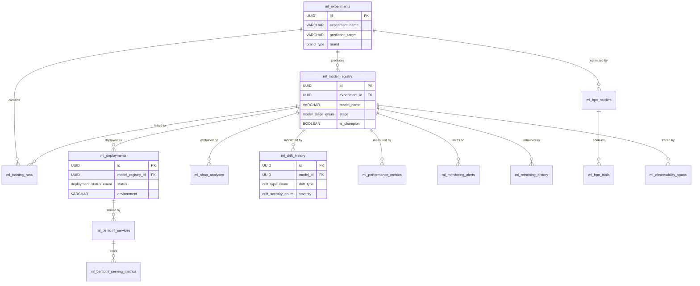
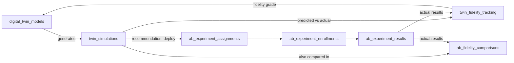
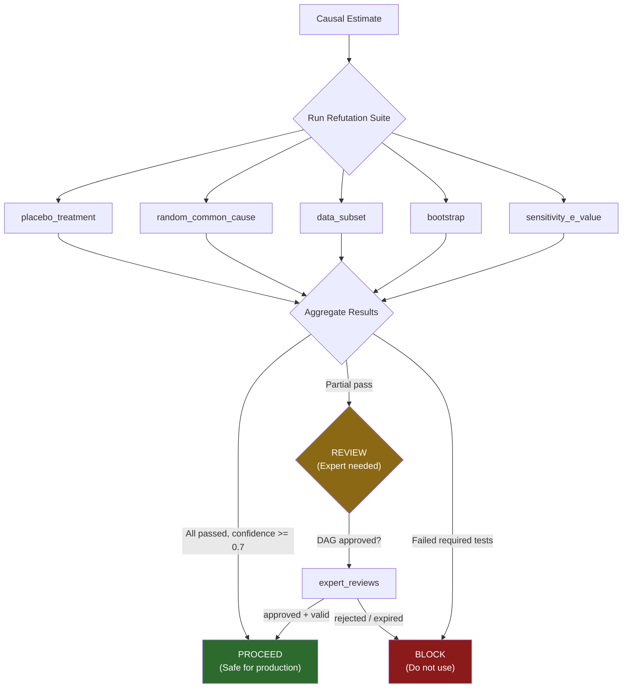
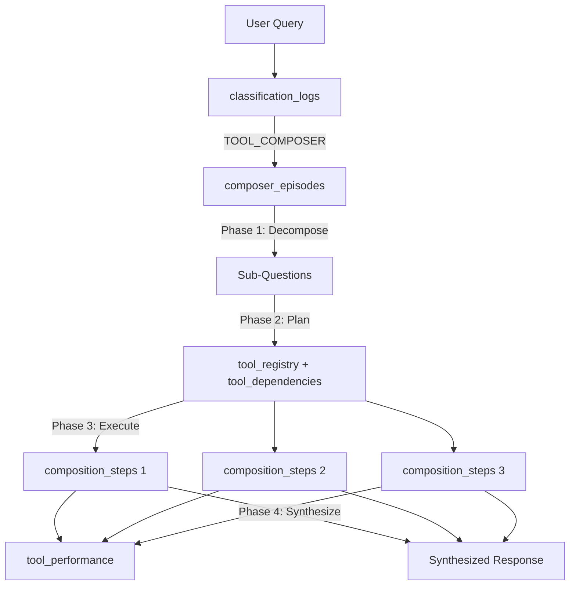

# 03 --- ML Pipeline Schema

> **E2I Causal Analytics** | Schema Version 4.2.1 | Last Updated: 2026-02

| Navigation | |
|---|---|
| [Index](00-INDEX.md) | [Conversion Guide](01-DATA-CONVERSION-GUIDE.md) |
| [Core Dictionary](02-CORE-DATA-DICTIONARY.md) | **ML Pipeline** |
| [Knowledge Graph](04-KNOWLEDGE-GRAPH-ONTOLOGY.md) | [Feature Store](05-FEATURE-STORE-REFERENCE.md) |
| [KPI Reference](06-KPI-REFERENCE.md) | [Supporting Schemas](07-SUPPORTING-SCHEMAS.md) |

---

## Overview

The ML pipeline schema spans **60+ tables** across 14 functional groups in `database/ml/`. These tables track the full ML lifecycle: experiment definition, model training, deployment, monitoring, causal validation, digital twin simulation, A/B testing, self-improvement, and prompt optimization. All tables live in the Supabase (Postgres) database and are referenced by the 21-agent, 6-tier system.

**Migration files**: `database/ml/mlops_tables.sql` through `database/ml/028_cohort_constructor_tables.sql`

---

## Table of Contents

1. [MLOps Core](#1-mlops-core) --- 8 tables
2. [Causal Validation](#2-causal-validation) --- 2 tables
3. [Digital Twin](#3-digital-twin) --- 3 tables
4. [Tool Composer](#4-tool-composer) --- 6 tables
5. [ROI Calculations](#5-roi-calculations) --- 3 tables
6. [HPO Studies](#6-hpo-studies) --- 2 tables
7. [Model Monitoring](#7-model-monitoring) --- 5 tables
8. [A/B Testing](#8-ab-testing) --- 6 tables
9. [Self-Improvement](#9-self-improvement) --- 5 tables
10. [GEPA Optimization](#10-gepa-optimization) --- 5 tables
11. [BentoML Tracking](#11-bentoml-tracking) --- 2 tables
12. [Feast Tracking](#12-feast-tracking) --- 3 tables
13. [Causal Discovery](#13-causal-discovery) --- 5 tables
14. [Cohort Constructor](#14-cohort-constructor) --- 5 tables
15. [Entity-Relationship Diagrams](#15-entity-relationship-diagrams)

---

## 1. MLOps Core

**Source**: `database/ml/mlops_tables.sql` (Migration 007)

The MLOps core tables provide the foundation for experiment tracking, model versioning, training run recording, feature metadata, data quality enforcement, SHAP explainability, deployment management, and distributed tracing across all 21 agents.

### Custom Enums

| Enum | Values |
|------|--------|
| `agent_tier_enum` | `ml_foundation`, `coordination`, `causal_analytics`, `monitoring`, `ml_predictions`, `self_improvement` |
| `model_stage_enum` | `development`, `staging`, `shadow`, `production`, `archived`, `deprecated` |
| `dq_status_enum` | `passed`, `failed`, `warning`, `skipped` |
| `deployment_status_enum` | `pending`, `deploying`, `active`, `draining`, `rolled_back`, `failed` |

### 1.1 `ml_experiments`

Experiment metadata with scope definitions and success criteria. Links to MLflow for tracking.

| Column | Type | Description |
|--------|------|-------------|
| `id` | UUID PK | Experiment identifier |
| `experiment_name` | VARCHAR(255) | Human-readable name |
| `mlflow_experiment_id` | VARCHAR(100) UNIQUE | MLflow experiment reference |
| `prediction_target` | VARCHAR(100) | What the experiment predicts |
| `observation_window_days` | INTEGER | Data lookback window |
| `prediction_horizon_days` | INTEGER | Forward prediction period |
| `minimum_auc` | DECIMAL(4,3) | Success threshold (0.5--1.0) |
| `brand` | brand_type | Remibrutinib, Fabhalta, or Kisqali |
| `data_split` | data_split_type | Train/val/test tracking |

**Key constraints**: `valid_auc CHECK (minimum_auc BETWEEN 0.5 AND 1.0)`

### 1.2 `ml_model_registry`

Model versioning with performance metrics and lifecycle stage tracking. A trigger ensures only one champion model per experiment.

| Column | Type | Description |
|--------|------|-------------|
| `id` | UUID PK | Model identifier |
| `experiment_id` | UUID FK | Parent experiment |
| `model_name` | VARCHAR(255) | Model name |
| `model_version` | VARCHAR(50) | Semantic version string |
| `algorithm` | VARCHAR(100) | Algorithm name (e.g., CausalForestDML) |
| `hyperparameters` | JSONB | Full hyperparameter set |
| `auc` | DECIMAL(5,4) | ROC AUC score |
| `pr_auc` | DECIMAL(5,4) | Precision-recall AUC |
| `fairness_metrics` | JSONB | Fairness assessment results |
| `stage` | model_stage_enum | Current lifecycle stage |
| `is_champion` | BOOLEAN | Whether this is the active champion model |

**Key constraints**: `UNIQUE(model_name, model_version)`, single-champion trigger per experiment

### 1.3 `ml_training_runs`

Individual training run records with hyperparameters, per-split metrics, and Optuna integration.

| Column | Type | Description |
|--------|------|-------------|
| `id` | UUID PK | Run identifier |
| `experiment_id` | UUID FK | Parent experiment |
| `model_registry_id` | UUID FK | Resulting model (if registered) |
| `mlflow_run_id` | VARCHAR(100) UNIQUE | MLflow run reference |
| `algorithm` | VARCHAR(100) | Algorithm used |
| `training_samples` | INTEGER | Number of training samples |
| `train_metrics` | JSONB | Training split metrics |
| `validation_metrics` | JSONB | Validation split metrics |
| `test_metrics` | JSONB | Test split metrics |
| `duration_seconds` | INTEGER | Wall-clock training time |
| `optuna_study_name` | VARCHAR(255) | Linked HPO study (if any) |
| `is_best_trial` | BOOLEAN | Best trial in HPO study |

### 1.4 `ml_feature_store`

Feature metadata with statistics computed on the train split only, to prevent data leakage.

| Column | Type | Description |
|--------|------|-------------|
| `id` | UUID PK | Feature identifier |
| `feature_name` | VARCHAR(255) | Feature name |
| `feature_group` | VARCHAR(100) | Logical grouping |
| `data_type` | VARCHAR(50) | Data type (numeric, categorical, etc.) |
| `entity_type` | VARCHAR(50) | Entity: patient, hcp, or treatment |
| `computation_sql` | TEXT | SQL computation logic |
| `train_statistics` | JSONB | Mean, std, min, max, null_rate, histogram |
| `global_importance` | DECIMAL(6,5) | SHAP global importance score |
| `importance_rank` | INTEGER | Rank by importance |

**Key constraints**: `UNIQUE(feature_name, feature_version)`

### 1.5 `ml_data_quality_reports`

Great Expectations validation results with six E2I quality dimensions and leakage detection.

| Column | Type | Description |
|--------|------|-------------|
| `id` | UUID PK | Report identifier |
| `expectation_suite_name` | VARCHAR(255) | GE suite name |
| `table_name` | VARCHAR(100) | Validated table |
| `overall_status` | dq_status_enum | Pass/fail/warning/skipped |
| `success_rate` | DECIMAL(5,4) | Fraction of expectations passed |
| `completeness_score` | DECIMAL(5,4) | Quality dimension: completeness |
| `validity_score` | DECIMAL(5,4) | Quality dimension: validity |
| `leakage_detected` | BOOLEAN | Whether train/test leakage was found |
| `data_split` | data_split_type | Which split was validated |
| `training_run_id` | UUID FK | Linked training run |

### 1.6 `ml_shap_analyses`

SHAP values for global, local (patient/HCP-level), and segment-level explainability. Includes natural language explanations generated by the Hybrid LLM node.

| Column | Type | Description |
|--------|------|-------------|
| `id` | UUID PK | Analysis identifier |
| `model_registry_id` | UUID FK | Model analyzed |
| `analysis_type` | VARCHAR(50) | `global`, `local`, or `segment` |
| `segment_name` | VARCHAR(100) | For segment analysis (e.g., `midwest`) |
| `global_importance` | JSONB | Feature name to mean abs SHAP value |
| `top_interactions` | JSONB | Top feature interactions |
| `local_shap_values` | JSONB | Per-entity SHAP values |
| `natural_language_explanation` | TEXT | LLM-generated explanation |
| `key_drivers` | TEXT[] | Top 5 driving features |
| `computation_method` | VARCHAR(50) | TreeExplainer or KernelExplainer |

### 1.7 `ml_deployments`

Deployment history with shadow mode testing, SLA tracking, and rollback chain support.

| Column | Type | Description |
|--------|------|-------------|
| `id` | UUID PK | Deployment identifier |
| `model_registry_id` | UUID FK | Deployed model |
| `deployment_name` | VARCHAR(255) | Deployment label |
| `environment` | VARCHAR(50) | development, staging, or production |
| `status` | deployment_status_enum | Current deployment status |
| `shadow_metrics` | JSONB | Metrics from shadow mode |
| `production_metrics` | JSONB | Metrics after promotion |
| `previous_deployment_id` | UUID FK (self) | Rollback chain reference |
| `latency_p50_ms` | INTEGER | 50th percentile latency |
| `latency_p99_ms` | INTEGER | 99th percentile latency |
| `error_rate` | DECIMAL(5,4) | Serving error rate |

### 1.8 `ml_observability_spans`

Opik span data for distributed tracing across all 21 agents, including LLM token usage and fallback chain tracking.

| Column | Type | Description |
|--------|------|-------------|
| `id` | UUID PK | Span record identifier |
| `trace_id` | VARCHAR(100) | Distributed trace ID |
| `span_id` | VARCHAR(100) | Span ID within trace |
| `parent_span_id` | VARCHAR(100) | Parent span (for nesting) |
| `agent_name` | agent_name_enum | Which agent executed |
| `agent_tier` | agent_tier_enum | Agent tier (0--5) |
| `operation_type` | VARCHAR(100) | inference, training, shap_computation, etc. |
| `duration_ms` | INTEGER | Execution duration |
| `total_tokens` | INTEGER | LLM tokens consumed |
| `fallback_used` | BOOLEAN | Whether fallback model was used |
| `fallback_chain` | JSONB | Sequence of models attempted |

**Key constraints**: `UNIQUE(trace_id, span_id)`

### Notable Views

| View | Purpose |
|------|---------|
| `v_champion_models` | Active champion models per experiment with metrics |
| `v_latest_data_quality` | Most recent DQ report per table and split |
| `v_agent_latency_summary` | 24-hour latency percentiles and error rates by agent |

---

## 2. Causal Validation

**Source**: `database/ml/010_causal_validation_tables.sql`

Stores DoWhy refutation test results for validating causal estimates. Implements a three-gate system (proceed/review/block) that controls whether causal estimates can be used in production. Requires expert sign-off for new DAG structures.

### Custom Enums

| Enum | Values |
|------|--------|
| `refutation_test_type` | `placebo_treatment`, `random_common_cause`, `data_subset`, `bootstrap`, `sensitivity_e_value` |
| `validation_status` | `passed`, `failed`, `warning`, `skipped` |
| `gate_decision` | `proceed`, `review`, `block` |
| `expert_review_type` | `dag_approval`, `methodology_review`, `quarterly_audit`, `ad_hoc_validation` |

### 2.1 `causal_validations`

Records individual refutation test results for each causal estimate.

| Column | Type | Description |
|--------|------|-------------|
| `validation_id` | UUID PK | Validation record identifier |
| `estimate_id` | UUID | ID of the estimate being validated |
| `estimate_source` | VARCHAR(50) | Source table: `causal_paths` or `ml_experiments` |
| `test_type` | refutation_test_type | Which DoWhy refutation test was run |
| `status` | validation_status | Per-test pass/fail result |
| `original_effect` | DECIMAL(12,6) | Causal effect before refutation |
| `refuted_effect` | DECIMAL(12,6) | Effect after refutation manipulation |
| `p_value` | DECIMAL(6,5) | Statistical significance |
| `confidence_score` | DECIMAL(4,3) | Weighted confidence (0--1) |
| `gate_decision` | gate_decision | proceed, review, or block |
| `treatment_variable` | VARCHAR(100) | Treatment being analyzed |
| `outcome_variable` | VARCHAR(100) | Outcome being measured |

### 2.2 `expert_reviews`

Tracks domain expert validation of causal DAGs and methodology. Supports time-limited approvals for quarterly audit cycles.

| Column | Type | Description |
|--------|------|-------------|
| `review_id` | UUID PK | Review identifier |
| `review_type` | expert_review_type | Type of review |
| `dag_version_hash` | VARCHAR(64) | SHA256 hash of DAG for versioning |
| `reviewer_id` | VARCHAR(100) | Reviewer user ID |
| `reviewer_role` | VARCHAR(100) | commercial_ops, medical_affairs, data_science |
| `approval_status` | VARCHAR(30) | pending, approved, rejected, expired |
| `checklist_json` | JSONB | Completed review checklist |
| `valid_until` | DATE | Expiration date for approval |
| `supersedes_review_id` | UUID | Replaces a previous review |

### Notable Functions

| Function | Purpose |
|----------|---------|
| `is_dag_approved(hash, brand)` | Check if a DAG has active expert approval |
| `get_validation_gate(estimate_id)` | Get aggregate gate decision for an estimate |
| `can_use_estimate(estimate_id, dag_hash)` | Combined gate + expert approval check |

---

## 3. Digital Twin

**Source**: `database/ml/012_digital_twin_tables.sql` (Migration 011)

Infrastructure for A/B test pre-screening using ML-based digital twins. Models generate synthetic HCP, patient, or territory populations to simulate intervention effects before committing to real experiments.

### Custom Enums

| Enum | Values |
|------|--------|
| `twin_type` | `hcp`, `patient`, `territory` |
| `simulation_status` | `pending`, `running`, `completed`, `failed` |
| `simulation_recommendation` | `deploy`, `skip`, `refine` |
| `fidelity_grade` | `excellent` (<10% error), `good` (10--20%), `fair` (20--35%), `poor` (>35%), `unvalidated` |

### 3.1 `digital_twin_models`

Stores trained ML models that generate digital twins, with MLflow integration and fidelity tracking.

| Column | Type | Description |
|--------|------|-------------|
| `model_id` | UUID PK | Model identifier |
| `model_name` | VARCHAR(200) | Human-readable name |
| `twin_type` | twin_type | hcp, patient, or territory |
| `training_config` | JSONB | Algorithm, n_estimators, max_depth, cv_folds |
| `performance_metrics` | JSONB | r2_score, rmse, mae, cv_scores |
| `fidelity_score` | FLOAT | 0--1 fidelity against real outcomes |
| `brand` | VARCHAR(100) | Remibrutinib, Fabhalta, Kisqali, or All |
| `is_active` | BOOLEAN | Currently deployed |

### 3.2 `twin_simulations`

Records simulation runs with predicted intervention effects and sample size recommendations.

| Column | Type | Description |
|--------|------|-------------|
| `simulation_id` | UUID PK | Simulation identifier |
| `model_id` | UUID FK | Twin model used |
| `intervention_type` | VARCHAR(100) | email_campaign, call_frequency_increase, etc. |
| `intervention_config` | JSONB | Channel, frequency, duration, target segment |
| `twin_count` | INTEGER | Number of twins simulated |
| `simulated_ate` | FLOAT | Average Treatment Effect |
| `simulated_ci_lower` | FLOAT | 95% CI lower bound |
| `simulated_ci_upper` | FLOAT | 95% CI upper bound |
| `recommendation` | simulation_recommendation | deploy, skip, or refine |
| `recommended_sample_size` | INTEGER | Suggested real experiment sample size |

### 3.3 `twin_fidelity_tracking`

Validates twin predictions against real experiment outcomes. A trigger auto-calculates fidelity metrics and grade when actual results are recorded.

| Column | Type | Description |
|--------|------|-------------|
| `tracking_id` | UUID PK | Tracking record identifier |
| `simulation_id` | UUID FK | Simulation being validated |
| `simulated_ate` | FLOAT | Twin-predicted effect |
| `actual_ate` | FLOAT | Real experiment effect |
| `prediction_error` | FLOAT | (simulated - actual) / actual |
| `ci_coverage` | BOOLEAN | Did actual fall within simulated CI? |
| `fidelity_grade` | fidelity_grade | Auto-computed from prediction error |

---

## 4. Tool Composer

**Source**: `database/ml/013_tool_composer_tables.sql` (Migration 011)

Supports multi-faceted query handling with dependency-aware tool composition. The Orchestrator classifier routes queries, and the Tool Composer breaks complex queries into sub-questions, plans execution DAGs, and synthesizes results.

### Custom Enums

| Enum | Values |
|------|--------|
| `routing_pattern` | `SINGLE_AGENT`, `PARALLEL_DELEGATION`, `TOOL_COMPOSER`, `CLARIFICATION_NEEDED` |
| `dependency_type` | `REFERENCE_CHAIN`, `CONDITIONAL`, `LOGICAL_SEQUENCE`, `ENTITY_TRANSFORMATION` |
| `tool_category` | `CAUSAL`, `SEGMENTATION`, `GAP`, `EXPERIMENT`, `PREDICTION`, `MONITORING` |
| `composition_status` | `PENDING`, `DECOMPOSING`, `PLANNING`, `EXECUTING`, `SYNTHESIZING`, `COMPLETED`, `FAILED`, `TIMEOUT` |

### 4.1 `tool_registry`

Central registry of composable tools exposed by Tier 2--4 agents. Seeded with 13 default tools.

| Column | Type | Description |
|--------|------|-------------|
| `tool_id` | UUID PK | Tool identifier |
| `name` | VARCHAR(100) UNIQUE | Tool name (e.g., `causal_effect_estimator`) |
| `category` | tool_category | Capability domain |
| `source_agent` | VARCHAR(50) | Owning agent |
| `input_schema` | JSONB | JSON Schema for inputs |
| `output_schema` | JSONB | JSON Schema for outputs |
| `composable` | BOOLEAN | Whether Tool Composer can use it |
| `avg_latency_ms` | FLOAT | Rolling average latency |
| `success_rate` | FLOAT | Rolling success rate (0--1) |

### 4.2 `tool_dependencies`

Defines which tools can consume output from other tools, enabling the Planner to build valid execution DAGs.

| Column | Type | Description |
|--------|------|-------------|
| `dependency_id` | UUID PK | Dependency record identifier |
| `consumer_tool_id` | UUID FK | Tool that consumes data |
| `producer_tool_id` | UUID FK | Tool that produces data |
| `output_field` | VARCHAR(100) | Specific producer output field (NULL = entire output) |
| `input_field` | VARCHAR(100) | Specific consumer input field |
| `transform_expression` | TEXT | Optional jq/JSONPath transformation |

**Key constraints**: No self-dependencies, unique (consumer, producer) pairs

### 4.3 `classification_logs`

Audit trail of Orchestrator query classification decisions with feedback tracking.

| Column | Type | Description |
|--------|------|-------------|
| `classification_id` | UUID PK | Log identifier |
| `query_text` | TEXT | Original user query |
| `query_hash` | VARCHAR(64) | SHA-256 for deduplication |
| `routing_pattern` | routing_pattern | Determined routing |
| `confidence` | FLOAT | Classification confidence (0--1) |
| `used_llm_layer` | BOOLEAN | Whether the LLM classifier was invoked |
| `was_correct` | BOOLEAN | Feedback: NULL = pending |

### 4.4 `composer_episodes`

Episodic memory for tool compositions. Stores vector embeddings for similarity search to optimize future plans.

| Column | Type | Description |
|--------|------|-------------|
| `episode_id` | UUID PK | Episode identifier |
| `query_text` | TEXT | Original query |
| `query_embedding` | vector(1536) | For similarity search (pgvector) |
| `sub_questions` | JSONB | Decomposed sub-questions |
| `tool_plan` | JSONB | Execution plan |
| `status` | composition_status | Execution status |
| `total_latency_ms` | FLOAT | End-to-end latency |
| `success` | BOOLEAN | Feedback on composition quality |

### 4.5 `composition_steps`

Individual step execution records within a composition.

| Column | Type | Description |
|--------|------|-------------|
| `step_id` | UUID PK | Step identifier |
| `episode_id` | UUID FK | Parent composition |
| `step_number` | INTEGER | Execution order |
| `tool_id` | UUID FK | Tool executed |
| `input_params` | JSONB | Input data |
| `output_result` | JSONB | Output data |
| `depends_on_steps` | INTEGER[] | Step dependencies |
| `latency_ms` | FLOAT | Step execution time |

### 4.6 `tool_performance`

Per-tool execution metrics for optimization and planner decisions.

| Column | Type | Description |
|--------|------|-------------|
| `performance_id` | UUID PK | Record identifier |
| `tool_id` | UUID FK | Tool measured |
| `latency_ms` | FLOAT | Execution latency |
| `success` | BOOLEAN | Success/failure |
| `error_type` | VARCHAR(100) | Error classification |
| `called_by` | VARCHAR(50) | composer, agent, or direct |

---

## 5. ROI Calculations

**Source**: `database/ml/014_roi_calculations.sql`

Persistence for ROI calculations from the Gap Analyzer agent. Supports Monte Carlo bootstrap confidence intervals, multi-driver value decomposition, risk-adjusted ROI, and NPV for multi-year initiatives.

### Custom Enums

| Enum | Values |
|------|--------|
| `value_driver_type` | `trx_lift`, `patient_identification`, `action_rate`, `intent_to_prescribe`, `data_quality`, `drift_prevention` |
| `attribution_level_type` | `full` (100%), `partial` (50--80%), `shared` (20--50%), `minimal` (<20%) |
| `risk_level_type` | `low`, `medium`, `high` |
| `initiative_type` | `data_source_integration`, `new_ml_model`, `algorithm_optimization`, `dashboard_enhancement`, `trigger_redesign`, `ab_test_implementation`, `other` |

### 5.1 `roi_calculations`

Complete ROI analysis for an initiative with confidence intervals from bootstrap simulation.

| Column | Type | Description |
|--------|------|-------------|
| `calculation_id` | UUID PK | Calculation identifier |
| `initiative_name` | VARCHAR(200) | Initiative label |
| `initiative_type` | initiative_type | Category of initiative |
| `brand` | brand_type | Target brand |
| `incremental_value` | DECIMAL(15,2) | Total incremental value |
| `attributed_value` | DECIMAL(15,2) | Value after attribution discount |
| `implementation_cost` | DECIMAL(15,2) | Total cost |
| `risk_adjusted_roi` | DECIMAL(8,2) | ROI after risk adjustment |
| `ci_lower` | DECIMAL(8,2) | 2.5th percentile ROI |
| `ci_upper` | DECIMAL(8,2) | 97.5th percentile ROI |
| `probability_positive` | DECIMAL(5,4) | P(ROI > 1x) |
| `attribution_level` | attribution_level_type | Causal attribution strength |
| `sensitivity_results` | JSONB | Tornado diagram data |

### 5.2 `roi_value_driver_details`

Itemized value driver breakdown for each ROI calculation.

| Column | Type | Description |
|--------|------|-------------|
| `detail_id` | UUID PK | Detail identifier |
| `calculation_id` | UUID FK | Parent ROI calculation |
| `driver_type` | value_driver_type | Type of value driver |
| `quantity` | DECIMAL(12,2) | Number of units |
| `unit_value` | DECIMAL(10,2) | Dollar value per unit |
| `total_value` | DECIMAL(15,2) | quantity x unit_value |

### 5.3 `roi_cost_details`

Itemized cost breakdown with one-time vs. recurring cost distinction.

| Column | Type | Description |
|--------|------|-------------|
| `detail_id` | UUID PK | Detail identifier |
| `calculation_id` | UUID FK | Parent ROI calculation |
| `category` | VARCHAR(50) | Cost category (engineering, data_acquisition, etc.) |
| `total_cost` | DECIMAL(15,2) | Total cost amount |
| `is_one_time` | BOOLEAN | One-time vs. recurring |
| `recurrence_months` | INTEGER | Duration if recurring |

---

## 6. HPO Studies

**Source**: `database/ml/016_hpo_studies.sql` (Migration 016)

Tracks Optuna hyperparameter optimization studies and their individual trial results.

### 6.1 `ml_hpo_studies`

Optuna study metadata including search space, sampler, pruner, and best results.

| Column | Type | Description |
|--------|------|-------------|
| `id` | UUID PK | Study identifier |
| `study_name` | VARCHAR(255) UNIQUE | Optuna study name |
| `experiment_id` | UUID FK | Linked ML experiment |
| `algorithm_name` | VARCHAR(100) | Algorithm being optimized |
| `direction` | VARCHAR(20) | `maximize` or `minimize` |
| `metric` | VARCHAR(50) | Objective metric (roc_auc, rmse, etc.) |
| `search_space` | JSONB | Param definitions: type, low, high, log, choices |
| `best_trial_number` | INTEGER | Index of best trial |
| `best_value` | DECIMAL(10,6) | Best objective value |
| `best_params` | JSONB | Best hyperparameters found |
| `n_trials` | INTEGER | Total trials run |
| `n_pruned` | INTEGER | Trials pruned early |

### 6.2 `ml_hpo_trials`

Individual trial records within an HPO study.

| Column | Type | Description |
|--------|------|-------------|
| `id` | UUID PK | Trial identifier |
| `study_id` | UUID FK | Parent study |
| `trial_number` | INTEGER | Trial index |
| `state` | VARCHAR(50) | COMPLETE, PRUNED, FAIL, WAITING, RUNNING |
| `params` | JSONB | Hyperparameters sampled |
| `value` | DECIMAL(10,6) | Objective function value |
| `intermediate_values` | JSONB | Step-wise values for pruning |
| `duration_seconds` | DECIMAL(10,3) | Trial wall-clock time |

**Key constraints**: `UNIQUE(study_id, trial_number)`

---

## 7. Model Monitoring

**Source**: `database/ml/017_model_monitoring_tables.sql` (Migration 017)

Comprehensive model monitoring with drift detection, performance tracking, alert lifecycle management, monitoring job orchestration, and automated retraining triggers.

### Custom Enums

| Enum | Values |
|------|--------|
| `drift_type_enum` | `data`, `model`, `concept` |
| `drift_severity_enum` | `none`, `low`, `medium`, `high`, `critical` |
| `alert_status_enum` | `active`, `acknowledged`, `investigating`, `resolved`, `dismissed` |
| `statistical_test_enum` | `psi`, `ks`, `chi_square`, `wasserstein`, `js_divergence`, `importance_correlation` |

### 7.1 `ml_drift_history`

Time-series drift detection results for data, model, and concept drift. A trigger auto-generates alerts for medium+ severity drift.

| Column | Type | Description |
|--------|------|-------------|
| `id` | UUID PK | Drift record identifier |
| `model_id` | UUID FK | Model monitored |
| `drift_type` | drift_type_enum | data, model, or concept |
| `feature_name` | VARCHAR(255) | Affected feature (NULL for model/concept) |
| `test_type` | statistical_test_enum | Statistical test used |
| `test_statistic` | DECIMAL(12,6) | Test statistic value |
| `p_value` | DECIMAL(12,10) | Statistical significance |
| `drift_detected` | BOOLEAN | Whether drift threshold exceeded |
| `severity` | drift_severity_enum | Drift severity classification |
| `drift_score` | DECIMAL(8,4) | Normalized 0--1 drift score |

**Key constraints**: `valid_period CHECK (baseline_end <= current_start)`

### 7.2 `ml_performance_metrics`

Time-series model performance measurements with baseline comparison and degradation detection.

| Column | Type | Description |
|--------|------|-------------|
| `id` | UUID PK | Metric record identifier |
| `model_id` | UUID FK | Model measured |
| `metric_name` | VARCHAR(100) | roc_auc, precision, rmse, etc. |
| `metric_value` | DECIMAL(12,6) | Measured value |
| `data_split` | VARCHAR(50) | train, val, test, or production |
| `segment` | VARCHAR(255) | Optional segmentation (brand, region) |
| `baseline_value` | DECIMAL(12,6) | Comparison baseline |
| `is_degraded` | BOOLEAN | Performance below threshold |

### 7.3 `ml_monitoring_alerts`

Full-lifecycle alert management from creation through resolution. Supports notification channels, retraining triggers, and auto-actions.

| Column | Type | Description |
|--------|------|-------------|
| `id` | UUID PK | Alert identifier |
| `alert_type` | VARCHAR(100) | drift, performance, staleness, error |
| `severity` | drift_severity_enum | Alert severity |
| `status` | alert_status_enum | Lifecycle status |
| `model_id` | UUID FK | Affected model |
| `affected_features` | TEXT[] | Features involved |
| `recommended_action` | TEXT | Suggested remediation |
| `triggered_retraining` | BOOLEAN | Whether auto-retraining was triggered |
| `resolution_action` | VARCHAR(100) | retrained, rolled_back, dismissed, fixed_data |

### 7.4 `ml_monitoring_runs`

Monitoring job execution records for auditing and debugging.

| Column | Type | Description |
|--------|------|-------------|
| `id` | UUID PK | Run identifier |
| `run_type` | VARCHAR(100) | data_drift, model_drift, concept_drift, performance, full |
| `trigger_type` | VARCHAR(50) | scheduled, manual, or event |
| `overall_health_score` | DECIMAL(5,2) | 0--100 health score |
| `alerts_generated` | INTEGER | Number of alerts produced |
| `critical_count` | INTEGER | Critical severity findings |

### 7.5 `ml_retraining_history`

Automated retraining events triggered by monitoring alerts with before/after performance comparison.

| Column | Type | Description |
|--------|------|-------------|
| `id` | UUID PK | Retraining record identifier |
| `trigger_type` | VARCHAR(100) | drift, performance, scheduled, manual |
| `alert_id` | UUID FK | Triggering alert |
| `model_id` | UUID FK | Model retrained |
| `old_model_version` | VARCHAR(100) | Previous version |
| `new_model_version` | VARCHAR(100) | New version |
| `old_metric_value` | DECIMAL(12,6) | Metric before retraining |
| `new_metric_value` | DECIMAL(12,6) | Metric after retraining |
| `auto_deployed` | BOOLEAN | Whether auto-promoted to production |

### Notable Views

| View | Purpose |
|------|---------|
| `ml_drift_status_latest` | Latest drift status per model and drift type |
| `ml_drift_trend_7d` | 7-day drift trend summary |
| `ml_active_alerts_summary` | Active alerts aggregated by model |
| `ml_model_health_dashboard` | Combined drift, alerts, and performance for production models |

---

## 8. A/B Testing

**Source**: `database/ml/020_ab_testing_tables.sql`, `database/ml/021_ab_results_tables.sql`

Full A/B testing infrastructure supporting randomization, enrollment tracking, interim analysis with O'Brien-Fleming stopping rules, results computation, sample ratio mismatch detection, and digital twin fidelity comparison.

### Custom Enums

| Enum | Values |
|------|--------|
| `ab_unit_type` | `hcp`, `patient`, `territory`, `account` |
| `randomization_method` | `simple`, `stratified`, `block`, `cluster`, `adaptive` |
| `enrollment_status` | `active`, `withdrawn`, `excluded`, `completed`, `lost_to_followup` |
| `interim_decision` | `continue`, `stop_efficacy`, `stop_futility`, `stop_safety`, `modify_sample` |
| `ab_analysis_type` | `interim`, `final`, `post_hoc` |
| `ab_analysis_method` | `itt`, `per_protocol`, `as_treated`, `cace` |
| `srm_severity` | `none`, `minor`, `moderate`, `severe` |

### 8.1 `ab_experiment_assignments`

Treatment/control assignments with randomization metadata and deterministic hashing for reproducibility.

| Column | Type | Description |
|--------|------|-------------|
| `id` | UUID PK | Assignment identifier |
| `experiment_id` | UUID FK | Parent experiment |
| `unit_id` | VARCHAR(255) | HCP/patient/territory ID |
| `unit_type` | ab_unit_type | Unit type |
| `variant` | VARCHAR(50) | control, treatment_a, treatment_b, etc. |
| `randomization_method` | randomization_method | Randomization strategy |
| `stratification_key` | JSONB | Stratification variables used |
| `assignment_hash` | VARCHAR(64) | SHA-256 for reproducible verification |

**Key constraints**: `UNIQUE(experiment_id, unit_id)`

### 8.2 `ab_experiment_enrollments`

Enrollment lifecycle tracking with eligibility criteria, consent, and protocol adherence.

| Column | Type | Description |
|--------|------|-------------|
| `id` | UUID PK | Enrollment identifier |
| `assignment_id` | UUID FK | Parent assignment |
| `enrollment_status` | enrollment_status | Current lifecycle status |
| `eligibility_criteria_met` | JSONB | Checklist of eligibility criteria |
| `withdrawal_reason` | TEXT | Reason for withdrawal (if applicable) |
| `protocol_deviations` | JSONB | Recorded deviations with date, type, severity |

### 8.3 `ab_interim_analyses`

Interim analysis results implementing O'Brien-Fleming alpha-spending with conditional power assessment.

| Column | Type | Description |
|--------|------|-------------|
| `id` | UUID PK | Analysis identifier |
| `experiment_id` | UUID FK | Parent experiment |
| `analysis_number` | INTEGER | Sequential analysis index |
| `information_fraction` | FLOAT | Proportion of total data collected (0--1) |
| `spending_function` | VARCHAR(50) | obrien_fleming or other |
| `adjusted_alpha` | FLOAT | Adjusted significance threshold |
| `conditional_power` | FLOAT | Probability of significance given current data |
| `decision` | interim_decision | continue, stop_efficacy, stop_futility, etc. |

### 8.4 `ab_experiment_results`

Computed experiment results with effect estimates, statistical inference, and heterogeneous treatment effects by segment.

| Column | Type | Description |
|--------|------|-------------|
| `id` | UUID PK | Result identifier |
| `experiment_id` | UUID FK | Parent experiment |
| `analysis_type` | ab_analysis_type | interim, final, or post_hoc |
| `analysis_method` | ab_analysis_method | itt, per_protocol, as_treated, or cace |
| `primary_metric` | VARCHAR(100) | Primary outcome metric |
| `control_n` | INTEGER | Control arm sample size |
| `treatment_n` | INTEGER | Treatment arm sample size |
| `effect_estimate` | FLOAT | Point estimate of effect |
| `p_value` | FLOAT | Statistical significance |
| `is_significant` | BOOLEAN | Whether effect is significant |
| `segment_results` | JSONB | Treatment effects by specialty, decile, etc. |

### 8.5 `ab_srm_checks`

Sample Ratio Mismatch detection using chi-squared tests.

| Column | Type | Description |
|--------|------|-------------|
| `id` | UUID PK | Check identifier |
| `experiment_id` | UUID FK | Parent experiment |
| `expected_ratio` | JSONB | Expected allocation per variant |
| `actual_counts` | JSONB | Observed counts per variant |
| `chi_squared_statistic` | FLOAT | Chi-squared test statistic |
| `p_value` | FLOAT | Statistical significance |
| `severity` | srm_severity | none, minor, moderate, severe |
| `root_cause` | VARCHAR(100) | Investigation finding |

### 8.6 `ab_fidelity_comparisons`

Compares Digital Twin predictions with actual A/B test results. Auto-computes prediction errors and fidelity scores via triggers.

| Column | Type | Description |
|--------|------|-------------|
| `id` | UUID PK | Comparison identifier |
| `experiment_id` | UUID FK | Parent experiment |
| `twin_simulation_id` | UUID FK | Digital Twin simulation |
| `results_id` | UUID FK | Experiment results |
| `predicted_effect` | FLOAT | Twin-predicted effect |
| `actual_effect` | FLOAT | Real experiment effect |
| `fidelity_score` | FLOAT | Prediction accuracy (0--1) |
| `fidelity_grade` | VARCHAR(20) | excellent, good, fair, poor |
| `direction_match` | BOOLEAN | Whether effect direction matched |

---

## 9. Self-Improvement

**Source**: `database/ml/022_self_improvement_tables.sql`

RAGAS-Opik integration for automated quality evaluation and self-improvement. Evaluates query-response pairs using RAGAS metrics (faithfulness, relevancy, precision, recall) and domain rubrics, then routes improvement actions to retrieval tuning, prompt optimization, or workflow changes.

### Custom Enums

| Enum | Values |
|------|--------|
| `improvement_type` | `retrieval`, `prompt`, `workflow`, `none` |
| `improvement_priority` | `critical` (<0.40), `high` (0.40--0.54), `medium` (0.55--0.69), `low` (0.70--0.84), `none` (>=0.85) |

### 9.1 `evaluation_results`

Detailed RAGAS and rubric evaluation results per query-response pair.

| Column | Type | Description |
|--------|------|-------------|
| `evaluation_id` | UUID PK | Evaluation identifier |
| `learning_signal_id` | UUID FK | Linked learning signal |
| `query` | TEXT | Input query |
| `response` | TEXT | Agent response |
| `faithfulness` | FLOAT | RAGAS faithfulness (0--1) |
| `answer_relevancy` | FLOAT | RAGAS answer relevancy (0--1) |
| `context_precision` | FLOAT | RAGAS context precision (0--1) |
| `context_recall` | FLOAT | RAGAS context recall (0--1) |
| `causal_validity` | FLOAT | Domain rubric: causal validity (1--5) |
| `actionability` | FLOAT | Domain rubric: actionability (1--5) |
| `ragas_aggregate` | FLOAT | Weighted RAGAS composite (0--1) |
| `rubric_aggregate` | FLOAT | Weighted rubric composite (1--5) |

### 9.2 `retrieval_configurations`

Versioned RAG retrieval parameter configurations with performance tracking.

| Column | Type | Description |
|--------|------|-------------|
| `config_id` | UUID PK | Configuration identifier |
| `k_value` | INTEGER | Number of documents to retrieve |
| `chunk_size` | INTEGER | Document chunk size |
| `vector_weight` | FLOAT | Hybrid RAG: vector search weight |
| `fulltext_weight` | FLOAT | Hybrid RAG: full-text search weight |
| `graph_weight` | FLOAT | Hybrid RAG: graph search weight |
| `rerank_enabled` | BOOLEAN | Whether reranking is active |
| `is_active` | BOOLEAN | Currently deployed configuration |

**Key constraints**: `weights_sum CHECK (ABS(vector_weight + fulltext_weight + graph_weight - 1.0) < 0.001)`

### 9.3 `prompt_configurations`

Prompt template versioning with lineage tracking and performance metrics.

| Column | Type | Description |
|--------|------|-------------|
| `prompt_id` | UUID PK | Prompt identifier |
| `prompt_name` | VARCHAR(100) | Configuration name |
| `agent_name` | VARCHAR(100) | Target agent |
| `system_prompt` | TEXT | System prompt content |
| `few_shot_examples` | JSONB | Few-shot examples |
| `avg_combined_score` | FLOAT | Performance metric |
| `parent_prompt_id` | UUID FK (self) | Lineage reference |

### 9.4 `improvement_actions`

Audit log of all self-improvement actions with before/after state and outcome tracking.

| Column | Type | Description |
|--------|------|-------------|
| `action_id` | UUID PK | Action identifier |
| `improvement_type` | improvement_type | retrieval, prompt, or workflow |
| `before_config` | JSONB | State before change |
| `after_config` | JSONB | State after change |
| `outcome_improved` | BOOLEAN | Whether improvement was positive |
| `outcome_delta` | FLOAT | Score change |
| `status` | VARCHAR(20) | applied or rolled_back |

### 9.5 `experiment_knowledge_store`

Organizational learning from experiments with vector embeddings for similarity search.

| Column | Type | Description |
|--------|------|-------------|
| `knowledge_id` | UUID PK | Knowledge identifier |
| `lesson_type` | VARCHAR(50) | Category of learning |
| `title` | VARCHAR(200) | Concise title |
| `description` | TEXT | Full description |
| `knowledge_json` | JSONB | Structured knowledge |
| `embedding` | vector(1536) | For similarity search |
| `times_applied` | INTEGER | Usage counter |
| `success_rate` | FLOAT | Application success rate |

---

## 10. GEPA Optimization

**Source**: `database/ml/023_gepa_optimization_tables.sql`

GEPA (Generative Evolutionary Prompting with AI) prompt optimization infrastructure. Tracks optimization sessions, stores versioned optimized instructions with Pareto lineage, and manages A/B tests comparing GEPA-optimized vs. baseline prompts.

### Custom Enums

| Enum | Values |
|------|--------|
| `optimizer_type` | `miprov2`, `gepa`, `bootstrap_fewshot`, `copro`, `simba`, `manual` |
| `gepa_budget_preset` | `light` (~500 calls), `medium` (~2000), `heavy` (~4000+), `custom` |
| `optimization_status` | `pending`, `running`, `completed`, `failed`, `cancelled`, `rolled_back` |
| `ab_test_variant` | `baseline`, `gepa`, `gepa_v2`, `control` |

### 10.1 `prompt_optimization_runs`

Tracks GEPA optimization sessions. Each run optimizes one agent.

| Column | Type | Description |
|--------|------|-------------|
| `run_id` | UUID PK | Run identifier |
| `agent_name` | VARCHAR(100) | Agent being optimized |
| `agent_tier` | SMALLINT | Tier 0--5 |
| `optimizer_type` | optimizer_type | gepa, miprov2, etc. |
| `budget_preset` | gepa_budget_preset | Computational budget |
| `baseline_score` | DECIMAL(5,4) | Score before optimization |
| `optimized_score` | DECIMAL(5,4) | Score after optimization |
| `improvement_percent` | DECIMAL(5,2) | Percentage improvement |
| `config_json` | JSONB | Full config for reproducibility |

### 10.2 `optimized_instructions`

Stores versioned agent instructions produced by GEPA with Pareto frontier lineage.

| Column | Type | Description |
|--------|------|-------------|
| `instruction_id` | UUID PK | Instruction identifier |
| `run_id` | UUID FK | Optimization run that produced this |
| `agent_name` | VARCHAR(100) | Target agent |
| `predictor_name` | VARCHAR(100) | DSPy predictor within agent |
| `instruction_text` | TEXT | The optimized prompt |
| `instruction_hash` | VARCHAR(64) | SHA256 for deduplication |
| `is_active` | BOOLEAN | Currently deployed |
| `val_score` | DECIMAL(5,4) | Validation score |
| `parent_indices` | INTEGER[] | GEPA evolution lineage |

**Key constraints**: Only one active instruction per agent/predictor pair

### 10.3 `optimized_tool_descriptions`

Stores optimized tool descriptions for DoWhy/EconML tools when `enable_tool_optimization=True`.

| Column | Type | Description |
|--------|------|-------------|
| `tool_description_id` | UUID PK | Description identifier |
| `run_id` | UUID FK | Optimization run |
| `tool_name` | VARCHAR(100) | e.g., causal_forest, linear_dml |
| `description_text` | TEXT | Optimized description |
| `original_description` | TEXT | Original for comparison |
| `tool_selection_accuracy` | DECIMAL(5,4) | How often correct tool selected |

### 10.4 `prompt_ab_tests`

Tracks A/B tests comparing GEPA-optimized vs. baseline agent versions.

| Column | Type | Description |
|--------|------|-------------|
| `test_id` | UUID PK | Test identifier |
| `agent_name` | VARCHAR(100) | Agent under test |
| `baseline_instruction_id` | UUID FK | Baseline prompt version |
| `treatment_instruction_id` | UUID FK | GEPA-optimized version |
| `traffic_split` | DECIMAL(3,2) | Fraction routed to treatment |
| `p_value` | DECIMAL(5,4) | Statistical significance |
| `winner` | ab_test_variant | Which variant won |
| `rolled_out` | BOOLEAN | Whether winner was promoted |

### 10.5 `prompt_ab_test_observations`

Individual request-level observations for statistical analysis.

| Column | Type | Description |
|--------|------|-------------|
| `observation_id` | UUID PK | Observation identifier |
| `test_id` | UUID FK | Parent A/B test |
| `variant` | ab_test_variant | baseline, gepa, control, etc. |
| `score` | DECIMAL(5,4) | Response quality score |
| `latency_ms` | INTEGER | Response latency |
| `success` | BOOLEAN | Whether request succeeded |

---

## 11. BentoML Tracking

**Source**: `database/ml/024_bentoml_tables.sql`

Tracks BentoML service deployments and time-series serving performance metrics for model serving health monitoring.

### 11.1 `ml_bentoml_services`

BentoML service deployments with health monitoring and endpoint tracking.

| Column | Type | Description |
|--------|------|-------------|
| `id` | UUID PK | Service identifier |
| `service_name` | VARCHAR(255) | Service name |
| `bento_tag` | VARCHAR(255) | Bento tag (name:version) |
| `model_registry_id` | UUID FK | Linked model |
| `deployment_id` | UUID FK | Linked deployment |
| `replicas` | INTEGER | Number of replicas |
| `resources` | JSONB | CPU and memory config |
| `health_status` | VARCHAR(50) | healthy, unhealthy, degraded, unknown |
| `serving_endpoint` | TEXT | External endpoint URL |
| `status` | deployment_status_enum | Deployment lifecycle status |

### 11.2 `ml_bentoml_serving_metrics`

Time-series serving performance metrics collected periodically.

| Column | Type | Description |
|--------|------|-------------|
| `id` | UUID PK | Metric record identifier |
| `service_id` | UUID FK | Parent service |
| `recorded_at` | TIMESTAMPTZ | Measurement timestamp |
| `requests_total` | INTEGER | Total requests in period |
| `requests_per_second` | FLOAT | Throughput |
| `avg_latency_ms` | FLOAT | Average latency |
| `p50_latency_ms` | FLOAT | Median latency |
| `p95_latency_ms` | FLOAT | 95th percentile latency |
| `p99_latency_ms` | FLOAT | 99th percentile latency |
| `error_rate` | FLOAT | Error percentage (0--100) |
| `memory_mb` | FLOAT | Memory usage |
| `cpu_percent` | FLOAT | CPU utilization |

---

## 12. Feast Tracking

**Source**: `database/ml/025_feast_tracking_tables.sql`

Tracks Feast feature view configurations, materialization jobs, and feature freshness for the feature store.

### 12.1 `ml_feast_feature_views`

Feast feature view configurations and metadata.

| Column | Type | Description |
|--------|------|-------------|
| `id` | UUID PK | Feature view identifier |
| `name` | VARCHAR(255) | Feature view name |
| `project` | VARCHAR(100) | Feast project (default: e2i_causal_analytics) |
| `features` | JSONB | Feature names and types |
| `feature_count` | INTEGER | Number of features |
| `source_type` | VARCHAR(50) | batch, stream, or request |
| `ttl_seconds` | INTEGER | Time-to-live for freshness |
| `online_enabled` | BOOLEAN | Whether online serving is active |

**Key constraints**: `UNIQUE(name, project)`

### 12.2 `ml_feast_materialization_jobs`

Materialization job execution records with resource usage metrics.

| Column | Type | Description |
|--------|------|-------------|
| `id` | UUID PK | Job identifier |
| `feature_view_id` | UUID FK | Target feature view |
| `job_type` | VARCHAR(50) | full or incremental |
| `start_time` | TIMESTAMPTZ | Materialization window start |
| `end_time` | TIMESTAMPTZ | Materialization window end |
| `status` | VARCHAR(50) | pending, running, success, failed |
| `rows_materialized` | INTEGER | Rows written |
| `duration_seconds` | FLOAT | Job wall-clock time |

### 12.3 `ml_feast_feature_freshness`

Feature freshness tracking with staleness thresholds.

| Column | Type | Description |
|--------|------|-------------|
| `id` | UUID PK | Freshness record identifier |
| `feature_view_id` | UUID FK | Feature view monitored |
| `staleness_seconds` | INTEGER | Time since last materialization |
| `data_lag_seconds` | INTEGER | Lag between source and online store |
| `freshness_status` | VARCHAR(50) | fresh, stale, critical, unknown |

---

## 13. Causal Discovery

**Source**: `database/ml/026_causal_discovery_tables.sql`

Stores causal structure learning results from multiple algorithms (GES, PC, FCI, LiNGAM). Implements ensemble voting across algorithms, gate evaluation for discovered DAGs, and comparison of causal vs. predictive feature importance rankings. Tables are in the `ml` schema.

### Custom Enums (ml schema)

| Enum | Values |
|------|--------|
| `ml.discovery_algorithm` | `ges`, `pc`, `fci`, `lingam`, `direct_lingam`, `ica_lingam` |
| `ml.gate_decision` | `accept`, `review`, `reject`, `augment` |
| `ml.edge_type` | `directed`, `undirected`, `bidirected` |

### 13.1 `ml.discovered_dags`

Stores discovered causal DAG structures with ensemble configuration and gate evaluation.

| Column | Type | Description |
|--------|------|-------------|
| `id` | UUID PK | DAG identifier |
| `session_id` | UUID FK | User session |
| `n_samples` | INTEGER | Data samples used |
| `n_features` | INTEGER | Features in graph |
| `algorithms_used` | TEXT[] | Algorithms in ensemble |
| `ensemble_threshold` | FLOAT | Voting threshold |
| `n_edges` | INTEGER | Edges discovered |
| `edge_list` | JSONB | Full edge list |
| `gate_decision` | ml.gate_decision | accept, review, reject, or augment |
| `gate_confidence` | FLOAT | Gate confidence score |
| `total_runtime_seconds` | FLOAT | Discovery wall-clock time |

### 13.2 `ml.discovery_algorithm_runs`

Individual algorithm results within a discovery session.

| Column | Type | Description |
|--------|------|-------------|
| `id` | UUID PK | Run identifier |
| `dag_id` | UUID FK | Parent DAG |
| `algorithm` | ml.discovery_algorithm | Algorithm used |
| `runtime_seconds` | FLOAT | Algorithm execution time |
| `converged` | BOOLEAN | Whether algorithm converged |
| `n_edges` | INTEGER | Edges found by this algorithm |
| `score` | FLOAT | Score-based method result |

### 13.3 `ml.discovered_edges`

Edges in discovered DAGs with confidence metadata and algorithm vote counts.

| Column | Type | Description |
|--------|------|-------------|
| `id` | UUID PK | Edge identifier |
| `dag_id` | UUID FK | Parent DAG |
| `source_node` | VARCHAR(255) | Cause variable |
| `target_node` | VARCHAR(255) | Effect variable |
| `edge_type` | ml.edge_type | directed, undirected, or bidirected |
| `confidence` | FLOAT | Ensemble confidence (0--1) |
| `algorithm_votes` | INTEGER | Number of algorithms that found this edge |
| `algorithms` | TEXT[] | Which algorithms found it |

**Key constraints**: `UNIQUE(dag_id, source_node, target_node)`

### 13.4 `ml.driver_rankings`

Causal vs. predictive feature importance rankings with Spearman correlation.

| Column | Type | Description |
|--------|------|-------------|
| `id` | UUID PK | Ranking set identifier |
| `dag_id` | UUID FK | Source DAG |
| `target_variable` | VARCHAR(255) | Outcome variable |
| `rankings` | JSONB | Full ranking array |
| `rank_correlation` | FLOAT | Spearman rho between causal and predictive |
| `causal_only_features` | TEXT[] | Features only important causally |
| `predictive_only_features` | TEXT[] | Features only important predictively |
| `concordant_features` | TEXT[] | Features important in both |

### 13.5 `ml.feature_rankings`

Detailed per-feature ranking information with auto-computed rank difference.

| Column | Type | Description |
|--------|------|-------------|
| `id` | UUID PK | Feature ranking identifier |
| `ranking_id` | UUID FK | Parent ranking set |
| `feature_name` | VARCHAR(255) | Feature name |
| `causal_rank` | INTEGER | Rank by causal importance |
| `predictive_rank` | INTEGER | Rank by predictive importance |
| `rank_difference` | INTEGER | `GENERATED ALWAYS AS (predictive_rank - causal_rank)` |
| `is_direct_cause` | BOOLEAN | Whether feature is a direct cause |

---

## 14. Cohort Constructor

**Source**: `database/ml/028_cohort_constructor_tables.sql`

Stores cohort eligibility criteria definitions, execution tracking, step-by-step exclusion logs, patient assignments, and cohort comparison results for the Tier 0 CohortConstructor agent.

### 14.1 `ml_cohort_definitions`

Versioned cohort configurations with inclusion/exclusion criteria for each brand and indication.

| Column | Type | Description |
|--------|------|-------------|
| `cohort_id` | TEXT PK | Cohort identifier |
| `brand` | TEXT | Target brand |
| `indication` | TEXT | Clinical indication |
| `version` | TEXT | Semantic version |
| `inclusion_criteria` | JSONB | Inclusion criteria array (field, operator, value) |
| `exclusion_criteria` | JSONB | Exclusion criteria array |
| `lookback_days` | INTEGER | Data lookback period (default 180) |
| `followup_days` | INTEGER | Required follow-up (default 90) |
| `eligible_population` | INTEGER | Population passing all criteria |
| `exclusion_rate` | DECIMAL(5,4) | Fraction excluded (0--1) |
| `config_hash` | TEXT | SHA256 for version tracking |
| `status` | TEXT | active, draft, archived, locked |

**Key constraints**: `UNIQUE(brand, indication, version)`

### 14.2 `ml_cohort_executions`

Execution tracking with per-node latency breakdown and SLA monitoring (target: <120s for 100K patients).

| Column | Type | Description |
|--------|------|-------------|
| `execution_id` | TEXT PK | Execution identifier |
| `cohort_id` | TEXT FK | Cohort definition |
| `input_row_count` | INTEGER | Input population size |
| `eligible_row_count` | INTEGER | Eligible population size |
| `execution_time_ms` | INTEGER | Total execution time (ms) |
| `validate_config_ms` | INTEGER | Config validation latency |
| `apply_criteria_ms` | INTEGER | Criteria application latency |
| `status` | TEXT | success, failed, partial |
| `error_code` | TEXT | CC_001 through CC_007 |

### 14.3 `ml_cohort_eligibility_log`

Audit trail of which criteria were applied and their impact on population size.

| Column | Type | Description |
|--------|------|-------------|
| `log_id` | SERIAL PK | Log entry identifier |
| `cohort_id` | TEXT FK | Cohort definition |
| `execution_id` | TEXT FK | Execution run |
| `criterion_order` | INTEGER | Application order |
| `criterion_name` | TEXT | Criterion label |
| `criterion_type` | TEXT | inclusion, exclusion, or temporal |
| `removed_count` | INTEGER | Patients excluded by this criterion |
| `remaining_count` | INTEGER | Patients remaining after this criterion |

### 14.4 `ml_patient_cohort_assignments`

Patient-level eligibility records with temporal validation status.

| Column | Type | Description |
|--------|------|-------------|
| `patient_journey_id` | TEXT | Patient identifier |
| `cohort_id` | TEXT FK | Cohort definition |
| `execution_id` | TEXT FK | Execution run |
| `is_eligible` | BOOLEAN | Eligibility result |
| `failed_criteria` | JSONB | Which criteria failed (if not eligible) |
| `lookback_complete` | BOOLEAN | Lookback period satisfied |
| `followup_complete` | BOOLEAN | Follow-up period satisfied |

**PK**: `(patient_journey_id, cohort_id, execution_id)` composite

### 14.5 `ml_cohort_comparisons`

Stores results of comparing multiple cohort definitions with overlap analysis.

| Column | Type | Description |
|--------|------|-------------|
| `comparison_id` | TEXT PK | Comparison identifier |
| `comparison_name` | TEXT | Human-readable label |
| `cohort_ids` | JSONB | Array of compared cohort IDs |
| `comparison_results` | JSONB | Statistical comparison results |
| `visualization_config` | JSONB | Visualization parameters |

---

## 15. Entity-Relationship Diagrams

### ML Experiment Lifecycle

Tracks the flow from experiment definition through training, model registration, deployment, and monitoring.

### Digital Twin Simulation Flow

Shows the lifecycle from twin model training through simulation, real experiment comparison, and fidelity tracking.

### Causal Validation Gate

Illustrates the three-gate decision process that controls whether causal estimates can be used.

### Tool Composer Execution

Shows the query decomposition and dependency-aware execution pipeline.

---

## Cross-References

| External System | Tables | Integration Point |
|----------------|--------|-------------------|
| **MLflow** | `ml_experiments`, `ml_model_registry`, `ml_training_runs`, `digital_twin_models` | `mlflow_experiment_id`, `mlflow_run_id`, `mlflow_model_uri` |
| **Opik** | `ml_observability_spans` | `trace_id`, `span_id` |
| **BentoML** | `ml_bentoml_services`, `ml_bentoml_serving_metrics` | `bento_tag`, `serving_endpoint` |
| **Feast** | `ml_feast_feature_views`, `ml_feast_materialization_jobs`, `ml_feast_feature_freshness` | Feature view configs, materialization tracking |
| **Optuna** | `ml_hpo_studies`, `ml_hpo_trials` | `study_name`, `trial_number` |
| **DoWhy** | `causal_validations` | Refutation test results |
| **RAGAS** | `evaluation_results` | Faithfulness, relevancy, precision, recall |
| **DSPy/GEPA** | `prompt_optimization_runs`, `optimized_instructions` | Prompt optimization lifecycle |
