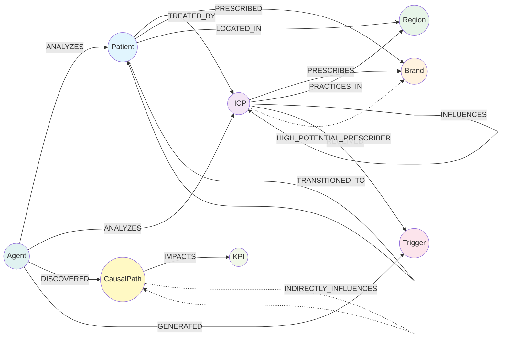
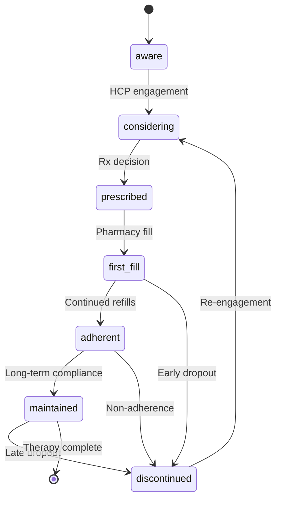

# 04 — Knowledge Graph Ontology (FalkorDB)

> **E2I Causal Analytics** | Schema Version 6.0.0 | Last Updated: 2026-02

| Navigation | |
|---|---|
| [Index](00-INDEX.md) | [Conversion Guide](01-DATA-CONVERSION-GUIDE.md) |
| [Core Dictionary](02-CORE-DATA-DICTIONARY.md) | [ML Pipeline](03-ML-PIPELINE-SCHEMA.md) |
| **Knowledge Graph** | [Feature Store](05-FEATURE-STORE-REFERENCE.md) |
| [KPI Reference](06-KPI-REFERENCE.md) | [Supporting Schemas](07-SUPPORTING-SCHEMAS.md) |

---

## Overview

The E2I knowledge graph runs on **FalkorDB** (Redis-compatible graph database) using the Cypher query language. It models pharmaceutical commercial relationships — patients, HCPs, brands, triggers, causal paths, and KPIs — as a property graph with **8 node types** and **15 edge types** (13 direct + 2 inferred).

**Purpose**: Enables graph-based RAG retrieval, causal path traversal, HCP influence network analysis, and patient journey state tracking for the 21-agent system.

---

## Full Graph Schema



*Dashed lines = inferred edges (computed by inference rules, not directly created)*

---

## Node Types

### Patient

Patient entity with journey tracking.

| Property | Type | Required | Constraints | Description |
|----------|------|----------|-------------|-------------|
| `patient_id` | string | Yes | Unique, `^PAT[0-9]{8}$` | Unique patient identifier (e.g., `PAT12345678`) |
| `journey_stage` | enum | Yes | See values below | Current stage in patient journey |
| `risk_score` | float | No | 0.0–1.0 | Risk score for churn/non-adherence |
| `region` | enum | Yes | See values below | Geographic region |
| `age_group` | enum | No | See values below | Age group classification |
| `insurance_type` | enum | No | See values below | Insurance coverage type |
| `created_at` | datetime | Yes | Auto | Timestamp of node creation |
| `updated_at` | datetime | Yes | Auto | Timestamp of last update |

**Enum values:**
- `journey_stage`: `aware`, `considering`, `prescribed`, `first_fill`, `adherent`, `discontinued`, `maintained`
- `region`: `northeast`, `south`, `midwest`, `west`
- `age_group`: `pediatric`, `young_adult`, `adult`, `senior`
- `insurance_type`: `commercial`, `medicare`, `medicaid`, `uninsured`, `other`

**Indexed properties**: `patient_id`, `journey_stage`, `region`, `age_group`, `insurance_type`, `created_at`

---

### HCP

Healthcare provider entity.

| Property | Type | Required | Constraints | Description |
|----------|------|----------|-------------|-------------|
| `hcp_id` | string | Yes | Unique, `^HCP[0-9]{8}$` | Unique HCP identifier |
| `npi` | string | Yes | Unique, `^[0-9]{10}$` | National Provider Identifier (10 digits) |
| `specialty` | enum | Yes | See values below | Medical specialty |
| `priority_tier` | enum | No | See values below | Targeting priority tier |
| `adoption_category` | enum | No | See values below | Adoption behavior classification |
| `region` | enum | Yes | `northeast`, `south`, `midwest`, `west` | Practice region |
| `created_at` | datetime | Yes | Auto | |
| `updated_at` | datetime | Yes | Auto | |

**Enum values:**
- `specialty`: `dermatology`, `allergist`, `immunology`, `hematology`, `oncology`, `medical_oncology`, `surgical_oncology`, `gynecologic_oncology`, `internal_medicine`, `family_medicine`, `physician_assistant`, `nurse_practitioner`, `other`
- `priority_tier`: `tier_1`, `tier_2`, `tier_3`
- `adoption_category`: `innovator`, `early_adopter`, `early_majority`, `late_majority`, `laggard`

**Indexed properties**: `hcp_id`, `npi`, `specialty`, `region`, `priority_tier`, `adoption_category`, `created_at`

---

### Brand

Pharmaceutical brand entity.

| Property | Type | Required | Constraints | Description |
|----------|------|----------|-------------|-------------|
| `brand_name` | enum | Yes | Unique | Brand name |
| `therapeutic_area` | enum | Yes | See below | Therapeutic area |
| `indication` | string | Yes | | Primary indication |
| `created_at` | datetime | Yes | Auto | |
| `updated_at` | datetime | Yes | Auto | |

**Enum values:**
- `brand_name`: `remibrutinib`, `fabhalta`, `kisqali`
- `therapeutic_area`: `immunology`, `hematology`, `oncology`

**Brand profiles:**

| Brand | Therapeutic Area | Primary Indication | Key Specialties |
|-------|-----------------|-------------------|-----------------|
| Remibrutinib | Immunology | Chronic Spontaneous Urticaria (CSU) | Allergist, Dermatology, Immunology |
| Fabhalta | Hematology | Paroxysmal Nocturnal Hemoglobinuria (PNH) | Hematology |
| Kisqali | Oncology | HR+/HER2- Breast Cancer | Oncology, Medical Oncology, Gynecologic Oncology |

---

### Region

Geographic region entity.

| Property | Type | Required | Constraints | Description |
|----------|------|----------|-------------|-------------|
| `region_name` | enum | Yes | Unique | Region name |
| `state_count` | integer | No | min 1 | Number of states in region |
| `created_at` | datetime | Yes | Auto | |
| `updated_at` | datetime | Yes | Auto | |

**Values**: `northeast`, `south`, `midwest`, `west`

---

### KPI

Key Performance Indicator entity.

| Property | Type | Required | Constraints | Description |
|----------|------|----------|-------------|-------------|
| `kpi_id` | string | Yes | Unique, `^KPI[0-9]{6}$` | KPI identifier (e.g., `KPI000001`) |
| `category` | enum | Yes | See below | KPI category |
| `name` | string | Yes | | KPI name |
| `target_value` | float | No | | Target value |
| `current_value` | float | No | | Current measured value |
| `unit` | string | No | | Unit of measurement |
| `created_at` | datetime | Yes | Auto | |
| `updated_at` | datetime | Yes | Auto | |

**Category values**: `ws1_data_quality`, `ws1_model_performance`, `ws2_triggers`, `ws3_business`, `brand_specific`, `causal_metrics`

See [06-KPI-REFERENCE.md](06-KPI-REFERENCE.md) for all 46 KPI definitions.

---

### CausalPath

Causal relationship with evidence.

| Property | Type | Required | Constraints | Description |
|----------|------|----------|-------------|-------------|
| `path_id` | string | Yes | Unique, `^CP[0-9]{8}$` | Causal path identifier |
| `source_variable` | string | Yes | | Source variable name |
| `target_variable` | string | Yes | | Target variable name |
| `effect_size` | float | Yes | | Quantified effect (can be negative) |
| `confidence` | float | Yes | 0.0–1.0 | Confidence score |
| `method_used` | enum | Yes | See below | Causal inference method |
| `validation_status` | enum | Yes | See below | Validation/refutation status |
| `gate_decision` | enum | No | See below | Gate decision based on threshold |
| `created_at` | datetime | Yes | Auto | |
| `updated_at` | datetime | Yes | Auto | |

**Enum values:**
- `method_used`: `dowhy_backdoor`, `dowhy_frontdoor`, `econml_dml`, `econml_causal_forest`, `causalml_uplift`, `causalml_metalearner`, `propensity_score_matching`, `difference_in_differences`
- `validation_status`: `validated`, `pending`, `failed`, `skipped`
- `gate_decision`: `proceed`, `review`, `block`

---

### Trigger

Next best action (NBA) trigger.

| Property | Type | Required | Constraints | Description |
|----------|------|----------|-------------|-------------|
| `trigger_id` | string | Yes | Unique, `^TRG[0-9]{8}$` | Trigger identifier |
| `trigger_type` | enum | Yes | See below | Type of trigger |
| `priority` | enum | Yes | See below | Priority level |
| `status` | enum | Yes | Default `pending` | Current status |
| `message` | string | Yes | | Trigger message content |
| `expiration_date` | datetime | No | | Expiration date |
| `created_at` | datetime | Yes | Auto | |
| `updated_at` | datetime | Yes | Auto | |

**Enum values:**
- `trigger_type`: `alert`, `recommendation`, `insight`, `nba`
- `priority`: `critical`, `high`, `medium`, `low`
- `status`: `pending`, `delivered`, `accepted`, `rejected`, `completed`, `expired`

---

### Agent

Agent entity for provenance tracking.

| Property | Type | Required | Constraints | Description |
|----------|------|----------|-------------|-------------|
| `agent_name` | enum | Yes | Unique | Agent name (snake_case) |
| `tier` | integer | Yes | 0–5 | Agent tier |
| `version` | string | No | | Agent version string |
| `created_at` | datetime | Yes | Auto | |
| `updated_at` | datetime | Yes | Auto | |

**Agent names (21 agents across 6 tiers):**

| Tier | Agents |
|------|--------|
| 0 — ML Foundation | `scope_definer`, `data_preparer`, `model_selector`, `model_trainer`, `model_evaluator`, `model_deployer`, `model_monitor` |
| 1 — Coordination | `orchestrator`, `tool_composer` |
| 2 — Causal Analytics | `causal_impact`, `heterogeneous_optimizer`, `gap_analyzer`, `experiment_designer` |
| 3 — Monitoring | `drift_monitor`, `data_quality_monitor`, `health_score` |
| 4 — Prediction | `prediction_synthesizer`, `risk_assessor`, `resource_optimizer` |
| 5 — Self-Improvement | `explainer`, `feedback_learner` |

---

## Edge Types

### Direct Edges (13)

#### TREATED_BY

**Patient → HCP** | Cardinality: N:M

| Property | Type | Required | Description |
|----------|------|----------|-------------|
| `is_primary_hcp` | boolean | Yes | Is this the primary provider? |
| `visit_count` | integer | No | Number of visits |
| `relationship_status` | enum | No | `active`, `inactive`, `transferred` |
| `first_visit_date` | datetime | No | Date of first visit |
| `last_visit_date` | datetime | No | Date of most recent visit |

#### PRESCRIBED

**Patient → Brand** | Cardinality: N:M

| Property | Type | Required | Description |
|----------|------|----------|-------------|
| `prescription_date` | datetime | Yes | Date of prescription |
| `is_first_line` | boolean | No | First-line therapy? |
| `line_of_therapy` | integer | No | Line of therapy (1, 2, 3...) |
| `status` | enum | Yes | `active`, `discontinued`, `completed` |

#### PRESCRIBES

**HCP → Brand** | Cardinality: N:M

| Property | Type | Required | Description |
|----------|------|----------|-------------|
| `volume_monthly` | integer | No | Average monthly Rx volume |
| `market_share` | float | No | Market share for this HCP (0–1) |
| `prescribing_status` | enum | No | `active`, `lapsed`, `never` |
| `first_prescription_date` | datetime | No | Date of first prescription |

#### PRACTICES_IN

**HCP → Region** | Cardinality: N:1

| Property | Type | Required | Description |
|----------|------|----------|-------------|
| `primary_location` | boolean | Yes | Is this the primary practice location? |

#### LOCATED_IN

**Patient → Region** | Cardinality: N:1

| Property | Type | Required | Description |
|----------|------|----------|-------------|
| `residence_status` | enum | No | `permanent`, `temporary` |

#### INFLUENCES

**HCP → HCP** | Cardinality: N:M

| Property | Type | Required | Description |
|----------|------|----------|-------------|
| `influence_strength` | float | Yes | Strength of influence (0–1) |
| `network_type` | enum | No | `peer`, `mentor`, `colleague`, `referral` |

#### RECEIVED

**HCP → Trigger** | Cardinality: N:M

| Property | Type | Required | Description |
|----------|------|----------|-------------|
| `delivery_date` | datetime | Yes | Date trigger was delivered |
| `accepted` | boolean | No | Did HCP accept the trigger? |
| `action_taken` | string | No | Description of action taken |

#### CAUSES

**any → any** | Cardinality: N:M

| Property | Type | Required | Description |
|----------|------|----------|-------------|
| `effect_size` | float | Yes | Quantified effect (can be negative) |
| `confidence` | float | Yes | Confidence in causal relationship (0–1) |
| `method_used` | enum | Yes | Causal inference method (same as CausalPath) |

#### IMPACTS

**CausalPath → KPI** | Cardinality: N:M

| Property | Type | Required | Description |
|----------|------|----------|-------------|
| `impact_magnitude` | float | Yes | Magnitude of impact on KPI |
| `direction` | enum | Yes | `positive`, `negative`, `neutral` |

#### ANALYZES

**Agent → any** | Cardinality: N:M

| Property | Type | Required | Description |
|----------|------|----------|-------------|
| `analysis_date` | datetime | Yes | Date of analysis |
| `analysis_type` | string | No | Type of analysis performed |

#### DISCOVERED

**Agent → CausalPath** | Cardinality: N:M

| Property | Type | Required | Description |
|----------|------|----------|-------------|
| `discovery_date` | datetime | Yes | Date of discovery |
| `discovery_method` | string | No | Method used for discovery |

#### GENERATED

**Agent → Trigger** | Cardinality: N:M

| Property | Type | Required | Description |
|----------|------|----------|-------------|
| `generation_date` | datetime | Yes | Date trigger was generated |
| `reasoning` | string | No | Reasoning behind trigger generation |

#### TRANSITIONED_TO

**Patient → Patient** (self-edge) | Cardinality: N:N

| Property | Type | Required | Description |
|----------|------|----------|-------------|
| `from_stage` | enum | Yes | Source journey stage |
| `to_stage` | enum | Yes | Target journey stage |
| `transition_date` | datetime | Yes | Date of transition |

Stage values: `aware`, `considering`, `prescribed`, `first_fill`, `adherent`, `discontinued`, `maintained`

---

### Inferred Edges (2)

These are computed by the inference rule engine, not created directly.

#### INDIRECTLY_INFLUENCES

**any → any** | Cardinality: N:M | Inference rule: `causal_chain`

| Property | Type | Required | Description |
|----------|------|----------|-------------|
| `combined_effect` | float | Yes | Combined effect through path |
| `combined_confidence` | float | Yes | Product of path confidences (0–1) |
| `path_count` | integer | Yes | Number of contributing paths |

#### HIGH_POTENTIAL_PRESCRIBER

**HCP → Brand** | Cardinality: N:M | Inference rule: `hcp_influence_propagation`

| Property | Type | Required | Description |
|----------|------|----------|-------------|
| `potential_score` | float | Yes | Potential score (0–1) |
| `evidence` | string | No | Evidence for classification |

---

## Patient Journey State Machine



Each transition is recorded as a `TRANSITIONED_TO` self-edge on the Patient node with `from_stage`, `to_stage`, and `transition_date` properties.

---

## Inference Rules

The inference engine runs 5 rules on a scheduled basis to discover implicit relationships.

### 1. indirect_treatment (Daily, Priority 1)

Infers `HCP → PRESCRIBES → Brand` from `Patient → TREATED_BY → HCP` + `Patient → PRESCRIBED → Brand` patterns.

**Requirements**: `min_patient_count >= 3`

```cypher
MATCH (p:Patient)-[:TREATED_BY]->(h:HCP),
      (p)-[:PRESCRIBED]->(b:Brand)
WITH h, b, COUNT(DISTINCT p) AS patient_count
WHERE patient_count >= 3
MERGE (h)-[r:PRESCRIBES]->(b)
SET r.volume_monthly = patient_count,
    r.prescribing_status = 'active',
    r.inferred = true
```

### 2. causal_chain (Weekly, Priority 2)

Transitive closure: A→B + B→C ⇒ A⇢C via `INDIRECTLY_INFLUENCES`.

**Requirements**: Direct confidence >= 0.50, combined confidence >= 0.25

```cypher
MATCH path = (a)-[:CAUSES*2..4]->(c)
WHERE ALL(r IN relationships(path) WHERE r.confidence >= 0.50)
WITH a, c,
     REDUCE(e = 1.0, r IN relationships(path) | e * r.effect_size) AS combined_effect,
     REDUCE(conf = 1.0, r IN relationships(path) | conf * r.confidence) AS combined_confidence,
     COUNT(path) AS path_count
WHERE combined_confidence >= 0.25
MERGE (a)-[r:INDIRECTLY_INFLUENCES]->(c)
SET r.combined_effect = combined_effect,
    r.combined_confidence = combined_confidence,
    r.path_count = path_count
```

### 3. hcp_influence_propagation (Weekly, Priority 3)

Identifies high-potential HCPs via influence networks.

**Requirements**: `influence_strength >= 0.70`, `influencer_count >= 2`

Creates `HIGH_POTENTIAL_PRESCRIBER` edges from HCP to Brand.

### 4. patient_journey_progression (Monthly, Priority 4)

Calculates stage transition probabilities from `TRANSITIONED_TO` edges. Creates `JourneyStage` nodes + `TRANSITION_PROBABILITY` edges.

### 5. roi_opportunity_flagging (Weekly, Priority 5)

Flags high-confidence causal paths with KPI gaps as Opportunities.

**Requirements**: `confidence >= 0.75`, `gap >= 10%`

Priority assignment: critical (gap >= 30%), high (>= 20%), medium (>= 10%)

### Execution Configuration

| Setting | Value |
|---------|-------|
| Batch size | 1,000 rows |
| Parallel execution | max 4 workers |
| Error handling | log_and_continue, 3 retries |
| Monitoring | Alert on failure or runtime > 30 min |

**Dependencies**: `hcp_influence_propagation` depends on `indirect_treatment`; `roi_opportunity_flagging` depends on `causal_chain`

---

## Seed Data

The seed script (`scripts/seed_falkordb.py`) populates:

- **3 Brand** nodes (Remibrutinib, Fabhalta, Kisqali)
- **4 Region** nodes (northeast, south, midwest, west)
- **11 Agent** nodes (one per Tier 1–5 agent)
- **Sample KPI** nodes (from `config/kpi_definitions.yaml`)
- **Sample HCP** and **Patient** nodes with relationships

Run from host:

```bash
FALKORDB_HOST=localhost FALKORDB_PORT=6381 .venv/bin/python scripts/seed_falkordb.py
```

From inside a container:

```bash
FALKORDB_URL=redis://:${FALKORDB_PASSWORD}@falkordb:6379/0 python scripts/seed_falkordb.py
```

---

## FalkorDB Configuration

**Source**: `config/ontology/falkordb_config.yaml`

### Unique Constraints

```
Patient.patient_id, HCP.hcp_id, HCP.npi, Brand.brand_name,
Region.region_name, KPI.kpi_id, CausalPath.path_id,
Trigger.trigger_id, Agent.agent_name
```

### Query Optimization

| Setting | Value |
|---------|-------|
| Query cache | 512 MB |
| Materialized views | Enabled |
| Parallel threads | 4 |
| Connection pool | min 2, max 10, 30s timeout |
| Compression level | 6 |
| Write buffer | 256 MB |

### Migration Strategy

- **Current version**: 6.0.0
- **Versioning**: `SchemaVersion` node tracks version
- **Additive changes**: New nodes/edges add constraints only
- **Breaking changes**: Create → copy → drop
- **Rollback**: Enabled with 30-day backup retention

---

## Example Queries

### Find HCPs who prescribed a brand

```cypher
MATCH (h:HCP)-[:PRESCRIBES]->(b:Brand {brand_name: 'remibrutinib'})
RETURN h.hcp_id, h.specialty, h.priority_tier
ORDER BY h.priority_tier
```

### Trace a patient's journey transitions

```cypher
MATCH (p:Patient {patient_id: 'PAT12345678'})-[t:TRANSITIONED_TO]->(p)
RETURN t.from_stage, t.to_stage, t.transition_date
ORDER BY t.transition_date
```

### Find causal paths impacting a KPI

```cypher
MATCH (cp:CausalPath)-[i:IMPACTS]->(k:KPI {category: 'ws3_business'})
WHERE cp.confidence >= 0.75 AND cp.validation_status = 'validated'
RETURN cp.source_variable, cp.target_variable, cp.effect_size,
       i.impact_magnitude, i.direction, k.name
ORDER BY ABS(i.impact_magnitude) DESC
```

### HCP influence network (2 hops)

```cypher
MATCH path = (h1:HCP)-[:INFLUENCES*1..2]->(h2:HCP)
WHERE h1.hcp_id = 'HCP87654321'
RETURN h2.hcp_id, h2.specialty,
       REDUCE(s = 1.0, r IN relationships(path) | s * r.influence_strength) AS combined_influence
ORDER BY combined_influence DESC
LIMIT 20
```

### Agents that discovered validated causal paths

```cypher
MATCH (a:Agent)-[:DISCOVERED]->(cp:CausalPath {validation_status: 'validated'})
RETURN a.agent_name, a.tier, COUNT(cp) AS discoveries,
       AVG(cp.confidence) AS avg_confidence
ORDER BY discoveries DESC
```
