# 05 — Feature Store Reference (Feast)

> **E2I Causal Analytics** | Feast 0.58.0 | Last Updated: 2026-02

| Navigation | |
|---|---|
| [Index](00-INDEX.md) | [Conversion Guide](01-DATA-CONVERSION-GUIDE.md) |
| [Core Dictionary](02-CORE-DATA-DICTIONARY.md) | [ML Pipeline](03-ML-PIPELINE-SCHEMA.md) |
| [Knowledge Graph](04-KNOWLEDGE-GRAPH-ONTOLOGY.md) | **Feature Store** |
| [KPI Reference](06-KPI-REFERENCE.md) | [Supporting Schemas](07-SUPPORTING-SCHEMAS.md) |

---

## Overview

The E2I feature store uses **Feast** (Feature Store for ML) to manage feature definitions, serving, and materialization. Features are organized around pharmaceutical commercial use cases: HCP conversion prediction, patient churn prediction, trigger effectiveness analysis, and ROI prediction.

**Source**: `feature_repo/` directory

---

## Architecture

```mermaid
graph TD
    subgraph "Data Sources (Supabase PostgreSQL)"
        BM[business_metrics]
        PJ[patient_journeys]
        TR[triggers]
        HP[hcp_profiles]
        TM[territory_metrics]
    end

    subgraph "Entities"
        E_HCP[hcp]
        E_PAT[patient]
        E_TER[territory]
        E_BRD[brand]
        E_TRG[trigger]
        E_HB[hcp_brand]
        E_PB[patient_brand]
        E_HT[hcp_territory]
    end

    subgraph "Feature Views"
        FV_HC[hcp_conversion_features]
        FV_HP2[hcp_profile_features]
        FV_HE[hcp_engagement_features]
        FV_PJ2[patient_journey_features]
        FV_PA[patient_adherence_features]
        FV_TE[trigger_effectiveness_features]
        FV_TR2[trigger_response_features]
        FV_MD[market_dynamics_features]
        FV_TP[territory_performance_features]
    end

    BM --> FV_HC
    BM --> FV_HE
    BM --> FV_MD
    HP --> FV_HP2
    PJ --> FV_PJ2
    PJ --> FV_PA
    TR --> FV_TE
    TR --> FV_TR2
    TM --> FV_TP

    E_HCP --> FV_HC
    E_HCP --> FV_HP2
    E_HCP --> FV_HE
    E_HB --> FV_HC
    E_HB --> FV_HE
    E_PAT --> FV_PJ2
    E_PAT --> FV_PA
    E_PB --> FV_PJ2
    E_PB --> FV_PA
    E_TRG --> FV_TE
    E_TRG --> FV_TR2
    E_TER --> FV_MD
    E_TER --> FV_TP
    E_BRD --> FV_MD
```



---

## Entities

### Primary Entities (5)

| Entity | Join Key | Value Type | Description | Tags |
|--------|----------|------------|-------------|------|
| `hcp` | `hcp_id` | STRING | Healthcare Provider — prescriber targeting and conversion | domain: commercial |
| `patient` | `patient_id` | STRING | Anonymized patient — journey analysis, adherence, churn | pii: pseudonymized, retention: 365 days |
| `territory` | `territory_id` | STRING | Geographic sales territory — resource allocation | domain: commercial |
| `brand` | `brand_id` | STRING | Pharmaceutical brand (Remibrutinib, Fabhalta, Kisqali) | domain: commercial |
| `trigger` | `trigger_id` | STRING | Marketing trigger/event — campaign effectiveness | domain: commercial |

### Composite Entities (3)

Feast 0.58.0 only supports single join keys, so composite entities use concatenated key strings.

| Entity | Join Key | Format | Description |
|--------|----------|--------|-------------|
| `hcp_brand` | `hcp_brand_id` | `{hcp_id}_{brand_id}` | Brand-specific HCP features |
| `patient_brand` | `patient_brand_id` | `{patient_id}_{brand_id}` | Therapy-specific journey features |
| `hcp_territory` | `hcp_territory_id` | `{hcp_id}_{territory_id}` | Territory-specific targeting |

**Example composite key**: `HCP00000001_brand_remibrutinib`

---

## Data Sources

### PostgreSQL Sources (5)

All sources read from Supabase PostgreSQL with a 365-day lookback window.

#### business_metrics_source

| Column | Type | Description |
|--------|------|-------------|
| `hcp_id` | VARCHAR | HCP identifier |
| `territory_id` | VARCHAR | Territory identifier |
| `brand_id` | VARCHAR | Brand identifier |
| `event_timestamp` | TIMESTAMP | Metric date |
| `trx_count` | INT | Total prescriptions |
| `nrx_count` | INT | New prescriptions |
| `total_rx_count` | INT | Total Rx count |
| `market_share` | FLOAT | Market share |
| `conversion_rate` | FLOAT | Conversion rate |
| `engagement_score` | FLOAT | Engagement score |
| `call_frequency` | FLOAT | Rep call frequency |

**Timestamp field**: `event_timestamp` (from `metric_date`)

#### patient_journey_source

| Column | Type | Description |
|--------|------|-------------|
| `patient_id` | VARCHAR | Patient identifier |
| `brand_id` | VARCHAR | Brand identifier |
| `event_timestamp` | TIMESTAMP | Event date |
| `therapy_start_date` | TIMESTAMP | Therapy start |
| `days_on_therapy` | INT | Duration on therapy |
| `adherence_rate` | FLOAT | Adherence rate (0-1) |
| `refill_count` | INT | Number of refills |
| `gap_days` | INT | Cumulative gap days |
| `is_churned` | BOOL | Churn flag |
| `churn_risk_score` | FLOAT | ML churn risk (0-1) |

#### triggers_source

| Column | Type | Description |
|--------|------|-------------|
| `trigger_id` | VARCHAR | Trigger identifier |
| `hcp_id` | VARCHAR | Target HCP |
| `brand_id` | VARCHAR | Related brand |
| `event_timestamp` | TIMESTAMP | Trigger date |
| `trigger_type` | VARCHAR | Type of trigger |
| `channel` | VARCHAR | Delivery channel |
| `is_responded` | BOOL | Response flag |
| `response_time_hours` | FLOAT | Time to respond |
| `conversion_flag` | BOOL | Led to conversion |
| `roi_estimate` | FLOAT | Estimated ROI |

#### hcp_profiles_source

| Column | Type | Description |
|--------|------|-------------|
| `hcp_id` | VARCHAR | HCP identifier |
| `territory_id` | VARCHAR | Territory |
| `specialty` | VARCHAR | Medical specialty |
| `practice_type` | VARCHAR | Solo/Group/Hospital |
| `patient_volume_tier` | VARCHAR | Volume tier |
| `digital_engagement_tier` | VARCHAR | Digital engagement level |
| `years_of_practice` | INT | Experience years |
| `prescribing_tier` | VARCHAR | Prescribing tier |

**Timestamp field**: `event_timestamp` (from `last_updated`)

#### territory_metrics_source

| Column | Type | Description |
|--------|------|-------------|
| `territory_id` | VARCHAR | Territory identifier |
| `event_timestamp` | TIMESTAMP | Metric date |
| `total_trx` | INT | Territory TRx volume |
| `total_nrx` | INT | Territory NRx volume |
| `active_hcp_count` | INT | Active HCPs |
| `covered_lives` | INT | Covered lives |
| `market_potential` | FLOAT | Market potential score |
| `resource_allocation_score` | FLOAT | Current resource allocation |

### Push Sources (2)

For real-time feature updates via streaming ingestion.

| Source | Batch Source | Description |
|--------|-------------|-------------|
| `hcp_engagement_push_source` | `business_metrics_source` | Real-time HCP engagement events |
| `trigger_response_push_source` | `triggers_source` | Real-time trigger responses |

### Request Source (1)

For on-demand feature computation at serving time.

| Source | Fields | Description |
|--------|--------|-------------|
| `hcp_request_source` | `hcp_id`, `brand_id`, `request_timestamp` | On-demand HCP features |

---

## Feature Views

### HCP Features

#### hcp_conversion_features

**Use case**: HCP conversion prediction (binary classification)
**Entities**: `hcp`, `hcp_brand` | **TTL**: 7 days | **Online**: Yes

| Feature | Type | Description |
|---------|------|-------------|
| `trx_count` | Int64 | Total TRx in period |
| `nrx_count` | Int64 | New prescriptions |
| `total_rx_count` | Int64 | Total prescriptions |
| `market_share` | Float32 | HCP's market share for brand (0-1) |
| `conversion_rate` | Float32 | Historical conversion rate |
| `engagement_score` | Float32 | Overall engagement score (0-100) |
| `call_frequency` | Float32 | Rep call frequency (calls/month) |

**Source**: `business_metrics_source`

#### hcp_profile_features

**Use case**: HCP segmentation (static attributes)
**Entities**: `hcp` | **TTL**: 30 days | **Online**: Yes

| Feature | Type | Description |
|---------|------|-------------|
| `specialty` | String | Medical specialty |
| `practice_type` | String | Solo/Group/Hospital |
| `years_of_practice` | Int64 | Years in practice |
| `patient_volume_tier` | String | High/Medium/Low volume |
| `digital_engagement_tier` | String | Digital engagement level |
| `prescribing_tier` | String | Prescribing volume tier |

**Source**: `hcp_profiles_source`

#### hcp_engagement_features

**Use case**: Real-time HCP scoring (dynamic)
**Entities**: `hcp`, `hcp_brand` | **TTL**: 1 day | **Online**: Yes

| Feature | Type | Description |
|---------|------|-------------|
| `engagement_score` | Float32 | Current engagement score |
| `call_frequency` | Float32 | Recent call frequency |
| `conversion_rate` | Float32 | Recent conversion rate |

**Source**: `business_metrics_source`

---

### Patient Features

#### patient_journey_features

**Use case**: Churn prediction (binary classification)
**Entities**: `patient`, `patient_brand` | **TTL**: 7 days | **Online**: Yes

| Feature | Type | Description |
|---------|------|-------------|
| `days_on_therapy` | Int64 | Days since therapy start |
| `therapy_start_date` | UnixTimestamp | Therapy initiation date |
| `adherence_rate` | Float32 | Adherence rate (0-1) |
| `refill_count` | Int64 | Number of refills |
| `gap_days` | Int64 | Cumulative gap days |
| `is_churned` | Bool | Has patient churned |
| `churn_risk_score` | Float32 | ML-derived churn risk (0-1) |

**Source**: `patient_journey_source` | **Tags**: pii_category: pseudonymized, criticality: high

#### patient_adherence_features

**Use case**: Intervention targeting (daily refresh)
**Entities**: `patient`, `patient_brand` | **TTL**: 1 day | **Online**: Yes

| Feature | Type | Description |
|---------|------|-------------|
| `adherence_rate` | Float32 | Current adherence rate |
| `refill_count` | Int64 | Total refills to date |
| `gap_days` | Int64 | Total gap days |
| `churn_risk_score` | Float32 | Current churn risk score |

**Source**: `patient_journey_source`

---

### Trigger Features

#### trigger_effectiveness_features

**Use case**: Trigger effectiveness prediction (binary classification)
**Entities**: `trigger`, `hcp`, `hcp_brand` | **TTL**: 7 days | **Online**: Yes

| Feature | Type | Description |
|---------|------|-------------|
| `trigger_type` | String | Type of trigger (email, call, event) |
| `channel` | String | Delivery channel |
| `is_responded` | Bool | Did HCP respond |
| `response_time_hours` | Float32 | Time to response (hours) |
| `conversion_flag` | Bool | Led to conversion |
| `roi_estimate` | Float32 | Estimated ROI |

**Source**: `triggers_source`

#### trigger_response_features

**Use case**: Real-time response tracking (hourly refresh)
**Entities**: `trigger` | **TTL**: 1 day | **Online**: Yes

| Feature | Type | Description |
|---------|------|-------------|
| `is_responded` | Bool | Has trigger been responded to |
| `response_time_hours` | Float32 | Response time |
| `conversion_flag` | Bool | Conversion outcome |

**Source**: `triggers_source`

---

### Market Features

#### market_dynamics_features

**Use case**: ROI prediction (regression)
**Entities**: `territory`, `brand` | **TTL**: 7 days | **Online**: Yes

| Feature | Type | Description |
|---------|------|-------------|
| `trx_count` | Int64 | Territory TRx volume |
| `nrx_count` | Int64 | Territory NRx volume |
| `total_rx_count` | Int64 | Total prescriptions |
| `market_share` | Float32 | Market share in territory |
| `conversion_rate` | Float32 | Territory conversion rate |
| `engagement_score` | Float32 | Average engagement score |

**Source**: `business_metrics_source`

#### territory_performance_features

**Use case**: Resource optimization (daily refresh)
**Entities**: `territory` | **TTL**: 1 day | **Online**: Yes

| Feature | Type | Description |
|---------|------|-------------|
| `total_trx` | Int64 | Total TRx in territory |
| `total_nrx` | Int64 | Total NRx in territory |
| `active_hcp_count` | Int64 | Active HCPs |
| `covered_lives` | Int64 | Covered lives |
| `market_potential` | Float32 | Market potential score |
| `resource_allocation_score` | Float32 | Current resource allocation |

**Source**: `territory_metrics_source`

---

## Feature View Summary

| Feature View | Entities | Features | TTL | Use Case | Source |
|-------------|----------|----------|-----|----------|--------|
| `hcp_conversion_features` | hcp, hcp_brand | 7 | 7d | HCP conversion | business_metrics |
| `hcp_profile_features` | hcp | 6 | 30d | Segmentation | hcp_profiles |
| `hcp_engagement_features` | hcp, hcp_brand | 3 | 1d | Real-time scoring | business_metrics |
| `patient_journey_features` | patient, patient_brand | 7 | 7d | Churn prediction | patient_journeys |
| `patient_adherence_features` | patient, patient_brand | 4 | 1d | Intervention | patient_journeys |
| `trigger_effectiveness_features` | trigger, hcp, hcp_brand | 6 | 7d | Trigger prediction | triggers |
| `trigger_response_features` | trigger | 3 | 1d | Response tracking | triggers |
| `market_dynamics_features` | territory, brand | 6 | 7d | ROI prediction | business_metrics |
| `territory_performance_features` | territory | 6 | 1d | Resource optimization | territory_metrics |

**Total**: 9 feature views, 48 features

---

## Materialization & Serving

### Offline Store

PostgreSQL (Supabase) — used for batch feature retrieval during training.

```python
from feast import FeatureStore

store = FeatureStore(repo_path="feature_repo/")

# Get historical features for training
training_df = store.get_historical_features(
    entity_df=entity_df,
    features=[
        "hcp_conversion_features:trx_count",
        "hcp_conversion_features:market_share",
        "hcp_profile_features:specialty",
    ],
).to_df()
```

### Online Store

Redis — used for low-latency feature retrieval during inference.

```python
# Get online features for real-time scoring
features = store.get_online_features(
    features=[
        "hcp_engagement_features:engagement_score",
        "hcp_engagement_features:conversion_rate",
    ],
    entity_rows=[{"hcp_id": "HCP00000001", "hcp_brand_id": "HCP00000001_brand_remibrutinib"}],
).to_dict()
```

### Materialization

Feast materializes features from the offline store to the online store on a schedule.

```bash
# Materialize features to online store
cd feature_repo/
feast materialize 2025-01-01T00:00:00 2025-12-01T00:00:00

# Incremental materialization
feast materialize-incremental $(date -u +%Y-%m-%dT%H:%M:%S)
```

### Feast Configuration

The Feast feature server runs in Docker at `127.0.0.1:6567` (internal port 6566, remapped because Chrome blocks 6566). The compose overlay binds the `feature_repo/` directory into the container.

```yaml
# feature_store.yaml
project: e2i_causal_analytics
provider: local
online_store:
  type: redis
  connection_string: redis://redis:6379/2
offline_store:
  type: postgres
  host: db
  port: 5432
```

---

## Tracking Tables

Feature store operations are tracked in PostgreSQL:

- `ml_feast_feature_views` — Registered feature views with column counts and materialization status
- `ml_feast_materialization_jobs` — Materialization run history with row counts and durations
- `ml_feast_feature_freshness` — Feature freshness monitoring per view

See [03-ML-PIPELINE-SCHEMA.md](03-ML-PIPELINE-SCHEMA.md) for details on these tracking tables.
