# KPI Reference

**Version**: 3.0.0 | **Last Updated**: 2025-11-28 | **Total KPIs**: 46 | **Gaps**: 0

---

**Navigation**: [Architecture](../ARCHITECTURE.md) | [Onboarding](../ONBOARDING.md) | [Data Templates](templates/README.md)

**Jump to workstream**: [WS1 Data Quality](#ws1-data-coverage--quality-9-kpis) | [WS1 Model Performance](#ws1-model-performance-9-kpis) | [WS2 Triggers](#ws2-trigger-performance-8-kpis) | [WS3 Business](#ws3-business-impact-10-kpis) | [Brand-Specific](#brand-specific-5-kpis) | [Causal Metrics](#causal-metrics-5-kpis)

**Reference sections**: [Threshold Interpretation](#threshold-interpretation-guide) | [Helper Views](#helper-views) | [KPI Data Flow](#kpi-data-flow)

---

## Summary Table

All 46 KPIs at a glance. See the detailed sections below for full definitions, source tables, and calculation logic.

| # | ID | Name | Workstream | Formula | Target | Warning | Critical | Freq |
|---|-----|------|-----------|---------|--------|---------|----------|------|
| 1 | WS1-DQ-001 | Source Coverage - Patients | WS1 DQ | `covered_patients / reference_patients` | 0.85 | 0.70 | 0.50 | Daily |
| 2 | WS1-DQ-002 | Source Coverage - HCPs | WS1 DQ | `covered_hcps / reference_hcps` | 0.80 | 0.65 | 0.45 | Daily |
| 3 | WS1-DQ-003 | Cross-source Match Rate | WS1 DQ | `records_matched / total_records` | 0.75 | 0.60 | 0.40 | Daily |
| 4 | WS1-DQ-004 | Stacking Lift | WS1 DQ | `(stacked - baseline) / baseline` | 0.15 | 0.10 | 0.05 | Daily |
| 5 | WS1-DQ-005 | Completeness Pass Rate | WS1 DQ | `1 - (null_critical / total)` | 0.95 | 0.90 | 0.80 | Daily |
| 6 | WS1-DQ-006 | Geographic Consistency | WS1 DQ | `max \|share_source - share_universe\|` | 0.05 | 0.10 | 0.20 | Weekly |
| 7 | WS1-DQ-007 | Data Lag (Median) | WS1 DQ | `median(ingestion - source)` | 3 days | 7 days | 14 days | Daily |
| 8 | WS1-DQ-008 | Label Quality (IAA) | WS1 DQ | `avg(agreement_score)` | 0.85 | 0.70 | 0.60 | Weekly |
| 9 | WS1-DQ-009 | Time-to-Release (TTR) | WS1 DQ | `run_completed - source_timestamp` | 24 hrs | 48 hrs | 72 hrs | Daily |
| 10 | WS1-MP-001 | ROC-AUC | WS1 MP | `integral TPR d(FPR)` | 0.80 | 0.70 | 0.60 | Daily |
| 11 | WS1-MP-002 | PR-AUC | WS1 MP | `integral Precision d(Recall)` | 0.70 | 0.55 | 0.40 | Daily |
| 12 | WS1-MP-003 | F1 Score | WS1 MP | `2 * P * R / (P + R)` | 0.75 | 0.60 | 0.45 | Daily |
| 13 | WS1-MP-004 | Recall@Top-K | WS1 MP | `TP_at_K / total_positives` | 0.60 | 0.45 | 0.30 | Daily |
| 14 | WS1-MP-005 | Brier Score | WS1 MP | `mean((p - y)^2)` | 0.15 | 0.25 | 0.35 | Daily |
| 15 | WS1-MP-006 | Calibration Slope | WS1 MP | `logistic_reg(y ~ p).slope` | 1.0 | 0.8 | 0.6 | Weekly |
| 16 | WS1-MP-007 | SHAP Coverage | WS1 MP | `has_shap / total_predictions` | 0.95 | 0.80 | 0.60 | Daily |
| 17 | WS1-MP-008 | Fairness Gap (dRecall) | WS1 MP | `max_group(R) - min_group(R)` | 0.05 | 0.10 | 0.20 | Weekly |
| 18 | WS1-MP-009 | Feature Drift (PSI) | WS1 MP | `sum (q-p) * ln(q/p)` | 0.10 | 0.20 | 0.25 | Daily |
| 19 | WS2-TR-001 | Trigger Precision | WS2 TR | `TP / (TP + FP)` | 0.70 | 0.55 | 0.40 | Daily |
| 20 | WS2-TR-002 | Trigger Recall | WS2 TR | `TP / (TP + FN)` | 0.60 | 0.45 | 0.30 | Daily |
| 21 | WS2-TR-003 | Action Rate Uplift | WS2 TR | `(rate_trt - rate_ctrl) / rate_ctrl` | 0.15 | 0.10 | 0.05 | Weekly |
| 22 | WS2-TR-004 | Acceptance Rate | WS2 TR | `accepted / delivered` | 0.60 | 0.45 | 0.30 | Daily |
| 23 | WS2-TR-005 | False Alert Rate | WS2 TR | `false_positives / total` | 0.10 | 0.20 | 0.30 | Daily |
| 24 | WS2-TR-006 | Override Rate | WS2 TR | `overridden / delivered` | 0.15 | 0.25 | 0.40 | Daily |
| 25 | WS2-TR-007 | Lead Time | WS2 TR | `median(outcome - trigger)` | 14 days | 21 days | 30 days | Weekly |
| 26 | WS2-TR-008 | Change-Fail Rate (CFR) | WS2 TR | `change_failed / changed` | 0.10 | 0.20 | 0.30 | Weekly |
| 27 | WS3-BI-001 | Monthly Active Users (MAU) | WS3 BI | `count(distinct user_id) 30d` | 2000 | 1500 | 1000 | Daily |
| 28 | WS3-BI-002 | Weekly Active Users (WAU) | WS3 BI | `count(distinct user_id) 7d` | 1200 | 900 | 600 | Daily |
| 29 | WS3-BI-003 | Patient Touch Rate | WS3 BI | `touched / eligible` | 0.40 | 0.30 | 0.20 | Weekly |
| 30 | WS3-BI-004 | HCP Coverage | WS3 BI | `covered / priority_hcps` | 0.75 | 0.60 | 0.45 | Weekly |
| 31 | WS3-BI-005 | Total Prescriptions (TRx) | WS3 BI | `count(rx)` | -- | -- | -- | Daily |
| 32 | WS3-BI-006 | New Prescriptions (NRx) | WS3 BI | `count(first_rx)` | -- | -- | -- | Daily |
| 33 | WS3-BI-007 | New-to-Brand Rx (NBRx) | WS3 BI | `count(first_brand_rx)` | -- | -- | -- | Daily |
| 34 | WS3-BI-008 | TRx Share | WS3 BI | `brand_trx / category_trx` | 0.30 | 0.20 | 0.10 | Weekly |
| 35 | WS3-BI-009 | Conversion Rate | WS3 BI | `rx_after_trigger / triggers` | 0.08 | 0.05 | 0.02 | Weekly |
| 36 | WS3-BI-010 | Return on Investment | WS3 BI | `value / cost` | 3.0x | 2.0x | 1.0x | Monthly |
| 37 | BR-001 | Remi - AH Uncontrolled % | Brand | `uncontrolled / ah_patients` | 0.40 | 0.50 | 0.60 | Weekly |
| 38 | BR-002 | Remi - Intent-to-Prescribe d | Brand | `post_intent - pre_intent` | 0.5 | 0.3 | 0.0 | Monthly |
| 39 | BR-003 | Fabhalta - % PNH Tested | Brand | `pnh_tested / eligible` | 0.60 | 0.45 | 0.30 | Weekly |
| 40 | BR-004 | Kisqali - Dx Adoption | Brand | `median(first_rx - dx)` | 30 days | 45 days | 60 days | Weekly |
| 41 | BR-005 | Kisqali - Oncologist Reach | Brand | `engaged / total_onc` | 0.70 | 0.55 | 0.40 | Weekly |
| 42 | CM-001 | Average Treatment Effect (ATE) | Causal | `E[Y(1) - Y(0)]` | -- | -- | -- | Weekly |
| 43 | CM-002 | Conditional ATE (CATE) | Causal | `E[Y(1) - Y(0) \| X=x]` | -- | -- | -- | Weekly |
| 44 | CM-003 | Causal Impact | Causal | `causal_effect_size` | -- | -- | -- | On demand |
| 45 | CM-004 | Counterfactual Outcome | Causal | `E[Y(a') \| do(A=a), X]` | -- | -- | -- | On demand |
| 46 | CM-005 | Mediation Effect | Causal | `indirect / total` | -- | -- | -- | On demand |

"--" indicates volume or effect-size metrics without fixed thresholds.

---

## WS1: Data Coverage & Quality (9 KPIs)

These KPIs measure the completeness, consistency, and timeliness of the data flowing into the ML pipeline. They are the foundation for all downstream model training and business analysis.

### WS1-DQ-001: Source Coverage - Patients

| Field | Value |
|-------|-------|
| **ID** | `WS1-DQ-001` |
| **Name** | Source Coverage - Patients |
| **Definition** | Percentage of eligible patients present in source versus the reference universe |
| **Formula** | `covered_patients / reference_patients` |
| **Calculation Type** | Derived |
| **Direction** | Higher is better |
| **Unit** | Ratio (0.0 - 1.0) |
| **Frequency** | Daily |
| **Source Tables** | `patient_journeys`, `reference_universe` |
| **Source Columns** | `patient_journeys.patient_id`, `reference_universe.total_count` |
| **Helper View** | None |
| **Target** | >= 0.85 |
| **Warning** | < 0.85 and >= 0.70 |
| **Critical** | < 0.50 |

**Calculator**: `DataQualityCalculator._calc_source_coverage_patients`

```sql
SELECT
    COUNT(DISTINCT pj.patient_id) AS covered,
    COUNT(DISTINCT ru.patient_id) AS total
FROM patient_journeys pj
FULL OUTER JOIN reference_universe ru ON pj.patient_id = ru.patient_id
WHERE ($1::text IS NULL OR pj.brand = $1 OR ru.brand = $1)
```

---

### WS1-DQ-002: Source Coverage - HCPs

| Field | Value |
|-------|-------|
| **ID** | `WS1-DQ-002` |
| **Name** | Source Coverage - HCPs |
| **Definition** | Percentage of priority HCPs present in source versus the universe |
| **Formula** | `covered_hcps / reference_hcps` |
| **Calculation Type** | Derived |
| **Direction** | Higher is better |
| **Unit** | Ratio (0.0 - 1.0) |
| **Frequency** | Daily |
| **Source Tables** | `hcp_profiles`, `reference_universe` |
| **Source Columns** | `hcp_profiles.coverage_status`, `reference_universe.total_count` |
| **Helper View** | None |
| **Target** | >= 0.80 |
| **Warning** | < 0.80 and >= 0.65 |
| **Critical** | < 0.45 |

**Calculator**: `DataQualityCalculator._calc_source_coverage_hcps`

---

### WS1-DQ-003: Cross-source Match Rate

| Field | Value |
|-------|-------|
| **ID** | `WS1-DQ-003` |
| **Name** | Cross-source Match Rate |
| **Definition** | Percentage of entities linkable across data sources |
| **Formula** | `records_matched / total_records` |
| **Calculation Type** | Direct |
| **Direction** | Higher is better |
| **Unit** | Ratio (0.0 - 1.0) |
| **Frequency** | Daily |
| **Source Tables** | `data_source_tracking` |
| **Source Columns** | `data_source_tracking.match_rate_vs_claims`, `data_source_tracking.match_rate_vs_ehr`, `data_source_tracking.match_rate_vs_specialty` |
| **Helper View** | `v_kpi_cross_source_match` |
| **Target** | >= 0.75 |
| **Warning** | < 0.75 and >= 0.60 |
| **Critical** | < 0.40 |

**Note**: V3 schema addition. Uses the `data_source_tracking` table introduced in schema V3.

**Calculator**: `DataQualityCalculator._calc_cross_source_match`

```sql
SELECT match_rate FROM v_kpi_cross_source_match LIMIT 1
```

---

### WS1-DQ-004: Stacking Lift

| Field | Value |
|-------|-------|
| **ID** | `WS1-DQ-004` |
| **Name** | Stacking Lift |
| **Definition** | Incremental value from combining multiple data sources |
| **Formula** | `(stacked_value - baseline) / baseline` |
| **Calculation Type** | Direct |
| **Direction** | Higher is better |
| **Unit** | Ratio |
| **Frequency** | Daily |
| **Source Tables** | `data_source_tracking` |
| **Source Columns** | `data_source_tracking.stacking_lift_percentage`, `data_source_tracking.stacking_eligible_records`, `data_source_tracking.stacking_applied_records` |
| **Helper View** | `v_kpi_stacking_lift` |
| **Target** | >= 0.15 |
| **Warning** | < 0.15 and >= 0.10 |
| **Critical** | < 0.05 |

**Note**: V3 schema addition. Measures how much additional value is gained by combining claims, EHR, and specialty data sources.

**Calculator**: `DataQualityCalculator._calc_stacking_lift`

```sql
SELECT lift_score FROM v_kpi_stacking_lift LIMIT 1
```

---

### WS1-DQ-005: Completeness Pass Rate

| Field | Value |
|-------|-------|
| **ID** | `WS1-DQ-005` |
| **Name** | Completeness Pass Rate |
| **Definition** | 1 minus the null rate across brand-critical fields |
| **Formula** | `1 - (null_critical / total_records)` |
| **Calculation Type** | Derived |
| **Direction** | Higher is better |
| **Unit** | Ratio (0.0 - 1.0) |
| **Frequency** | Daily |
| **Source Tables** | `patient_journeys` |
| **Source Columns** | `patient_journeys.data_quality_score` |
| **Helper View** | None |
| **Target** | >= 0.95 |
| **Warning** | < 0.95 and >= 0.90 |
| **Critical** | < 0.80 |

**Calculator**: `DataQualityCalculator._calc_completeness_pass_rate`

Critical fields checked: `patient_id`, `brand`, `event_date`. Records from the last 30 days are evaluated.

---

### WS1-DQ-006: Geographic Consistency

| Field | Value |
|-------|-------|
| **ID** | `WS1-DQ-006` |
| **Name** | Geographic Consistency |
| **Definition** | Maximum absolute gap between source share and universe share across regions |
| **Formula** | `max_region(\|share_source - share_universe\|)` |
| **Calculation Type** | Derived |
| **Direction** | Lower is better |
| **Unit** | Ratio |
| **Frequency** | Weekly |
| **Source Tables** | `patient_journeys`, `reference_universe` |
| **Source Columns** | `patient_journeys.geographic_region`, `patient_journeys.state` |
| **Helper View** | None |
| **Target** | <= 0.05 |
| **Warning** | > 0.05 and <= 0.10 |
| **Critical** | > 0.20 |

**Calculator**: `DataQualityCalculator._calc_geographic_consistency`

---

### WS1-DQ-007: Data Lag (Median)

| Field | Value |
|-------|-------|
| **ID** | `WS1-DQ-007` |
| **Name** | Data Lag (Median) |
| **Definition** | Median days from service date to availability in the warehouse |
| **Formula** | `median(ingestion_timestamp - source_timestamp)` |
| **Calculation Type** | Direct |
| **Direction** | Lower is better |
| **Unit** | Days |
| **Frequency** | Daily |
| **Source Tables** | `patient_journeys` |
| **Source Columns** | `patient_journeys.source_timestamp`, `patient_journeys.ingestion_timestamp`, `patient_journeys.data_lag_hours` |
| **Helper View** | `v_kpi_data_lag` |
| **Target** | <= 3 days |
| **Warning** | > 3 days and <= 7 days |
| **Critical** | > 14 days |

**Note**: V3 schema addition. Uses new timestamp fields in `patient_journeys`.

**Calculator**: `DataQualityCalculator._calc_data_lag`

```sql
SELECT median_lag_days FROM v_kpi_data_lag LIMIT 1
```

---

### WS1-DQ-008: Label Quality (IAA)

| Field | Value |
|-------|-------|
| **ID** | `WS1-DQ-008` |
| **Name** | Label Quality (IAA) |
| **Definition** | Inter-annotator agreement score for labeled data |
| **Formula** | `avg(agreement_score) for iaa_groups` |
| **Calculation Type** | Direct |
| **Direction** | Higher is better |
| **Unit** | Score (0.0 - 1.0) |
| **Frequency** | Weekly |
| **Source Tables** | `ml_annotations` |
| **Source Columns** | `ml_annotations.iaa_group_id`, `ml_annotations.annotation_value`, `ml_annotations.annotation_confidence` |
| **Helper View** | `v_kpi_label_quality` |
| **Target** | >= 0.85 |
| **Warning** | < 0.85 and >= 0.70 |
| **Critical** | < 0.60 |

**Note**: V3 schema addition. Uses the `ml_annotations` table with IAA group tracking.

**Calculator**: `DataQualityCalculator._calc_label_quality`

```sql
SELECT iaa_score FROM v_kpi_label_quality LIMIT 1
```

---

### WS1-DQ-009: Time-to-Release (TTR)

| Field | Value |
|-------|-------|
| **ID** | `WS1-DQ-009` |
| **Name** | Time-to-Release (TTR) |
| **Definition** | Hours from source data timestamp to pipeline completion |
| **Formula** | `run_completed_at - source_data_timestamp` |
| **Calculation Type** | Direct |
| **Direction** | Lower is better |
| **Unit** | Hours |
| **Frequency** | Daily |
| **Source Tables** | `etl_pipeline_metrics` |
| **Source Columns** | `etl_pipeline_metrics.source_data_timestamp`, `etl_pipeline_metrics.run_completed_at`, `etl_pipeline_metrics.time_to_release_hours` |
| **Helper View** | `v_kpi_time_to_release` |
| **Target** | <= 24 hours |
| **Warning** | > 24 hours and <= 48 hours |
| **Critical** | > 72 hours |

**Note**: V3 schema addition. Uses the `etl_pipeline_metrics` table.

**Calculator**: `DataQualityCalculator._calc_time_to_release`

```sql
SELECT median_ttr_days FROM v_kpi_time_to_release LIMIT 1
```

---

## WS1: Model Performance (9 KPIs)

These KPIs monitor the predictive quality, calibration, explainability, and fairness of the ML models powering the engagement triggers. Metrics are sourced from MLflow experiment tracking and the `ml_predictions` table.

### WS1-MP-001: ROC-AUC

| Field | Value |
|-------|-------|
| **ID** | `WS1-MP-001` |
| **Name** | ROC-AUC |
| **Definition** | Area Under the Receiver Operating Characteristic Curve |
| **Formula** | `integral TPR d(FPR)` |
| **Calculation Type** | Direct |
| **Direction** | Higher is better |
| **Unit** | Score (0.0 - 1.0) |
| **Frequency** | Daily |
| **Source Tables** | `ml_predictions` |
| **Source Columns** | `ml_predictions.model_auc` |
| **Helper View** | None |
| **Target** | >= 0.80 |
| **Warning** | < 0.80 and >= 0.70 |
| **Critical** | < 0.60 |

**Calculator**: `ModelPerformanceCalculator._calc_roc_auc` -- retrieves from MLflow for the latest production model version.

---

### WS1-MP-002: PR-AUC

| Field | Value |
|-------|-------|
| **ID** | `WS1-MP-002` |
| **Name** | PR-AUC |
| **Definition** | Area under the Precision-Recall Curve |
| **Formula** | `integral Precision d(Recall)` |
| **Calculation Type** | Direct |
| **Direction** | Higher is better |
| **Unit** | Score (0.0 - 1.0) |
| **Frequency** | Daily |
| **Source Tables** | `ml_predictions` |
| **Source Columns** | `ml_predictions.model_pr_auc` |
| **Helper View** | None |
| **Target** | >= 0.70 |
| **Warning** | < 0.70 and >= 0.55 |
| **Critical** | < 0.40 |

**Note**: V3 schema addition. Uses the `model_pr_auc` field added to `ml_predictions`.

**Calculator**: `ModelPerformanceCalculator._calc_pr_auc`

---

### WS1-MP-003: F1 Score

| Field | Value |
|-------|-------|
| **ID** | `WS1-MP-003` |
| **Name** | F1 Score |
| **Definition** | Harmonic mean of precision and recall |
| **Formula** | `2 * (precision * recall) / (precision + recall)` |
| **Calculation Type** | Derived |
| **Direction** | Higher is better |
| **Unit** | Score (0.0 - 1.0) |
| **Frequency** | Daily |
| **Source Tables** | `ml_predictions` |
| **Source Columns** | `ml_predictions.model_precision`, `ml_predictions.model_recall` |
| **Helper View** | None |
| **Target** | >= 0.75 |
| **Warning** | < 0.75 and >= 0.60 |
| **Critical** | < 0.45 |

**Calculator**: `ModelPerformanceCalculator._calc_f1_score`

---

### WS1-MP-004: Recall@Top-K

| Field | Value |
|-------|-------|
| **ID** | `WS1-MP-004` |
| **Name** | Recall@Top-K |
| **Definition** | Recall achieved when selecting top K predictions (default K=100) |
| **Formula** | `TP_at_K / total_positives` |
| **Calculation Type** | Direct |
| **Direction** | Higher is better |
| **Unit** | Score (0.0 - 1.0) |
| **Frequency** | Daily |
| **Source Tables** | `ml_predictions` |
| **Source Columns** | `ml_predictions.rank_metrics` (JSONB: `{recall_at_5, recall_at_10, recall_at_20}`) |
| **Helper View** | None |
| **Target** | >= 0.60 |
| **Warning** | < 0.60 and >= 0.45 |
| **Critical** | < 0.30 |

**Note**: V3 schema addition. Uses the `rank_metrics` JSONB field.

**Calculator**: `ModelPerformanceCalculator._calc_recall_at_k` -- configurable K via context parameter.

---

### WS1-MP-005: Brier Score

| Field | Value |
|-------|-------|
| **ID** | `WS1-MP-005` |
| **Name** | Brier Score |
| **Definition** | Mean squared error of probability predictions (calibration quality) |
| **Formula** | `mean((p - y)^2)` |
| **Calculation Type** | Direct |
| **Direction** | Lower is better |
| **Unit** | Score (0.0 = perfect) |
| **Frequency** | Daily |
| **Source Tables** | `ml_predictions` |
| **Source Columns** | `ml_predictions.brier_score` |
| **Helper View** | None |
| **Target** | <= 0.15 |
| **Warning** | > 0.15 and <= 0.25 |
| **Critical** | > 0.35 |

**Note**: V3 schema addition. A Brier score of 0 means perfect calibration; 0.25 is the score of a coin flip for balanced classes.

**Calculator**: `ModelPerformanceCalculator._calc_brier_score`

---

### WS1-MP-006: Calibration Slope

| Field | Value |
|-------|-------|
| **ID** | `WS1-MP-006` |
| **Name** | Calibration Slope |
| **Definition** | Slope of predicted versus actual probability regression (reliability diagram) |
| **Formula** | `logistic_regression(y ~ predicted_prob).slope` |
| **Calculation Type** | Direct |
| **Direction** | Higher is better (target is 1.0) |
| **Unit** | Slope coefficient |
| **Frequency** | Weekly |
| **Source Tables** | `ml_predictions` |
| **Source Columns** | `ml_predictions.calibration_score` |
| **Helper View** | None |
| **Target** | >= 1.0 |
| **Warning** | < 1.0 and >= 0.8 |
| **Critical** | < 0.6 |

A slope of 1.0 indicates perfectly calibrated probability predictions. Values below 1.0 suggest overconfident predictions.

**Calculator**: `ModelPerformanceCalculator._calc_calibration_slope`

---

### WS1-MP-007: SHAP Coverage

| Field | Value |
|-------|-------|
| **ID** | `WS1-MP-007` |
| **Name** | SHAP Coverage |
| **Definition** | Percentage of predictions with SHAP explanations generated |
| **Formula** | `count(shap_values IS NOT NULL) / total_predictions` |
| **Calculation Type** | Derived |
| **Direction** | Higher is better |
| **Unit** | Ratio (0.0 - 1.0) |
| **Frequency** | Daily |
| **Source Tables** | `ml_predictions` |
| **Source Columns** | `ml_predictions.shap_values` |
| **Helper View** | None |
| **Target** | >= 0.95 |
| **Warning** | < 0.95 and >= 0.80 |
| **Critical** | < 0.60 |

Ensures that nearly every prediction produced by the system has an accompanying SHAP explanation for compliance and auditability.

**Calculator**: `ModelPerformanceCalculator._calc_shap_coverage`

```sql
SELECT
    COUNT(CASE WHEN shap_values IS NOT NULL THEN 1 END)::float /
    NULLIF(COUNT(*), 0) AS coverage
FROM predictions p
WHERE p.created_at >= NOW() - INTERVAL '30 days'
```

---

### WS1-MP-008: Fairness Gap (Delta Recall)

| Field | Value |
|-------|-------|
| **ID** | `WS1-MP-008` |
| **Name** | Fairness Gap (Delta Recall) |
| **Definition** | Maximum difference in recall across protected groups |
| **Formula** | `max_group(recall) - min_group(recall)` |
| **Calculation Type** | Direct |
| **Direction** | Lower is better |
| **Unit** | Difference (0.0 = perfectly fair) |
| **Frequency** | Weekly |
| **Source Tables** | `ml_predictions` |
| **Source Columns** | `ml_predictions.fairness_metrics` (JSONB) |
| **Helper View** | None |
| **Target** | <= 0.05 |
| **Warning** | > 0.05 and <= 0.10 |
| **Critical** | > 0.20 |

Protected groups are defined per brand and typically include insurance type, geographic region, and demographic attributes.

**Calculator**: `ModelPerformanceCalculator._calc_fairness_gap`

---

### WS1-MP-009: Feature Drift (PSI)

| Field | Value |
|-------|-------|
| **ID** | `WS1-MP-009` |
| **Name** | Feature Drift (PSI) |
| **Definition** | Population Stability Index measuring feature distribution shift between training and production |
| **Formula** | `sum_b (q_b - p_b) * ln(q_b / p_b)` |
| **Calculation Type** | Derived |
| **Direction** | Lower is better |
| **Unit** | PSI value |
| **Frequency** | Daily |
| **Source Tables** | `ml_preprocessing_metadata`, `ml_predictions` |
| **Source Columns** | `ml_preprocessing_metadata.feature_distributions` |
| **Helper View** | None |
| **Target** | <= 0.10 (stable) |
| **Warning** | > 0.10 and <= 0.20 (moderate drift) |
| **Critical** | > 0.25 (significant drift) |

PSI interpretation guide:
- `< 0.10` -- No significant population change
- `0.10 - 0.25` -- Moderate drift; investigate
- `> 0.25` -- Significant drift; retrain model

**Calculator**: `ModelPerformanceCalculator._calc_feature_drift`

The `calculate_psi` utility in `src/kpi/calculators/model_performance.py` bins distributions into decile-based histograms with Laplace smoothing before computing the index.

---

## WS2: Trigger Performance (8 KPIs)

These KPIs evaluate the quality and effectiveness of engagement triggers sent to sales representatives. They track precision, recall, uplift, acceptance, and failure rates.

### WS2-TR-001: Trigger Precision

| Field | Value |
|-------|-------|
| **ID** | `WS2-TR-001` |
| **Name** | Trigger Precision |
| **Definition** | Percentage of fired triggers resulting in positive outcome |
| **Formula** | `true_positives / (true_positives + false_positives)` |
| **Calculation Type** | Derived |
| **Direction** | Higher is better |
| **Unit** | Ratio (0.0 - 1.0) |
| **Frequency** | Daily |
| **Source Tables** | `triggers` |
| **Source Columns** | `triggers.outcome_tracked`, `triggers.outcome_value` |
| **Helper View** | None |
| **Target** | >= 0.70 |
| **Warning** | < 0.70 and >= 0.55 |
| **Critical** | < 0.40 |

**Calculator**: `TriggerPerformanceCalculator._calc_trigger_precision`

---

### WS2-TR-002: Trigger Recall

| Field | Value |
|-------|-------|
| **ID** | `WS2-TR-002` |
| **Name** | Trigger Recall |
| **Definition** | Percentage of positive outcomes preceded by a trigger |
| **Formula** | `true_positives / (true_positives + false_negatives)` |
| **Calculation Type** | Derived |
| **Direction** | Higher is better |
| **Unit** | Ratio (0.0 - 1.0) |
| **Frequency** | Daily |
| **Source Tables** | `triggers`, `treatment_events` |
| **Source Columns** | `triggers.trigger_id`, `treatment_events.event_type` |
| **Helper View** | None |
| **Target** | >= 0.60 |
| **Warning** | < 0.60 and >= 0.45 |
| **Critical** | < 0.30 |

Measures whether the system identified opportunities before they happened. Looks for positive outcomes (prescriptions, conversions) that were preceded by at least one trigger.

**Calculator**: `TriggerPerformanceCalculator._calc_trigger_recall`

---

### WS2-TR-003: Action Rate Uplift

| Field | Value |
|-------|-------|
| **ID** | `WS2-TR-003` |
| **Name** | Action Rate Uplift |
| **Definition** | Incremental action rate versus control group |
| **Formula** | `(action_rate_treatment - action_rate_control) / action_rate_control` |
| **Calculation Type** | Derived |
| **Direction** | Higher is better |
| **Unit** | Relative lift |
| **Frequency** | Weekly |
| **Source Tables** | `triggers` |
| **Source Columns** | `triggers.action_taken`, `triggers.control_group_flag` |
| **Helper View** | None |
| **Target** | >= 0.15 (15% uplift) |
| **Warning** | < 0.15 and >= 0.10 |
| **Critical** | < 0.05 |

Uses the `control_group_flag` on the triggers table to compare treatment and control populations.

**Calculator**: `TriggerPerformanceCalculator._calc_action_rate_uplift`

---

### WS2-TR-004: Acceptance Rate

| Field | Value |
|-------|-------|
| **ID** | `WS2-TR-004` |
| **Name** | Acceptance Rate |
| **Definition** | Percentage of delivered triggers accepted by sales reps |
| **Formula** | `count(accepted) / count(delivered)` |
| **Calculation Type** | Direct |
| **Direction** | Higher is better |
| **Unit** | Ratio (0.0 - 1.0) |
| **Frequency** | Daily |
| **Source Tables** | `triggers` |
| **Source Columns** | `triggers.acceptance_status` |
| **Helper View** | None |
| **Target** | >= 0.60 |
| **Warning** | < 0.60 and >= 0.45 |
| **Critical** | < 0.30 |

**Calculator**: `TriggerPerformanceCalculator._calc_acceptance_rate`

---

### WS2-TR-005: False Alert Rate

| Field | Value |
|-------|-------|
| **ID** | `WS2-TR-005` |
| **Name** | False Alert Rate |
| **Definition** | Percentage of triggers marked as false positives |
| **Formula** | `count(false_positive) / total_triggers` |
| **Calculation Type** | Direct |
| **Direction** | Lower is better |
| **Unit** | Ratio (0.0 - 1.0) |
| **Frequency** | Daily |
| **Source Tables** | `triggers` |
| **Source Columns** | `triggers.false_positive_flag` |
| **Helper View** | None |
| **Target** | <= 0.10 |
| **Warning** | > 0.10 and <= 0.20 |
| **Critical** | > 0.30 |

**Calculator**: `TriggerPerformanceCalculator._calc_false_alert_rate`

---

### WS2-TR-006: Override Rate

| Field | Value |
|-------|-------|
| **ID** | `WS2-TR-006` |
| **Name** | Override Rate |
| **Definition** | Percentage of triggers overridden by users |
| **Formula** | `count(overridden) / count(delivered)` |
| **Calculation Type** | Derived |
| **Direction** | Lower is better |
| **Unit** | Ratio (0.0 - 1.0) |
| **Frequency** | Daily |
| **Source Tables** | `triggers` |
| **Source Columns** | `triggers.acceptance_status` |
| **Helper View** | None |
| **Target** | <= 0.15 |
| **Warning** | > 0.15 and <= 0.25 |
| **Critical** | > 0.40 |

High override rates indicate triggers that do not align with rep judgment and may require model recalibration.

**Calculator**: `TriggerPerformanceCalculator._calc_override_rate`

---

### WS2-TR-007: Lead Time

| Field | Value |
|-------|-------|
| **ID** | `WS2-TR-007` |
| **Name** | Lead Time |
| **Definition** | Median days between trigger firing and outcome |
| **Formula** | `median(outcome_date - trigger_date)` |
| **Calculation Type** | Direct |
| **Direction** | Lower is better |
| **Unit** | Days |
| **Frequency** | Weekly |
| **Source Tables** | `triggers` |
| **Source Columns** | `triggers.lead_time_days` |
| **Helper View** | None |
| **Target** | <= 14 days |
| **Warning** | > 14 days and <= 21 days |
| **Critical** | > 30 days |

**Calculator**: `TriggerPerformanceCalculator._calc_lead_time`

---

### WS2-TR-008: Change-Fail Rate (CFR)

| Field | Value |
|-------|-------|
| **ID** | `WS2-TR-008` |
| **Name** | Change-Fail Rate (CFR) |
| **Definition** | Percentage of trigger changes that resulted in worse outcomes |
| **Formula** | `count(change_failed) / count(changed_triggers)` |
| **Calculation Type** | Derived |
| **Direction** | Lower is better |
| **Unit** | Ratio (0.0 - 1.0) |
| **Frequency** | Weekly |
| **Source Tables** | `triggers` |
| **Source Columns** | `triggers.previous_trigger_id`, `triggers.change_type`, `triggers.change_failed`, `triggers.change_outcome_delta` |
| **Helper View** | `v_kpi_change_fail_rate` |
| **Target** | <= 0.10 |
| **Warning** | > 0.10 and <= 0.20 |
| **Critical** | > 0.30 |

**Note**: V3 schema addition. Uses new change tracking fields in the `triggers` table to identify when a modified trigger performed worse than its predecessor.

**Calculator**: `TriggerPerformanceCalculator._calc_change_fail_rate`

---

## WS3: Business Impact (10 KPIs)

These KPIs measure the downstream business outcomes of the engagement platform, including user adoption, prescription volumes, conversion rates, and return on investment.

### WS3-BI-001: Monthly Active Users (MAU)

| Field | Value |
|-------|-------|
| **ID** | `WS3-BI-001` |
| **Name** | Monthly Active Users (MAU) |
| **Definition** | Unique users with at least one session in past 30 days |
| **Formula** | `count(distinct user_id) WHERE session_start >= NOW() - 30 days` |
| **Calculation Type** | Direct |
| **Direction** | Higher is better |
| **Unit** | Count |
| **Frequency** | Daily |
| **Source Tables** | `user_sessions` |
| **Source Columns** | `user_sessions.user_id`, `user_sessions.session_start` |
| **Helper View** | `v_kpi_active_users` |
| **Target** | >= 2000 |
| **Warning** | < 2000 and >= 1500 |
| **Critical** | < 1000 |

**Note**: V3 schema addition. Uses the `user_sessions` table.

**Calculator**: `BusinessImpactCalculator._calc_mau`

---

### WS3-BI-002: Weekly Active Users (WAU)

| Field | Value |
|-------|-------|
| **ID** | `WS3-BI-002` |
| **Name** | Weekly Active Users (WAU) |
| **Definition** | Unique users with at least one session in past 7 days |
| **Formula** | `count(distinct user_id) WHERE session_start >= NOW() - 7 days` |
| **Calculation Type** | Direct |
| **Direction** | Higher is better |
| **Unit** | Count |
| **Frequency** | Daily |
| **Source Tables** | `user_sessions` |
| **Source Columns** | `user_sessions.user_id`, `user_sessions.session_start` |
| **Helper View** | `v_kpi_active_users` |
| **Target** | >= 1200 |
| **Warning** | < 1200 and >= 900 |
| **Critical** | < 600 |

**Note**: V3 schema addition.

**Calculator**: `BusinessImpactCalculator._calc_wau`

---

### WS3-BI-003: Patient Touch Rate

| Field | Value |
|-------|-------|
| **ID** | `WS3-BI-003` |
| **Name** | Patient Touch Rate |
| **Definition** | Percentage of eligible patients with at least one trigger-driven touchpoint |
| **Formula** | `patients_with_trigger / eligible_patients` |
| **Calculation Type** | Derived |
| **Direction** | Higher is better |
| **Unit** | Ratio (0.0 - 1.0) |
| **Frequency** | Weekly |
| **Source Tables** | `triggers`, `patient_journeys` |
| **Source Columns** | `triggers.patient_id`, `patient_journeys.patient_id` |
| **Helper View** | None |
| **Target** | >= 0.40 |
| **Warning** | < 0.40 and >= 0.30 |
| **Critical** | < 0.20 |

**Calculator**: `BusinessImpactCalculator._calc_patient_touch_rate`

---

### WS3-BI-004: HCP Coverage

| Field | Value |
|-------|-------|
| **ID** | `WS3-BI-004` |
| **Name** | HCP Coverage |
| **Definition** | Percentage of priority HCPs (tier 1-2) with active engagement |
| **Formula** | `count(covered) / total_priority_hcps` |
| **Calculation Type** | Direct |
| **Direction** | Higher is better |
| **Unit** | Ratio (0.0 - 1.0) |
| **Frequency** | Weekly |
| **Source Tables** | `hcp_profiles` |
| **Source Columns** | `hcp_profiles.coverage_status` |
| **Helper View** | None |
| **Target** | >= 0.75 |
| **Warning** | < 0.75 and >= 0.60 |
| **Critical** | < 0.45 |

**Calculator**: `BusinessImpactCalculator._calc_hcp_coverage`

---

### WS3-BI-005: Total Prescriptions (TRx)

| Field | Value |
|-------|-------|
| **ID** | `WS3-BI-005` |
| **Name** | Total Prescriptions (TRx) |
| **Definition** | Total prescription volume in the trailing 30-day window |
| **Formula** | `count(event_type = 'prescription')` |
| **Calculation Type** | Derived |
| **Direction** | Higher is better |
| **Unit** | Count |
| **Frequency** | Daily |
| **Source Tables** | `treatment_events` |
| **Source Columns** | `treatment_events.event_type` |
| **Helper View** | None |
| **Thresholds** | None (volume metric -- tracked for trend analysis only) |

**Calculator**: `BusinessImpactCalculator._calc_trx` -- accepts optional `brand` context parameter.

---

### WS3-BI-006: New Prescriptions (NRx)

| Field | Value |
|-------|-------|
| **ID** | `WS3-BI-006` |
| **Name** | New Prescriptions (NRx) |
| **Definition** | First-time prescriptions for a patient (sequence_number = 1) |
| **Formula** | `count(first_prescription)` |
| **Calculation Type** | Derived |
| **Direction** | Higher is better |
| **Unit** | Count |
| **Frequency** | Daily |
| **Source Tables** | `treatment_events` |
| **Source Columns** | `treatment_events.event_type`, `treatment_events.sequence_number` |
| **Helper View** | None |
| **Thresholds** | None (volume metric) |

**Calculator**: `BusinessImpactCalculator._calc_nrx`

---

### WS3-BI-007: New-to-Brand Prescriptions (NBRx)

| Field | Value |
|-------|-------|
| **ID** | `WS3-BI-007` |
| **Name** | New-to-Brand Prescriptions (NBRx) |
| **Definition** | First prescription of a specific brand for a patient |
| **Formula** | `count(first_brand_prescription)` |
| **Calculation Type** | Derived |
| **Direction** | Higher is better |
| **Unit** | Count |
| **Frequency** | Daily |
| **Source Tables** | `treatment_events` |
| **Source Columns** | `treatment_events.event_type`, `treatment_events.brand` |
| **Helper View** | None |
| **Thresholds** | None (volume metric) |

Requires the `brand` context parameter. Returns 0 when no brand is specified.

**Calculator**: `BusinessImpactCalculator._calc_nbrx`

---

### WS3-BI-008: TRx Share

| Field | Value |
|-------|-------|
| **ID** | `WS3-BI-008` |
| **Name** | TRx Share |
| **Definition** | Brand prescription share of total therapeutic category |
| **Formula** | `brand_trx / category_trx` |
| **Calculation Type** | Derived |
| **Direction** | Higher is better |
| **Unit** | Ratio (0.0 - 1.0) |
| **Frequency** | Weekly |
| **Source Tables** | `treatment_events` |
| **Source Columns** | `treatment_events.brand` |
| **Helper View** | None |
| **Target** | >= 0.30 |
| **Warning** | < 0.30 and >= 0.20 |
| **Critical** | < 0.10 |

Requires the `brand` context parameter.

**Calculator**: `BusinessImpactCalculator._calc_trx_share`

---

### WS3-BI-009: Conversion Rate

| Field | Value |
|-------|-------|
| **ID** | `WS3-BI-009` |
| **Name** | Conversion Rate |
| **Definition** | Percentage of triggers resulting in a prescription within 30 days |
| **Formula** | `prescriptions_after_trigger / triggers_delivered` |
| **Calculation Type** | Derived |
| **Direction** | Higher is better |
| **Unit** | Ratio (0.0 - 1.0) |
| **Frequency** | Weekly |
| **Source Tables** | `triggers`, `treatment_events` |
| **Source Columns** | `triggers.trigger_id`, `treatment_events.event_type` |
| **Helper View** | None |
| **Target** | >= 0.08 (8%) |
| **Warning** | < 0.08 and >= 0.05 |
| **Critical** | < 0.02 |

Looks for prescription events that occur between trigger fire date and 30 days after for the same patient.

**Calculator**: `BusinessImpactCalculator._calc_conversion_rate`

---

### WS3-BI-010: Return on Investment (ROI)

| Field | Value |
|-------|-------|
| **ID** | `WS3-BI-010` |
| **Name** | Return on Investment (ROI) |
| **Definition** | Value generated per dollar invested in the engagement platform |
| **Formula** | `value_captured / cost_invested` |
| **Calculation Type** | Direct |
| **Direction** | Higher is better |
| **Unit** | Multiplier (x) |
| **Frequency** | Monthly |
| **Source Tables** | `business_metrics`, `agent_activities` |
| **Source Columns** | `business_metrics.roi`, `agent_activities.roi_estimate` |
| **Helper View** | None |
| **Target** | >= 3.0x |
| **Warning** | < 3.0x and >= 2.0x |
| **Critical** | < 1.0x |

Falls back from `business_metrics.roi` to `agent_activities.roi_estimate` when the primary source is unavailable.

**Calculator**: `BusinessImpactCalculator._calc_roi`

---

## Brand-Specific (5 KPIs)

These KPIs track therapeutic-area-specific outcomes for the three Novartis brands supported by the platform: Remibrutinib (chronic spontaneous urticaria), Fabhalta (PNH), and Kisqali (breast cancer).

### BR-001: Remi - AH Uncontrolled %

| Field | Value |
|-------|-------|
| **ID** | `BR-001` |
| **Name** | Remi - AH Uncontrolled % |
| **Brand** | Remibrutinib |
| **Definition** | Percentage of antihistamine patients with uncontrolled symptoms (CSU indication) |
| **Formula** | `uncontrolled_patients / ah_patients` |
| **Calculation Type** | Derived |
| **Direction** | Lower is better |
| **Unit** | Ratio (0.0 - 1.0) |
| **Frequency** | Weekly |
| **Source Tables** | `patient_journeys`, `treatment_events` |
| **Source Columns** | `patient_journeys.diagnosis`, `treatment_events.treatment_response` |
| **Helper View** | None |
| **Target** | <= 0.40 |
| **Warning** | > 0.40 and <= 0.50 |
| **Critical** | > 0.60 |

Identifies patients with CSU diagnosis on antihistamine/H1-blocker therapy whose treatment response is `inadequate`, `uncontrolled`, or `refractory`.

**Calculator**: `BrandSpecificCalculator._calc_remi_ah_uncontrolled`

---

### BR-002: Remi - Intent-to-Prescribe Delta

| Field | Value |
|-------|-------|
| **ID** | `BR-002` |
| **Name** | Remi - Intent-to-Prescribe Delta |
| **Brand** | Remibrutinib |
| **Definition** | Change in HCP intent-to-prescribe score after intervention |
| **Formula** | `post_intent - pre_intent` |
| **Calculation Type** | Direct |
| **Direction** | Higher is better |
| **Unit** | Points (1-7 scale) |
| **Frequency** | Monthly |
| **Source Tables** | `hcp_intent_surveys` |
| **Source Columns** | `hcp_intent_surveys.intent_to_prescribe_score`, `hcp_intent_surveys.intent_to_prescribe_change`, `hcp_intent_surveys.previous_survey_id` |
| **Helper View** | `v_kpi_intent_to_prescribe` |
| **Target** | >= 0.5 points |
| **Warning** | < 0.5 and >= 0.3 |
| **Critical** | < 0.0 (negative shift) |

**Note**: V3 schema addition. Uses the `hcp_intent_surveys` table. Surveys are linked via `previous_survey_id` to compute pre/post deltas over the trailing 90-day window.

**Calculator**: `BrandSpecificCalculator._calc_remi_intent_delta`

---

### BR-003: Fabhalta - % PNH Tested

| Field | Value |
|-------|-------|
| **ID** | `BR-003` |
| **Name** | Fabhalta - % PNH Tested |
| **Brand** | Fabhalta |
| **Definition** | Percentage of eligible patients tested for paroxysmal nocturnal hemoglobinuria (PNH) |
| **Formula** | `pnh_tested / eligible_patients` |
| **Calculation Type** | Derived |
| **Direction** | Higher is better |
| **Unit** | Ratio (0.0 - 1.0) |
| **Frequency** | Weekly |
| **Source Tables** | `treatment_events` |
| **Source Columns** | `treatment_events.event_type`, `treatment_events.test_type` |
| **Helper View** | None |
| **Target** | >= 0.60 |
| **Warning** | < 0.60 and >= 0.45 |
| **Critical** | < 0.30 |

Eligible patients are those with a PNH diagnosis or an anemia diagnosis flagged as eligible. Testing is identified by `test_type` values: `flow_cytometry`, `pnh_panel`, or `gpi_anchor`.

**Calculator**: `BrandSpecificCalculator._calc_fabhalta_pnh_tested`

---

### BR-004: Kisqali - Dx Adoption

| Field | Value |
|-------|-------|
| **ID** | `BR-004` |
| **Name** | Kisqali - Dx Adoption |
| **Brand** | Kisqali |
| **Definition** | Median time from diagnosis to first Kisqali prescription |
| **Formula** | `median(first_kisqali_date - diagnosis_date)` |
| **Calculation Type** | Derived |
| **Direction** | Lower is better |
| **Unit** | Days |
| **Frequency** | Weekly |
| **Source Tables** | `patient_journeys`, `treatment_events` |
| **Source Columns** | `patient_journeys.diagnosis_date`, `treatment_events.event_date` |
| **Helper View** | None |
| **Target** | <= 30 days |
| **Warning** | > 30 days and <= 45 days |
| **Critical** | > 60 days |

Measures speed of adoption for breast cancer patients. Joins `treatment_events` (first Kisqali prescription) with `patient_journeys` (diagnosis date) and computes the median gap.

**Calculator**: `BrandSpecificCalculator._calc_kisqali_dx_adoption`

---

### BR-005: Kisqali - Oncologist Reach

| Field | Value |
|-------|-------|
| **ID** | `BR-005` |
| **Name** | Kisqali - Oncologist Reach |
| **Brand** | Kisqali |
| **Definition** | Percentage of oncologists with Kisqali engagement in the trailing 90 days |
| **Formula** | `engaged_oncologists / total_oncologists` |
| **Calculation Type** | Derived |
| **Direction** | Higher is better |
| **Unit** | Ratio (0.0 - 1.0) |
| **Frequency** | Weekly |
| **Source Tables** | `hcp_profiles`, `triggers` |
| **Source Columns** | `hcp_profiles.specialty`, `triggers.hcp_id` |
| **Helper View** | None |
| **Target** | >= 0.70 |
| **Warning** | < 0.70 and >= 0.55 |
| **Critical** | < 0.40 |

Oncologists are identified by `hcp_profiles.specialty LIKE '%oncolog%'`. Engagement is defined as having at least one Kisqali-branded trigger in the past 90 days.

**Calculator**: `BrandSpecificCalculator._calc_kisqali_oncologist_reach`

---

## Causal Metrics (5 KPIs)

These KPIs represent causal inference outputs from the platform's causal engine. They do not have fixed target/warning/critical thresholds because their values are context-dependent (varying by treatment, outcome, and segment). Instead, they carry confidence intervals and p-values.

### CM-001: Average Treatment Effect (ATE)

| Field | Value |
|-------|-------|
| **ID** | `CM-001` |
| **Name** | Average Treatment Effect (ATE) |
| **Definition** | Average causal effect of treatment on outcome across the full population |
| **Formula** | `E[Y(1) - Y(0)]` |
| **Calculation Type** | Direct |
| **Direction** | Context-dependent |
| **Unit** | Effect size |
| **Frequency** | Weekly |
| **Source Tables** | `ml_predictions` |
| **Source Columns** | `ml_predictions.treatment_effect_estimate` |
| **Helper View** | None |
| **Thresholds** | None (causal metric) |
| **Causal Library** | DoWhy (primary) |

**Calculator**: `CausalMetricsCalculator._calc_ate`

Returns `value`, `ate_std`, `ci_lower`, `ci_upper`, and `n_samples` in metadata. Falls back to the causal engine's `EstimatorSelector` when raw data (treatment, outcome, covariates) is provided in context.

---

### CM-002: Conditional ATE (CATE)

| Field | Value |
|-------|-------|
| **ID** | `CM-002` |
| **Name** | Conditional ATE (CATE) |
| **Definition** | Treatment effect conditioned on patient segment |
| **Formula** | `E[Y(1) - Y(0) | X=x]` |
| **Calculation Type** | Direct |
| **Direction** | Context-dependent |
| **Unit** | Effect size per segment |
| **Frequency** | Weekly |
| **Source Tables** | `ml_predictions` |
| **Source Columns** | `ml_predictions.heterogeneous_effect`, `ml_predictions.segment_assignment` |
| **Helper View** | None |
| **Thresholds** | None (causal metric) |
| **Causal Library** | EconML (primary) -- CausalForestDML |

**Calculator**: `CausalMetricsCalculator._calc_cate`

When a `segment` is provided in context, returns the CATE for that segment. Without a segment, returns the overall CATE and a `segment_breakdown` array in metadata.

---

### CM-003: Causal Impact

| Field | Value |
|-------|-------|
| **ID** | `CM-003` |
| **Name** | Causal Impact |
| **Definition** | Estimated causal effect size from validated causal paths |
| **Formula** | `causal_effect_size from causal analysis` |
| **Calculation Type** | Direct |
| **Direction** | Context-dependent |
| **Unit** | Effect size |
| **Frequency** | On demand |
| **Source Tables** | `causal_paths` |
| **Source Columns** | `causal_paths.causal_effect_size`, `causal_paths.confidence_level` |
| **Helper View** | None |
| **Thresholds** | None (causal metric) |
| **Causal Library** | DoWhy (validation) |

**Calculator**: `CausalMetricsCalculator._calc_causal_impact`

Accepts an optional `intervention` context parameter to filter to a specific intervention. Without it, returns the top 10 interventions ranked by effect size.

---

### CM-004: Counterfactual Outcome

| Field | Value |
|-------|-------|
| **ID** | `CM-004` |
| **Name** | Counterfactual Outcome |
| **Definition** | Predicted outcome under alternative treatment for a specific patient |
| **Formula** | `E[Y(a') | do(A=a), X]` |
| **Calculation Type** | Direct |
| **Direction** | Context-dependent |
| **Unit** | Outcome value |
| **Frequency** | On demand |
| **Source Tables** | `ml_predictions` |
| **Source Columns** | `ml_predictions.counterfactual_outcome` |
| **Helper View** | None |
| **Thresholds** | None (causal metric) |
| **Causal Library** | EconML |

**Calculator**: `CausalMetricsCalculator._calc_counterfactual`

Requires `patient_id` in the context. Returns the most recent counterfactual prediction along with `actual_outcome`, `treatment_received`, `counterfactual_treatment`, and `outcome_delta` in metadata.

---

### CM-005: Mediation Effect

| Field | Value |
|-------|-------|
| **ID** | `CM-005` |
| **Name** | Mediation Effect |
| **Definition** | Proportion of the total treatment effect that is mediated through intermediate variables |
| **Formula** | `indirect_effect / total_effect` |
| **Calculation Type** | Derived |
| **Direction** | Context-dependent |
| **Unit** | Proportion mediated (0.0 - 1.0) |
| **Frequency** | On demand |
| **Source Tables** | `causal_paths` |
| **Source Columns** | `causal_paths.mediators_identified`, `causal_paths.pathway_details` |
| **Helper View** | None |
| **Thresholds** | None (causal metric) |
| **Causal Library** | DoWhy (primary) |

**Calculator**: `CausalMetricsCalculator._calc_mediation_effect`

Accepts optional `treatment` and `outcome` context parameters. Returns `proportion_mediated`, `indirect_effect`, `direct_effect`, `total_effect`, and `mediators` in metadata.

---

## Threshold Interpretation Guide

### How Thresholds Work

Each KPI with thresholds defines three levels that map to the `KPIStatus` enum:

| Status | Color | Meaning |
|--------|-------|---------|
| `GOOD` | Green | Value meets or exceeds the target |
| `WARNING` | Yellow/Amber | Value is between target and critical; action recommended |
| `CRITICAL` | Red | Value has crossed the critical boundary; immediate action required |
| `UNKNOWN` | Gray | Value is null, threshold is not defined, or metric has no thresholds |

### Higher-is-Better Metrics (Default)

For metrics where higher values indicate better performance (e.g., coverage, precision, ROC-AUC):

```
CRITICAL          WARNING              GOOD
|<------>|<-------------------->|<---------------->
0.0    critical              target              1.0
```

- `value >= target` -- GOOD
- `critical <= value < target` -- WARNING
- `value < critical` -- CRITICAL

### Lower-is-Better Metrics

For metrics where lower values indicate better performance (e.g., Brier score, drift PSI, false alert rate, data lag):

```
GOOD              WARNING              CRITICAL
|<------>|<-------------------->|<---------------->
0.0    target               warning            1.0+
```

- `value <= target` -- GOOD
- `target < value <= warning` -- WARNING
- `value > warning` -- CRITICAL

### Lower-is-Better KPIs in This System

The following KPIs use lower-is-better evaluation:

| ID | Name | Target | Warning | Critical |
|----|------|--------|---------|----------|
| WS1-DQ-006 | Geographic Consistency | 0.05 | 0.10 | 0.20 |
| WS1-DQ-007 | Data Lag (Median) | 3 days | 7 days | 14 days |
| WS1-DQ-009 | Time-to-Release (TTR) | 24 hrs | 48 hrs | 72 hrs |
| WS1-MP-005 | Brier Score | 0.15 | 0.25 | 0.35 |
| WS1-MP-008 | Fairness Gap | 0.05 | 0.10 | 0.20 |
| WS1-MP-009 | Feature Drift (PSI) | 0.10 | 0.20 | 0.25 |
| WS2-TR-005 | False Alert Rate | 0.10 | 0.20 | 0.30 |
| WS2-TR-006 | Override Rate | 0.15 | 0.25 | 0.40 |
| WS2-TR-007 | Lead Time | 14 days | 21 days | 30 days |
| WS2-TR-008 | Change-Fail Rate | 0.10 | 0.20 | 0.30 |
| BR-001 | Remi - AH Uncontrolled % | 0.40 | 0.50 | 0.60 |
| BR-004 | Kisqali - Dx Adoption | 30 days | 45 days | 60 days |

### Volume and Causal Metrics (No Thresholds)

The following KPIs do not have thresholds. They are tracked for trend analysis, A/B testing, or contextual interpretation only:

- **Volume metrics**: WS3-BI-005 (TRx), WS3-BI-006 (NRx), WS3-BI-007 (NBRx)
- **Causal metrics**: CM-001 (ATE), CM-002 (CATE), CM-003 (Causal Impact), CM-004 (Counterfactual), CM-005 (Mediation)

### Threshold Evaluation in Code

Threshold evaluation is implemented in `src/kpi/models.py` via `KPIThreshold.evaluate()`:

```python
def evaluate(self, value: float | None, lower_is_better: bool = False) -> KPIStatus:
    if value is None:
        return KPIStatus.UNKNOWN
    if self.target is None:
        return KPIStatus.UNKNOWN

    if lower_is_better:
        if value <= self.target:
            return KPIStatus.GOOD
        elif self.warning is not None and value > self.warning:
            return KPIStatus.CRITICAL
        else:
            return KPIStatus.WARNING
    else:
        if value >= self.target:
            return KPIStatus.GOOD
        elif self.critical is not None and value < self.critical:
            return KPIStatus.CRITICAL
        else:
            return KPIStatus.WARNING
```

---

## Helper Views

Eight Postgres views pre-compute KPI aggregations for performance. These are defined in the V3 schema and referenced by the `view` field in `config/kpi_definitions.yaml`.

| View Name | Description | Source Table(s) | Used By |
|-----------|-------------|-----------------|---------|
| `v_kpi_cross_source_match` | Daily cross-source match rates by source | `data_source_tracking` | WS1-DQ-003 |
| `v_kpi_stacking_lift` | Stacking lift percentages | `data_source_tracking` | WS1-DQ-004 |
| `v_kpi_data_lag` | Data lag statistics (average, median, P95) | `patient_journeys` | WS1-DQ-007 |
| `v_kpi_label_quality` | Label quality and inter-annotator agreement metrics | `ml_annotations` | WS1-DQ-008 |
| `v_kpi_time_to_release` | Time-to-release by pipeline | `etl_pipeline_metrics` | WS1-DQ-009 |
| `v_kpi_change_fail_rate` | Change-fail rate by change type | `triggers` | WS2-TR-008 |
| `v_kpi_active_users` | MAU, WAU, and DAU counts | `user_sessions` | WS3-BI-001, WS3-BI-002 |
| `v_kpi_intent_to_prescribe` | Intent-to-prescribe scores by brand and month | `hcp_intent_surveys` | BR-002 |

### View Details

**`v_kpi_cross_source_match`** -- Aggregates match rates across claims, EHR, and specialty sources from `data_source_tracking`. Returns a single `match_rate` value representing the weighted average.

**`v_kpi_stacking_lift`** -- Computes the lift percentage from combining data sources. Uses `stacking_eligible_records` and `stacking_applied_records` columns. Returns `lift_score`.

**`v_kpi_data_lag`** -- Calculates descriptive statistics on data freshness using `source_timestamp` and `ingestion_timestamp` from `patient_journeys`. Returns `median_lag_days`, plus average and P95 values.

**`v_kpi_label_quality`** -- Groups annotations by `iaa_group_id` and computes agreement within each group, then averages across groups. Returns `iaa_score`.

**`v_kpi_time_to_release`** -- Computes median TTR from `etl_pipeline_metrics`. Returns `median_ttr_days` and breakdowns by pipeline name.

**`v_kpi_change_fail_rate`** -- Filters triggers with non-null `previous_trigger_id` (indicating a change) and computes the failure rate. Returns `avg_cfr` with a `calculated_at` timestamp.

**`v_kpi_active_users`** -- Pre-aggregates distinct user counts over 30-day (MAU), 7-day (WAU), and 1-day (DAU) windows from `user_sessions`. Returns `mau`, `wau`, `dau`, and `calculated_at`.

**`v_kpi_intent_to_prescribe`** -- Aggregates intent survey results by brand and survey month. Returns `avg_intent_change` and filters by brand for brand-specific analysis.

---

## KPI Data Flow

The following diagram shows how data flows from source tables through helper views to KPI calculations.

```mermaid
graph TD
    subgraph "Source Tables"
        PJ[patient_journeys]
        TE[treatment_events]
        HP[hcp_profiles]
        TR[triggers]
        MP[ml_predictions]
        US[user_sessions]
        BM[business_metrics]
        AA[agent_activities]
        DST[data_source_tracking]
        MLA[ml_annotations]
        EPM[etl_pipeline_metrics]
        HIS[hcp_intent_surveys]
        RU[reference_universe]
        CP[causal_paths]
        PPM[ml_preprocessing_metadata]
        FDM[feature_drift_metrics]
    end

    subgraph "Helper Views"
        V1[v_kpi_cross_source_match]
        V2[v_kpi_stacking_lift]
        V3[v_kpi_data_lag]
        V4[v_kpi_label_quality]
        V5[v_kpi_time_to_release]
        V6[v_kpi_change_fail_rate]
        V7[v_kpi_active_users]
        V8[v_kpi_intent_to_prescribe]
    end

    subgraph "KPI Calculators"
        DQC[DataQualityCalculator]
        MPC[ModelPerformanceCalculator]
        TPC[TriggerPerformanceCalculator]
        BIC[BusinessImpactCalculator]
        BSC[BrandSpecificCalculator]
        CMC[CausalMetricsCalculator]
    end

    subgraph "KPI Engine"
        REG[KPIRegistry]
        CAL[KPICalculator]
        CAC[KPICache]
        RTR[CausalLibraryRouter]
    end

    %% Source -> View connections
    DST --> V1
    DST --> V2
    PJ --> V3
    MLA --> V4
    EPM --> V5
    TR --> V6
    US --> V7
    HIS --> V8

    %% View/Table -> Calculator connections
    PJ --> DQC
    RU --> DQC
    HP --> DQC
    V1 --> DQC
    V2 --> DQC
    V3 --> DQC
    V4 --> DQC
    V5 --> DQC

    MP --> MPC
    PPM --> MPC
    FDM --> MPC

    TR --> TPC
    TE --> TPC
    V6 --> TPC

    US --> BIC
    V7 --> BIC
    TR --> BIC
    PJ --> BIC
    HP --> BIC
    TE --> BIC
    BM --> BIC
    AA --> BIC

    PJ --> BSC
    TE --> BSC
    HP --> BSC
    TR --> BSC
    HIS --> BSC
    V8 --> BSC

    MP --> CMC
    CP --> CMC

    %% Calculator -> Engine connections
    DQC --> CAL
    MPC --> CAL
    TPC --> CAL
    BIC --> CAL
    BSC --> CAL
    CMC --> CAL

    REG --> CAL
    CAC --> CAL
    RTR --> CAL
```



### Calculation Pipeline

1. **Request** -- A KPI is requested by ID (e.g., `WS1-DQ-003`) via the API or internal batch job.
2. **Registry Lookup** -- `KPIRegistry` loads the metadata from `config/kpi_definitions.yaml` (singleton, cached).
3. **Cache Check** -- `KPICache` checks for a recent result. TTL varies by frequency: realtime=60s, daily=300s, weekly=1800s, monthly=3600s, on_demand=600s.
4. **Calculator Dispatch** -- `KPICalculator` routes to the workstream-specific calculator (e.g., `DataQualityCalculator`).
5. **Data Retrieval** -- The calculator queries the database, using a helper view when available or falling back to direct SQL.
6. **Threshold Evaluation** -- The result is evaluated against `KPIThreshold` to produce a `KPIStatus`.
7. **Causal Routing** -- For causal metrics, `CausalLibraryRouter` selects the appropriate library (DoWhy, EconML, CausalML, or NetworkX).
8. **Cache Storage** -- The result is stored in `KPICache` with a frequency-appropriate TTL.
9. **Response** -- A `KPIResult` is returned containing `value`, `status`, `metadata`, `confidence_interval`, and `p_value` (for causal KPIs).

---

## Source Code Reference

| Component | File Path |
|-----------|-----------|
| KPI definitions (YAML) | `config/kpi_definitions.yaml` |
| Data models (`KPIMetadata`, `KPIResult`, `KPIThreshold`) | `src/kpi/models.py` |
| Registry (YAML loader, singleton) | `src/kpi/registry.py` |
| Calculator orchestrator | `src/kpi/calculator.py` |
| Cache layer | `src/kpi/cache.py` |
| Causal library router | `src/kpi/router.py` |
| WS1 Data Quality calculators | `src/kpi/calculators/data_quality.py` |
| WS1 Model Performance calculators | `src/kpi/calculators/model_performance.py` |
| WS2 Trigger Performance calculators | `src/kpi/calculators/trigger_performance.py` |
| WS3 Business Impact calculators | `src/kpi/calculators/business_impact.py` |
| Brand-Specific calculators | `src/kpi/calculators/brand_specific.py` |
| Causal Metrics calculators | `src/kpi/calculators/causal_metrics.py` |
