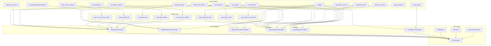

# KPI Reference

**Version**: 3.2.0 | **Last Updated**: 2026-09-07 | **Calculable KPIs**: 45 | **Decommissioned**: 2 (WS1-MP-008, WS1-DQ-008) | **Gaps**: 0

---

**Navigation**: [Architecture](../ARCHITECTURE.md) | [Onboarding](../ONBOARDING.md) | [Data Templates](templates/README.md)

**Jump to workstream**: [WS1 Data Quality](#ws1-data-coverage--quality-9-kpis) | [WS1 Model Performance](#ws1-model-performance-9-kpis) | [WS2 Triggers](#ws2-trigger-performance-9-kpis) | [WS3 Business](#ws3-business-impact-10-kpis) | [Brand-Specific](#brand-specific-5-kpis) | [Causal Metrics](#causal-metrics-5-kpis)

**Reference sections**: [Time Windows & Dimension Axes](#time-windows--dimension-axes-july-2026-engine) | [Threshold Interpretation](#threshold-interpretation-guide) | [Helper Views](#helper-views) | [KPI Data Flow](#kpi-data-flow)

> **Reporting windows (migration 089)**: KPIs described as covering a "30-day" / "trailing" window are anchored at the **data frontier** — the window ends at `MAX(<domain timestamp>)` of the query's own domain (e.g. latest prescription for TRx/NRx/NBRx), **not** wall-clock `NOW()`. The synthetic gold-standard substrate is calendar-fixed by design (journeys 2022-01-01..2024-12-31), so `NOW()`-anchored windows silently decayed to empty sets as time passed the seed date. Each answer carries a `data_through` as-of date. Exception: MAU/WAU stay `NOW()`-anchored — `user_sessions` is real accruing app usage.

---

## Summary Table

All 45 calculable KPIs at a glance, plus WS1-MP-008 (row 17) and WS1-DQ-008 (row 8) retained as **decommissioned** (#1068, T8 — see their sections below). See the detailed sections for full definitions, source tables, and calculation logic.

| # | ID | Name | Workstream | Formula | Target | Warning | Critical | Freq |
|---|-----|------|-----------|---------|--------|---------|----------|------|
| 1 | WS1-DQ-001 | Source Coverage - Patients | WS1 DQ | `covered_patients / reference_patients` | 0.85 | 0.70 | 0.50 | Daily |
| 2 | WS1-DQ-002 | Source Coverage - HCPs | WS1 DQ | `covered_hcps / reference_hcps` | 0.80 | 0.65 | 0.45 | Daily |
| 3 | WS1-DQ-003 | Cross-source Match Rate | WS1 DQ | `records_matched / total_records` | 0.75 | 0.60 | 0.40 | Daily |
| 4 | WS1-DQ-004 | Stacking Lift | WS1 DQ | `(stacked - baseline) / baseline` | 0.15 | 0.10 | 0.05 | Daily |
| 5 | WS1-DQ-005 | Completeness Pass Rate | WS1 DQ | `1 - (null_critical / total)` | 0.95 | 0.90 | 0.80 | Daily |
| 6 | WS1-DQ-006 | Geographic Consistency Gap | WS1 DQ | `max \|share_source - share_universe\|` | 0.05 | 0.10 | 0.20 | Weekly |
| 7 | WS1-DQ-007 | Data Lag (Median) | WS1 DQ | `median(ingestion - source)` | 3 days | 7 days | 14 days | Daily |
| 8 | WS1-DQ-008 | Label Quality (IAA) — ⚠️ DECOMMISSIONED (T8) | WS1 DQ | `avg(agreement_score)` | 0.85 | 0.70 | 0.60 | Weekly |
| 9 | WS1-DQ-009 | Time-to-Release (TTR) | WS1 DQ | `run_completed - source_timestamp` | 24 hrs | 48 hrs | 72 hrs | Daily |
| 10 | WS1-MP-001 | ROC-AUC | WS1 MP | `integral TPR d(FPR)` | 0.80 | 0.70 | 0.60 | Daily |
| 11 | WS1-MP-002 | PR-AUC | WS1 MP | `integral Precision d(Recall)` | 0.70 | 0.55 | 0.40 | Daily |
| 12 | WS1-MP-003 | F1 Score | WS1 MP | `2 * P * R / (P + R)` | 0.65 | 0.60 | 0.45 | Daily |
| 13 | WS1-MP-004 | Recall@Top-K | WS1 MP | `TP_at_K / total_positives` | 0.60 | 0.45 | 0.30 | Daily |
| 14 | WS1-MP-005 | Brier Score | WS1 MP | `mean((p - y)^2)` | 0.185 | 0.25 | 0.35 | Daily |
| 15 | WS1-MP-006 | Calibration Slope Deviation | WS1 MP | `1 + mean(\|slope_i - 1\|)` | 1.0 ± 0.10 | ± 0.15 | beyond | Weekly |
| 16 | WS1-MP-007 | SHAP Coverage | WS1 MP | `has_shap / total_predictions` | 0.95 | 0.80 | 0.60 | Daily |
| 17 | WS1-MP-008 | Fairness Gap (dRecall) — ⚠️ DECOMMISSIONED (#1068) | WS1 MP | `max_group(R) - min_group(R)` | 0.05 | 0.10 | 0.20 | Weekly |
| 18 | WS1-MP-009 | Feature Drift (PSI) | WS1 MP | `sum (q-p) * ln(q/p)` | 0.10 | 0.20 | 0.25 | Daily |
| 19 | WS2-TR-001 | Trigger Precision | WS2 TR | `accepted_and_converted / accepted_and_tracked` (v2, mig 113) | 0.70 | 0.55 | 0.40 | Daily |
| 20 | WS2-TR-002 | Trigger Recall | WS2 TR | `new_starts_with_prior_trigger / new_starts` (v2, mig 113) | 0.60 | 0.45 | 0.30 | Daily |
| 21 | WS2-TR-003 | Action Rate Uplift | WS2 TR | `(rate_trt - rate_ctrl) / rate_ctrl` | 0.15 | 0.10 | 0.05 | Weekly |
| 22 | WS2-TR-004 | Acceptance Rate | WS2 TR | `accepted / delivered` | 0.60 | 0.45 | 0.30 | Daily |
| 23 | WS2-TR-005 | False Alert Rate | WS2 TR | `false_positives / total` | 0.10 | 0.20 | 0.30 | Daily |
| 24 | WS2-TR-006 | Override Rate | WS2 TR | `overridden / delivered` | 0.15 | 0.25 | 0.40 | Daily |
| 25 | WS2-TR-007 | Lead Time | WS2 TR | `median(outcome - trigger)` | 14 days | 21 days | 30 days | Weekly |
| 26 | WS2-TR-008 | Change-Fail Rate (CFR) | WS2 TR | `change_failed / changed` | 0.10 | 0.20 | 0.30 | Weekly |
| 27 | WS2-TR-009 | Trigger Funnel Conversion | WS2 TR | `actioned / delivered` | -- | -- | -- | Daily |
| 28 | WS3-BI-001 | Monthly Active Users (MAU) | WS3 BI | `count(distinct user_id) 30d` | 2000 | 1500 | 1000 | Daily |
| 29 | WS3-BI-002 | Weekly Active Users (WAU) | WS3 BI | `count(distinct user_id) 7d` | 1200 | 900 | 600 | Daily |
| 30 | WS3-BI-003 | Patient Touch Rate | WS3 BI | `touched / eligible` | 0.40 | 0.30 | 0.20 | Weekly |
| 31 | WS3-BI-004 | HCP Coverage | WS3 BI | `covered / priority_hcps` | 0.75 | 0.60 | 0.45 | Weekly |
| 32 | WS3-BI-005 | Total Prescriptions (TRx) | WS3 BI | `count(rx)` | -- | -- | -- | Daily |
| 33 | WS3-BI-006 | New Prescriptions (NRx) | WS3 BI | `count(first_rx)` | -- | -- | -- | Daily |
| 34 | WS3-BI-007 | New-to-Brand Rx (NBRx) | WS3 BI | `count(first_brand_rx)` | -- | -- | -- | Daily |
| 35 | WS3-BI-008 | TRx Share | WS3 BI | `brand_trx / category_trx` | 0.30 | 0.20 | 0.10 | Weekly |
| 36 | WS3-BI-009 | Conversion Rate | WS3 BI | `rx_after_trigger / triggers` | 0.08 | 0.05 | 0.02 | Weekly |
| 37 | WS3-BI-010 | Return on Investment | WS3 BI | `value / cost` | 3.0x | 2.0x | 1.0x | Monthly |
| 38 | BR-001 | Remi - AH Uncontrolled % | Brand | `uncontrolled / ah_patients` | 0.40 | 0.50 | 0.60 | Weekly |
| 39 | BR-002 | Remi - Intent-to-Prescribe d | Brand | `post_intent - pre_intent` | 0.5 | 0.3 | 0.0 | Monthly |
| 40 | BR-003 | Fabhalta - % PNH Tested | Brand | `pnh_tested / eligible` | 0.60 | 0.45 | 0.30 | Weekly |
| 41 | BR-004 | Kisqali - Dx Adoption | Brand | `median(first_rx - dx)` | 30 days | 45 days | 60 days | Weekly |
| 42 | BR-005 | Kisqali - Oncologist Reach | Brand | `engaged / total_onc` | 0.70 | 0.55 | 0.40 | Weekly |
| 43 | CM-001 | Average Treatment Effect (ATE) | Causal | `E[Y(1) - Y(0)]` | -- | -- | -- | Weekly |
| 44 | CM-002 | Conditional ATE (CATE) | Causal | `E[Y(1) - Y(0) \| X=x]` | -- | -- | -- | Weekly |
| 45 | CM-003 | Causal Impact | Causal | `causal_effect_size` | -- | -- | -- | On demand |
| 46 | CM-004 | Counterfactual Outcome | Causal | `E[Y(a') \| do(A=a), X]` | -- | -- | -- | On demand |
| 47 | CM-005 | Mediation Effect | Causal | `indirect / total` | -- | -- | -- | On demand |

"--" indicates volume or effect-size metrics without fixed thresholds.

---

## Time Windows & Dimension Axes (July 2026 engine)

The chatbot KPI engine (PRs #1271/#1273, migrations 105/108/110/111) lets a
small set of KPIs be sliced by **dimension axes** and bounded by
**user-requested time windows**. This section documents the request grammar,
the variant registry that serves it, and the honesty guarantees. Code is the
source of truth: `src/services/time_window.py`, `src/kpi/calculator.py`,
`src/kpi/calculators/business_impact.py`, `src/kpi/synthetic_mode.py`,
`src/api/routes/chatbot_tools.py`.

### Which KPIs participate

Windowability comes from `windowable:` in `config/kpi_definitions.yaml`.
Exactly five KPIs are `windowable: clean`: **WS3-BI-005 (TRx), WS3-BI-006
(NRx), WS3-BI-007 (NBRx), WS3-BI-008 (TRx Share), WS3-BI-009 (Conversion
Rate)**. Nearly all others are `not_applicable` (point-in-time or
model-scored metrics).

### Window grammar (`parse_window`, `src/services/time_window.py`)

Accepted forms (case-insensitive; all half-open `[start, end)` UTC):

| Form | Examples | Anchoring |
|---|---|---|
| Rolling — `last/past/trailing/previous [N] unit` | `last 6 months`, `past 2 weeks`, **`last year`** (count optional since PR #1273 — bare unit = 1) | relative to now |
| Quarter | `Q1 2025` | absolute |
| Month range | `Jan-Mar 2025`, `Jan to Mar 2025` | absolute |
| Single month | `March 2025` | absolute |
| Bare year | `2025` | absolute |
| ISO range | `2025-01-01 to 2025-06-30` | absolute |

| Calendar-aligned — `this/current week\|month\|quarter\|year`, `last/previous quarter` | `this month`, `current quarter`, `last quarter` | absolute, whole calendar period |

**Calendar-aligned phrases are accepted** (#1546). `this month` is the **full
calendar month containing now** — the whole period, deliberately *not* clamped
to `.. now` — which keeps the window valid even at the period's first instant;
future dates inside it simply hold no data. `last quarter` is the most recent
*completed* calendar quarter. **`last month` and `last year` keep their rolling
meaning**: the rolling branch matches them first, so only `quarter`, which has
no rolling unit, carries a `last`/`previous` calendar form.

**Still not supported**: `ytd`, `qtd`. Every other bare unit requires the
`last/past/trailing/previous` prefix or a `this/current` prefix. An unparseable
window raises `WindowParseError` and comes back as a user-input error with a
hint — **never a silent default**. No window at all means the KPI's standard
frontier-anchored window (see the migration-089 callout above).

Every response stamps `window_status`:

| `window_status` | Meaning |
|---|---|
| `default` | No window requested; the engine's frontier-anchored default was used (a `reporting_window` prose note is attached) |
| `applied` | The requested window was honored; `window_requested` + `window_applied` carry the bounds |
| `not_applicable` | KPI has no time dimension; the request is recorded but the value is unchanged |

### Dimension axes

| Axis | Request field | Backed by | Values |
|---|---|---|---|
| Severity tier | `segment` | `patient_journeys.segment_assignment` | `low` / `medium` / `high` severity |
| Line of therapy | `therapy_line` | `patient_journeys.prior_therapy_lines` | 0–3 |
| Biologic status | `biologic` | `patient_journeys.biologic_experienced` | `experienced` / `naive` — **Remibrutinib (CSU) only** |
| IgE tertile | `ige_tier` | `patient_journeys.ige_level`, cut at the empirical p33/p66 (105.21 / 208.50 IU/mL) | `low` / `medium` / `high` — **Remibrutinib (CSU) only** |
| Region | `region` | territory mapping | predates the axis work; **loses to any patient axis** |

Joins are on `patient_id` (not `patient_journey_id`). Patient axes take
precedence over `region`, and axes do **not** combine with each other. That
non-combination is a *registration* fact, not an arity ceiling: **the
`kpi_query` positional cap is 6, raised from 4 by migration 120** (#1388), and
`_windowed_region` variants exist precisely because the 5th and 6th slots
opened up. A combination is refused because no variant is registered for it,
not because the RPC cannot bind the params. The biologic / IgE axes are
**brand-gated fail-closed**: requesting them for a brand whose rows are NULL
by design (anything but Remibrutinib) errors before any query rather than
fabricating a split.

### The variant registry (`kpi_query_registry`)

Axis and window support is served by pre-registered SQL variants keyed by
`query_id` suffix — the certified base queries are byte-for-byte unchanged:

| Suffix | Meaning | Params |
|---|---|---|
| *(base)* | brand-scoped headline | `[brand]` |
| `_segment` / `_line` / `_biologic` / `_ige_tier` | one patient axis | `[brand, axis_value]` |
| `_windowed` | user window | `[brand, start, end]` |
| `_{axis}_windowed` | axis + window | `[brand, axis_value, start, end]` |
| `_monthly_by_{segment,line}` | monthly time-series, all buckets in one call (feeds trend charts) | `[brand]` |
| `_region`, `_brand` | pre-axis-era variants | per query |
| `_include_synthetic` | twin of any of the above without the `is_synthetic = false` wrapper (showcase mode) | same |

Registry migrations: **095** (deterministic re-registration + `_include_synthetic`
twins for the four view-backed WS1 DQ KPIs — see the DQ-003/004/007/009 notes),
**099** (WS3-BI-004 HCP Coverage tier-scoped + twin), **105** (severity/line
variants for TRx/NRx/NBRx/TRx Share), **108** (biologic/IgE variants,
Remibrutinib-only), **110** (monthly series by segment/line), **111**
(Conversion Rate brand/axis/window + TRx Share windowed), **113** (WS2 truth
metrics redefined in place + brand variants), **116** (claims-lag triangles),
**118** (trigger_effectiveness family), **120** (the 6-param cap + the 5-param
regioned+windowed trigger-effectiveness variants), **124** (WS3-BI-010
per-slice trailing-12-month statistics), **125** (WS3-BI-010 brand/region
scoped headline), **127** (`brand_specific_*_region` x6 + BR-002 twins),
**128** (`business_impact_conversion_rate_brand_region`), **129**
(`cohort_profiler_hcp_trx_cohort_region`), **130**
(`cohort_profiler_hcp_volume_tiers`).

`grep -ln kpi_query_registry database/migrations/*.sql` is the current list —
prefer re-running it to trusting this sentence.

### Fail-loud on unregistered combinations (PR #1271)

A dimension combination with no registered variant **errors loudly** instead
of silently dropping dimensions (the pre-#1271 bug: conversion rate routed
region-only and silently discarded brand/segment/line, producing one flat
number for every question). Examples of refused combinations: conversion ×
biologic/IgE (conversion is computed over triggers, which carry no
biologic/IgE dimension); conversion × window × region; TRx Share × window ×
region/biologic/IgE. The error text names the missing variant and the
supported alternatives. (Conversion × brand × region is **no longer** in this
list — migration 128 registered it; see WS3-BI-009.)

### A patient axis on a KPI that does not bind it is REFUSED, not dropped (#1911/#1913)

Region carries a provenance marker (`region_status`, below), so a region that
could not be applied is at least *disclosed*. **The four patient axes carry no
such marker** — `src/kpi/calculator.py` stamps region only. So on a KPI whose
calculator does not bind the axis, the filter was silently dropped while the
answer still read as segment-scoped: the migration-111 conversion-rate incident
shape, one tier up. `kpi_calculate_tool` now refuses instead.

Only these KPIs **bind** each axis — the allowlist is
`_PATIENT_AXIS_KPI_IDS` in `src/api/routes/chatbot_tools.py`, and
`tests/unit/test_api/test_chatbot_kpi_axis_gate_1911.py` re-derives every set
by running the real calculators against a recording client, so it cannot drift
from the code:

| Axis | KPIs that bind it |
|---|---|
| `segment` | WS3-BI-005, -006, -007, -008, **WS3-BI-009**, **CM-002** |
| `therapy_line` | WS3-BI-005, -006, -007, -008, **WS3-BI-009** |
| `biologic` | WS3-BI-005, -006, -007, -008 |
| `ige_tier` | WS3-BI-005, -006, -007, -008 |

Notes on the edges, because they are deliberate:

- **WS3-BI-009** binds `segment` and `therapy_line` (migration 111) but refuses
  `biologic`/`ige_tier` *itself* — triggers carry no biologic/IgE dimension. It
  is left out of those two sets on purpose so the allowlist keeps one meaning
  ("binds the axis") and the refusal names only KPIs that do; the calculator's
  own guard remains as defence in depth for `/api/kpis`.
- **CM-002** binds `segment` as `ml_predictions.segment_assignment = $1`
  (migration 044), over the same label space this tool's `segment` field uses
  (`low`/`medium`/`high_severity`). "CATE" and "conditional ATE" resolve to
  CM-002, so refusing it would drop a combination the calculator serves. It
  reads none of the other three axes.

The refusal (#1565: a next step, not a dead end) names the served KPIs in
registry order and offers both ways out — ask for this KPI without the filter,
or ask for one of the served KPIs by that filter.

### Region provenance (#1538)

The window idiom applied to geography. Only a fixed set of calculators route to
region-scoped variants (migrations 077/078/113/118/125/127/128); **every other
calculator keeps its global/portfolio value even when the context carries a
region**. Three fields on the response disclose which happened:

| Field | Meaning |
|---|---|
| `region_requested` | The region the caller asked for (or `null`) |
| `region_applied` | The region a region-scoped variant actually computed for |
| `region_status` | `default` \| `applied` \| `not_applicable` |

| `region_status` | Meaning |
|---|---|
| `default` | No region requested |
| `applied` | A region-scoped variant computed this value |
| `not_applicable` | A region was requested but **not** applied — no variant exists, or a combination (e.g. a patient axis) dropped it |

> **A `not_applicable` value is global and must NOT be captioned with the
> region.** That is the whole point of the marker: the number is portfolio-wide
> and labelling it "west" would be a fabrication.

Defined on `KPIResult` in `src/kpi/models.py`; round-tripped through
`src/kpi/cache.py`, which deliberately treats a pre-#1538 cache entry as
`region_status="default"`.

### Measure basis (#1640/#1647)

`src/kpi/measure_basis.py` is the SSOT for **what a KPI figure measures and
what it may be compared with**. The rule:

> Two figures are comparable only if their substrate declarations are **equal**,
> and an **undeclared substrate is never comparable with anything**.

`measure_basis` is a field on four response models in
`src/api/schemas/kpi.py`. **Figures with different bases must not share an
axis** — a chart that plots them together is asserting a comparison the data
does not support.

The motivating measurement: `business_metrics.value` and a
`treatment_events` prescription count are not the same quantity. Measured
against the live DB on 2026-08-15, the national `business_metrics` TRx total
for 2026-08 was 825,242 against 11,298 trailing-30-day `treatment_events`
prescription events for the same brand — a stable **~73x** ratio month over
month.

The module is deliberately cheap to import (it lives under `src.kpi`, not
`src.services`, because `src/services/__init__.py` eagerly pulls in
`alert_routing` and hence `aiohttp`) so every surface that emits a figure — the
chat tools, the orchestrator's `kpi_lookup` payload, the Home KPI summary tiles
— can carry it without importing the chat stack.

### `semantic_note` (fabrication guard)

WS3-BI-008 responses always carry this note, verbatim from
`KPI_SEMANTIC_NOTES` in `src/services/kpi_resolution.py` (moved out of `src/api/routes/chatbot_tools.py` by #1475 so surfaces can import it without paying the chat stack's import cost):

> TRx Share is the brand's share of the tracked portfolio's prescriptions
> (Fabhalta + Kisqali + Remibrutinib, cross-indication) — NOT market share
> against external competitors. Competitor brands (e.g. Xolair, Dupixent)
> are not in the data model; never attribute the share complement to them.

It exists because the chatbot once presented TRx Share as "share of the CSU
market" and attributed the complement to competitors that aren't in the data.

### Surfaces

- **Chatbot tool `kpi_calculate_tool`** (`src/api/routes/chatbot_tools.py`)
  — the full engine: accepts `window` plus all axes and returns the
  provenance fields (`window_status`, `window_requested`/`window_applied`,
  `data_through`, `reporting_window`, `semantic_note`, and a
  `window_coverage` warning for volume KPIs over long windows).
- **REST `GET /api/kpis/{kpi_id}`** (`src/api/routes/kpi.py`) — accepts the
  axis params (`brand`, `region`, `segment`, `therapy_line`, `biologic`,
  `ige_tier`) but **no `window` param**, and its response omits the
  window/semantic provenance fields. To exercise or verify the windowed
  path, go through the chatbot tool, not REST.

---

## WS1: Data Coverage & Quality (9 KPIs)

These KPIs measure the completeness, consistency, and timeliness of the data flowing into the ML pipeline. They are the foundation for all downstream model training and business analysis.

> **Note:** 8 of these 9 are currently calculable. **WS1-DQ-008 (Label Quality / IAA) is decommissioned** (T8) — removed by **product decision**, not a data limit. Unlike WS1-MP-008, it is a *working* metric (the corpus-level generalized Fleiss κ computes a real ≈0.76), but it was deprioritized out of the live KPI set. The DB objects `v_kpi_label_quality` + `ml_annotations` are retained. It is kept below as a designed KPI.

### WS1-DQ-001: Source Coverage - Patients

| Field | Value |
|-------|-------|
| **ID** | `WS1-DQ-001` |
| **Name** | Source Coverage - Patients |
| **Definition** | Percentage of eligible patients present in source versus the reference universe |
| **Formula** | `covered_patients / reference_patients` |
| **Calculation Type** | Derived |
| **Direction** | Higher is better |
| **Unit** | Ratio (0.0 - 1.0) |
| **Frequency** | Daily |
| **Source Tables** | `patient_journeys`, `reference_universe` |
| **Source Columns** | `patient_journeys.patient_id`, `reference_universe.total_count` |
| **Helper View** | None |
| **Target** | >= 0.85 |
| **Warning** | < 0.85 and >= 0.70 |
| **Critical** | < 0.50 |

**Calculator**: `DataQualityCalculator._calc_source_coverage_patients`

```sql
SELECT
    COUNT(DISTINCT pj.patient_id) AS covered,
    COUNT(DISTINCT ru.patient_id) AS total
FROM patient_journeys pj
FULL OUTER JOIN reference_universe ru ON pj.patient_id = ru.patient_id
WHERE ($1::text IS NULL OR pj.brand = $1 OR ru.brand = $1)
```

---

### WS1-DQ-002: Source Coverage - HCPs

| Field | Value |
|-------|-------|
| **ID** | `WS1-DQ-002` |
| **Name** | Source Coverage - HCPs |
| **Definition** | Percentage of priority HCPs present in source versus the universe |
| **Formula** | `covered_hcps / reference_hcps` |
| **Calculation Type** | Derived |
| **Direction** | Higher is better |
| **Unit** | Ratio (0.0 - 1.0) |
| **Frequency** | Daily |
| **Source Tables** | `hcp_profiles`, `reference_universe` |
| **Source Columns** | `hcp_profiles.coverage_status`, `reference_universe.total_count` |
| **Helper View** | None |
| **Target** | >= 0.80 |
| **Warning** | < 0.80 and >= 0.65 |
| **Critical** | < 0.45 |

**Calculator**: `DataQualityCalculator._calc_source_coverage_hcps`

---

### WS1-DQ-003: Cross-source Match Rate

| Field | Value |
|-------|-------|
| **ID** | `WS1-DQ-003` |
| **Name** | Cross-source Match Rate |
| **Definition** | Percentage of entities linkable across data sources |
| **Formula** | `records_matched / total_records` |
| **Calculation Type** | Direct |
| **Direction** | Higher is better |
| **Unit** | Ratio (0.0 - 1.0) |
| **Frequency** | Daily |
| **Source Tables** | `data_source_tracking` |
| **Source Columns** | `data_source_tracking.match_rate_vs_iqvia`, `match_rate_vs_healthverity`, `match_rate_vs_komodo`, `match_rate_vs_veeva` — the four columns the table actually declares. (`match_rate_vs_claims` / `_ehr` / `_specialty`, cited here before 2026-09-07, exist in no DDL.) |
| **Helper View** | `v_kpi_cross_source_match` (retained, but the live registry query reads the table directly since migration 095) |
| **Target** | >= 0.75 |
| **Warning** | < 0.75 and >= 0.60 |
| **Critical** | < 0.40 |

**Note**: V3 schema addition. Uses the `data_source_tracking` table introduced in schema V3. Migration 095 re-registered the query as a deterministic records-weighted trailing-30-day aggregate anchored at the data frontier (the original `SELECT match_rate FROM v_kpi_cross_source_match LIMIT 1` returned one arbitrary (date, source) row), and added an `_include_synthetic` twin (byte-identical minus the synthetic-excluding wrap).

**Calculator**: `DataQualityCalculator._calc_cross_source_match`

```sql
-- registry query since migration 095 (base; twin drops the is_synthetic wrap)
SELECT (SUM(records_matched)::numeric / NULLIF(SUM(records_received), 0))::float AS match_rate
FROM (SELECT * FROM data_source_tracking WHERE is_synthetic = false) dst
WHERE tracking_date >= (SELECT MAX(tracking_date)
                        FROM (SELECT * FROM data_source_tracking WHERE is_synthetic = false) dst2)
                       - INTERVAL '30 days'
```

---

### WS1-DQ-004: Stacking Lift

| Field | Value |
|-------|-------|
| **ID** | `WS1-DQ-004` |
| **Name** | Stacking Lift |
| **Definition** | Incremental value from combining multiple data sources |
| **Formula** | `(stacked_value - baseline) / baseline` |
| **Calculation Type** | Direct |
| **Direction** | Higher is better |
| **Unit** | Ratio |
| **Frequency** | Daily |
| **Source Tables** | `data_source_tracking` |
| **Source Columns** | `data_source_tracking.stacking_lift_percentage`, `data_source_tracking.stacking_eligible_records`, `data_source_tracking.stacking_applied_records` |
| **Helper View** | `v_kpi_stacking_lift` (retained, but the live registry query reads the table directly since migration 095) |
| **Target** | >= 0.15 |
| **Warning** | < 0.15 and >= 0.10 |
| **Critical** | < 0.05 |

**Note**: V3 schema addition. Measures how much additional value is gained by combining claims, EHR, and specialty data sources.

**Calculator**: `DataQualityCalculator._calc_stacking_lift`

```sql
-- registry query since migration 095 (base; twin drops the is_synthetic wrap):
-- trailing-30d mean stacking_lift_percentage anchored at the data frontier
SELECT AVG(stacking_lift_percentage)::float AS lift_score
FROM (SELECT * FROM data_source_tracking WHERE is_synthetic = false) dst
WHERE tracking_date >= (SELECT MAX(tracking_date)
                        FROM (SELECT * FROM data_source_tracking WHERE is_synthetic = false) dst2)
                       - INTERVAL '30 days'
```

---

### WS1-DQ-005: Completeness Pass Rate

| Field | Value |
|-------|-------|
| **ID** | `WS1-DQ-005` |
| **Name** | Completeness Pass Rate |
| **Definition** | 1 minus the null rate across brand-critical fields |
| **Formula** | `1 - (null_critical / total_records)` |
| **Calculation Type** | Derived |
| **Direction** | Higher is better |
| **Unit** | Ratio (0.0 - 1.0) |
| **Frequency** | Daily |
| **Source Tables** | `patient_journeys` |
| **Source Columns** | `patient_journeys.data_quality_score` |
| **Helper View** | None |
| **Target** | >= 0.95 |
| **Warning** | < 0.95 and >= 0.90 |
| **Critical** | < 0.80 |

**Calculator**: `DataQualityCalculator._calc_completeness_pass_rate`

Critical fields checked: `patient_id`, `brand`, `event_date`. Records from the most recent 30 days of data are evaluated (frontier-anchored on `patient_journeys.created_at`, migration 089).

---

### WS1-DQ-006: Geographic Consistency Gap

| Field | Value |
|-------|-------|
| **ID** | `WS1-DQ-006` |
| **Name** | Geographic Consistency Gap (lower is better — a GAP, not a score) |
| **Definition** | Maximum absolute gap between source share and universe share across regions |
| **Formula** | `max_region(\|share_source - share_universe\|)` |
| **Calculation Type** | Derived |
| **Direction** | Lower is better |
| **Unit** | Ratio |
| **Frequency** | Weekly |
| **Source Tables** | `patient_journeys`, `reference_universe` |
| **Source Columns** | `patient_journeys.geographic_region`, `patient_journeys.state` |
| **Helper View** | None |
| **Target** | <= 0.05 |
| **Warning** | > 0.05 and <= 0.10 |
| **Critical** | > 0.20 |

**Calculator**: `DataQualityCalculator._calc_geographic_consistency`

---

### WS1-DQ-007: Data Lag (Median)

| Field | Value |
|-------|-------|
| **ID** | `WS1-DQ-007` |
| **Name** | Data Lag (Median) |
| **Definition** | Median days from service date to availability in the warehouse |
| **Formula** | `median(ingestion_timestamp - source_timestamp)` |
| **Calculation Type** | Direct |
| **Direction** | Lower is better |
| **Unit** | Days |
| **Frequency** | Daily |
| **Source Tables** | `patient_journeys` |
| **Source Columns** | `patient_journeys.source_timestamp`, `patient_journeys.ingestion_timestamp`, `patient_journeys.data_lag_hours` |
| **Helper View** | `v_kpi_data_lag` (retained, but the live registry query reads the table directly since migration 095) |
| **Target** | <= 3 days |
| **Warning** | > 3 days and <= 7 days |
| **Critical** | > 14 days |

**Note**: V3 schema addition. Uses new timestamp fields in `patient_journeys`.

**Calculator**: `DataQualityCalculator._calc_data_lag`

```sql
-- registry query since migration 095 (base; twin drops the is_synthetic wrap):
-- a TRUE median over rows (the old view read returned one arbitrary group's median)
SELECT (percentile_cont(0.5) WITHIN GROUP (ORDER BY data_lag_hours) / 24.0)::float
       AS median_lag_days
FROM (SELECT * FROM patient_journeys WHERE is_synthetic = false) pj
WHERE data_lag_hours IS NOT NULL
  AND created_at >= (SELECT MAX(created_at)
                     FROM (SELECT * FROM patient_journeys WHERE is_synthetic = false) pj2
                     WHERE pj2.data_lag_hours IS NOT NULL)
                    - INTERVAL '30 days'
```

---

### WS1-DQ-008: Label Quality (IAA)

> ⚠️ **DECOMMISSIONED (T8):** Removed from the live KPI registry, the data-quality
> calculator, the coverage tooling, and the dashboard legend by **product decision**.
> Unlike WS1-MP-008, this is a *working* metric — the corpus-level generalized Fleiss κ
> computes a real ≈0.76 from `ml_annotations` — but it was deprioritized out of the live
> KPI set. The DB objects (`v_kpi_label_quality`, `ml_annotations`) are intentionally
> retained, so it remains documented here as a *designed* KPI.

| Field | Value |
|-------|-------|
| **ID** | `WS1-DQ-008` |
| **Name** | Label Quality (IAA) |
| **Definition** | Inter-annotator agreement score for labeled data |
| **Formula** | `avg(agreement_score) for iaa_groups` |
| **Calculation Type** | Direct |
| **Direction** | Higher is better |
| **Unit** | Score (0.0 - 1.0) |
| **Frequency** | Weekly |
| **Source Tables** | `ml_annotations` |
| **Source Columns** | `ml_annotations.iaa_group_id`, `ml_annotations.annotation_value`, `ml_annotations.annotation_confidence` |
| **Helper View** | `v_kpi_label_quality` |
| **Target** | >= 0.85 |
| **Warning** | < 0.85 and >= 0.70 |
| **Critical** | < 0.60 |

**Note**: V3 schema addition. Uses the `ml_annotations` table with IAA group tracking.

**Calculator**: _removed in T8_ — was `DataQualityCalculator._calc_label_quality` (the
corpus-level generalized Fleiss κ). The retained `v_kpi_label_quality` view is no longer
read by the live KPI engine.

```sql
-- (Designed query — the view is retained but no longer wired to a live KPI)
SELECT iaa_score FROM v_kpi_label_quality LIMIT 1
```

---

### WS1-DQ-009: Time-to-Release (TTR)

| Field | Value |
|-------|-------|
| **ID** | `WS1-DQ-009` |
| **Name** | Time-to-Release (TTR) |
| **Definition** | Hours from source data timestamp to pipeline completion |
| **Formula** | `run_completed_at - source_data_timestamp` |
| **Calculation Type** | Direct |
| **Direction** | Lower is better |
| **Unit** | Hours |
| **Frequency** | Daily |
| **Source Tables** | `etl_pipeline_metrics` |
| **Source Columns** | `etl_pipeline_metrics.source_data_timestamp`, `etl_pipeline_metrics.run_completed_at`, `etl_pipeline_metrics.time_to_release_hours` |
| **Helper View** | `v_kpi_time_to_release` (retained, but the live registry query reads the table directly since migration 095) |
| **Target** | <= 24 hours |
| **Warning** | > 24 hours and <= 48 hours |
| **Critical** | > 72 hours (declared SLA ceiling — see status-banding note) |

**Note**: V3 schema addition. Uses the `etl_pipeline_metrics` table.

**Status banding (lower-is-better)**: the direction-aware evaluator (`KPIThreshold.evaluate`) reports **GOOD** for `<= 24h`, **WARNING** for `> 24h and <= 48h`, and **CRITICAL** for `> 48h`. The configured `critical: 72h` is the declared SLA ceiling but is **not** a distinct evaluator band — for lower-is-better KPIs the evaluator uses only the `target` and `warning` thresholds, so any value above the warning bound (48h) is CRITICAL. The same convention applies to the other lower-is-better data-quality KPIs (DQ-006, DQ-007). (#580)

**Calculator**: `DataQualityCalculator._calc_time_to_release`

```sql
-- registry query since migration 095 (base; twin drops the is_synthetic wrap):
-- trailing-30d mean TTR over status='success' runs, anchored on the latest
-- successful run (a trailing failure streak narrows the window, never empties it)
SELECT AVG(time_to_release_hours)::float AS avg_ttr_hours
FROM (SELECT * FROM etl_pipeline_metrics WHERE is_synthetic = false) epm
WHERE status = 'success'
  AND run_start >= (SELECT MAX(run_start)
                    FROM (SELECT * FROM etl_pipeline_metrics WHERE is_synthetic = false) epm2
                    WHERE epm2.status = 'success')
                   - INTERVAL '30 days'
```

**Data note (migration 095)**: the synthetic generator originally wrote the unsanctioned `status = 'completed'`; 095 backfilled those rows to `'success'` (scoped to `is_synthetic = true`) and the generator now writes `'success'` directly.

---

## WS1: Model Performance (9 KPIs)

These KPIs monitor the predictive quality, calibration, explainability, and fairness of the ML models powering the engagement triggers. Metrics are sourced from MLflow experiment tracking and the `ml_predictions` table.

> **Note:** 8 of these 9 are currently calculable. **WS1-MP-008 (Fairness Gap) is decommissioned** (#1068) — it needs protected-group `fairness_metrics` the synthetic substrate does not populate. It is retained below as a designed KPI.

### Sampling-aware trend classification (#1916, 2026-09-07)

The `/model-performance` page's "Performance trend" label is **not** a plain
threshold on the metric. It used to be: newest walk-forward fold vs the mean of
the older folds, ±5% relative, with no notion of sample size. A walk-forward
fold is **one calendar month of rows** (~80–230 patients, ~130 HCPs), so its
AUC carries a Hanley–McNeil standard error of 0.04–0.07 — *larger* than the 5%
threshold (~0.04). Simulated under a perfectly stationary model, the old rule
reported something other than "stable" **38% of the time at n=130 and 56% at
n=54**, and on 2026-09-07 it flagged four gold-standard models "degrading" on
single folds that sat 0.8–2.2 standard errors below baseline with no slope.

`src/services/performance_trend_stats.py` replaces it. A row is labelled
`degrading` / `improving` only when the change is **both**:

1. **statistically distinguishable from noise** — level `z` beyond 2.5 **OR**
   the OLS slope `t` beyond its threshold (the slope catches a steady
   0.01/month slide a level test cannot see); and
2. **material** — the historical ±5% floor, kept as a materiality gate.

**Analytic standard errors are computed only where a closed form exists**:
binomial on n for `accuracy`, binomial on the positive count for `recall`,
Hanley–McNeil for `auc_roc`. **`precision` and `f1` get none** — precision's
denominator (predicted positives) is not persisted and F1 has no binomial
variance, and an invented interval would understate their noise, re-creating
the false alarms this module exists to remove.

**Two noise scales; the classifier uses the larger available one:**

| Basis | Definition | Availability |
|---|---|---|
| `analytic` | `sqrt(SE_current² + SE_baseline_mean²)` | Only when the newest fold **and every baseline fold** have an analytic SE — a baseline fold of unknown precision is never treated as exact |
| `empirical` | Fold-to-fold sd of the baseline, ×`sqrt(1 + 1/k)` for a new observation, inflated by `t_{k-1}/z` because that sd is itself estimated from k folds (a Student-t test, not a z-test) | k >= 6 baseline folds |
| `legacy_relative` | The old ±5% rule, with the reason attached | Fallback when neither scale is available |

Every row carries its **basis code**, so a reader can see which rule produced
the label.

**The open month is skipped.** A calendar month that has not closed is a
partial fold; `src/mlops/gold_standard_eval/walk_forward.py` skips the month
containing `as_of` and anything later, in both the runner and the reader.

> **`alert_threshold` is an alert FLOOR, not a boundary.** Crossing it makes a
> row eligible for an alert; it does not by itself define "degrading". The
> classification above does.

At ±2.5 the page's 12 models × 5 metrics = 60 weekly series expect ~0.4 false
"degrading" labels per run from the level test alone, bounded by ~0.7 with the
slope test OR'd in, before the ±5% materiality floor removes the shallow ones.

### WS1-MP-001: ROC-AUC

| Field | Value |
|-------|-------|
| **ID** | `WS1-MP-001` |
| **Name** | ROC-AUC |
| **Definition** | Area Under the Receiver Operating Characteristic Curve |
| **Formula** | `integral TPR d(FPR)` |
| **Calculation Type** | Direct |
| **Direction** | Higher is better |
| **Unit** | Score (0.0 - 1.0) |
| **Frequency** | Daily |
| **Source Tables** | `ml_predictions` |
| **Source Columns** | `ml_predictions.model_auc` |
| **Helper View** | None |
| **Target** | >= 0.80 |
| **Warning** | < 0.80 and >= 0.70 |
| **Critical** | < 0.60 |

**Calculator**: `ModelPerformanceCalculator._calc_roc_auc` -- retrieves from MLflow for the latest production model version.

---

### WS1-MP-002: PR-AUC

| Field | Value |
|-------|-------|
| **ID** | `WS1-MP-002` |
| **Name** | PR-AUC |
| **Definition** | Area under the Precision-Recall Curve |
| **Formula** | `integral Precision d(Recall)` |
| **Calculation Type** | Direct |
| **Direction** | Higher is better |
| **Unit** | Score (0.0 - 1.0) |
| **Frequency** | Daily |
| **Source Tables** | `ml_predictions` |
| **Source Columns** | `ml_predictions.model_pr_auc` |
| **Helper View** | None |
| **Target** | >= 0.70 |
| **Warning** | < 0.70 and >= 0.55 |
| **Critical** | < 0.40 |

**Note**: V3 schema addition. Uses the `model_pr_auc` field added to `ml_predictions`.

**Calculator**: `ModelPerformanceCalculator._calc_pr_auc`

---

### WS1-MP-003: F1 Score

| Field | Value |
|-------|-------|
| **ID** | `WS1-MP-003` |
| **Name** | F1 Score |
| **Definition** | Harmonic mean of precision and recall |
| **Formula** | `2 * (precision * recall) / (precision + recall)` |
| **Calculation Type** | Derived |
| **Direction** | Higher is better |
| **Unit** | Score (0.0 - 1.0) |
| **Frequency** | Daily |
| **Source Tables** | `ml_predictions` |
| **Source Columns** | `ml_predictions.model_precision`, `ml_predictions.model_recall` |
| **Helper View** | None |
| **Target** | >= 0.65 |
| **Warning** | < 0.65 and >= 0.45 (the `warning` field is unused in higher-is-better mode) |
| **Critical** | < 0.45 |

**Note**: Target retuned 0.75 → 0.65 (2026-07-23, DGP-aware frontier): the max-over-cutoffs F1 ceiling at the gold-standard models' measured holdout AUC/prevalence is ~0.70–0.72 brand-mean, and the models capture 96–97% of it — the old target sat above what a perfect model could reach. 0.65 keeps ~0.03 absolute degradation headroom before WARNING.

**Calculator**: `ModelPerformanceCalculator._calc_f1_score`

---

### WS1-MP-004: Recall@Top-K

| Field | Value |
|-------|-------|
| **ID** | `WS1-MP-004` |
| **Name** | Recall@Top-K |
| **Definition** | Recall achieved when selecting top K predictions (default K=100) |
| **Formula** | `TP_at_K / total_positives` |
| **Calculation Type** | Direct |
| **Direction** | Higher is better |
| **Unit** | Score (0.0 - 1.0) |
| **Frequency** | Daily |
| **Source Tables** | `ml_predictions` |
| **Source Columns** | `ml_predictions.rank_metrics` (JSONB: `{recall_at_5, recall_at_10, recall_at_20}`) |
| **Helper View** | None |
| **Target** | >= 0.60 |
| **Warning** | < 0.60 and >= 0.45 |
| **Critical** | < 0.30 |

**Note**: V3 schema addition. Uses the `rank_metrics` JSONB field.

**Calculator**: `ModelPerformanceCalculator._calc_recall_at_k` -- configurable K via context parameter.

---

### WS1-MP-005: Brier Score

| Field | Value |
|-------|-------|
| **ID** | `WS1-MP-005` |
| **Name** | Brier Score |
| **Definition** | Mean squared error of probability predictions (calibration quality) |
| **Formula** | `mean((p - y)^2)` |
| **Calculation Type** | Direct |
| **Direction** | Lower is better |
| **Unit** | Score (0.0 = perfect) |
| **Frequency** | Daily |
| **Source Tables** | `ml_predictions` |
| **Source Columns** | `ml_predictions.brier_score` |
| **Helper View** | None |
| **Target** | <= 0.185 |
| **Warning** | > 0.185 and <= 0.25 |
| **Critical** | > 0.25 (lower-is-better mode: CRITICAL fires above the `warning` bound; the `critical` field is unused) |

**Note**: V3 schema addition. A Brier score of 0 means perfect calibration; 0.25 is the score of a coin flip for balanced classes. Target retuned 0.15 → 0.185 (2026-07-23, DGP-aware frontier): the perfectly-calibrated Brier floor at the measured holdout AUC/prevalence is 0.174–0.178 brand-mean (only the initiation cohort, AUC 0.84+, can reach 0.15) and recalibration recovers <= 0.001 — the models already sit at their floor.

**Calculator**: `ModelPerformanceCalculator._calc_brier_score`

---

### WS1-MP-006: Calibration Slope Deviation

| Field | Value |
|-------|-------|
| **ID** | `WS1-MP-006` |
| **Name** | Calibration Slope Deviation |
| **Definition** | Brand headline = 1 + mean(\|slope - 1\|) over the gold-standard models' holdout calibration slopes; per-model TRUE slopes (with holdout n and bootstrap CI) are in the `calibration_slope_detail` payload |
| **Formula** | `1 + mean(\|logistic_regression(y ~ predicted_prob).slope - 1\|)` over per-model holdout slopes |
| **Calculation Type** | Direct |
| **Direction** | Band around ideal 1.0 (deviation-from-1.0 metric; both directions away are worse) |
| **Unit** | Slope-band units (headline >= 1.0 by construction) |
| **Frequency** | Weekly |
| **Source Tables** | `ml_predictions` |
| **Source Columns** | `ml_predictions.calibration_score` |
| **Helper View** | None |
| **Good** | abs(value - 1.0) <= 0.10 |
| **Warning** | abs(value - 1.0) <= 0.15 |
| **Critical** | abs(value - 1.0) > 0.15 |

Good tolerance retuned 0.05 → 0.10 (2026-07-23): the folded headline has a sampling-noise floor — E[1 + mean(\|s−1\|)] ≈ 1.08 for a *perfectly calibrated* brand at the pre-union holdout sizes (three cohorts n≈850 + hcp_adoption n=250) — so the 0.05 green band was statistically unreachable. 0.10 sits above the floor while genuine miscalibration (a per-model slope whose bootstrap CI excludes 1) still reads WARNING. The OOS-union eval window (2026-07-23: `test` + `holdout`, every row outside the champion's training data — patient n≈1700, hcp n=1000) roughly halves the floor (≈1.056); single-window slope draws at the old sizes were a window lottery (measured: same-size random windows of the Remi persistence OOS pool span slope ~1.0–1.24 around a true OOS slope of ~1.12).

Each gold-standard model's holdout **calibration slope** is a true Cox slope: 1.0 is perfectly calibrated, below 1.0 over-confident, above 1.0 under-confident (over-dispersed). The **brand headline is NOT a slope** — it is the deviation fold `1 + mean(|slope_i - 1|)` (renamed from "Calibration Slope", 2026-07-21), which stays in slope-band units so the band threshold (#1117) applies unchanged while killing signed cancellation: slopes 0.70 and 1.30 read 1.30 (CRITICAL), not a signed-mean 1.00 (GOOD). Because the fold discards direction, the per-model true slopes — with holdout n and bootstrap CI — are surfaced in the KPI result's `calibration_slope_detail` metadata; note the persistence/discontinuation mirror pair scores the same patients with mirrored labels, so 2 of a brand's 4 slots are one correlated draw. The metric storage key in `ml_performance_metrics` remains `calibration_slope` (per-model true slopes).

**Calculator**: `ModelPerformanceCalculator._calc_calibration_slope`

---

### WS1-MP-007: SHAP Coverage

| Field | Value |
|-------|-------|
| **ID** | `WS1-MP-007` |
| **Name** | SHAP Coverage |
| **Definition** | Percentage of predictions with SHAP explanations generated |
| **Formula** | `count(shap_values IS NOT NULL) / total_predictions` |
| **Calculation Type** | Derived |
| **Direction** | Higher is better |
| **Unit** | Ratio (0.0 - 1.0) |
| **Frequency** | Daily |
| **Source Tables** | `ml_predictions` |
| **Source Columns** | `ml_predictions.shap_values` |
| **Helper View** | None |
| **Target** | >= 0.95 |
| **Warning** | < 0.95 and >= 0.80 |
| **Critical** | < 0.60 |

Ensures that nearly every prediction produced by the system has an accompanying SHAP explanation for compliance and auditability.

**Calculator**: `ModelPerformanceCalculator._calc_shap_coverage`

```sql
SELECT
    COUNT(CASE WHEN shap_values IS NOT NULL THEN 1 END)::float /
    NULLIF(COUNT(*), 0) AS coverage
FROM predictions p
WHERE p.created_at >= (SELECT MAX(created_at) FROM ml_predictions) - INTERVAL '30 days'  -- frontier-anchored (089)
```

---

### WS1-MP-008: Fairness Gap (Delta Recall)

> ⚠️ **DECOMMISSIONED (#1068):** Removed from the KPI registry and the gold-standard scorer — it requires protected-group `ml_predictions.fairness_metrics` that the synthetic substrate does not populate, so it is **not currently calculable**. Retained here as a *designed* KPI for when protected-group data exists.

| Field | Value |
|-------|-------|
| **ID** | `WS1-MP-008` |
| **Name** | Fairness Gap (Delta Recall) |
| **Definition** | Maximum difference in recall across protected groups |
| **Formula** | `max_group(recall) - min_group(recall)` |
| **Calculation Type** | Direct |
| **Direction** | Lower is better |
| **Unit** | Difference (0.0 = perfectly fair) |
| **Frequency** | Weekly |
| **Source Tables** | `ml_predictions` |
| **Source Columns** | `ml_predictions.fairness_metrics` (JSONB) |
| **Helper View** | None |
| **Target** | <= 0.05 |
| **Warning** | > 0.05 and <= 0.10 |
| **Critical** | > 0.20 |

Protected groups are defined per brand and typically include insurance type, geographic region, and demographic attributes.

**Calculator**: `ModelPerformanceCalculator._calc_fairness_gap`

---

### WS1-MP-009: Feature Drift (PSI)

| Field | Value |
|-------|-------|
| **ID** | `WS1-MP-009` |
| **Name** | Feature Drift (PSI) |
| **Definition** | Population Stability Index measuring feature distribution shift between training and production |
| **Formula** | `sum_b (q_b - p_b) * ln(q_b / p_b)` |
| **Calculation Type** | Derived |
| **Direction** | Lower is better |
| **Unit** | PSI value |
| **Frequency** | Daily |
| **Source Tables** | `ml_preprocessing_metadata`, `ml_predictions` |
| **Source Columns** | `ml_preprocessing_metadata.feature_distributions` |
| **Helper View** | None |
| **Target** | <= 0.10 (stable) |
| **Warning** | > 0.10 and <= 0.20 (moderate drift) |
| **Critical** | > 0.25 (significant drift) |

PSI interpretation guide:
- `< 0.10` -- No significant population change
- `0.10 - 0.25` -- Moderate drift; investigate
- `> 0.25` -- Significant drift; retrain model

**Calculator**: `ModelPerformanceCalculator._calc_feature_drift`

The `calculate_psi` utility in `src/kpi/calculators/model_performance.py` bins distributions into decile-based histograms with Laplace smoothing before computing the index.

---

## WS2: Trigger Performance (9 KPIs)

These KPIs evaluate the quality and effectiveness of engagement triggers sent to sales representatives. They track precision, recall, uplift, acceptance, and failure rates.

### WS2-TR-001: Trigger Precision

| Field | Value |
|-------|-------|
| **ID** | `WS2-TR-001` |
| **Name** | Trigger Precision |
| **Definition** | Of the triggers that were **accepted** and whose outcome was tracked, the share that converted |
| **Formula** | `count(accepted AND outcome_tracked AND outcome_value > 0) / count(accepted AND outcome_tracked)` — **v2, migration 113** |
| **Calculation Type** | Derived |
| **Direction** | Higher is better |
| **Unit** | Ratio (0.0 - 1.0) |
| **Frequency** | Daily |
| **Source Tables** | `triggers` |
| **Source Columns** | `triggers.outcome_tracked`, `triggers.outcome_value` |
| **Helper View** | None |
| **Target** | >= 0.70 |
| **Warning** | < 0.70 and >= 0.55 |
| **Critical** | < 0.40 |

> **Definition break, 2026-07-20 (migration 113, #1300).** The v1 formula was
> the generic `TP / (TP + FP)`. v2 is the declared truth shape — "trigger
> accepted **and** downstream outcome achieved" — applied **in place** on all
> four existing variants.
>
> It also **shifts the scored window** from `[frontier-30d, frontier]` to
> `(frontier-60d, frontier-30d]`. A trigger's 30-day conversion window must
> fully elapse inside the data before the trigger can be scored; one fired five
> days before the frontier has had no chance to convert and would read as a
> false precision decline. `history_backfill`'s TR-001 recast carries the same
> 30-day maturity guard, in lockstep.
>
> Because this changed in place, **`kpi_history` shows a definition-driven step
> at 2026-07-20, not a performance change.** Do not read across it.

**Calculator**: `TriggerPerformanceCalculator._calc_trigger_precision`

---

### WS2-TR-002: Trigger Recall

| Field | Value |
|-------|-------|
| **ID** | `WS2-TR-002` |
| **Name** | Trigger Recall |
| **Definition** | Of the **new starts** in the window, the share that had a trigger dated on or before their first prescription |
| **Formula** | `new_starts_with_prior_trigger / new_starts` — **v2, migration 113** |
| **Calculation Type** | Derived |
| **Direction** | Higher is better |
| **Unit** | Ratio (0.0 - 1.0) |
| **Frequency** | Daily |
| **Source Tables** | `triggers`, `treatment_events` |
| **Source Columns** | `triggers.trigger_id`, `treatment_events.event_type` |
| **Helper View** | None |
| **Target** | >= 0.60 |
| **Warning** | < 0.60 and >= 0.45 |
| **Critical** | < 0.30 |

Measures whether the system identified opportunities before they happened.

> **Definition break, 2026-07-20 (migration 113, #1300).** v2 applied **in
> place** on all four variants:
>
> - **Denominator = NEW STARTS** — patients whose *first-ever* prescription
>   lands in the frontier-anchored 30-day window `[frontier-30d, frontier]`.
>   The v1 migration-044 proxy used an any-Rx-in-30d denominator.
> - **Numerator** = those new starts with a trigger dated on or before the
>   first Rx. The boundary is **DATE-granular**: a same-calendar-day trigger
>   counts as preceding, because `event_date` carries no time of day.
>
> The v1 proxy read structurally ~0.10 regardless of model quality.
> Disproof-validated 2026-07-20: 0.1025 -> 0.6750 portfolio, ~0.673–0.676 per
> brand. **The historical 0.10 was a measurement artefact, not model
> performance** — `kpi_history` shows a definition-driven step here, not an
> improvement. Do not read a trend across 2026-07-20.

**Calculator**: `TriggerPerformanceCalculator._calc_trigger_recall`

---

### WS2-TR-003: Action Rate Uplift

| Field | Value |
|-------|-------|
| **ID** | `WS2-TR-003` |
| **Name** | Action Rate Uplift |
| **Definition** | Incremental action rate versus control group |
| **Formula** | `(action_rate_treatment - action_rate_control) / action_rate_control` |
| **Calculation Type** | Derived |
| **Direction** | Higher is better |
| **Unit** | Relative lift |
| **Frequency** | Weekly |
| **Source Tables** | `triggers` |
| **Source Columns** | `triggers.action_taken`, `triggers.control_group_flag` |
| **Helper View** | None |
| **Target** | >= 0.15 (15% uplift) |
| **Warning** | < 0.15 and >= 0.10 |
| **Critical** | < 0.05 |

Uses the `control_group_flag` on the triggers table to compare treatment and control populations.

**Calculator**: `TriggerPerformanceCalculator._calc_action_rate_uplift`

---

### WS2-TR-004: Acceptance Rate

| Field | Value |
|-------|-------|
| **ID** | `WS2-TR-004` |
| **Name** | Acceptance Rate |
| **Definition** | Percentage of delivered triggers accepted by sales reps |
| **Formula** | `count(accepted) / count(delivered)` |
| **Calculation Type** | Direct |
| **Direction** | Higher is better |
| **Unit** | Ratio (0.0 - 1.0) |
| **Frequency** | Daily |
| **Source Tables** | `triggers` |
| **Source Columns** | `triggers.acceptance_status`, `triggers.delivery_status` |
| **Helper View** | None |
| **Target** | >= 0.60 |
| **Warning** | < 0.60 and >= 0.45 |
| **Critical** | < 0.30 |

"Delivered" in the denominator means `delivery_status IN ('delivered', 'viewed')` — a viewed trigger is strictly post-delivery, and only delivered triggers can carry a non-pending acceptance disposition (migration 092, #1124; same convention as WS2-TR-006, migration 090).

**Calculator**: `TriggerPerformanceCalculator._calc_acceptance_rate`

---

### WS2-TR-005: False Alert Rate

| Field | Value |
|-------|-------|
| **ID** | `WS2-TR-005` |
| **Name** | False Alert Rate |
| **Definition** | Percentage of triggers marked as false positives |
| **Formula** | `count(false_positive) / total_triggers` |
| **Calculation Type** | Direct |
| **Direction** | Lower is better |
| **Unit** | Ratio (0.0 - 1.0) |
| **Frequency** | Daily |
| **Source Tables** | `triggers` |
| **Source Columns** | `triggers.false_positive_flag` |
| **Helper View** | None |
| **Target** | <= 0.10 |
| **Warning** | > 0.10 and <= 0.20 |
| **Critical** | > 0.30 |

**Calculator**: `TriggerPerformanceCalculator._calc_false_alert_rate`

---

### WS2-TR-006: Override Rate

| Field | Value |
|-------|-------|
| **ID** | `WS2-TR-006` |
| **Name** | Override Rate |
| **Definition** | Percentage of triggers overridden by users |
| **Formula** | `count(overridden) / count(delivered)` |
| **Calculation Type** | Derived |
| **Direction** | Lower is better |
| **Unit** | Ratio (0.0 - 1.0) |
| **Frequency** | Daily |
| **Source Tables** | `triggers` |
| **Source Columns** | `triggers.acceptance_status`, `triggers.delivery_status` |
| **Helper View** | None |
| **Target** | <= 0.15 |
| **Warning** | > 0.15 and <= 0.25 |
| **Critical** | > 0.40 |

High override rates indicate triggers that do not align with rep judgment and may require model recalibration.

"Delivered" in the denominator means `delivery_status IN ('delivered', 'viewed')` — a viewed trigger is strictly post-delivery, and only delivered triggers can carry a non-pending acceptance disposition (migration 090, #1119).

**Calculator**: `TriggerPerformanceCalculator._calc_override_rate`

---

### WS2-TR-007: Lead Time

| Field | Value |
|-------|-------|
| **ID** | `WS2-TR-007` |
| **Name** | Lead Time |
| **Definition** | Median days between trigger firing and outcome |
| **Formula** | `median(outcome_date - trigger_date)` |
| **Calculation Type** | Direct |
| **Direction** | Lower is better |
| **Unit** | Days |
| **Frequency** | Weekly |
| **Source Tables** | `triggers` |
| **Source Columns** | `triggers.lead_time_days` |
| **Helper View** | None |
| **Target** | <= 14 days |
| **Warning** | > 14 days and <= 21 days |
| **Critical** | > 30 days (declared ceiling — see status-banding note) |

**Status banding (lower-is-better)**: the direction-aware evaluator (`KPIThreshold.evaluate`) reports **GOOD** for `<= 14 days`, **WARNING** for `> 14 and <= 21 days`, and **CRITICAL** for `> 21 days`. The configured `critical: 30` is a declared ceiling but is **not** a distinct evaluator band — for lower-is-better KPIs the evaluator uses only the `target` and `warning` thresholds, so any value above the warning bound (21 days) is CRITICAL. There is no undefined `(21, 30]` gap: such values evaluate CRITICAL. Same convention as WS1-DQ-009 (#580). Evaluated monotone by design, not band-mode (#1126): the synthetic DGP draws `lead_time_days` uniformly on `[3, 29]` days (no near-zero regime exists), and unlike calibration slope there is no principled `ideal` lead time — within the plausible range, lower genuinely is better.

**Calculator**: `TriggerPerformanceCalculator._calc_lead_time`

---

### WS2-TR-008: Change-Fail Rate (CFR)

| Field | Value |
|-------|-------|
| **ID** | `WS2-TR-008` |
| **Name** | Change-Fail Rate (CFR) |
| **Definition** | Percentage of trigger changes that resulted in worse outcomes |
| **Formula** | `count(change_failed) / count(changed_triggers)` |
| **Calculation Type** | Derived |
| **Direction** | Lower is better |
| **Unit** | Ratio (0.0 - 1.0) |
| **Frequency** | Weekly |
| **Source Tables** | `triggers` |
| **Source Columns** | `triggers.previous_trigger_id`, `triggers.change_type`, `triggers.change_failed`, `triggers.change_outcome_delta` |
| **Helper View** | `v_kpi_change_fail_rate` |
| **Target** | <= 0.10 |
| **Warning** | > 0.10 and <= 0.20 |
| **Critical** | > 0.30 |

**Note**: V3 schema addition. Uses new change tracking fields in the `triggers` table to identify when a modified trigger performed worse than its predecessor.

**Calculator**: `TriggerPerformanceCalculator._calc_change_fail_rate`

---

### WS2-TR-009: Trigger Funnel Conversion

| Field | Value |
|-------|-------|
| **ID** | `WS2-TR-009` |
| **Name** | Trigger Funnel Conversion |
| **Definition** | Share of delivered triggers that were accepted and actioned by the field (full funnel stage counts surfaced alongside) |
| **Formula** | `count(delivered AND accepted AND actioned) / count(delivered)` |
| **Calculation Type** | Derived |
| **Direction** | Higher is better |
| **Unit** | Ratio (0.0 - 1.0) |
| **Frequency** | Daily |
| **Source Tables** | `triggers` |
| **Source Columns** | `triggers.delivery_status`, `triggers.acceptance_status`, `triggers.action_taken`, `triggers.outcome_tracked`, `triggers.outcome_value` |
| **Helper View** | None |
| **Target** | — (informational until a target is ratified) |

**Note**: Added by the #1360 ruling (2026-07-30) — trigger-effectiveness KPIs are chat-KPI-path, served by `kpi_calculate_tool` over the migration-118 `trigger_effectiveness_funnel_conversion` statements. The response carries the full stage counts (`funnel_stages`: delivered → viewed → accepted → actioned → outcome). The headline deliberately stops at **actioned** — the outcome stage reflects outcome-*tracking* coverage, not effectiveness (the v1 trigger-precision trap; see WS2-TR-001) — and `viewed` is a `delivery_status` progression state, not a funnel prerequisite for acceptance. "Delivered" follows the migration-090/092 convention: `delivery_status IN ('delivered', 'viewed')`. Accepts `brand` / `region` / `trigger_type` filters and an explicit time window. **Region and window are no longer mutually exclusive**: migration 120 raised the `kpi_query` positional cap from 4 to 6 (#1388) and registered the 5-param `trigger_effectiveness_*_windowed_region[_include_synthetic]` variants — `$1` brand, `$2` region (via a `patient_journeys` join, since `triggers` carries no region column), `$3` trigger_type, `$4`/`$5` the half-open window, all filters nullable.

**Calculator**: `TriggerPerformanceCalculator._calc_funnel_conversion`

---

## WS3: Business Impact (10 KPIs)

These KPIs measure the downstream business outcomes of the engagement platform, including user adoption, prescription volumes, conversion rates, and return on investment.

### WS3-BI-001: Monthly Active Users (MAU)

| Field | Value |
|-------|-------|
| **ID** | `WS3-BI-001` |
| **Name** | Monthly Active Users (MAU) |
| **Definition** | Unique users with at least one session in past 30 days |
| **Formula** | `count(distinct user_id) WHERE session_start >= NOW() - 30 days` |
| **Calculation Type** | Direct |
| **Direction** | Higher is better |
| **Unit** | Count |
| **Frequency** | Daily |
| **Source Tables** | `user_sessions` |
| **Source Columns** | `user_sessions.user_id`, `user_sessions.session_start` |
| **Helper View** | `v_kpi_active_users` |
| **Target** | >= 2000 |
| **Warning** | < 2000 and >= 1500 |
| **Critical** | < 1000 |

**Note**: V3 schema addition. Uses the `user_sessions` table.

**Calculator**: `BusinessImpactCalculator._calc_mau`

---

### WS3-BI-002: Weekly Active Users (WAU)

| Field | Value |
|-------|-------|
| **ID** | `WS3-BI-002` |
| **Name** | Weekly Active Users (WAU) |
| **Definition** | Unique users with at least one session in past 7 days |
| **Formula** | `count(distinct user_id) WHERE session_start >= NOW() - 7 days` |
| **Calculation Type** | Direct |
| **Direction** | Higher is better |
| **Unit** | Count |
| **Frequency** | Daily |
| **Source Tables** | `user_sessions` |
| **Source Columns** | `user_sessions.user_id`, `user_sessions.session_start` |
| **Helper View** | `v_kpi_active_users` |
| **Target** | >= 1200 |
| **Warning** | < 1200 and >= 900 |
| **Critical** | < 600 |

**Note**: V3 schema addition.

**Calculator**: `BusinessImpactCalculator._calc_wau`

---

### WS3-BI-003: Patient Touch Rate

| Field | Value |
|-------|-------|
| **ID** | `WS3-BI-003` |
| **Name** | Patient Touch Rate |
| **Definition** | Percentage of eligible patients with at least one trigger-driven touchpoint |
| **Formula** | `patients_with_trigger / eligible_patients` |
| **Calculation Type** | Derived |
| **Direction** | Higher is better |
| **Unit** | Ratio (0.0 - 1.0) |
| **Frequency** | Weekly |
| **Source Tables** | `triggers`, `patient_journeys` |
| **Source Columns** | `triggers.patient_id`, `patient_journeys.patient_id` |
| **Helper View** | None |
| **Target** | >= 0.40 |
| **Warning** | < 0.40 and >= 0.30 |
| **Critical** | < 0.20 |

**Calculator**: `BusinessImpactCalculator._calc_patient_touch_rate`

---

### WS3-BI-004: HCP Coverage

| Field | Value |
|-------|-------|
| **ID** | `WS3-BI-004` |
| **Name** | HCP Coverage |
| **Definition** | Percentage of priority HCPs (tier 1-2) with active engagement |
| **Formula** | `count(covered) / total_priority_hcps` |
| **Calculation Type** | Direct |
| **Direction** | Higher is better |
| **Unit** | Ratio (0.0 - 1.0) |
| **Frequency** | Weekly |
| **Source Tables** | `hcp_profiles` |
| **Source Columns** | `hcp_profiles.coverage_status`, `hcp_profiles.priority_tier` |
| **Helper View** | None |
| **Target** | >= 0.75 |
| **Warning** | < 0.75 and >= 0.60 |
| **Critical** | < 0.45 |

**Calculator**: `BusinessImpactCalculator._calc_hcp_coverage`

**Registry (migration 099)**: `business_impact_hcp_coverage` (+ `_include_synthetic` twin) scopes **both** numerator and denominator to tier 1–2 priority targets — `count(covered AND tier <= 2) / count(tier <= 2)` — matching the stated definition. The same migration healed synthetic instances so the KPI is honest there: NULL `priority_tier` backfilled via `NTILE(5)` over descending patient volume, and the all-TRUE default `coverage_status` re-planted as a deterministic tier-weighted split (`is_synthetic = true` rows only).

---

### WS3-BI-005: Total Prescriptions (TRx)

| Field | Value |
|-------|-------|
| **ID** | `WS3-BI-005` |
| **Name** | Total Prescriptions (TRx) |
| **Definition** | Total prescription volume in the trailing 30-day window |
| **Formula** | `count(event_type = 'prescription')` |
| **Calculation Type** | Derived |
| **Direction** | Higher is better |
| **Unit** | Count |
| **Frequency** | Daily |
| **Source Tables** | `treatment_events` |
| **Source Columns** | `treatment_events.event_type` |
| **Helper View** | None |
| **Thresholds** | None (volume metric -- tracked for trend analysis only) |

**Calculator**: `BusinessImpactCalculator._calc_trx` -- accepts optional `brand` context parameter.

---

### WS3-BI-006: New Prescriptions (NRx)

| Field | Value |
|-------|-------|
| **ID** | `WS3-BI-006` |
| **Name** | New Prescriptions (NRx) |
| **Definition** | First-time prescriptions for a patient (sequence_number = 1) |
| **Formula** | `count(first_prescription)` |
| **Calculation Type** | Derived |
| **Direction** | Higher is better |
| **Unit** | Count |
| **Frequency** | Daily |
| **Source Tables** | `treatment_events` |
| **Source Columns** | `treatment_events.event_type`, `treatment_events.sequence_number` |
| **Helper View** | None |
| **Thresholds** | None (volume metric) |

**Calculator**: `BusinessImpactCalculator._calc_nrx`

---

### WS3-BI-007: New-to-Brand Prescriptions (NBRx)

| Field | Value |
|-------|-------|
| **ID** | `WS3-BI-007` |
| **Name** | New-to-Brand Prescriptions (NBRx) |
| **Definition** | First prescription of a specific brand for a patient |
| **Formula** | `count(first_brand_prescription)` |
| **Calculation Type** | Derived |
| **Direction** | Higher is better |
| **Unit** | Count |
| **Frequency** | Daily |
| **Source Tables** | `treatment_events` |
| **Source Columns** | `treatment_events.event_type`, `treatment_events.brand` |
| **Helper View** | None |
| **Thresholds** | None (volume metric) |

Requires the `brand` context parameter. Returns 0 when no brand is specified.

**Calculator**: `BusinessImpactCalculator._calc_nbrx`

---

### WS3-BI-008: TRx Share

| Field | Value |
|-------|-------|
| **ID** | `WS3-BI-008` |
| **Name** | TRx Share |
| **Definition** | Brand share of the tracked portfolio's prescriptions (Fabhalta + Kisqali + Remibrutinib, cross-indication) — **not** market share against external competitors |
| **Formula** | `brand_trx / portfolio_trx` |
| **Calculation Type** | Derived |
| **Direction** | Higher is better |
| **Unit** | Ratio (0.0 - 1.0) |
| **Frequency** | Weekly |
| **Source Tables** | `treatment_events` |
| **Source Columns** | `treatment_events.brand` |
| **Helper View** | None |
| **Target** | >= 0.30 |
| **Warning** | < 0.30 and >= 0.20 |
| **Critical** | < 0.10 |

Requires the `brand` context parameter.

**Axes & windows** (see [Time Windows & Dimension Axes](#time-windows--dimension-axes-july-2026-engine)):
severity tier and line-of-therapy variants (migration 105), biologic/IgE
variants for Remibrutinib (migration 108), and windowed variants — plain,
`_segment_windowed`, `_line_windowed` only (migration 111). A window combined
with region/biologic/IgE fails loud (no such variant is registered). Every
response carries the portfolio-scope `semantic_note` — the share complement
must never be attributed to competitor brands, which are not in the data
model.

**Calculator**: `BusinessImpactCalculator._calc_trx_share`

---

### WS3-BI-009: Conversion Rate

| Field | Value |
|-------|-------|
| **ID** | `WS3-BI-009` |
| **Name** | Conversion Rate |
| **Definition** | Percentage of triggers resulting in a prescription within 30 days |
| **Formula** | `prescriptions_after_trigger / triggers_delivered` |
| **Calculation Type** | Derived |
| **Direction** | Higher is better |
| **Unit** | Ratio (0.0 - 1.0) |
| **Frequency** | Weekly |
| **Source Tables** | `triggers`, `treatment_events` |
| **Source Columns** | `triggers.trigger_id`, `triggers.brand_id`, `treatment_events.event_type` |
| **Helper View** | None |
| **Target** | >= 0.08 (8%) |
| **Warning** | < 0.08 and >= 0.05 |
| **Critical** | < 0.02 |

Looks for prescription events that occur between trigger fire date and 30 days after for the same patient. Brand scoping (migration 111): a trigger belongs to a brand via `triggers.brand_id`, and it **converts only on a same-brand prescription** within the fixed 30-day horizon. A requested time window bounds **which triggers count** (`trigger_timestamp` in the window) — the 30-day trigger→Rx horizon is never window-truncated.

**Axes & windows** (see [Time Windows & Dimension Axes](#time-windows--dimension-axes-july-2026-engine)):
routed variants for brand, severity tier, line of therapy, and their
windowed forms (migration 111), plus **brand x region** since **migration 128**
(#1575): `business_impact_conversion_rate_brand_region`. Before 128 the family
had a `_brand` leg (111) and a `_region` leg (077/089) but no joint — its
certified base is param-less by original design, so unlike every Rx-volume
sibling (whose nullable `$1` brand makes their `_region` leg
`[brand, region]` already) "conversion rate for Kisqali in the west" could only
be answered brand-scoped *or* region-scoped, and the chat layer said "KPI
unavailable" for a combination that was unserved rather than unservable. The
128 statements are derived byte-wise from the vetted migration-111 `_segment`
statement with the patient-axis CTE swapped for the 077/078 region CTE. A
2026-08-13 registry sweep found conversion_rate was the only
`business_impact` family with this split-legs gap.

Still refused with an explanatory error: the **biologic / IgE axes** (triggers
carry no biologic/IgE dimension) and **window x region**.
Before PR #1271 this KPI silently routed region-only and dropped
brand/segment/line dimensions, returning one flat number for every
question — the fail-loud routing is the fix.

**Calculator**: `BusinessImpactCalculator._calc_conversion_rate`

---

### WS3-BI-010: Return on Investment (ROI)

| Field | Value |
|-------|-------|
| **ID** | `WS3-BI-010` |
| **Name** | Return on Investment (ROI) |
| **Definition** | Value generated per dollar invested in the engagement platform |
| **Formula** | `value_captured / cost_invested` |
| **Calculation Type** | Direct |
| **Direction** | Higher is better |
| **Unit** | Multiplier (x) |
| **Frequency** | Monthly |
| **Source Tables** | `business_metrics`, `agent_activities` |
| **Source Columns** | `business_metrics.roi`, `agent_activities.roi_estimate` |
| **Helper View** | None |
| **Target** | >= 3.0x |
| **Warning** | < 3.0x and >= 2.0x |
| **Critical** | < 1.0x |

Falls back from `business_metrics.roi` to `agent_activities.roi_estimate` when the primary source is unavailable.

**Brand/region scoping (migration 125, #1534).** The headline was a 0-param
portfolio-wide aggregate since the 044 allowlist restore, while every surface
that batched it — dashboard grid, `insights_strategic` grounding, the chatbot
`kpi_calculate_tool` — passed brand/region context and *labelled the figure
with it*. Migration 125 registers a 2-nullable-param scoped variant of the
exact migration-089 headline: same `AVG(roi)`, same inclusive >= 30-day window,
same frontier anchoring, same `data_through` disclosure. Called with
`[NULL, NULL]` it is value-identical to the 0-param query. **The frontier
(`MAX(metric_date)`) stays global**, not scope-narrowed.

**Temporal-variability band (migration 124, #1532).** The KPI is a pooled point
estimate with no dispersion, and #1527 established that **no interval is
possible within the 30-day headline window**: `business_metrics` ROI data is
monthly, so every (metric_name, brand, region) slice has exactly n=1 there
(measured 2026-08-10: 9,840 ROI rows, one per slice per month, 164 months
deep). A pooled STDDEV would measure cross-slice heterogeneity, not
uncertainty. Migration 124 instead registers per-slice descriptive statistics
over the **trailing 12 months** (n <= 12 monthly observations per slice), from
which `src/kpi/calculators/business_impact.py` assembles the range of the
slice's recent monthly ROI values.

> **It is a temporal-variability band, not a confidence interval, and is never
> named as one** (the #1526 `sensitivity_band` naming discipline). It is
> **suppressed below n = 6** (`_ROI_BAND_MIN_N`): the entry comes back with
> `band = None` and `band_suppressed = True` rather than a 3-month range
> dressed up as a 12-month band. See `docs/roi_methodology.md` §8.2.

**Calculator**: `BusinessImpactCalculator._calc_roi`

---

## Brand-Specific (5 KPIs)

These KPIs track therapeutic-area-specific outcomes for the three Novartis brands supported by the platform: Remibrutinib (chronic spontaneous urticaria), Fabhalta (PNH), and Kisqali (breast cancer).

### Region axis (migration 127, #1564)

All five BR KPIs accept a **region** scope. Before migration 127 the region
axis (#1536/#1538, migrations 077/078/113/125) covered three of the six KPI
calculator families and `brand_specific` was not one of them, so a region+brand
ask ("Kisqali oncologist reach in the northeast") always answered
portfolio-level under the honest `not_applicable` hedge.

Region exists in every BR source: `patient_journeys.geographic_region` for the
patient-based KPIs (BR-001, BR-003, BR-004) and `hcp_profiles.geographic_region`
for the HCP-based ones (BR-002, BR-005).

Registered variants — **additive, not in-place**, on the same contract as
migration 077: the base statements feed certified reads, and the parallel
`*_region` ids are routed to **only when a region is selected**, so
`region = None` stays byte-identical to before.

| KPI | `query_id` |
|-----|-----------|
| BR-001 | `brand_specific_remi_ah_uncontrolled_region` |
| BR-002 | `brand_specific_remi_intent_delta_primary_region` **and** `..._fallback_region` — BR-002 has primary/fallback **twins**, so both legs get a region variant |
| BR-003 | `brand_specific_fabhalta_pnh_tested_region` |
| BR-004 | `brand_specific_kisqali_dx_adoption_region` |
| BR-005 | `brand_specific_kisqali_oncologist_reach_region` |

Each also has an `_include_synthetic` twin (12 statements in all).

### BR-001: Remi - AH Uncontrolled %

| Field | Value |
|-------|-------|
| **ID** | `BR-001` |
| **Name** | Remi - AH Uncontrolled % |
| **Brand** | Remibrutinib |
| **Definition** | Percentage of antihistamine patients with uncontrolled symptoms (CSU indication) |
| **Formula** | `uncontrolled_patients / ah_patients` |
| **Calculation Type** | Derived |
| **Direction** | Lower is better |
| **Unit** | Ratio (0.0 - 1.0) |
| **Frequency** | Weekly |
| **Source Tables** | `patient_journeys`, `treatment_events` |
| **Source Columns** | `patient_journeys.diagnosis`, `treatment_events.treatment_response` |
| **Helper View** | None |
| **Target** | <= 0.40 |
| **Warning** | > 0.40 and <= 0.50 |
| **Critical** | > 0.60 |

Identifies patients with CSU diagnosis on antihistamine/H1-blocker therapy whose treatment response is `inadequate`, `uncontrolled`, or `refractory`.

**Calculator**: `BrandSpecificCalculator._calc_remi_ah_uncontrolled`

---

### BR-002: Remi - Intent-to-Prescribe Delta

| Field | Value |
|-------|-------|
| **ID** | `BR-002` |
| **Name** | Remi - Intent-to-Prescribe Delta |
| **Brand** | Remibrutinib |
| **Definition** | Change in HCP intent-to-prescribe score after intervention |
| **Formula** | `post_intent - pre_intent` |
| **Calculation Type** | Direct |
| **Direction** | Higher is better |
| **Unit** | Points (1-7 scale) |
| **Frequency** | Monthly |
| **Source Tables** | `hcp_intent_surveys` |
| **Source Columns** | `hcp_intent_surveys.intent_to_prescribe_score`, `hcp_intent_surveys.intent_to_prescribe_change`, `hcp_intent_surveys.previous_survey_id` |
| **Helper View** | `v_kpi_intent_to_prescribe` |
| **Target** | >= 0.5 points |
| **Warning** | < 0.5 and >= 0.3 |
| **Critical** | < 0.0 (negative shift) |

**Note**: V3 schema addition. Uses the `hcp_intent_surveys` table. Surveys are linked via `previous_survey_id` to compute pre/post deltas over the trailing 90-day window.

**Calculator**: `BrandSpecificCalculator._calc_remi_intent_delta`

---

### BR-003: Fabhalta - % PNH Tested

| Field | Value |
|-------|-------|
| **ID** | `BR-003` |
| **Name** | Fabhalta - % PNH Tested |
| **Brand** | Fabhalta |
| **Definition** | Percentage of eligible patients tested for paroxysmal nocturnal hemoglobinuria (PNH) |
| **Formula** | `pnh_tested / eligible_patients` |
| **Calculation Type** | Derived |
| **Direction** | Higher is better |
| **Unit** | Ratio (0.0 - 1.0) |
| **Frequency** | Weekly |
| **Source Tables** | `treatment_events` |
| **Source Columns** | `patient_journeys.primary_diagnosis_code`, `treatment_events.event_subtype`, `treatment_events.loinc_codes`. (`treatment_events.test_type`, cited here before 2026-09-07, exists in no DDL.) |
| **Helper View** | None |
| **Target** | >= 0.60 |
| **Warning** | < 0.60 and >= 0.45 |
| **Critical** | < 0.30 |

Eligible patients are the distinct `patient_journeys` rows with `brand = 'Fabhalta'` **and** `primary_diagnosis_code = 'D59.5'`. Testing is identified in `treatment_events` by `event_subtype = 'pnh_flow_cytometry'` **and** a `loinc_codes` overlap with `ARRAY['55164-8','35468-8','90735-2','44007-3']` — both conditions, not a `test_type` vocabulary.

**Calculator**: `BrandSpecificCalculator._calc_fabhalta_pnh_tested`

---

### BR-004: Kisqali - Dx Adoption

| Field | Value |
|-------|-------|
| **ID** | `BR-004` |
| **Name** | Kisqali - Dx Adoption |
| **Brand** | Kisqali |
| **Definition** | Median time from diagnosis to first Kisqali prescription |
| **Formula** | `median(first_kisqali_rx_date - journey_start_date)` |
| **Calculation Type** | Derived |
| **Direction** | Lower is better |
| **Unit** | Days |
| **Frequency** | Weekly |
| **Source Tables** | `patient_journeys`, `treatment_events` |
| **Source Columns** | `patient_journeys.journey_start_date`, `treatment_events.event_date`, `treatment_events.event_type`. (`patient_journeys.diagnosis_date`, cited here before 2026-09-07, exists in no DDL.) |
| **Helper View** | None |
| **Target** | <= 30 days |
| **Warning** | > 30 days and <= 45 days |
| **Critical** | > 60 days |

Measures speed of adoption for breast cancer patients. Joins `treatment_events`
(`MIN(event_date)` where `brand = 'Kisqali'` and `event_type = 'prescription'`)
with `patient_journeys` and takes `PERCENTILE_CONT(0.5)` of the gap, restricted
to rows where the first Rx is on or after the journey start.

> **This is a proxy, and the registry note says so.** There is **no
> `diagnosis_date` column**; diagnosis date is approximated by
> `patient_journeys.journey_start_date`. Read the figure as time-from-journey-start,
> not time-from-diagnosis.

**Calculator**: `BrandSpecificCalculator._calc_kisqali_dx_adoption`

---

### BR-005: Kisqali - Oncologist Reach

| Field | Value |
|-------|-------|
| **ID** | `BR-005` |
| **Name** | Kisqali - Oncologist Reach |
| **Brand** | Kisqali |
| **Definition** | Percentage of oncologists with Kisqali engagement in the trailing 90 days |
| **Formula** | `engaged_oncologists / total_oncologists` |
| **Calculation Type** | Derived |
| **Direction** | Higher is better |
| **Unit** | Ratio (0.0 - 1.0) |
| **Frequency** | Weekly |
| **Source Tables** | `hcp_profiles`, `triggers` |
| **Source Columns** | `hcp_profiles.specialty`, `triggers.hcp_id` |
| **Helper View** | None |
| **Target** | >= 0.70 |
| **Warning** | < 0.70 and >= 0.55 |
| **Critical** | < 0.40 |

Oncologists are identified by `hcp_profiles.specialty LIKE '%oncolog%'`. Engagement is defined as having at least one Kisqali-branded trigger in the past 90 days.

**Calculator**: `BrandSpecificCalculator._calc_kisqali_oncologist_reach`

---

## Causal Metrics (5 KPIs)

These KPIs represent causal inference outputs from the platform's causal engine. They do not have fixed target/warning/critical thresholds because their values are context-dependent (varying by treatment, outcome, and segment). Instead, they carry confidence intervals and p-values.

### CM-001: Average Treatment Effect (ATE)

| Field | Value |
|-------|-------|
| **ID** | `CM-001` |
| **Name** | Average Treatment Effect (ATE) |
| **Definition** | Average causal effect of treatment on outcome across the full population |
| **Formula** | `E[Y(1) - Y(0)]` |
| **Calculation Type** | Direct |
| **Direction** | Context-dependent |
| **Unit** | Effect size |
| **Frequency** | Weekly |
| **Source Tables** | `ml_predictions` |
| **Source Columns** | `ml_predictions.treatment_effect_estimate` |
| **Helper View** | None |
| **Thresholds** | None (causal metric) |
| **Causal Library** | DoWhy (primary) |

**Calculator**: `CausalMetricsCalculator._calc_ate`

Returns `value`, `ate_std`, `ci_lower`, `ci_upper`, and `n_samples` in metadata. Falls back to the causal engine's `EstimatorSelector` when raw data (treatment, outcome, covariates) is provided in context.

---

### CM-002: Conditional ATE (CATE)

| Field | Value |
|-------|-------|
| **ID** | `CM-002` |
| **Name** | Conditional ATE (CATE) |
| **Definition** | Treatment effect conditioned on patient segment |
| **Formula** | `E[Y(1) - Y(0) | X=x]` |
| **Calculation Type** | Direct |
| **Direction** | Context-dependent |
| **Unit** | Effect size per segment |
| **Frequency** | Weekly |
| **Source Tables** | `ml_predictions` |
| **Source Columns** | `ml_predictions.heterogeneous_effect`, `ml_predictions.segment_assignment` |
| **Helper View** | None |
| **Thresholds** | None (causal metric) |
| **Causal Library** | EconML (primary) -- CausalForestDML |

**Calculator**: `CausalMetricsCalculator._calc_cate`

When a `segment` is provided in context, returns the CATE for that segment. Without a segment, returns the overall CATE and a `segment_breakdown` array in metadata.

---

### CM-003: Causal Impact

| Field | Value |
|-------|-------|
| **ID** | `CM-003` |
| **Name** | Causal Impact |
| **Definition** | Estimated causal effect size from validated causal paths |
| **Formula** | `causal_effect_size from causal analysis` |
| **Calculation Type** | Direct |
| **Direction** | Context-dependent |
| **Unit** | Effect size |
| **Frequency** | On demand |
| **Source Tables** | `causal_paths` |
| **Source Columns** | `causal_paths.causal_effect_size`, `causal_paths.confidence_level` |
| **Helper View** | None |
| **Thresholds** | None (causal metric) |
| **Causal Library** | DoWhy (validation) |

**Calculator**: `CausalMetricsCalculator._calc_causal_impact`

Accepts an optional `intervention` context parameter to filter to a specific intervention. Without it, returns the top 10 interventions ranked by effect size.

---

### CM-004: Counterfactual Outcome

| Field | Value |
|-------|-------|
| **ID** | `CM-004` |
| **Name** | Counterfactual Outcome |
| **Definition** | Predicted outcome under alternative treatment for a specific patient |
| **Formula** | `E[Y(a') | do(A=a), X]` |
| **Calculation Type** | Direct |
| **Direction** | Context-dependent |
| **Unit** | Outcome value |
| **Frequency** | On demand |
| **Source Tables** | `ml_predictions` |
| **Source Columns** | `ml_predictions.counterfactual_outcome` |
| **Helper View** | None |
| **Thresholds** | None (causal metric) |
| **Causal Library** | EconML |

**Calculator**: `CausalMetricsCalculator._calc_counterfactual`

Requires `patient_id` in the context. Returns the most recent counterfactual prediction along with `actual_outcome`, `treatment_received`, `counterfactual_treatment`, and `outcome_delta` in metadata.

---

### CM-005: Mediation Effect

| Field | Value |
|-------|-------|
| **ID** | `CM-005` |
| **Name** | Mediation Effect |
| **Definition** | Proportion of the total treatment effect that is mediated through intermediate variables |
| **Formula** | `indirect_effect / total_effect` |
| **Calculation Type** | Derived |
| **Direction** | Context-dependent |
| **Unit** | Proportion mediated (0.0 - 1.0) |
| **Frequency** | On demand |
| **Source Tables** | `causal_paths` |
| **Source Columns** | `causal_paths.mediators_identified`, `causal_paths.pathway_details` |
| **Helper View** | None |
| **Thresholds** | None (causal metric) |
| **Causal Library** | DoWhy (primary) |

**Calculator**: `CausalMetricsCalculator._calc_mediation_effect`

Accepts optional `treatment` and `outcome` context parameters. Returns `proportion_mediated`, `indirect_effect`, `direct_effect`, `total_effect`, and `mediators` in metadata.

---

## Threshold Interpretation Guide

### How Thresholds Work

Each KPI with thresholds defines three levels that map to the `KPIStatus` enum:

| Status | Color | Meaning |
|--------|-------|---------|
| `GOOD` | Green | Value meets or exceeds the target |
| `WARNING` | Yellow/Amber | Value is between target and critical; action recommended |
| `CRITICAL` | Red | Value has crossed the critical boundary; immediate action required |
| `UNKNOWN` | Gray | Value is null, threshold is not defined, or metric has no thresholds |

### Higher-is-Better Metrics (Default)

For metrics where higher values indicate better performance (e.g., coverage, precision, ROC-AUC):

```
CRITICAL          WARNING              GOOD
|<------>|<-------------------->|<---------------->
0.0    critical              target              1.0
```

- `value >= target` -- GOOD
- `critical <= value < target` -- WARNING
- `value < critical` -- CRITICAL

### Lower-is-Better Metrics

For metrics where lower values indicate better performance (e.g., Brier score, drift PSI, false alert rate, data lag):

```
GOOD              WARNING              CRITICAL
|<------>|<-------------------->|<---------------->
0.0    target               warning            1.0+
```

- `value <= target` -- GOOD
- `target < value <= warning` -- WARNING
- `value > warning` -- CRITICAL

### Lower-is-Better KPIs in This System

The following KPIs use lower-is-better evaluation:

| ID | Name | Target | Warning | Critical |
|----|------|--------|---------|----------|
| WS1-DQ-006 | Geographic Consistency Gap | 0.05 | 0.10 | 0.20 |
| WS1-DQ-007 | Data Lag (Median) | 3 days | 7 days | 14 days |
| WS1-DQ-009 | Time-to-Release (TTR) | 24 hrs | 48 hrs | 72 hrs |
| WS1-MP-005 | Brier Score | 0.185 | 0.25 | 0.35 |
| WS1-MP-008 | Fairness Gap — ⚠️ DECOMMISSIONED (#1068) | 0.05 | 0.10 | 0.20 |
| WS1-MP-009 | Feature Drift (PSI) | 0.10 | 0.20 | 0.25 |
| WS2-TR-005 | False Alert Rate | 0.10 | 0.20 | 0.30 |
| WS2-TR-006 | Override Rate | 0.15 | 0.25 | 0.40 |
| WS2-TR-007 | Lead Time | 14 days | 21 days | 30 days |
| WS2-TR-008 | Change-Fail Rate | 0.10 | 0.20 | 0.30 |
| BR-001 | Remi - AH Uncontrolled % | 0.40 | 0.50 | 0.60 |
| BR-004 | Kisqali - Dx Adoption | 30 days | 45 days | 60 days |

### Volume and Causal Metrics (No Thresholds)

The following KPIs do not have thresholds. They are tracked for trend analysis, A/B testing, or contextual interpretation only:

- **Volume metrics**: WS3-BI-005 (TRx), WS3-BI-006 (NRx), WS3-BI-007 (NBRx)
- **Causal metrics**: CM-001 (ATE), CM-002 (CATE), CM-003 (Causal Impact), CM-004 (Counterfactual), CM-005 (Mediation)
- **New KPIs pending a ratified target**: WS2-TR-009 (Trigger Funnel Conversion, #1360)

These KPIs report status `informational` when a value is available: "no target
by design" is a deliberate product decision, distinct from `unknown` (which is
reserved for genuine could-not-evaluate: missing data or a calculation error).

### Threshold Evaluation in Code

Threshold evaluation is implemented in `src/kpi/models.py` via `KPIThreshold.evaluate()`:

```python
def evaluate(self, value: float | None, lower_is_better: bool = False) -> KPIStatus:
    if value is None:
        return KPIStatus.UNKNOWN
    if self.target is None:
        # No target on the threshold = no-target-by-design KPI, not an
        # evaluation failure.
        return KPIStatus.INFORMATIONAL

    if lower_is_better:
        if value <= self.target:
            return KPIStatus.GOOD
        elif self.warning is not None and value > self.warning:
            return KPIStatus.CRITICAL
        else:
            return KPIStatus.WARNING
    else:
        if value >= self.target:
            return KPIStatus.GOOD
        elif self.critical is not None and value < self.critical:
            return KPIStatus.CRITICAL
        else:
            return KPIStatus.WARNING
```

---

## KPI history (`kpi_history`, migration 079)

The durable KPI time series behind the Time-Series page. Schema in
[02 Core Data Dictionary](02-CORE-DATA-DICTIONARY.md#kpi_history); the
behaviour that affects how a series should be read is here.

**Two writers**, both under `src/kpi/`:

| Writer | Role |
|---|---|
| `src.kpi.history_backfill` | Reconstructs history from the source tables (`python -m src.kpi.history_backfill [KPI_ID]`) |
| `src.kpi.history_capture` | Going-forward companion, wired into `scripts/reseed_synthetic.sh`; appends the current period weekly |

**Scope keys use `''`, never NULL.** `brand = ''` means all-brands and
`region = ''` means all-regions; NULLs would compare as distinct in the
`(kpi_id, brand, region, metric_date)` UNIQUE constraint and let duplicate
points through.

**Brand axis (#1896).** `history_capture` also captures a per-brand line for
the KPIs in `BRAND_CAPTURE_KPI_IDS`, over `CAPTURE_BRANDS`, by calling the same
calculator with `context={"brand": <brand>}`. **Only KPIs whose calculator
returns a genuinely distinct brand-scoped reading are on that list.** A KPI
that ignores or lacks a brand parameter is captured globally only — three
identical lines would be a fabricated brand axis.

**Partial months are dropped.** `_complete_months()` keeps only calendar months
fully covered by the data span: a leading month counts only if the data starts
on its 1st, a trailing month only if it reaches the last day. A mid-month
frontier would otherwise render a truncated point that reads as a real collapse
or spike.

**Definition breaks are visible in the series.** Migration 113 redefined
WS2-TR-001 and WS2-TR-002 in place on 2026-07-20, so those series carry a step
at that date that is a *definition* change, not a performance change. See
[WS2-TR-001](#ws2-tr-001-trigger-precision) and
[WS2-TR-002](#ws2-tr-002-trigger-recall).

**Coverage** is exposed by `v_kpi_history_coverage` (migration 098, re-grained
by region in 126) behind `GET /api/kpis/history/coverage`.

---

## Claims-lag nowcast

`GET /api/kpis/{kpi_id}/history/nowcast` — the honest as-of-frontier view of
the Rx-volume trend KPIs, plus a grossed-up estimate of where the month will
land. **Gated to the Rx-volume family**: TRx (WS3-BI-005), NRx (WS3-BI-006),
NBRx (WS3-BI-007). Any other `kpi_id` gets an explicit "no claims-lag nowcast
series" refusal, not an empty chart.

**Why it exists.** The DGP stamps every claims-derived `treatment_events` row
with `claim_available_date` (= event date + adjudication lag; migration 115).
**Base KPIs never read that column** — they report the *mature*, omniscient,
all-events value. But a recent month has not finished arriving, so its honest
as-of-frontier count is an under-count.

**Three series per month** (`src/kpi/nowcast/completion_factor.py`):

| Series | Definition |
|---|---|
| `mature` | The all-events total — omniscient, what the base KPI reports |
| `provisional` | Events with `claim_available_date <= frontier` — the under-count actually visible as of now |
| `nowcast` | `provisional / CF(x_m)` — the under-count grossed up by the completion factor |

**The completion curve is estimated, never read from the generating
distribution.** Migration 116's lag-triangle registry queries return, per
calendar service month, the histogram of `arrival_offset_days` plus global
`data_min` / `frontier` scalars (query-time live compute, mirroring the
migration-110 segmented-history pattern). `CF(x) = P(offset <= x)` is the
pooled delay CDF over **mature months only**, where a month is mature iff its
age reaches the maximum *observed* arrived offset — so its inclusion cannot be
selection-biased by a lucky fast tail — **and** every one of its events has
arrived. (That second check is possible only because the synthetic substrate is
omniscient; a real-feed deployment would substitute a fixed maturity horizon.)

**The self-check is the point.** On mature-enough months the nowcast should
recover the known `mature` value. If it does not, the estimator is wrong — and
displaying all three series is what makes that visible rather than hidden.
Uncertainty is a percentile bootstrap CI combining estimation noise in CF
(cluster resampling of mature months) with the sampling noise of the
provisional count.

The Time-Series page renders it as an overlay on the mature line.

---

## Helper Views

Postgres views that pre-compute KPI aggregations. The first eight are defined in the V3 schema and referenced by the `view` field in `config/kpi_definitions.yaml`; `v_kpi_history_coverage` came later, from migrations 098/126. Seven of the nine are still referenced by a live KPI — `v_kpi_label_quality` is retained after its KPI was decommissioned, and `v_kpi_history_coverage` backs an endpoint rather than a KPI.

| View Name | Description | Source Table(s) | Used By |
|-----------|-------------|-----------------|---------|
| `v_kpi_cross_source_match` | Daily cross-source match rates by source | `data_source_tracking` | WS1-DQ-003 |
| `v_kpi_stacking_lift` | Stacking lift percentages | `data_source_tracking` | WS1-DQ-004 |
| `v_kpi_data_lag` | Data lag statistics (average, median, P95) | `patient_journeys` | WS1-DQ-007 |
| `v_kpi_label_quality` | Label quality and inter-annotator agreement metrics (view retained; KPI decommissioned) | `ml_annotations` | WS1-DQ-008 (decommissioned, T8) |
| `v_kpi_time_to_release` | Time-to-release by pipeline | `etl_pipeline_metrics` | WS1-DQ-009 |
| `v_kpi_change_fail_rate` | Change-fail rate by change type | `triggers` | WS2-TR-008 |
| `v_kpi_active_users` | MAU, WAU, and DAU counts | `user_sessions` | WS3-BI-001, WS3-BI-002 |
| `v_kpi_intent_to_prescribe` | Intent-to-prescribe scores by brand and month | `hcp_intent_surveys` | BR-002 |
| `v_kpi_history_coverage` | Per-`(kpi_id, brand, region)` coverage lattice of materialized `kpi_history`: `points`, `first_date`, `last_date` (`region=''` rows = the pre-region brand axis; migration 098, regrained by 126 for #1536) | `kpi_history` | `GET /api/kpis/history/coverage` — Time-Series page badges, brand dropdown, and region selector (`scopes`) |

> **Migration 095**: the live registry queries for DQ-003/004/007/009 no longer
> read their `v_kpi_*` views — they were re-registered as deterministic
> trailing-30-day aggregates reading the source tables directly, each with an
> `_include_synthetic` twin. The views are retained (dashboards/ad-hoc use).

### View Details

**`v_kpi_cross_source_match`** -- Aggregates match rates across claims, EHR, and specialty sources from `data_source_tracking`. Returns a single `match_rate` value representing the weighted average.

**`v_kpi_stacking_lift`** -- Computes the lift percentage from combining data sources. Uses `stacking_eligible_records` and `stacking_applied_records` columns. Returns `lift_score`.

**`v_kpi_data_lag`** -- Calculates descriptive statistics on data freshness using `source_timestamp` and `ingestion_timestamp` from `patient_journeys`. Returns `median_lag_days`, plus average and P95 values.

**`v_kpi_label_quality`** -- Groups annotations by `iaa_group_id` and computes agreement within each group, then averages across groups. Returns `iaa_score`.

**`v_kpi_time_to_release`** -- Computes the average TTR (in hours) from `etl_pipeline_metrics`. Returns `avg_ttr_hours` and min/max breakdowns by pipeline name.

**`v_kpi_change_fail_rate`** -- Filters triggers with non-null `previous_trigger_id` (indicating a change) and computes the failure rate. Returns `avg_cfr` with a `calculated_at` timestamp.

**`v_kpi_active_users`** -- Pre-aggregates distinct user counts over 30-day (MAU), 7-day (WAU), and 1-day (DAU) windows from `user_sessions`. Returns `mau`, `wau`, `dau`, and `calculated_at`.

**`v_kpi_intent_to_prescribe`** -- Aggregates intent survey results by brand and survey month. Returns `avg_intent_change` and filters by brand for brand-specific analysis.

---

## KPI Data Flow

The following diagram shows how data flows from source tables through helper views to KPI calculations.


```mermaid
graph TD
    subgraph "Source Tables"
        PJ[patient_journeys]
        TE[treatment_events]
        HP[hcp_profiles]
        TR[triggers]
        MP[ml_predictions]
        US[user_sessions]
        BM[business_metrics]
        AA[agent_activities]
        DST[data_source_tracking]
        MLA[ml_annotations]
        EPM[etl_pipeline_metrics]
        HIS[hcp_intent_surveys]
        RU[reference_universe]
        CP[causal_paths]
        PPM[ml_preprocessing_metadata]
        FDM[feature_drift_metrics]
    end

    subgraph "Helper Views"
        V1[v_kpi_cross_source_match]
        V2[v_kpi_stacking_lift]
        V3[v_kpi_data_lag]
        V4[v_kpi_label_quality]
        V5[v_kpi_time_to_release]
        V6[v_kpi_change_fail_rate]
        V7[v_kpi_active_users]
        V8[v_kpi_intent_to_prescribe]
    end

    subgraph "KPI Calculators"
        DQC[DataQualityCalculator]
        MPC[ModelPerformanceCalculator]
        TPC[TriggerPerformanceCalculator]
        BIC[BusinessImpactCalculator]
        BSC[BrandSpecificCalculator]
        CMC[CausalMetricsCalculator]
    end

    subgraph "KPI Engine"
        REG[KPIRegistry]
        CAL[KPICalculator]
        CAC[KPICache]
        RTR[CausalLibraryRouter]
    end

    %% Source -> View connections
    DST --> V1
    DST --> V2
    PJ --> V3
    MLA --> V4
    EPM --> V5
    TR --> V6
    US --> V7
    HIS --> V8

    %% View/Table -> Calculator connections
    PJ --> DQC
    RU --> DQC
    HP --> DQC
    V1 --> DQC
    V2 --> DQC
    V3 --> DQC
    V4 --> DQC
    V5 --> DQC

    MP --> MPC
    PPM --> MPC
    FDM --> MPC

    TR --> TPC
    TE --> TPC
    V6 --> TPC

    US --> BIC
    V7 --> BIC
    TR --> BIC
    PJ --> BIC
    HP --> BIC
    TE --> BIC
    BM --> BIC
    AA --> BIC

    PJ --> BSC
    TE --> BSC
    HP --> BSC
    TR --> BSC
    HIS --> BSC
    V8 --> BSC

    MP --> CMC
    CP --> CMC

    %% Calculator -> Engine connections
    DQC --> CAL
    MPC --> CAL
    TPC --> CAL
    BIC --> CAL
    BSC --> CAL
    CMC --> CAL

    REG --> CAL
    CAC --> CAL
    RTR --> CAL
```

### Calculation Pipeline

1. **Request** -- A KPI is requested by ID (e.g., `WS1-DQ-003`) via the API or internal batch job.
2. **Registry Lookup** -- `KPIRegistry` loads the metadata from `config/kpi_definitions.yaml` (singleton, cached).
3. **Cache Check** -- `KPICache` checks for a recent result. TTL varies by frequency: realtime=60s, daily=300s, weekly=1800s, monthly=3600s, on_demand=600s.
4. **Calculator Dispatch** -- `KPICalculator` routes to the workstream-specific calculator (e.g., `DataQualityCalculator`).
5. **Data Retrieval** -- The calculator queries the database, using a helper view when available or falling back to direct SQL.
6. **Threshold Evaluation** -- The result is evaluated against `KPIThreshold` to produce a `KPIStatus`.
7. **Causal Routing** -- For causal metrics, `CausalLibraryRouter` selects the appropriate library (DoWhy, EconML, CausalML, or NetworkX).
8. **Cache Storage** -- The result is stored in `KPICache` with a frequency-appropriate TTL.
9. **Response** -- A `KPIResult` is returned containing `value`, `status`, `metadata`, `confidence_interval`, and `p_value` (for causal KPIs).

---

## Source Code Reference

| Component | File Path |
|-----------|-----------|
| KPI definitions (YAML) | `config/kpi_definitions.yaml` |
| Data models (`KPIMetadata`, `KPIResult`, `KPIThreshold`) | `src/kpi/models.py` |
| Registry (YAML loader, singleton) | `src/kpi/registry.py` |
| Calculator orchestrator | `src/kpi/calculator.py` |
| Cache layer | `src/kpi/cache.py` |
| Causal library router | `src/kpi/router.py` |
| WS1 Data Quality calculators | `src/kpi/calculators/data_quality.py` |
| WS1 Model Performance calculators | `src/kpi/calculators/model_performance.py` |
| WS2 Trigger Performance calculators | `src/kpi/calculators/trigger_performance.py` |
| WS3 Business Impact calculators | `src/kpi/calculators/business_impact.py` |
| Brand-Specific calculators | `src/kpi/calculators/brand_specific.py` |
| Causal Metrics calculators | `src/kpi/calculators/causal_metrics.py` |
