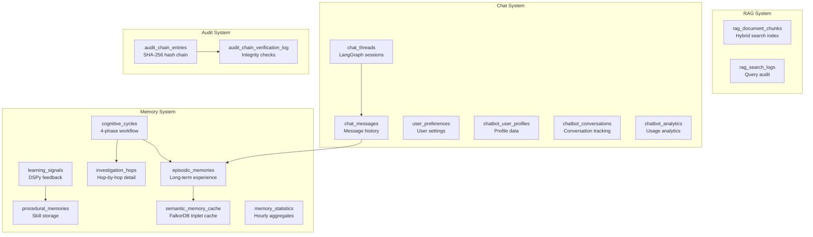
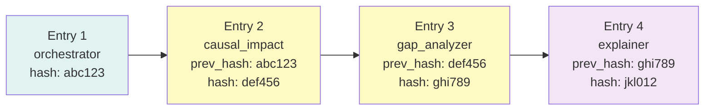

# 07 — Supporting Schemas (Memory, RAG, Chat, Audit)

> **E2I Causal Analytics** | Last Updated: 2026-02

| Navigation | |
|---|---|
| [Index](00-INDEX.md) | [Conversion Guide](01-DATA-CONVERSION-GUIDE.md) |
| [Core Dictionary](02-CORE-DATA-DICTIONARY.md) | [ML Pipeline](03-ML-PIPELINE-SCHEMA.md) |
| [Knowledge Graph](04-KNOWLEDGE-GRAPH-ONTOLOGY.md) | [Feature Store](05-FEATURE-STORE-REFERENCE.md) |
| [KPI Reference](06-KPI-REFERENCE.md) | **Supporting Schemas** |

---

## Overview

These schemas support the agent runtime infrastructure — not the business data itself. They are populated by the system during operation and generally do **not** need data conversion from external sources.



---

## Memory Schema

**Source**: `database/memory/001_agentic_memory_schema_v1.3.sql` (807 lines)

The tri-memory architecture provides agents with episodic recall (what happened), procedural knowledge (how to do things), and semantic caching (graph facts). No FK dependencies to the core data layer — entity references use VARCHAR IDs.

### Enum Types

| Enum | Values |
|------|--------|
| `memory_event_type` | `query`, `analysis`, `recommendation`, `alert`, `learning`, `feedback` |
| `memory_outcome_type` | `success`, `partial_success`, `failure`, `timeout`, `skipped` |
| `procedure_type` | `tool_sequence`, `analysis_recipe`, `response_template`, `escalation_path` |
| `cognitive_phase` | `summarizer`, `investigator`, `agent`, `reflector` |
| `e2i_agent_name` | All 21 agent names (scope_definer through feedback_learner) |
| `learning_signal_type` | `thumbs_up`, `thumbs_down`, `correction`, `rating`, `implicit` |

### episodic_memories

Long-term experience storage with vector embeddings for semantic retrieval.

| Column | Type | Description |
|--------|------|-------------|
| `memory_id` | UUID (PK) | Auto-generated |
| `cycle_id` | UUID (FK → cognitive_cycles) | Originating cognitive cycle |
| `agent_name` | e2i_agent_name | Which agent created this memory |
| `event_type` | memory_event_type | Type of event |
| `summary` | TEXT | Natural language summary |
| `detail_jsonb` | JSONB | Structured detail data |
| `outcome` | memory_outcome_type | What happened |
| `importance` | FLOAT (0–1) | Importance score for retrieval ranking |
| `embedding` | vector(1536) | pgvector embedding for semantic search |
| `patient_id` | VARCHAR(20) | E2I entity reference (nullable) |
| `hcp_id` | VARCHAR(20) | E2I entity reference (nullable) |
| `trigger_id` | VARCHAR(30) | E2I entity reference (nullable) |
| `causal_path_id` | VARCHAR(20) | E2I entity reference (nullable) |
| `brand` | VARCHAR(20) | Brand context (nullable) |
| `tags` | TEXT[] | Searchable tags |
| `created_at` | TIMESTAMPTZ | |

**Indexes**: ivfflat on `embedding`, GIN on `tags`, B-tree on `agent_name`, `event_type`, `patient_id`, `hcp_id`, `created_at`

**Full-text search**: `ts_summary` tsvector column with GIN index

### procedural_memories

Reusable skill storage — tool sequences, analysis recipes, and response templates.

| Column | Type | Description |
|--------|------|-------------|
| `procedure_id` | UUID (PK) | Auto-generated |
| `procedure_name` | VARCHAR(200) | Human-readable name |
| `procedure_type` | procedure_type | Category |
| `trigger_pattern` | TEXT | Intent pattern that activates this procedure |
| `tool_sequence` | JSONB | Ordered list of tool calls |
| `parameters` | JSONB | Default parameters |
| `success_count` | INTEGER | Times used successfully |
| `failure_count` | INTEGER | Times failed |
| `avg_duration_ms` | FLOAT | Average execution time |
| `agent_name` | e2i_agent_name | Owning agent |
| `intent_keywords` | TEXT[] | Keywords for matching |
| `version` | INTEGER | Version counter |
| `is_active` | BOOLEAN | Active flag |

**Indexes**: GIN on `intent_keywords`, B-tree on `procedure_type`, `agent_name`, unique on `(procedure_name, version)`

### semantic_memory_cache

Hot cache of FalkorDB graph triplets for fast in-process retrieval.

| Column | Type | Description |
|--------|------|-------------|
| `cache_id` | UUID (PK) | |
| `subject` | VARCHAR(200) | Triplet subject |
| `predicate` | VARCHAR(100) | Triplet predicate (relationship) |
| `object` | VARCHAR(200) | Triplet object |
| `confidence` | FLOAT (0–1) | Confidence in this fact |
| `source_agent` | e2i_agent_name | Which agent discovered this |
| `falkordb_synced` | BOOLEAN | Has been synced to FalkorDB |
| `last_accessed` | TIMESTAMPTZ | For LRU eviction |

**Indexes**: Unique on `(subject, predicate, object)`, B-tree on `falkordb_synced`, `last_accessed`

### cognitive_cycles

Tracks the 4-phase cognitive workflow: Summarizer → Investigator → Agent → Reflector.

| Column | Type | Description |
|--------|------|-------------|
| `cycle_id` | UUID (PK) | |
| `query_text` | TEXT | User's original query |
| `current_phase` | cognitive_phase | Active phase |
| `phase_started_at` | TIMESTAMPTZ | When current phase began |
| `summarizer_output` | JSONB | Phase 1 output |
| `investigator_output` | JSONB | Phase 2 output |
| `agent_output` | JSONB | Phase 3 output |
| `reflector_output` | JSONB | Phase 4 output |
| `final_synthesis` | TEXT | Combined result |
| `total_duration_ms` | INTEGER | End-to-end time |
| `agents_involved` | TEXT[] | Which agents participated |

### investigation_hops

Detailed hop-by-hop tracking for the investigator phase.

| Column | Type | Description |
|--------|------|-------------|
| `hop_id` | UUID (PK) | |
| `cycle_id` | UUID (FK → cognitive_cycles) | Parent cycle |
| `hop_number` | INTEGER | Sequence (1, 2, 3...) |
| `source_type` | VARCHAR(50) | `vector_search`, `graph_query`, `sql_query`, `memory_recall` |
| `source_query` | TEXT | The query executed |
| `results_count` | INTEGER | Number of results |
| `relevance_score` | FLOAT (0–1) | Relevance of results |
| `selected_results` | JSONB | Results kept for synthesis |

### learning_signals

Feedback data used for DSPy optimization and self-improvement.

| Column | Type | Description |
|--------|------|-------------|
| `signal_id` | UUID (PK) | |
| `cycle_id` | UUID (FK → cognitive_cycles) | Related cycle |
| `signal_type` | learning_signal_type | Type of feedback |
| `signal_value` | FLOAT | Numeric signal (-1 to 1 or 1–5 rating) |
| `correction_text` | TEXT | User's correction (if any) |
| `agent_name` | e2i_agent_name | Agent being evaluated |

### memory_statistics

Aggregated hourly/daily metrics for monitoring memory system health.

| Column | Type | Description |
|--------|------|-------------|
| `stat_id` | UUID (PK) | |
| `period_start` | TIMESTAMPTZ | Aggregation window start |
| `period_type` | VARCHAR(10) | `hourly`, `daily` |
| `total_queries` | INTEGER | Queries in period |
| `cache_hit_rate` | FLOAT | Semantic cache hit rate |
| `avg_retrieval_ms` | FLOAT | Average retrieval latency |
| `memories_created` | INTEGER | New episodic memories |
| `procedures_invoked` | INTEGER | Procedural memory uses |

---

## RAG Schema

**Source**: `database/rag/001_rag_schema.sql` (501 lines)

Hybrid search combining vector, full-text, and graph retrieval.

### rag_document_chunks

Chunked documents with pgvector embeddings and E2I context metadata.

| Column | Type | Description |
|--------|------|-------------|
| `chunk_id` | UUID (PK) | Auto-generated |
| `document_id` | UUID | Parent document |
| `chunk_index` | INTEGER | Position in document |
| `content` | TEXT | Chunk text content |
| `content_hash` | VARCHAR(64) | SHA-256 for dedup |
| `embedding` | vector(1536) | pgvector embedding |
| `token_count` | INTEGER | Token count |
| `brand` | VARCHAR(20) | E2I brand context (nullable) |
| `region` | VARCHAR(20) | E2I region context (nullable) |
| `agent_name` | VARCHAR(50) | Relevant agent (nullable) |
| `kpi_name` | VARCHAR(100) | Relevant KPI (nullable) |
| `document_type` | VARCHAR(50) | `policy`, `protocol`, `research`, `training` |
| `ts_content` | tsvector | Full-text search vector |
| `metadata` | JSONB | Additional metadata |

**Indexes**:
- HNSW on `embedding` (cosine distance)
- GIN on `ts_content` (full-text search)
- B-tree on `document_id`, `brand`, `agent_name`
- Unique on `content_hash`

### rag_search_logs

Audit trail for RAG queries with latency breakdown.

| Column | Type | Description |
|--------|------|-------------|
| `log_id` | UUID (PK) | |
| `query_text` | TEXT | User's search query |
| `query_embedding` | vector(1536) | Query vector |
| `vector_latency_ms` | FLOAT | Vector search time |
| `fulltext_latency_ms` | FLOAT | Full-text search time |
| `graph_latency_ms` | FLOAT | Graph search time |
| `fusion_latency_ms` | FLOAT | Fusion/reranking time |
| `total_latency_ms` | FLOAT | End-to-end time |
| `results_count` | INTEGER | Total results returned |
| `vector_results` | INTEGER | From vector search |
| `fulltext_results` | INTEGER | From full-text search |
| `graph_results` | INTEGER | From graph search |
| `extracted_entities` | JSONB | Named entities found |
| `error_message` | TEXT | Error if failed |
| `user_id` | VARCHAR(50) | Requesting user |
| `created_at` | TIMESTAMPTZ | |

### RAG Functions

| Function | Purpose |
|----------|---------|
| `rag_vector_search(query_embedding, filters, limit)` | Searches chunks + episodic_memories + procedural_memories |
| `rag_fulltext_search(query_text, filters, limit)` | Searches chunks + causal_paths + agent_activities + triggers |
| `log_rag_search(...)` | Logs query with full latency and error metadata |

### RAG Views

| View | Purpose |
|------|---------|
| `rag_slow_queries` | Queries with total_latency_ms > 1000 |
| `rag_search_stats` | Hourly aggregates: avg latency, p95 latency, error counts |

---

## Chat Schema

**Source**: `database/chat/` (13 migration files)

### Core Tables

#### chatbot_user_profiles (from 028_chatbot_user_profiles.sql)

Extended user profiles for the chatbot system.

| Column | Type | Description |
|--------|------|-------------|
| `profile_id` | UUID (PK) | |
| `user_id` | VARCHAR(50) | Auth user reference |
| `display_name` | VARCHAR(100) | Display name |
| `role` | VARCHAR(50) | User role |
| `region` | region_type | User's region |
| `default_brand` | brand_type | Preferred brand filter |
| `created_at` | TIMESTAMPTZ | |

#### chatbot_conversations (from 029_chatbot_conversations.sql)

Conversation session tracking.

| Column | Type | Description |
|--------|------|-------------|
| `conversation_id` | UUID (PK) | |
| `user_id` | VARCHAR(50) | User reference |
| `title` | VARCHAR(200) | Conversation title |
| `status` | VARCHAR(20) | `active`, `archived`, `deleted` |
| `message_count` | INTEGER | Total messages |
| `created_at` | TIMESTAMPTZ | |
| `updated_at` | TIMESTAMPTZ | |

### Extended Chat Tables (from 008_chatbot_memory_tables.sql)

#### chat_threads

Maps to LangGraph checkpointer for persistent agent sessions.

| Column | Type | Description |
|--------|------|-------------|
| `thread_id` | UUID (PK) | Maps to LangGraph thread |
| `user_id` | VARCHAR(50) | User reference |
| `session_id` | UUID (FK → user_sessions) | Session context |
| `title` | VARCHAR(200) | Thread title |
| `status` | VARCHAR(20) | `active`, `archived`, `deleted` |
| `initial_context` | JSONB | Starting context |
| `agents_used` | TEXT[] | Agents that participated |
| `primary_agent` | VARCHAR(50) | Main agent |
| `topic_embedding` | vector(1536) | Thread topic vector |

**Indexes**: B-tree on `user_id`, `updated_at DESC`, GIN on `agents_used`, ivfflat on `topic_embedding`

#### chat_messages

Full message history with agent metadata and validation tracking.

| Column | Type | Description |
|--------|------|-------------|
| `message_id` | UUID (PK) | |
| `thread_id` | UUID (FK → chat_threads) | Parent thread |
| `role` | VARCHAR(20) | `user`, `assistant`, `system`, `tool` |
| `content` | TEXT | Message content |
| `sequence_num` | INTEGER | Order in thread |
| `agent_ids` | TEXT[] | Contributing agents |
| `primary_agent` | VARCHAR(50) | Main responding agent |
| `agent_tier` | INTEGER | Tier of primary agent |
| `tool_name` | VARCHAR(100) | Tool used (for tool messages) |
| `tool_input` | JSONB | Tool input |
| `tool_output` | JSONB | Tool output |
| `validation_id` | UUID | Causal validation reference |
| `gate_decision` | VARCHAR(20) | `proceed`, `review`, `block` |
| `confidence_score` | FLOAT | Agent confidence |
| `filter_context` | JSONB | Active filters (brand, region, date) |
| `content_embedding` | vector(1536) | Message vector |
| `feedback_rating` | INTEGER | 1–5 user rating |
| `feedback_text` | TEXT | Feedback comment |
| `tokens_used` | INTEGER | Token consumption |
| `latency_ms` | INTEGER | Response time |

**Indexes**: B-tree on `thread_id`, `created_at`, `role`, GIN on `agent_ids`, ivfflat on `content_embedding`, GIN on full-text search

#### user_preferences

Key-value preference store per user.

| Column | Type | Description |
|--------|------|-------------|
| `preference_id` | UUID (PK) | |
| `user_id` | VARCHAR(50) | User reference |
| `key` | VARCHAR(100) | Preference key |
| `value` | JSONB | Preference value |
| `source` | VARCHAR(20) | `user`, `agent`, `system` |

Common keys: `detail_level`, `default_brand`, `default_region`, `show_validation_badges`, `preferred_chart_type`

Unique constraint: `(user_id, key)`

### Chat Functions

| Function | Purpose |
|----------|---------|
| `search_chat_messages(embedding, user_id, limit)` | Semantic search over message history |
| `get_recent_threads(user_id, limit)` | Threads with last message preview |
| `upsert_user_preference(user_id, key, value)` | Create or update preference |
| `save_chat_to_episodic(message_id)` | Promotes validated messages to episodic_memories |

### Additional Chat Tables

| Table | Source | Purpose |
|-------|--------|---------|
| `chatbot_message_feedback` | 031 | Structured feedback per message |
| `chatbot_analytics` | 033 | Usage analytics aggregations |
| `chatbot_training_signals` | 034 | Training data for model improvement |
| `chatbot_optimization_requests` | 035 | Optimization request tracking |
| `user_roles` | 036 | Role-based access definitions |

### Row-Level Security

All chat tables enforce RLS:
- Users can only see their own threads, messages, and preferences
- Uses `current_setting('app.current_user_id')` for user context
- `authenticated` role gets SELECT/INSERT
- `service_role` gets full access

---

## Audit Schema

**Source**: `database/audit/011_audit_chain_tables.sql` (352 lines)

Tamper-evident audit chain with SHA-256 hash linking for regulatory compliance. Every agent action in a workflow is recorded as a chain entry, with each entry's hash incorporating the previous entry's hash (blockchain-style).

### audit_chain_entries

Hash-linked audit trail — one entry per agent action.

| Column | Type | Description |
|--------|------|-------------|
| `entry_id` | UUID (PK) | |
| `workflow_id` | UUID | Groups entries in one workflow execution |
| `sequence_number` | INTEGER | Order within workflow (1, 2, 3...) |
| `agent_name` | VARCHAR(50) | Agent that performed action |
| `agent_tier` | INTEGER (0–5) | Agent's tier |
| `action_type` | VARCHAR(50) | `analysis`, `validation`, `prediction`, `recommendation` |
| `input_hash` | VARCHAR(64) | SHA-256 of input data |
| `output_hash` | VARCHAR(64) | SHA-256 of output data |
| `validation_passed` | BOOLEAN | Did validation gate pass? |
| `confidence_score` | FLOAT (0–1) | Agent's confidence |
| `refutation_results` | JSONB | DoWhy refutation outcomes |
| `entry_hash` | VARCHAR(64) | SHA-256 of this entry |
| `previous_hash` | VARCHAR(64) | Hash of previous entry in chain |
| `previous_entry_id` | UUID (FK → self) | Link to previous entry |
| `created_at` | TIMESTAMPTZ | |

**Refutation results JSONB structure**:
```json
{
  "placebo_treatment": {"passed": true, "p_value": 0.85},
  "random_cause": {"passed": true, "p_value": 0.92},
  "subset_data": {"passed": true, "p_value": 0.78},
  "add_unobserved_confound": {"passed": false, "p_value": 0.03}
}
```

**Hash computation** (`compute_entry_hash` function):
```
SHA-256(entry_id || workflow_id || sequence_number || agent_name ||
        action_type || created_at || input_hash || output_hash || previous_hash)
```

### audit_chain_verification_log

Records when chain integrity was verified.

| Column | Type | Description |
|--------|------|-------------|
| `verification_id` | UUID (PK) | |
| `workflow_id` | UUID | Workflow being verified |
| `verified_at` | TIMESTAMPTZ | When verification ran |
| `chain_valid` | BOOLEAN | Did chain pass integrity check? |
| `entries_checked` | INTEGER | Number of entries verified |
| `first_broken_entry` | UUID | First entry where chain broke (null if valid) |
| `verified_by` | VARCHAR(100) | Who initiated verification |

### Audit Functions

| Function | Purpose |
|----------|---------|
| `compute_entry_hash(entry)` | Computes SHA-256 hash for an audit entry |
| `verify_chain_integrity(workflow_id)` | Validates hash chain for a workflow |
| `verify_all_chains(start_date, end_date)` | Bulk verification across date range |

### Audit Views

| View | Description |
|------|-------------|
| `v_audit_chain_summary` | Per-workflow: total entries, agents involved, all_validations_passed, avg_confidence |
| `v_causal_validation_chain` | Tier 2 agent validation results with refutation test outcomes |
| `v_audit_chain_daily_stats` | Daily counts, pass/fail, avg confidence, unique agents |

### Chain Integrity Diagram



Each entry's `entry_hash` incorporates the `previous_hash`, creating a tamper-evident chain. If any entry is modified, all subsequent hashes become invalid, detectable by `verify_chain_integrity()`.

---

## Permissions Summary

| Schema | authenticated | service_role |
|--------|-------------|-------------|
| Memory | SELECT/INSERT on all tables | Full access |
| RAG | SELECT/INSERT, EXECUTE functions | Full access |
| Chat | RLS-filtered SELECT/INSERT | Full access |
| Audit | SELECT only (e2i_readonly) | SELECT/INSERT (e2i_service) |
