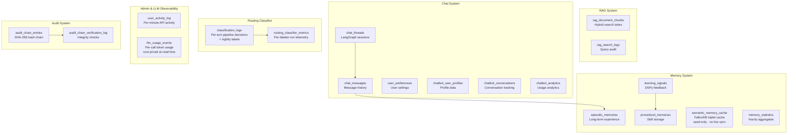
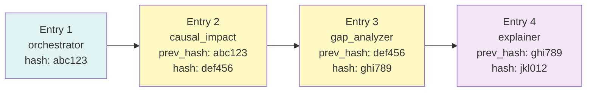

# 07 — Supporting Schemas (Memory, RAG, Chat, Routing Classifier, Admin/LLM Observability, Audit)

> **E2I Causal Analytics** | Last Updated: 2026-07-31

| Navigation | |
|---|---|
| [Index](00-INDEX.md) | [Conversion Guide](01-DATA-CONVERSION-GUIDE.md) |
| [Core Dictionary](02-CORE-DATA-DICTIONARY.md) | [ML Pipeline](03-ML-PIPELINE-SCHEMA.md) |
| [Knowledge Graph](04-KNOWLEDGE-GRAPH-ONTOLOGY.md) | [Feature Store](05-FEATURE-STORE-REFERENCE.md) |
| [KPI Reference](06-KPI-REFERENCE.md) | **Supporting Schemas** |

---

## Overview

These schemas support the agent runtime infrastructure — not the business data itself. They are populated by the system during operation and generally do **not** need data conversion from external sources.


```mermaid
graph TD
    subgraph "Memory System"
        EM[episodic_memories<br/>Long-term experience]
        PM[procedural_memories<br/>Skill storage]
        SM[semantic_memory_cache<br/>FalkorDB triplet cache<br/>seed-only · no live sync]
        LS[learning_signals<br/>DSPy feedback]
        MS[memory_statistics<br/>Hourly aggregates]
    end

    subgraph "RAG System"
        DC[rag_document_chunks<br/>Hybrid search index]
        SL[rag_search_logs<br/>Query audit]
    end

    subgraph "Chat System"
        CT[chat_threads<br/>LangGraph sessions]
        CM[chat_messages<br/>Message history]
        UP[user_preferences<br/>User settings]
        CP[chatbot_user_profiles<br/>Profile data]
        CV[chatbot_conversations<br/>Conversation tracking]
        CA[chatbot_analytics<br/>Usage analytics]
    end

    subgraph "Routing Classifier"
        CL[classification_logs<br/>Per-turn pipeline decisions<br/>+ nightly labels]
        RM[routing_classifier_metrics<br/>Per-labeler-run telemetry]
    end

    subgraph "Admin & LLM Observability"
        UA[user_activity_log<br/>Per-minute API activity]
        LU[llm_usage_events<br/>Per-call token usage<br/>cost priced at read time]
    end

    subgraph "Audit System"
        AC[audit_chain_entries<br/>SHA-256 hash chain]
        AV[audit_chain_verification_log<br/>Integrity checks]
    end

    LS --> PM
    CT --> CM
    CM --> EM
    CL --> RM
    AC --> AV
```

> **Retired 2026-06-05** (memory-audit remediation, migration `033`): the three
> orphan MIPROv2-era `dspy_*` optimization tables (`dspy_optimization_runs`,
> `dspy_prompt_versions`, `dspy_cognitive_context_history`) were **dropped**. The
> live DSPy optimization substrate is `dspy_agent_training_signals` + the GEPA
> `023` tables.
>
> **Restored 2026-06-09** (audit-F1 reversal, migration `042`): `cognitive_cycles`
> and `investigation_hops` — dropped by migration `032` on a mistaken "no writer"
> rationale — are **live again**. They are the parent ledger of the 4-phase
> cognitive cycle whose `cycle_id` the live workflow already threads onto
> `episodic_memories` / `learning_signals`; the producer
> (`src/memory/cognitive_integration.py::CognitiveService`) was simply never wired,
> and now is. The broken `016` similarity RPCs (retired by `031`) stay retired —
> RAG-over-history is served by `episodic_memories` + HybridRetriever, and live
> conversation history by `chatbot_conversations`.

---

## Memory Schema

**Source**: `database/memory/001_agentic_memory_schema_v1.3.sql`, extended by the
numbered migrations in the same directory (`ls database/memory | sort | tail -1`
for the ceiling). The base file is not the whole memory schema — everything
under [Later memory tables](#later-memory-tables) arrived in a migration.

The tri-memory architecture provides agents with episodic recall (what happened), procedural knowledge (how to do things), and semantic caching (graph facts). No FK dependencies to the core data layer — entity references use VARCHAR IDs.

### Enum Types

All values below were re-derived from the `CREATE TYPE` and `ALTER TYPE ... ADD
VALUE` statements under `database/memory/` and `database/migrations/`.

| Enum | Values |
|------|--------|
| `memory_event_type` | **8 base** — `user_query`, `agent_action`, `system_event`, `feedback`, `error`, `causal_discovery`, `trigger_generated`, `experiment_completed` — plus **21 added** by migrations 020/039/040/041: `composition_completed`, `optimization_completed`, `explanation_generated`, `scope_definition_completed`, `qc_report_completed`, `model_selection_completed`, `model_training_completed`, `feature_analysis_completed`, `model_deployment_completed`, `observability_metrics_collected`, `cohort_construction_completed`, `causal_analysis_completed`, `causal_analysis`, `cate_analysis_completed`, `prediction_completed`, `prediction_delivered`, `health_check_completed`, `experiment_alert_generated`, `experiment_monitoring_completed`, `gap_analysis_completed`, `orchestration_completed` (**29** in all) |
| `memory_outcome_type` | `success`, `partial_success`, `failure`, `pending`, `escalated` |
| `procedure_type` | `tool_sequence`, `query_pattern`, `causal_chain_traversal`, `error_recovery`, `optimization`, plus `hpo_pattern` and `tool_composition` added by migration |
| `cognitive_phase` | `summarizer`, `investigator`, `agent`, `reflector` |
| `e2i_agent_name` | **23 values**: 12 base (`orchestrator`, `causal_impact`, `gap_analyzer`, `drift_monitor`, `heterogeneous_optimizer`, `fairness_guardian`, `health_score`, `experiment_designer`, `prediction_synthesizer`, `feedback_learner`, `explainer`, `resource_optimizer`) + 11 added by migrations 018/029/041 (`scope_definer`, `data_preparer`, `feature_analyzer`, `model_selector`, `model_trainer`, `model_deployer`, `observability_connector`, `tool_composer`, `cohort_constructor`, `experiment_monitor`, `corpus_ingestion`). **See the roster mismatch note below.** |
| `learning_signal_type` | `thumbs_up`, `thumbs_down`, `correction`, `rating`, `implicit_positive`, `implicit_negative` |

> **This enum is NOT the agent roster, and the two do not match.**
> `config/agent_config.yaml` declares 22 agents; `e2i_agent_name` has 23 values.
> They differ in three places:
>
> - **`cohort_profiler` is in the roster but has NO enum value** (added to the
>   config by #1790; no `ALTER TYPE ... ADD VALUE` was ever written for it).
>   This is a **known gap**, recorded here rather than papered over. It is
>   currently latent: `src/agents/cohort_profiler/` writes no memory rows, so
>   nothing inserts a value the enum would reject. **But there is already one
>   reachable path** — `src/api/routes/memory.py` passes `rated_agent` straight
>   through on procedural feedback, so a client posting `"cohort_profiler"`
>   raises a 22P02 today. Tracked as issue #1932; needs a memory migration.
> - **`fairness_guardian`** and **`corpus_ingestion`** are enum values with no
>   agent in the config roster — **but for opposite reasons, and neither is a
>   cleanup candidate.** `corpus_ingestion` has **live rows** (137 as of
>   2026-09-07) written by `src/rag/corpus_ingestion.py` (migration 041); it is
>   absent from the roster because it is a **RAG pipeline, not a dispatched
>   agent**. `fairness_guardian` has no rows, but commit `48261d223` records the
>   retention as deliberate — *"KEPT (DEPRECATED) in the enums for
>   backwards-compat with existing memory rows"* — and Postgres cannot drop an
>   enum value in place regardless. Verify before acting:
>   `docker exec -i supabase-db psql -U postgres -d postgres -tAc "SELECT agent_name, count(*) FROM episodic_memories GROUP BY 1;"`
>
> Re-derive rather than trusting this note:
> `grep -rn "'cohort_profiler'" database/memory/ database/migrations/ | grep -c 'ADD VALUE'`
> -> 0 today.

### episodic_memories

Long-term experience storage with vector embeddings for semantic retrieval.

| Column | Type | Description |
|--------|------|-------------|
| `memory_id` | UUID (PK) | Auto-generated |
| `cycle_id` | UUID — parent `cognitive_cycles` restored mig 042 (soft reference; enforced FK not re-added — the async reflector may write a child before the parent row, so the link is intentionally soft) | Originating cognitive cycle |
| `agent_name` | e2i_agent_name | Which agent created this memory |
| `event_type` | memory_event_type | Type of event |
| `summary` | TEXT | Natural language summary |
| `detail_jsonb` | JSONB | Structured detail data |
| `outcome` | memory_outcome_type | What happened |
| `importance` | FLOAT (0–1) | Importance score for retrieval ranking |
| `embedding` | vector(1536) | pgvector embedding for semantic search |
| `patient_id` | VARCHAR(20) | E2I entity reference (nullable) |
| `hcp_id` | VARCHAR(20) | E2I entity reference (nullable) |
| `trigger_id` | VARCHAR(30) | E2I entity reference (nullable) |
| `causal_path_id` | VARCHAR(20) | E2I entity reference (nullable) |
| `brand` | VARCHAR(20) | Brand context (nullable) |
| `tags` | TEXT[] | Searchable tags |
| `created_at` | TIMESTAMPTZ | |

**Indexes**: ivfflat on `embedding`, GIN on `tags`, B-tree on `agent_name`, `event_type`, `patient_id`, `hcp_id`, `created_at`

**Full-text search**: `ts_summary` tsvector column with GIN index

### procedural_memories

Reusable skill storage — tool sequences, analysis recipes, and response templates.

| Column | Type | Description |
|--------|------|-------------|
| `procedure_id` | UUID (PK) | Auto-generated |
| `procedure_name` | VARCHAR(200) | Human-readable name |
| `procedure_type` | procedure_type | Category |
| `trigger_pattern` | TEXT | Intent pattern that activates this procedure |
| `tool_sequence` | JSONB | Ordered list of tool calls |
| `parameters` | JSONB | Default parameters |
| `success_count` | INTEGER | Times used successfully |
| `failure_count` | INTEGER | Times failed |
| `avg_duration_ms` | FLOAT | Average execution time |
| `agent_name` | e2i_agent_name | Owning agent |
| `intent_keywords` | TEXT[] | Keywords for matching |
| `version` | INTEGER | Version counter |
| `is_active` | BOOLEAN | Active flag |

**Indexes**: GIN on `intent_keywords`, B-tree on `procedure_type`, `agent_name`, unique on `(procedure_name, version)`

### semantic_memory_cache

> **ℹ️ Deploy-seed-only (audit 2026-06-05, F2/F4).** The table and its populating
> RPC (`sync_hcp_patient_relationships_to_cache`) are real, but there is **no live
> producer or reader**. The dormant `sync_data_layer_to_semantic_cache` /
> `sync_treatment_relationships_to_cache` Python wrappers and the inert
> `semantic_cache_ttl_minutes` config control were retired in commit `9cb0dc19`;
> the inert `falkordb_synced` / `falkordb_sync_at` columns (no sync-back job ever
> read them) were dropped by migration `034_drop_inert_falkordb_sync_columns.sql`.
> The table + RPC are kept as scaffolding for a future FalkorDB→Supabase hot-cache
> mirror; activation would require a sync job + a reader + TTL eviction (+ a
> re-added sync-state column).

Hot cache of FalkorDB graph triplets — a triplet store
(Subject –[Predicate]→ Object) with optional entity-id references into the data
layer (schema per `database/memory/001_agentic_memory_schema_v1.3.sql`).

> **ℹ️ Semantic graph name = `e2i_causal` (not `e2i_semantic`).** The FalkorDB graph
> backing agent semantic memory is **`e2i_causal`** — set in
> `config/005_memory_config.yaml` (`memory_backends.semantic.<env>.graph_name`) and
> `FALKORDB_GRAPH_NAME`, resolved at runtime by `get_config().semantic.graph_name`.
> The `e2i_semantic` name still seen in some seed scripts (`scripts/seed_semantic_graph.py`,
> `scripts/seed_falkordb_*`) and `config/ontology/falkordb_config.yaml` is a **legacy,
> runtime-unused** graph. The in-code defaults in `src/memory/services/config.py` and
> `src/memory/graphiti_config.py` were aligned from `e2i_semantic` → `e2i_causal` in
> **#749** so a missing YAML key cannot silently route memory to the empty graph.
> (Retiring/renaming the `e2i_semantic` seed path is tracked separately under #749.)

| Column | Type | Description |
|--------|------|-------------|
| `cache_id` | UUID (PK) | |
| `subject_type` / `subject_id` | VARCHAR(50) / VARCHAR(100) | Triplet subject |
| `predicate` | VARCHAR(50) | Triplet predicate (relationship) |
| `object_type` / `object_id` | VARCHAR(50) / VARCHAR(100) | Triplet object |
| `subject_*_id` / `object_*_id` | VARCHAR(50) | Optional entity-id refs (patient / hcp / trigger / causal_path) for joining to the data layer — no FKs |
| `confidence` | FLOAT (0–1) | Confidence in this fact |
| `source` | VARCHAR(50) | Provenance (`graphity_extraction`, `user_stated`, `causal_discovery`, `data_layer_sync`) |
| `properties` | JSONB | Free-form triplet metadata |
| `created_at` / `updated_at` | TIMESTAMPTZ | |

**Indexes**: Unique on `(subject_type, subject_id, predicate, object_type, object_id)`; B-tree on `(subject_type, subject_id)`, `(object_type, object_id)`, `predicate`, `confidence DESC`; partial on `subject_patient_id` and `subject_hcp_id` (WHERE NOT NULL).

### cognitive_cycles

> **♻️ RESTORED 2026-06-09 — LIVE** (migration `042_restore_cognitive_cycles_trio.sql`,
> reverses `032`). This is the **parent ledger** of the 4-phase cognitive cycle,
> not a superseded conversation store. The live workflow
> `src/memory/cognitive_integration.py::CognitiveService.process_query` generates a
> `cycle_id` per query and threads it onto `episodic_memories` / `learning_signals`;
> `_persist_cognitive_cycle` now writes the parent row (real data, best-effort,
> never seeded) so those references resolve. The broken `016` similarity RPCs stay
> retired (mig `031`) — vector RAG-over-history is served by `episodic_memories` +
> HybridRetriever; conversation history by `chatbot_conversations`.

Tracks the 4-phase cognitive workflow: Summarizer → Investigator → Agent → Reflector.

| Column | Type | Description |
|--------|------|-------------|
| `cycle_id` | UUID (PK) | |
| `query_text` | TEXT | User's original query |
| `current_phase` | cognitive_phase | Active phase |
| `phase_started_at` | TIMESTAMPTZ | When current phase began |
| `summarizer_output` | JSONB | Phase 1 output |
| `investigator_output` | JSONB | Phase 2 output |
| `agent_output` | JSONB | Phase 3 output |
| `reflector_output` | JSONB | Phase 4 output |
| `final_synthesis` | TEXT | Combined result |
| `total_duration_ms` | INTEGER | End-to-end time |
| `agents_involved` | TEXT[] | Which agents participated |

### investigation_hops

> **♻️ RESTORED 2026-06-09 — LIVE** (migration `042_restore_cognitive_cycles_trio.sql`,
> reverses `032`). FK child of the restored `cognitive_cycles` (parent recreated
> first). Captures per-hop detail of the Investigator phase; its `cycle_id` FK to
> `cognitive_cycles` is live again.

Detailed hop-by-hop tracking for the investigator phase.

| Column | Type | Description |
|--------|------|-------------|
| `hop_id` | UUID (PK) | |
| `cycle_id` | UUID — parent `cognitive_cycles` restored mig 042 (soft reference; enforced FK not re-added — the async reflector may write a child before the parent row, so the link is intentionally soft) | Parent cycle |
| `hop_number` | INTEGER | Sequence (1, 2, 3...) |
| `source_type` | VARCHAR(50) | `vector_search`, `graph_query`, `sql_query`, `memory_recall` |
| `source_query` | TEXT | The query executed |
| `results_count` | INTEGER | Number of results |
| `relevance_score` | FLOAT (0–1) | Relevance of results |
| `selected_results` | JSONB | Results kept for synthesis |

### learning_signals

Feedback data used for DSPy optimization and self-improvement.

| Column | Type | Description |
|--------|------|-------------|
| `signal_id` | UUID (PK) | |
| `cycle_id` | UUID **FK -> `cognitive_cycles(cycle_id)` ON DELETE CASCADE** | Related cycle. The parent table was restored by migration 042, and **migration 072 (#884) added the real FK** — it is no longer a soft reference. 072 first NULLs any orphan `cycle_id` (measured 0 at the time: all 300 rows had `cycle_id` NULL), so the `ADD CONSTRAINT` cannot fail on an environment that does hold orphans, and it specifically asserts CASCADE delete behaviour rather than accepting any FK |
| `signal_type` | learning_signal_type | Type of feedback |
| `signal_value` | FLOAT | Numeric signal (-1 to 1 or 1–5 rating) |
| `correction_text` | TEXT | User's correction (if any) |
| `agent_name` | e2i_agent_name | Agent being evaluated |
| `signal_details` | JSONB (default `{}`) | Structured payload. `signal_details->>'domain_signal' = 'dspy_signal'` marks the rows the feedback-learner consumes. There is **no** `metadata` column on this table — structured data goes here. |

> **Two signal collectors — only one feeds the learner (PRs #1240/#1241, July 2026).** Chat feedback lands in two different tables and they are NOT interchangeable:
>
> 1. **`chatbot_training_signals`** (chat schema, migration 034 — `database/chat/034_chatbot_training_signals.sql`) — written by the chatbot graph's finalize node on `/copilotkit/chat` turns (feature flag `CHATBOT_SIGNAL_COLLECTION`, default on). The feedback-learner **never reads this table** (no reference anywhere in `src/agents/feedback_learner/` or `src/repositories/`). Its intended consumer is the **`ChatbotOptimizer`** GEPA path in `src/api/routes/chatbot_dspy.py` — a chat-specific optimizer that is fully implemented (signal fetch → training examples → GEPA/MIPROv2 compile, plus SQL consume functions `get_training_signals`/`mark_signals_used`) but **dormant**: nothing in production invokes it (no endpoint, cron, or caller; only an integration test). The migration header's "for DSPy prompt optimization via the feedback_learner agent" wording refers to this ChatbotOptimizer path, NOT the Tier-5 `src/agents/feedback_learner/` agent — they are different code paths that happen to share vocabulary; this conflation is the usual source of "is this table redundant?" confusion. It is not redundant: rows are phase-decomposed (per-DSPy-phase output/method/confidence/timing, RAG internals, explicit user feedback, four reward components), strictly richer than the single-scalar `dspy_signal` rows in collector 2. Intent decision (issue #1282, 2026-07): **kept as an intentional placeholder** for the dormant optimizer. **Double-count guard**: if the ChatbotOptimizer (or any future trainer) is ever wired to consume this table, it must exclude turns already ingested by the learner through the copilot-side `dspy_signal` row for the same turn (both writers fire on every `/copilotkit/chat` turn).
> 2. **`learning_signals` rows stamped `dspy_signal`** — the learner's **only** input, read via `LearningSignalsFeedbackStore` filtered on `signal_details->>'domain_signal' = 'dspy_signal'`. Writers: the Phase-4 Reflector on `POST /api/cognitive/rag`, agent-node collectors (interpretation, heterogeneous-optimizer profile generator, gap-analyzer formatter), and — since PR #1240 — a copilot-side collector on the chat path. Copilot turns therefore now reach the learner through this table, while `chatbot_training_signals` remains learner-invisible.

### memory_statistics

Aggregated hourly/daily metrics for monitoring memory system health.

| Column | Type | Description |
|--------|------|-------------|
| `stat_id` | UUID (PK) | |
| `period_start` | TIMESTAMPTZ | Aggregation window start |
| `period_type` | VARCHAR(10) | `hourly`, `daily` |
| `total_queries` | INTEGER | Queries in period |
| `cache_hit_rate` | FLOAT | Semantic cache hit rate |
| `avg_retrieval_ms` | FLOAT | Average retrieval latency |
| `memories_created` | INTEGER | New episodic memories |
| `procedures_invoked` | INTEGER | Procedural memory uses |

---

## Later memory tables

Everything above is in the `001` base schema. These arrived in numbered
migrations under `database/memory/` (or `database/migrations/`) and were
previously undocumented. `grep -l 'CREATE TABLE' database/memory/*.sql` is the
current inventory.

### agent_knowledge_store (migration 065)

Durable backend for the feedback-learner's knowledge updates (#837). Before it,
`KnowledgeUpdaterNode` proposed updates with no store behind them.

| Column | Type | Description |
|--------|------|-------------|
| `knowledge_type` | TEXT NOT NULL | One of the four the node proposes: `baseline`, `agent_config`, `prompt`, `threshold` |
| `key` | TEXT NOT NULL | Knowledge key within the type |
| `value` | JSONB NOT NULL | The stored value |
| `justification` | TEXT | Why the update was proposed |
| `version` | INTEGER NOT NULL DEFAULT 1 | Bumped on update — history is versioned, not overwritten |
| `created_at` / `updated_at` | TIMESTAMPTZ NOT NULL DEFAULT now() | |

### dspy_agent_training_signals (migration 014)

Per-invocation DSPy training signals, richer than `learning_signals`: phase
decomposition, token/latency accounting and downstream impact.

Notable columns: `signal_id` (PK), `source_agent`, `batch_id`, `input_context`
/ `output` / `quality_metrics` (JSONB), `reward` (`CHECK BETWEEN 0 AND 1`),
`latency_breakdown`, `total_latency_ms`, `model_used`, `llm_calls`,
`total_tokens` / `prompt_tokens` / `completion_tokens`,
`cognitive_context_id`, `has_cognitive_context`, `user_satisfaction_delta`,
`downstream_impact` (JSONB), `human_validated`, `validation_timestamp`.

### ml_hpo_patterns (migration 017)

Hyperparameter-optimization outcomes reused as **warm starts** for later
studies. `procedure_id` FK -> `procedural_memories(procedure_id)` ON DELETE
CASCADE, so an HPO pattern is a specialisation of a procedural memory.

Notable columns: `pattern_id` (PK), `algorithm_name`, `problem_type`,
`search_space` / `best_hyperparameters` (JSONB), `best_value`,
`optimization_metric`, the problem-shape fields used for matching
(`n_samples`, `n_features`, `n_classes`, `class_balance`, `feature_types`),
the study fields (`n_trials`, `n_completed`, `n_pruned`, `duration_seconds`,
`study_name`) and the payoff fields `times_used_as_warmstart` /
`warmstart_improvement_avg`. Migration 017 also adds `hpo_pattern` to
`procedure_type`.

### procedural_templates (migration 027)

Brand-scoped templates distilled from episodic memories.

| Column | Type | Description |
|--------|------|-------------|
| `id` | UUID PK | |
| `brand` | TEXT NOT NULL | Brand scope |
| `template_signature` | TEXT NOT NULL | Signature the template answers to |
| `template_body` | JSONB NOT NULL | The template |
| `derived_from_episodic_ids` | UUID[] NOT NULL | **Provenance**: exactly which episodic rows produced this template |
| `extraction_confidence` | FLOAT NOT NULL | Confidence of the distillation |
| `extraction_method` | TEXT NOT NULL | How it was extracted |
| `created_at` | TIMESTAMPTZ NOT NULL DEFAULT NOW() | |

### Insight lifecycle: executive_insights, insight_edges, sentinels (migration 021)

**`executive_insights`** — crystallized narratives. `insight_id` (PK), `title`,
`narrative`, `brand` (**never cross-brand**), `region`, `kpi`,
`time_window_start` / `_end`, `key_metrics` (JSONB), the recall fields
(`recall`, `recall_reason`, `recall_at`), the crystallization provenance
(`crystallized_at`, `crystallized_by_cycle_id`, `crystallized_by_user_id`),
the invalidation fields (`invalidated_at`, `invalidation_reason` — mirroring
triggers/predictions for cascade uniformity) and `source_count` (count of
`insight_edges` rows targeting this insight).

**`insight_edges`** — the provenance graph between source rows and insights;
`verify_insight_chain()` walks it, and migration 030 pins the permitted
ancestor types.

**`sentinels`** — standing watches over the data. `sentinel_id` (PK), `name`,
`description`, `pattern_type` (`sentinel_pattern_type`), `pattern_config`
(JSONB, e.g. `{"table":"causal_paths","column":"causal_effect_size","op":"<","value":0.05}`),
`action_type` (`sentinel_action_type`), `action_config`, `brand` (`'all'` is
admin-only, enforced at the API layer), `region`, `created_by_user_id`,
`enabled`, `last_fired_at`, `fire_count`, timestamps. Migrations 023 and 024
add cooldown and the invalidation-count pattern.

**Append-only enforcement (migration 028)**: a
`prevent_change_invalidated_executive_insight` trigger blocks changes to an
invalidated insight, so the record is corrected by a new row, never rewritten.

### crystal_narrative_audits (migration 028)

One audit row per crystallized narrative — what the model produced and what it
cost. `audit_id` (PK), `insight_id` (**UNIQUE**, one audit per insight),
`narrator_model`, `key_finding`, `limitations`, `recommended_next`,
`input_prompt`, `latency_ms`, `input_tokens`, `output_tokens`, `cost_usd`,
`created_at`.

### Gap analysis & feedback-loop tables

| Table | Source | Purpose |
|-------|--------|---------|
| `gap_analyses` | migration 059 | Persisted gap-analyzer results |
| `feedback_learning_batches` | migration 059 | A learner run over a batch of signals |
| `feedback_patterns` | migration 059 | Patterns the learner extracted |
| `feedback_knowledge_updates` | migration 059 | Proposed updates (the `agent_knowledge_store` writes above) |
| `feedback_items` | migration 059 | Individual feedback records |
| `ml_feedback_loop_config` | migration 006 | Feedback-loop configuration |
| `ml_feedback_loop_runs` | migration 006 | Feedback-loop run history |

### Memory RPCs

Functions defined under `database/memory/`. Re-derive with
`grep -rhoE 'CREATE OR REPLACE FUNCTION [a-z_.]+\(' database/memory/*.sql | sort -u`.

| Function | Purpose |
|----------|---------|
| `search_episodic_memory` | Episodic recall; migration 035 added filters |
| `hybrid_vector_search` / `hybrid_fulltext_search` | The two halves of hybrid retrieval (011). Migrations 043–045 add operational-corpus scoping and synthetic exclusion/coalescing |
| `find_relevant_procedures` | Procedural-memory lookup |
| `increment_procedure_outcome` | Atomic outcome counter (036) — atomic so concurrent updates cannot lose a count |
| `find_similar_hpo_patterns` / `record_hpo_warmstart_usage` | HPO warm-start matching and usage recording (017) |
| `get_memory_entity_context` / `get_agent_activity_context` | Context assembly for agents |
| `get_dspy_training_examples` / `get_dspy_agent_metrics` | DSPy training-signal reads (014) |
| `get_conversations_with_feedback` / `search_similar_conversations` | Conversation-level reads (016; migration 031 retired some of the similarity RPCs) |
| `get_active_prompt` | Active prompt lookup |
| `get_search_stats` / `test_vector_search` / `test_fulltext_search` | Diagnostics |
| `sync_hcp_patient_relationships_to_cache` | Semantic-cache sync (038 makes the count accumulate) |
| `verify_insight_chain` | Walks `insight_edges`; migration 030 verifies permitted ancestor types |
| `prevent_change_invalidated_executive_insight` | Trigger function — append-only insights (028) |
| `prevent_update_delete_audit_chain` | Trigger function — the audit chain is insert-only |

---

## RAG Schema

**Source**: `database/rag/001_rag_schema.sql`, extended by `002`-`006` in the same directory

Hybrid search combining vector, full-text, and graph retrieval.

**Provenance filtering (migrations 004/005).** `rag_document_chunks` carries
`is_synthetic`, and the vector-search path filters on it, so a synthetic-gold
chunk is not retrieved as though it were real-world evidence.

**Full-text uses OR semantics, not AND (migration 006).** `rag_fulltext_search`
still parses the query with `websearch_to_tsquery` (so phrase and negation
syntax keep working), but a long natural-language question under strict AND
matched nothing — every term had to appear in one chunk. The function converts
the parsed tsquery to its **OR** form for both matching and ranking, letting
`ts_rank_cd` order partial matches instead of returning an empty set.
**Negated queries keep strict AND**: `-term` -> `!term` must still exclude.

### rag_document_chunks

Chunked documents with pgvector embeddings and E2I context metadata.

| Column | Type | Description |
|--------|------|-------------|
| `chunk_id` | UUID (PK) | Auto-generated |
| `document_id` | UUID | Parent document |
| `chunk_index` | INTEGER | Position in document |
| `content` | TEXT | Chunk text content |
| `content_hash` | VARCHAR(64) | SHA-256 for dedup |
| `embedding` | vector(1536) | pgvector embedding |
| `token_count` | INTEGER | Token count |
| `brand` | VARCHAR(20) | E2I brand context (nullable) |
| `region` | VARCHAR(20) | E2I region context (nullable) |
| `agent_name` | VARCHAR(50) | Relevant agent (nullable) |
| `kpi_name` | VARCHAR(100) | Relevant KPI (nullable) |
| `document_type` | VARCHAR(50) | `policy`, `protocol`, `research`, `training` |
| `ts_content` | tsvector | Full-text search vector |
| `metadata` | JSONB | Additional metadata |

**Indexes**:
- HNSW on `embedding` (cosine distance)
- GIN on `ts_content` (full-text search)
- B-tree on `document_id`, `brand`, `agent_name`
- Unique on `content_hash`

### rag_search_logs

Audit trail for RAG queries with latency breakdown.

| Column | Type | Description |
|--------|------|-------------|
| `log_id` | UUID (PK) | |
| `query_text` | TEXT | User's search query |
| `query_embedding` | vector(1536) | Query vector |
| `vector_latency_ms` | FLOAT | Vector search time |
| `fulltext_latency_ms` | FLOAT | Full-text search time |
| `graph_latency_ms` | FLOAT | Graph search time |
| `fusion_latency_ms` | FLOAT | Fusion/reranking time |
| `total_latency_ms` | FLOAT | End-to-end time |
| `results_count` | INTEGER | Total results returned |
| `vector_results` | INTEGER | From vector search |
| `fulltext_results` | INTEGER | From full-text search |
| `graph_results` | INTEGER | From graph search |
| `extracted_entities` | JSONB | Named entities found |
| `error_message` | TEXT | Error if failed |
| `user_id` | VARCHAR(50) | Requesting user |
| `created_at` | TIMESTAMPTZ | |

### RAG Functions

| Function | Purpose |
|----------|---------|
| `rag_vector_search(query_embedding, filters, limit)` | Searches chunks + episodic_memories + procedural_memories |
| `rag_fulltext_search(query_text, filters, limit)` | Searches chunks + causal_paths + agent_activities + triggers |
| `log_rag_search(...)` | Logs query with full latency and error metadata |

### RAG Views

| View | Purpose |
|------|---------|
| `rag_slow_queries` | Queries with total_latency_ms > 1000 |
| `rag_search_stats` | Hourly aggregates: avg latency, p95 latency, error counts |

---

## Chat Schema

**Source**: `database/chat/` (13 migration files)

### Core Tables

#### chatbot_user_profiles (from 028_chatbot_user_profiles.sql)

Extended user profiles for the chatbot system.

| Column | Type | Description |
|--------|------|-------------|
| `profile_id` | UUID (PK) | |
| `user_id` | VARCHAR(50) | Auth user reference |
| `display_name` | VARCHAR(100) | Display name |
| `role` | VARCHAR(50) | User role |
| `region` | region_type | User's region |
| `default_brand` | brand_type | Preferred brand filter |
| `created_at` | TIMESTAMPTZ | |

#### chatbot_conversations (from 029_chatbot_conversations.sql)

Conversation session tracking.

| Column | Type | Description |
|--------|------|-------------|
| `conversation_id` | UUID (PK) | |
| `user_id` | VARCHAR(50) | User reference |
| `title` | VARCHAR(200) | Conversation title |
| `status` | VARCHAR(20) | `active`, `archived`, `deleted` |
| `message_count` | INTEGER | Total messages |
| `created_at` | TIMESTAMPTZ | |
| `updated_at` | TIMESTAMPTZ | |

### Extended Chat Tables (from 008_chatbot_memory_tables.sql)

#### chat_threads

Maps to LangGraph checkpointer for persistent agent sessions.

| Column | Type | Description |
|--------|------|-------------|
| `thread_id` | UUID (PK) | Maps to LangGraph thread |
| `user_id` | VARCHAR(50) | User reference |
| `session_id` | UUID (FK → user_sessions) | Session context |
| `title` | VARCHAR(200) | Thread title |
| `status` | VARCHAR(20) | `active`, `archived`, `deleted` |
| `initial_context` | JSONB | Starting context |
| `agents_used` | TEXT[] | Agents that participated |
| `primary_agent` | VARCHAR(50) | Main agent |
| `topic_embedding` | vector(1536) | Thread topic vector |

**Indexes**: B-tree on `user_id`, `updated_at DESC`, GIN on `agents_used`, ivfflat on `topic_embedding`

#### chat_messages

Full message history with agent metadata and validation tracking.

| Column | Type | Description |
|--------|------|-------------|
| `message_id` | UUID (PK) | |
| `thread_id` | UUID (FK → chat_threads) | Parent thread |
| `role` | VARCHAR(20) | `user`, `assistant`, `system`, `tool` |
| `content` | TEXT | Message content |
| `sequence_num` | INTEGER | Order in thread |
| `agent_ids` | TEXT[] | Contributing agents |
| `primary_agent` | VARCHAR(50) | Main responding agent |
| `agent_tier` | INTEGER | Tier of primary agent |
| `tool_name` | VARCHAR(100) | Tool used (for tool messages) |
| `tool_input` | JSONB | Tool input |
| `tool_output` | JSONB | Tool output |
| `validation_id` | UUID | Causal validation reference |
| `gate_decision` | VARCHAR(20) | `proceed`, `review`, `block` |
| `confidence_score` | FLOAT | Agent confidence |
| `filter_context` | JSONB | Active filters (brand, region, date) |
| `content_embedding` | vector(1536) | Message vector |
| `feedback_rating` | INTEGER | 1–5 user rating |
| `feedback_text` | TEXT | Feedback comment |
| `tokens_used` | INTEGER | Token consumption |
| `latency_ms` | INTEGER | Response time |

**Indexes**: B-tree on `thread_id`, `created_at`, `role`, GIN on `agent_ids`, ivfflat on `content_embedding`, GIN on full-text search

#### user_preferences

Key-value preference store per user.

| Column | Type | Description |
|--------|------|-------------|
| `preference_id` | UUID (PK) | |
| `user_id` | VARCHAR(50) | User reference |
| `key` | VARCHAR(100) | Preference key |
| `value` | JSONB | Preference value |
| `source` | VARCHAR(20) | `user`, `agent`, `system` |

Common keys: `detail_level`, `default_brand`, `default_region`, `show_validation_badges`, `preferred_chart_type`

Unique constraint: `(user_id, key)`

### Chat Functions

| Function | Purpose |
|----------|---------|
| `search_chat_messages(embedding, user_id, limit)` | Semantic search over message history |
| `get_recent_threads(user_id, limit)` | Threads with last message preview |
| `upsert_user_preference(user_id, key, value)` | Create or update preference |
| `save_chat_to_episodic(message_id)` | Promotes validated messages to episodic_memories |

### Additional Chat Tables

| Table | Source | Purpose |
|-------|--------|---------|
| `chatbot_message_feedback` | 031 | Structured feedback per message |
| `chatbot_analytics` | 033 | Usage analytics aggregations |
| `chatbot_training_signals` | 034 | Phase-decomposed training signals written by the chatbot finalize node — intended consumer is the dormant `ChatbotOptimizer` (chatbot_dspy.py), **not** the feedback-learner (see the two-collector note under `learning_signals` above; intent decision: issue #1282) |
| `chatbot_optimization_requests` | 035 | Optimization request tracking. No longer purely dormant: `src/tasks/chatbot_optimization_tasks.py` drains it on the 05:30 schedule **when `CHATBOT_OPT_DRAIN_ENABLED` is set** (#1521, following the #1513 precedent) — a logged no-op otherwise, so the default deployment behaves as before |
| `user_roles` | 036 | Role-based access definitions |

#### `computed_user_id` is trigger-maintained, not generated (migration 123)

`chatbot_messages.computed_user_id` and its sibling on the feedback table were
`GENERATED ALWAYS AS` expressions. Migration 123 (#1433) **drops the generated
expression on both** and replaces it with a shared
`chatbot_inherit_conversation_owner()` trigger that sets `computed_user_id`
from the parent conversation's `user_id` on insert. The RLS policies and
indexes keyed on the column are preserved unchanged — the column keeps its
meaning; only the mechanism that fills it changed.

### Row-Level Security

All chat tables enforce RLS:
- Users can only see their own threads, messages, and preferences
- Uses `current_setting('app.current_user_id')` for user context
- `authenticated` role gets SELECT/INSERT
- `service_role` gets full access

---

## Routing Classifier Schema

**Source**: `database/ml/013_tool_composer_tables.sql` (classification_logs +
`routing_pattern` enum) and `database/ml/032_routing_classifier_metrics.sql`
(metrics snapshots). Column lists below verified against the live database
(`\d` on 2026-07-31). API-side context: `docs/api/chat.md` §6–7.

### Enum: routing_pattern

`SINGLE_AGENT` · `PARALLEL_DELEGATION` · `TOOL_COMPOSER` · `CLARIFICATION_NEEDED`

### classification_logs (from ml/013)

One row per 4-stage ClassificationPipeline decision on the `/chat/stream`
orchestrator path (written fire-and-forget, fail-open, by
`src/repositories/classification_log.py record_classification()` whenever
`ORCHESTRATOR_CLASSIFIER_MODE` is `shadow`/`active`; suppressed under
`E2I_TESTING_MODE`). Write-only until #1341: the nightly labeler
(`src/tasks/routing_label_tasks.py`, beat `routing-label-nightly` 04:30 UTC)
now fills the feedback columns.

| Column | Type | Description |
|--------|------|-------------|
| `classification_id` | UUID (PK) | |
| `query_text` | TEXT | Raw user query |
| `query_hash` | VARCHAR(64) | SHA-256 for similar-query dedup analysis |
| `routing_pattern` | routing_pattern | Pipeline decision |
| `target_agents` | TEXT[] | Agents the pattern targets |
| `confidence` | FLOAT (0–1 CHECK) | Pipeline confidence (active-mode floor is 0.5) |
| `features_extracted` | JSONB | Stage 1 `ExtractedFeatures` dump |
| `domain_mapping` | JSONB | Stage 2 `DomainMapping` dump (GIN-indexed) |
| `dependency_analysis` | JSONB | Stage 3 `DependencyAnalysis` dump |
| `sub_questions` | JSONB | Decomposed sub-questions (multi-part queries) |
| `dependencies` | JSONB | Sub-question dependency edges (field names `from_id`/`to_id`, not aliases) |
| `used_llm_layer` | BOOLEAN | Whether the pipeline's LLM stage ran (hard-disabled today — pending async stage-3) |
| `classification_latency_ms` | FLOAT | Pipeline latency (measured median 0.72 ms) |
| `session_id` | VARCHAR(100) | Chat session (`user_id~uuid` composite form; truncated to 100) |
| `user_id` | VARCHAR(100) | Authenticated user id |
| `is_followup` | BOOLEAN | Conversation history was present |
| `was_correct` | BOOLEAN | **Labeler**: NULL = awaiting label; true/false once labeled |
| `correct_pattern` | routing_pattern | **Labeler**: the pattern that should have been chosen (when `was_correct=false`) |
| `feedback_notes` | TEXT | **Labeler**: JSON note `{source, ...}`; doubles as the judge's *visited marker* (judged/abstained rows are never re-judged) |
| `created_at` | TIMESTAMPTZ | |

**Indexes**: B-tree on `routing_pattern`, `created_at DESC`, `session_id`,
`query_hash`; partial on `was_correct WHERE was_correct IS NOT NULL`; GIN on
`domain_mapping`. Referenced by `composer_episodes.classification_id` (FK).

**The JSONB stage payloads** are `model_dump(mode="json")` of the pipeline's
stage schemas (`src/agents/orchestrator/classifier/schemas.py`): Stage 1
feature extraction, Stage 2 domain detection (domains + per-domain
confidence — drives `DOMAIN_TO_AGENT`), Stage 3 dependency analysis
(`is_parallelizable`, dependency edges — splits multi-domain queries into
PARALLEL_DELEGATION vs TOOL_COMPOSER).

**Labeling convention (#1341 Phase 1, PR #1342)** — signals strongest-first:

1. **Explicit feedback** (`chatbot_message_feedback` thumbs, matched on
   session + query text): `thumbs_up` confirms the dispatch. **A negative
   signal (thumbs_down, errors, failed tools) is judge CONTEXT only — it must
   never auto-write `was_correct=false`** (a bad answer does not by itself
   prove bad routing).
2. **Implicit outcome** (`chatbot_analytics`, nearest turn within 180 s):
   `user_satisfied=true` confirms; errors become judge context + priority.
3. **LLM judge** (capped per run; haiku): abstains below confidence 0.6
   (`JUDGE_CONFIDENCE_FLOOR`) — abstentions record a `feedback_notes` marker
   (`source: llm_judge_abstain`) with `was_correct` left NULL.

Routing behavior is never mutated by the labeler — labels and metrics only
(authority changes stay human-gated).

### routing_classifier_metrics (from ml/032)

Per-labeler-run safety-telemetry time series (#1341 Phase 2) — one small row
per nightly cycle, written fail-open by `routing_label_tasks.py` (the labeler
degrades to log-only if the table is absent). This is the standing signal any
future active-mode promotion is judged against;
`v_classification_accuracy` aggregates per-day accuracy live from
`classification_logs`, while this table keeps what the view cannot: whole-run
telemetry across nights.

| Column | Type | Description |
|--------|------|-------------|
| `metric_id` | UUID (PK) | |
| `run_at` | TIMESTAMPTZ | Run timestamp (indexed DESC) |
| `task_id` | VARCHAR(100) | Celery task id |
| `window_days` | INTEGER | Lookback window |
| `total` / `labeled` | INTEGER | Rows seen / rows carrying a label |
| `overall_accuracy_pct` | NUMERIC | Pipeline-vs-judge agreement over labeled rows |
| `engagement_rate` | NUMERIC | Share committing to a route at `active_floor` |
| `active_floor` | NUMERIC | `MIN_ACTIVE_CONFIDENCE` used for the engagement computation |
| `llm_layer_share` | NUMERIC | Share that engaged the LLM layer |
| `abstention_total` / `abstention_correct` / `abstention_incorrect` | INTEGER | Abstention correctness (over-abstention is the #1337 finding) |
| `per_pattern` | JSONB | `{pattern: {total, correct, incorrect, awaiting, accuracy_pct}}` |
| `label_sources` | JSONB | `{explicit_feedback, implicit_outcome, llm_judge, llm_judge_abstain}` |
| `created_at` | TIMESTAMPTZ | |

### View: v_classification_accuracy (from ml/013)

Daily classifier accuracy by routing pattern, aggregated live from labeled
`classification_logs` rows.

**Access**: both tables are written server-side through the service-role
Supabase client; the ml/013 and ml/032 migrations define no table-specific
RLS policies or grants (013's grant block is commented guidance only).

---

## Admin & LLM Observability Schema

**Source**: `database/migrations/101_admin_user_activity.sql`, `database/migrations/104_llm_usage_events.sql` (July 2026 — `/admin` page backing tables)

### user_activity_log

Per-minute pre-aggregated API activity, powering the `/admin` user-management
activity views. One row per (user, endpoint group, method, minute bucket);
flushes are additive merges.

| Column | Type | Description |
|--------|------|-------------|
| `id` | BIGSERIAL (PK) | |
| `user_id` | UUID | Acting user |
| `user_email` | TEXT | Denormalized for display |
| `endpoint_group` | TEXT | Coarse endpoint family (not raw paths) |
| `http_method` | TEXT | DEFAULT `'GET'` |
| `bucket_minute` | TIMESTAMPTZ | Minute bucket |
| `request_count` | INTEGER | Requests in the bucket (summed on conflict) |
| `created_at` | TIMESTAMPTZ | |

Unique on `(user_id, endpoint_group, http_method, bucket_minute)`; indexed by
`(user_id, bucket_minute DESC)` and `(bucket_minute DESC)`. Retention via
`purge_old_user_activity` (default 180 days).

### llm_usage_events

One row per completed LLM call, written by the LLM factory's
`UsageRecorderCallback` (see `docs/LLM_CONFIGURATION.md` §4). **No cost
column by design** — cost is computed at read time from
`src/services/llm_pricing.py`, so rate changes never require backfills.
Surfaced in the `/admin` page's Observability tab.

| Column | Type | Description |
|--------|------|-------------|
| `id` | BIGINT IDENTITY (PK) | |
| `created_at` | TIMESTAMPTZ | Call completion time |
| `provider` | TEXT | `openai` / `anthropic` / … |
| `model` | TEXT | Model ID as invoked |
| `input_tokens` | INTEGER | DEFAULT 0 |
| `output_tokens` | INTEGER | DEFAULT 0 |
| `surface` | TEXT | Calling surface, DEFAULT `'other'` |
| `component` | TEXT | Finer-grained caller |
| `user_id` | UUID | NULL for platform-initiated calls |
| `session_id` | VARCHAR | Chat session, when applicable |
| `request_id` | TEXT | Correlation ID |

Indexed by `created_at`, `(user_id, created_at)`, and `session_id`.

### Admin Functions

All `SECURITY DEFINER`, EXECUTE granted to `service_role` only (migration 101):

| Function | Purpose |
|----------|---------|
| `record_user_activity(p_rows JSONB)` | Additive upsert-merge flush of activity buckets |
| `admin_get_login_activity(p_user_id, p_days)` | Daily login events from `auth.audit_log_entries` |
| `admin_get_platform_activity(p_days)` | Daily logins + active users |
| `admin_get_user_recent_events(p_user_id, p_limit)` | Recent auth events for one user (capped at 200) |
| `purge_old_user_activity(p_days)` | Retention delete (default 180 days) |

Migration 101 also backfilled `chatbot_user_profiles` from `auth.users` and
syncs `role`/`is_admin` from `raw_app_meta_data->>'role'`
(viewer/analyst/operator/admin).

### Row-Level Security

Both tables enable RLS with an **admin-read** policy: `authenticated` may
SELECT only when their `chatbot_user_profiles` row is admin; the
service-role writers bypass RLS.

---

## Audit Schema

**Source**: `database/audit/011_audit_chain_tables.sql`

Tamper-evident audit chain with SHA-256 hash linking for regulatory compliance. Every agent action in a workflow is recorded as a chain entry, with each entry's hash incorporating the previous entry's hash (blockchain-style).

### audit_chain_entries

Hash-linked audit trail — one entry per agent action.

| Column | Type | Description |
|--------|------|-------------|
| `entry_id` | UUID (PK) | |
| `workflow_id` | UUID | Groups entries in one workflow execution |
| `sequence_number` | INTEGER | Order within workflow (1, 2, 3...) |
| `agent_name` | VARCHAR(50) | Agent that performed action |
| `agent_tier` | INTEGER (0–5) | Agent's tier |
| `action_type` | VARCHAR(50) | The audited node's name (`<node>`), or **`<node>_error`** when that node raised or returned a `{node}_error` key. The tool composer's total-tool-failure gate writes `execute_error`. See the callout below |
| `input_hash` | VARCHAR(64) | SHA-256 of input data |
| `output_hash` | VARCHAR(64) | SHA-256 of output data |
| `validation_passed` | BOOLEAN | A **scientific verdict about the data**, not a run outcome. See the callout below |
| `confidence_score` | FLOAT (0–1) | Agent's confidence |
| `refutation_results` | JSONB | DoWhy refutation outcomes |
| `entry_hash` | VARCHAR(64) | SHA-256 of this entry |
| `previous_hash` | VARCHAR(64) | Hash of previous entry in chain |
| `previous_entry_id` | UUID (FK → self) | Link to previous entry |
| `created_at` | TIMESTAMPTZ | |

> **`validation_passed` is a verdict; `<node>_error` is the execution outcome
> (#1902).** The audited-node wrapper (`src.agents.base.audit_chain_mixin`)
> records under `validation_passed` whatever the node returned as
> `validation_passed` / `overall_robust` — the heterogeneous optimizer's
> EconML/CausalML cross-library agreement, or causal_impact's refutation
> verdict. Those are results *about the data*, and a downstream node returning
> `{**state}` re-records the same verdict once per node. Counting them as
> failed invocations made /system-health warn "heterogeneous_optimizer has low
> success rate (89.7%)" across a 30-day window in which no node of any agent
> raised.
>
> **Execution failure has exactly one marker: an `action_type` ending in
> `_error`**, and every fail-closed path writes one. The single shared
> definition is `is_execution_failure()` in `src/api/utils/audit_outcomes.py`,
> used by the agent-health reader (`/health-score` -> /system-health) and the
> analytics readers.
>
> **The unit of an invocation is the workflow run (`workflow_id`), not the
> row.** A run writes one genesis row plus one row per node; a run counts as
> failed if *any* of its rows is an error row, once, however many rows it
> wrote. Legacy rows with no `workflow_id` have no other unit, so each counts
> as one run.

**Refutation results JSONB structure**:
```json
{
  "placebo_treatment": {"passed": true, "p_value": 0.85},
  "random_cause": {"passed": true, "p_value": 0.92},
  "subset_data": {"passed": true, "p_value": 0.78},
  "add_unobserved_confound": {"passed": false, "p_value": 0.03}
}
```

**Hash computation** (`compute_entry_hash` function):
```
SHA-256(entry_id || workflow_id || sequence_number || agent_name ||
        action_type || created_at || input_hash || output_hash || previous_hash)
```

### security_audit_log

**Source**: `database/audit/012_security_audit_log.sql`. Separate from the hash
chain: `audit_chain_entries` records *agent actions* for scientific
reproducibility; this table records *security events* for compliance and threat
detection — authentication, authorization, rate limiting, API-security and
sensitive-data-access events.

| Column | Type | Description |
|--------|------|-------------|
| `event_id` | UUID PK DEFAULT `gen_random_uuid()` | |
| `event_type` | VARCHAR(100) NOT NULL | Event class |
| `severity` | VARCHAR(20) NOT NULL CHECK | `debug`, `info`, `warning`, `error`, `critical` |
| `timestamp` | TIMESTAMPTZ NOT NULL DEFAULT NOW() | Event time (indexed DESC) |
| `message` | TEXT NOT NULL | Human-readable summary |
| `user_id` / `user_email` / `user_roles` | VARCHAR / VARCHAR / JSONB | Actor |
| `request_id` / `correlation_id` | VARCHAR(100) | Request correlation |
| `client_ip` | INET | Client address |
| `user_agent` / `endpoint` / `http_method` | TEXT / VARCHAR(500) / VARCHAR(10) | Request context |
| `resource_type` / `resource_id` / `action_attempted` / `action_result` | VARCHAR | What was attempted, on what, and how it ended |
| `error_code` / `error_details` | VARCHAR(50) / TEXT | Failure detail |
| `metadata` | JSONB DEFAULT `'{}'` | Flexible payload (GIN-indexed) |
| `created_at` | TIMESTAMPTZ NOT NULL DEFAULT NOW() | |

Indexed on `timestamp`, `event_type`, `severity`, `user_id`, `client_ip`,
`request_id`, the composite `(event_type, severity, timestamp)`, and `metadata`.
The file also carries a **commented-out** partitioned variant
(`security_audit_log_partitioned`) — it is guidance for a future volume
migration, not live DDL.

### audit_chain_verification_log

Records when chain integrity was verified.

| Column | Type | Description |
|--------|------|-------------|
| `verification_id` | UUID (PK) | |
| `workflow_id` | UUID | Workflow being verified |
| `verified_at` | TIMESTAMPTZ | When verification ran |
| `chain_valid` | BOOLEAN | Did chain pass integrity check? |
| `entries_checked` | INTEGER | Number of entries verified |
| `first_broken_entry` | UUID | First entry where chain broke (null if valid) |
| `verified_by` | VARCHAR(100) | Who initiated verification |

### Audit Functions

| Function | Purpose |
|----------|---------|
| `compute_entry_hash(entry)` | Computes SHA-256 hash for an audit entry |
| `verify_chain_integrity(workflow_id)` | Validates hash chain for a workflow |
| `verify_all_chains(start_date, end_date)` | Bulk verification across date range |

### Audit Views

| View | Description |
|------|-------------|
| `v_audit_chain_summary` | Per-workflow: total entries, agents involved, all_validations_passed, avg_confidence |
| `v_causal_validation_chain` | Tier 2 agent validation results with refutation test outcomes |
| `v_audit_chain_daily_stats` | Daily counts, pass/fail, avg confidence, unique agents |

### Chain Integrity Diagram


```mermaid
graph LR
    E1["Entry 1<br/>orchestrator<br/>hash: abc123"] --> E2["Entry 2<br/>causal_impact<br/>prev_hash: abc123<br/>hash: def456"]
    E2 --> E3["Entry 3<br/>gap_analyzer<br/>prev_hash: def456<br/>hash: ghi789"]
    E3 --> E4["Entry 4<br/>explainer<br/>prev_hash: ghi789<br/>hash: jkl012"]

    style E1 fill:#e0f2f1
    style E2 fill:#fff9c4
    style E3 fill:#fff9c4
    style E4 fill:#f3e5f5
```

Each entry's `entry_hash` incorporates the `previous_hash`, creating a tamper-evident chain. If any entry is modified, all subsequent hashes become invalid, detectable by `verify_chain_integrity()`.

---

## Permissions Summary

> **Migration 058 (#703) REVOKEd the `anon` / `authenticated` over-grant.** The
> Supabase default `GRANT ALL ON ... TO anon, authenticated` had left roughly
> 101 no-RLS public tables (and ~105 anon-granted views) readable and writable
> by those roles. Migration 058 revokes ALL privileges from `anon` and
> `authenticated` on **every** public table and view (including materialized
> views), and neutralises the Supabase DEFAULT PRIVILEGES that would re-grant
> them. **All application access is via the service-role backend**, which
> bypasses RLS and retains its grants. It was safe to revoke because the
> frontend never calls PostgREST directly — it goes through the API.
>
> Scope, per the owner decision at the time: **tables and views, REVOKE only**
> (RLS itself deferred). Other anon-granted public *functions* — the guarded
> `kpi_query` allowlist among them — were left in place deliberately. The
> migration is idempotent and safe to re-apply.

| Schema | anon / authenticated | service_role |
|--------|----------------------|-------------|
| Memory | **none** (revoked by migration 058) | Full access |
| RAG | **none** on tables/views; the hybrid-search functions remain EXECUTE-able | Full access |
| Chat | **none** on tables; RLS policies still define the per-user shape for the service-role paths that honour them | Full access |
| Admin & LLM Observability | **none** | Full access; sole EXECUTE on admin functions |
| Audit | **none** | SELECT/INSERT (e2i_service) |
