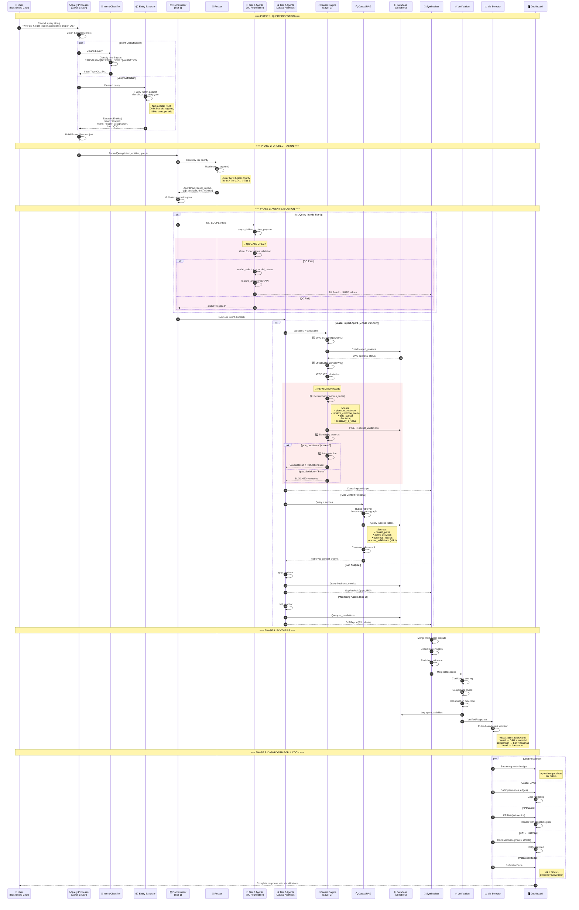

# E2I Query Processing Flow - Granular Data Handoff Diagram

## Overview

This document provides a granular breakdown of the query processing flow in the E2I Causal Analytics V4.1 system, mapping:
- **Data Handoffs**: What data moves between components
- **Processing Steps**: What transformation happens at each node
- **End States**: How results populate the dashboard

---

## Complete Flow Sequence



---

## Data Handoff Reference Table

| Step | From | To | Data Object | Key Fields |
|------|------|-----|-------------|------------|
| 1 | User | Query Processor | `string` | Raw NL query |
| 2 | Query Processor | Intent Classifier | `CleanedQuery` | normalized_text, tokens |
| 3 | Query Processor | Entity Extractor | `CleanedQuery` | normalized_text, tokens |
| 4 | Intent Classifier | Query Processor | `IntentType` | enum: CAUSAL\|GAP\|DRIFT\|ML_SCOPE\|VALIDATION |
| 5 | Entity Extractor | Query Processor | `ExtractedEntities` | brands[], regions[], kpis[], time_periods[] |
| 6 | Query Processor | Orchestrator | `ParsedQuery` | intent, entities, rewritten_query, confidence |
| 7 | Router | Orchestrator | `AgentPlan` | agents[], priority_order, execution_mode |
| 8 | Orchestrator | Tier 0 Agents | `MLRequest` | scope, constraints, data_requirements |
| 9 | Data Preparer | Model Trainer | `QCResult` | status: pass\|block, failures[], baseline_metrics |
| 10 | Orchestrator | Tier 2 Agents | `CausalRequest` | variables, treatment, outcome, confounders |
| 11 | Causal Engine | Database | `ValidationRecord` | estimate_id, test_type, status, gate_decision |
| 12 | CausalRAG | Agents | `RetrievedContext` | chunks[], sources[], relevance_scores[] |
| 13 | All Agents | Synthesizer | `AgentOutput` | result_type, content, confidence, visualizations[] |
| 14 | Synthesizer | Verification | `MergedResponse` | insights[], conflicts[], citations[] |
| 15 | Verification | Viz Selector | `VerifiedResponse` | content, compliance_status, confidence_score |
| 16 | Viz Selector | Dashboard | `ChatResponse` | text, agent_badges[], stream_tokens |
| 17 | Viz Selector | Dashboard | `DAGSpec` | nodes[], edges[], layout_hints |
| 18 | Viz Selector | Dashboard | `KPIData` | metric_id, value, trend, causal_insight |
| 19 | Viz Selector | Dashboard | `CATEMatrix` | segments[], time_periods[], effects[][] |
| 20 | Viz Selector | Dashboard | `ValidationBadge` | gate_decision, test_results[], confidence_score |

---

## Processing Step Details

### Layer 1: NLP Processing

```
┌─────────────────────────────────────────────────────────────────┐
│                     QUERY PROCESSOR                              │
├─────────────────────────────────────────────────────────────────┤
│  Input: "Why did Kisqali trigger acceptance drop in Q3?"        │
│                                                                  │
│  Step 1: Normalization                                          │
│    → lowercase, remove punctuation, expand contractions         │
│                                                                  │
│  Step 2: Intent Classification (5 types)                        │
│    → Pattern: "why did X" + metric change = CAUSAL              │
│    → Output: IntentType.CAUSAL                                  │
│                                                                  │
│  Step 3: Entity Extraction (domain_vocabulary.yaml)             │
│    → "Kisqali" fuzzy match → brand: "Kisqali" (score: 1.0)      │
│    → "trigger acceptance" → metric: "trigger_acceptance"         │
│    → "Q3" → time_period: "2024-Q3"                              │
│                                                                  │
│  Step 4: Query Rewriting (for RAG optimization)                 │
│    → "causal factors trigger acceptance decline Kisqali Q3"     │
│                                                                  │
│  Output: ParsedQuery{                                           │
│    intent: CAUSAL,                                              │
│    entities: {brand, metric, time},                             │
│    rewritten: "causal factors...",                              │
│    confidence: 0.92                                             │
│  }                                                              │
└─────────────────────────────────────────────────────────────────┘
```

### Layer 2: Causal Engine (5-Node Workflow)

```
┌─────────────────────────────────────────────────────────────────┐
│                 CAUSAL IMPACT AGENT WORKFLOW                     │
├─────────────────────────────────────────────────────────────────┤
│                                                                  │
│  Node 1: GraphBuilder                                           │
│    → Input: variables from ParsedQuery                          │
│    → Process: NetworkX DAG construction                         │
│    → Check: expert_reviews table for DAG approval               │
│    → Output: CausalGraph{nodes, edges, confounders}             │
│                                                                  │
│  Node 2: Estimation                                             │
│    → Input: CausalGraph + treatment + outcome                   │
│    → Process: DoWhy/EconML effect estimation                    │
│    → Output: EffectEstimate{ATE, CI, p_value}                   │
│                                                                  │
│  Node 3: Refutation (V4.1) 🚦 GATE                              │
│    → Input: EffectEstimate                                      │
│    → Process: RefutationRunner.run_suite()                      │
│      ├── placebo_treatment test                                 │
│      ├── random_common_cause test                               │
│      ├── data_subset test                                       │
│      ├── bootstrap test                                         │
│      └── sensitivity_e_value test                               │
│    → Persist: INSERT INTO causal_validations                    │
│    → Output: RefutationSuite{tests[], gate_decision}            │
│    → Gate: if gate_decision == "block" → STOP                   │
│                                                                  │
│  Node 4: Sensitivity                                            │
│    → Input: EffectEstimate + RefutationSuite                    │
│    → Process: Sensitivity analysis for unobserved confounders   │
│    → Output: SensitivityResult{e_value, robustness_score}       │
│                                                                  │
│  Node 5: Interpretation                                         │
│    → Input: All previous outputs                                │
│    → Process: LLM-based narrative generation                    │
│    → Output: CausalResult{effect, explanation, confidence}      │
│                                                                  │
└─────────────────────────────────────────────────────────────────┘
```

### Dashboard End States

```
┌─────────────────────────────────────────────────────────────────┐
│                    DASHBOARD COMPONENTS                          │
├─────────────────────────────────────────────────────────────────┤
│                                                                  │
│  1. Chat Response Panel                                         │
│     ├── Streaming text (WebSocket)                              │
│     ├── Agent badges (tier-colored)                             │
│     └── Inline citations to sources                             │
│                                                                  │
│  2. Causal DAG Visualization (D3.js)                            │
│     ├── Nodes: variables (treatment, outcome, confounders)      │
│     ├── Edges: causal relationships with strength               │
│     └── Interactive: click to see effect details                │
│                                                                  │
│  3. KPI Cards (46 metrics)                                      │
│     ├── Value + trend indicator                                 │
│     ├── Sparkline chart (Chart.js)                              │
│     └── Causal insight badge ("↑ caused by X")                  │
│                                                                  │
│  4. CATE Heatmap (Plotly)                                       │
│     ├── X-axis: Time periods                                    │
│     ├── Y-axis: HCP segments                                    │
│     └── Color: Treatment effect magnitude                       │
│                                                                  │
│  5. Resource Allocation Sankey (Plotly)                         │
│     ├── Left: Current budget allocation                         │
│     ├── Right: Optimal allocation                               │
│     └── Flows: Budget movement recommendations                  │
│                                                                  │
│  6. Validation Badge (V4.1)                                     │
│     ├── Status: proceed | review | block                        │
│     ├── Tests passed: 4/5 ✓                                     │
│     └── Confidence score: 87%                                   │
│                                                                  │
│  7. Health Radar Chart (Plotly)                                 │
│     ├── 8 dimensions: coverage, AUC, fairness, etc.             │
│     ├── Current state (solid)                                   │
│     └── Target state (dashed)                                   │
│                                                                  │
└─────────────────────────────────────────────────────────────────┘
```

---

## Critical Flow Constraints

| Constraint | Location | Behavior |
|------------|----------|----------|
| **NO Medical NER** | Entity Extractor | Only extracts from domain_vocabulary.yaml. Never uses scispaCy, BioBERT. |
| **QC Gate Blocking** | Data Preparer → Model Trainer | Training blocked with status="blocked" if Great Expectations validation fails. |
| **Refutation Required** | Causal Engine Node 3 | All causal effects must pass 5 DoWhy tests. Results persisted to causal_validations. |
| **ML Split Enforcement** | All data access | Same patient always in same split. Test/holdout never exposed in production. |
| **Operational Data Only** | RAG Retrieval | Only indexes: causal_paths, agent_activities, business_metrics, triggers. Never: clinical trials, medical literature. |
| **Tier Priority** | Router | Lower tier = higher priority. Tier 0 requests handled before Tier 5. |

---

## New in V4.1: Validation Infrastructure

### New Tables
- `causal_validations`: Stores refutation test results with gate decisions
- `expert_reviews`: Tracks DAG approval by domain experts

### New ENUMs
- `refutation_test_types`: placebo_treatment, random_common_cause, data_subset, bootstrap, sensitivity_e_value
- `validation_statuses`: passed, failed, warning, skipped
- `gate_decisions`: proceed, review, block

### New Dashboard Component
- **Validation Badge**: Shows refutation status with proceed/review/block indicator and confidence score

---

*Generated from E2I Causal Analytics V4.1 Architecture Documentation*
