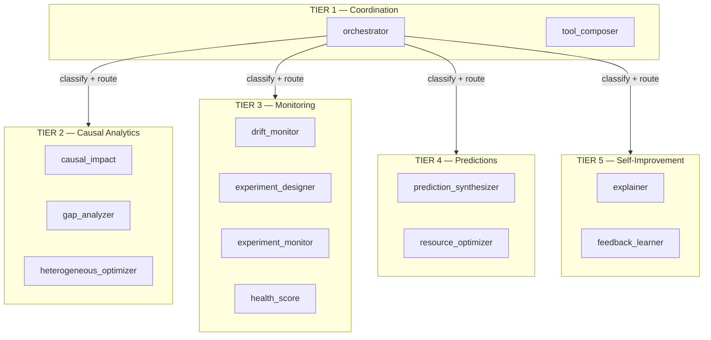
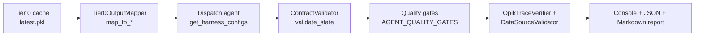

# Tier 1-5 Causal Analytics Pipeline — Status Report

**As of:** 2026-06-01
**Scope:** Implementation, testing, and reporting state of the Tier 1-5 agent pipeline.
**Method:** Static source review only. **No live harness run was performed** for this
report — the report contains no measured pass/fail numbers or runtime metrics. Every factual
claim cites a source file (`path:line`) so it can be independently verified.

---

## 1. Executive summary

The Tier 1-5 causal analytics pipeline is **already implemented and mature**. All three
requested dimensions exist in the codebase today:

- **Implementation** — 13 LangGraph agents across Tiers 1-5, dispatched from a single source
  of truth (`AGENT_METHOD_MAP`), with a 2,125-line test/validation harness
  (`scripts/run_tier1_5_test.py`).
- **Testing** — per-agent TypedDict contract validation, quality gates, Opik observability
  verification, and real-vs-mock data-source checks, wired into a hard-fail CI workflow.
- **Reporting** — the harness emits results three ways: rich console output, a JSON results
  file, and a timestamped markdown run report.

The one **load-bearing caveat** (Finding 1) was that the CI harness only actually *executed
the agents* when a Tier 0 cache (`scripts/tier0_output_cache/latest.pkl`) was present, and
that path was gitignored so it was never committed — in normal PR CI the harness took its
graceful-skip branch. **Resolved in issue #600**: a small, sanitized Tier-0 fixture is now
committed at that path (built deterministically by `scripts/generate_tier0_fixture.py`), so
the harness executes all 13 agents on every relevant PR. Per the maintainer decision, an
agent/contract failure is a **monitored alarm** (non-blocking `::warning` + results
artifact), while infra failures still hard-fail (#263). See
[§6, Finding 1](#finding-1--ci-harness-skips-agent-execution-headline).

---

## 2. Architecture

The platform is a 6-tier agent system. Tier 0 is the ML foundation (8 agents, separate
harness `scripts/run_tier0_test.py`). **Tiers 1-5 are 13 downstream agents**, each a
LangGraph state machine with a typed state/output contract.



**Source of truth:** `AGENT_METHOD_MAP` in `src/agents/orchestrator/_agent_method_map.py`
(`:63`+). Each entry is an `AgentMethodSpec` carrying `tier`, dispatch `method`, `is_async`,
`state_module` / `state_class` (the TypedDict / dataclass output contract), and `timeout`.

| Tier | Theme | Agent | Contract (`state_class`) | Timeout |
|---|---|---|---|---|
| 1 | Coordination | orchestrator | `OrchestratorState` | default |
| 1 | Coordination | tool_composer | `ToolComposerState` | 90s |
| 2 | Causal Analytics | causal_impact | `CausalImpactOutput` | 120s |
| 2 | Causal Analytics | gap_analyzer | `GapAnalyzerOutput` | default |
| 2 | Causal Analytics | heterogeneous_optimizer | `HeterogeneousOptimizerOutput` | default |
| 3 | Monitoring | drift_monitor | `DriftMonitorState` | default |
| 3 | Monitoring | experiment_designer | `ExperimentDesignState` | 120s |
| 3 | Monitoring | experiment_monitor | `ExperimentMonitorOutput` | 20s |
| 3 | Monitoring | health_score | `HealthScoreState` | default |
| 4 | Predictions | prediction_synthesizer | `PredictionSynthesizerState` | default |
| 4 | Predictions | resource_optimizer | `ResourceOptimizerState` | default |
| 5 | Self-Improvement | explainer | `ExplainerState` | default |
| 5 | Self-Improvement | feedback_learner | `FeedbackLearnerState` | default |

**Totals: 13 agents — Tier 1: 2, Tier 2: 3, Tier 3: 4, Tier 4: 2, Tier 5: 2.**

> ⚠️ **Documentation drift:** `docs/ARCHITECTURE.md:227`+ and `docs/ONBOARDING.md:275`+
> describe **"12 agents"** and list Tier 3 as only 3 agents (drift_monitor,
> experiment_designer, health_score). The code map has **13** agents; Tier 3 includes a 4th,
> `experiment_monitor` (`_agent_method_map.py:131`), which those docs omit. Tracked as
> [Finding 2](#finding-2--doc-drift-12-vs-13-agents).

---

## 3. Implementation — the harness

`scripts/run_tier1_5_test.py` (2,125 lines) validates every Tier 1-5 agent against cached
Tier 0 synthetic output. End-to-end flow:



1. **Input mapping** — `Tier0OutputMapper` (`src/testing/tier0_output_mapper.py:138`) maps
   Tier 0 ML output into each agent's expected input via per-agent `map_to_*` methods
   (`map_to_orchestrator` … `map_to_feedback_learner`), routed through
   `get_agent_mapping()` (`:854`).
2. **Dispatch** — the harness reads its per-agent config from `get_harness_configs()`
   (`src/agents/orchestrator/_agent_method_map.py:273`), which *projects* `AGENT_METHOD_MAP`
   into the harness `AGENT_CONFIGS` shape. This unification (issue #252) means the harness and
   the production dispatcher **cannot drift** on per-agent metadata — there is no second,
   hand-maintained config literal. See the comment at `run_tier1_5_test.py:203`-213.
3. **Contract validation** — `ContractValidator.validate_state` /
   `get_contract_summary` (`src/testing/contract_validator.py:67`, `:372`) check the agent
   output against its declared TypedDict / dataclass: required-field presence, optional-field
   presence, and per-field type correctness.
4. **Quality gates** — `AGENT_QUALITY_GATES` (`src/testing/agent_quality_gates.py`) apply
   per-agent thresholds (see §4).
5. **Observability & data-source** — `OpikTraceVerifier` confirms a trace was captured for the
   run; `DataSourceValidator` flags whether an agent consumed real vs. mock data.
6. **Output** — see §5.

---

## 4. Testing

### Contract & quality gates

Each agent has a gate in `AGENT_QUALITY_GATES` (`src/testing/agent_quality_gates.py`) defining:

- `required_output_fields` — fields that must be present (e.g. orchestrator →
  `["status", "response_text"]` at `:655`; drift_monitor → `["overall_drift_score"]` at
  `:710`; health_score → `["overall_health_score"]` at `:730`).
- `min_required_fields_pct` — fraction of contract-required fields that must be populated,
  ranging **0.4–0.5** across agents.
- Field-level constraints — `min_value` / `min_length` (e.g. orchestrator
  `response_text` `min_length: 50` at `:659`; explainer `executive_summary` `min_length: 10`
  at `:777`; experiment_monitor `experiments_checked` `min_value: 0` at `:801`).

### CI workflow

- **`.github/workflows/tier1-5-test.yml`** ("Tier 1-5 Agent Harness") runs on PRs touching
  `src/agents/**`, `src/testing/**`, the tier runners, `config/agents/**`, or the compose
  file. It boots Redis + FalkorDB + MLflow from `docker/docker-compose.yml` so agents that
  lazy-init those backends find real services.
- **Hard-fail mode** since issue #263 (flip landed via PR #275 / commit `ac68ae41`):
  compose-parse / missing-service / install-deps failures trip the job rather than soft-pass.
- **Forcing test** — `tests/integration/test_tier1_5_workflow_hard_fail.py` asserts the
  workflow never reintroduces `continue-on-error: true` on the harness job or its
  boot-stack / install-deps steps, so the hard-fail posture can't silently regress.

### Coverage gate

`pyproject.toml` `[tool.coverage.report]` sets `fail_under = 20` (`:258`), with branch
coverage on. The in-file comment (`:251`-257) records this as a deliberate, re-baselined
floor (aspirational target 70; current reality ~25%) chosen to catch drops below current
coverage without blocking PRs while backfill catches up.

---

## 5. Reporting

The harness emits results through three channels (see `run_tier1_5_test.py` `main()`,
`:1860`+):

1. **Console** — rich per-agent sections (inputs, processing steps, validation checks, metrics
   table, agent-specific insights, full output fields) plus a run summary.
2. **JSON** — `--output <path>` writes the full results dict.
3. **Markdown** — `--output-dir <dir>` saves a timestamped run report
   `tier1_5_pipeline_run_{timestamp}.md` (console output with ANSI codes stripped).

The JSON / full-results schema (`:1868`+):

| Key | Contents |
|---|---|
| `test_run` | run id, UTC timestamp, tier0 cache path, tier0 experiment id |
| `summary` | `total_agents`, `passed`, `failed`, `skipped`, `total_time_ms`, `pass_rate` |
| `tier_breakdown` | per-tier `passed` / `failed` / `agents[]` |
| `results` | per-agent dataclass dump (contract, quality gate, trace, data source) |
| `quality_gate_summary` | passed / failed / status_failures / `failed_agents[]` |
| `observability_summary` | `traces_created`, `traces_verified`, `opik_health` |
| `data_source_summary` | validated / passed / failed / `mock_detected` / `failed_agents[]` |

Exit code is non-zero when any agent fails (`summary.failed > 0`), so the run report doubles
as a CI gate.

---

## 6. Findings & gaps

These are reported, not fixed — this report makes no code/CI/doc changes.

### Finding 1 — CI harness skips agent execution (headline) — ✅ RESOLVED (#600)

- **What (original):** The workflow only ran the agents when
  `scripts/tier0_output_cache/latest.pkl` existed; the run/skip was gated on
  `steps.restore-cache.outputs.found` (`.github/workflows/tier1-5-test.yml`). That cache path
  was **gitignored** (`scripts/tier0_output_cache/`), so it was never committed.
- **Why it mattered:** On a normal PR the harness took the graceful-skip branch and emitted a
  `::notice` instead of executing the 13 agents. Hard-fail mode (#263) therefore protected only
  pip-install / docker-compose infra regressions — agent and contract correctness were **not**
  exercised in CI.
- **Resolution (#600, option a):** A small, sanitized Tier-0 fixture is now committed at
  `scripts/tier0_output_cache/latest.pkl` (un-ignored via a `!`-exception; built
  deterministically by `scripts/generate_tier0_fixture.py` — the refresh mechanism). The fixture
  carries a real-generator `eligible_df` + realistic scalar metrics + a tiny `LogisticRegression`
  (no version-fragile fitted preprocessor/encoder; ~130 KB). `restore-cache.found` is now `true`
  on every relevant PR, so the harness executes all 13 agents. Per the maintainer decision,
  agent/contract failures are a **monitored alarm** — the run-harness step captures `make`'s exit
  code and emits a non-blocking `::warning` + the results artifact (it does **not** block the PR);
  infra failures still hard-fail (#263). Contract pinned by
  `tests/unit/test_scripts/test_tier0_fixture.py` and
  `tests/integration/test_tier1_5_workflow_alarm_only.py`.

### Finding 2 — Doc drift: "12" vs 13 agents

- **What:** `docs/ARCHITECTURE.md:227`+ and `docs/ONBOARDING.md:275`+ state "12 agents" and
  list Tier 3 with 3 agents; `AGENT_METHOD_MAP` has 13 agents with a 4th Tier 3 agent,
  `experiment_monitor` (`_agent_method_map.py:131`).
- **Why it matters:** Onboarding docs undercount the surface area; a reader auditing Tier 3
  coverage would miss an agent.
- **Suggested follow-up:** Update both docs to 13 / Tier-3-of-4, citing `AGENT_METHOD_MAP` as
  the source of truth.

### Finding 3 — Coverage floor is low

- **What:** `fail_under = 20` (`pyproject.toml:258`) against an aspirational target of 70.
- **Why it matters:** The gate catches regressions below ~current, but a large band of
  untested code passes CI. This is already acknowledged in-file as intentional during backfill.
- **Suggested follow-up:** Track incremental lifts back toward 70 via the follow-up tickets the
  comment references; no action implied for this pipeline specifically.

---

## 7. How to run locally

From `docs/ONBOARDING.md:480`+ and the harness docstring:

```bash
# 1. Generate Tier 0 synthetic output (1500 patients) and cache it (~20 min)
.venv/bin/python scripts/run_tier0_test.py

# 2. Run all 13 Tier 1-5 agents against the cached Tier 0 output (~15 min)
.venv/bin/python scripts/run_tier1_5_test.py

# Subsets
.venv/bin/python scripts/run_tier1_5_test.py --tiers 2,3
.venv/bin/python scripts/run_tier1_5_test.py --agents causal_impact,explainer

# Skip Opik verification if Opik isn't running
.venv/bin/python scripts/run_tier1_5_test.py --skip-observability

# Persist outputs
.venv/bin/python scripts/run_tier1_5_test.py \
    --output results/tier1_5_test_results.json --output-dir results/
```

Prerequisites: Python 3.12 venv with project deps installed, a Tier 0 cache (step 1 or
`--run-tier0-first`), and — for the trace checks — Opik reachable (else `--skip-observability`).

---

## 8. Appendix — source map

| Concern | File | Anchor |
|---|---|---|
| Agent registry (source of truth) | `src/agents/orchestrator/_agent_method_map.py` | `AGENT_METHOD_MAP` `:63`; `get_harness_configs` `:273` |
| Harness runner | `scripts/run_tier1_5_test.py` | dispatch unify `:203`; results schema `:1868` |
| Input mapping | `src/testing/tier0_output_mapper.py` | `Tier0OutputMapper` `:138`; `get_agent_mapping` `:854` |
| Contract validation | `src/testing/contract_validator.py` | `validate_state` `:67`; `get_contract_summary` `:372` |
| Quality gates | `src/testing/agent_quality_gates.py` | `AGENT_QUALITY_GATES` |
| Observability / data source | `src/testing/opik_trace_verifier.py`, `src/testing/data_source_validator.py` | — |
| CI workflow | `.github/workflows/tier1-5-test.yml` | cache gate `:138`-181 |
| Hard-fail forcing test | `tests/integration/test_tier1_5_workflow_hard_fail.py` | — |
| Coverage gate | `pyproject.toml` | `fail_under` `:258` |
| Tier 0 cache (gitignored) | `.gitignore` | `:191` |
